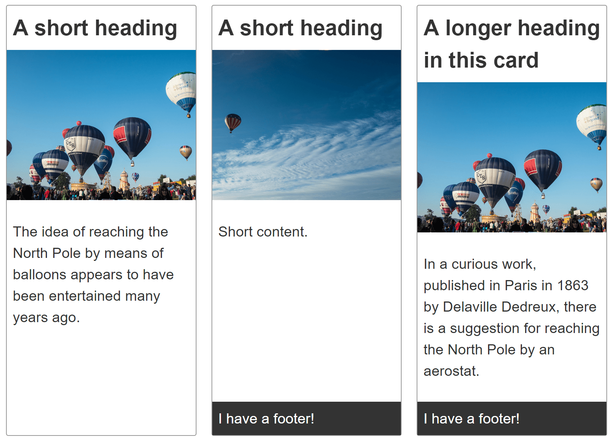

{{CSSRef}}

This pattern is a list of "card" components with optional footers. A card contains a title, an image, a description or other content, and an attribution or footer. Cards are generally displayed within a group or collection.



## Requirements

Create a group of cards, with each card component containing a heading, image, content, and, optionally, a footer.

Each card in the group of cards should be the same height. The optional card footer should stick to the bottom of the card.

The cards in the group should line up in two dimensions — both vertically and horizontally.

## Recipe

{{EmbedGHLiveSample("css-examples/css-cookbook/card.html", '100%', 1720)}}

> **Callout:**
>
> [Download this example](https://github.com/mdn/css-examples/blob/main/css-cookbook/card--download.html)

## Choices made

Each card is laid out using [CSS grid layout](/en-US/docs/Web/CSS/CSS_grid_layout) despite the layout being one-dimensional. This enables the use of content sizing for the grid tracks. To set up a single-column grid we can use the following:

```css
.card {
  display: grid;
  grid-template-rows: max-content 200px 1fr;
}
```

{{cssxref("display", "display: grid")}} converts the element into a grid container. The three values of the {{cssxref("grid-template-rows")}} property divide the grid into a minimum of three rows, defining the height of the first three children of the card, in order.

Each `card` contains a {{HTMLElement("header")}}, {{HTMLElement("img")}}, and {{HTMLElement("div")}}, in that order, with some also containing a {{HTMLElement("footer")}}.

The heading row, or track, is set to {{cssxref("max-content")}}, which prevents it from stretching. The image track is set to 200 pixels tall. The third track, where the content lives, is set to `1fr`. This means it will fill any additional space.

Any children beyond the three with explicitly defined sizes create rows in the implicit grid, which fits the content added to it. These are auto-sized by default. If a card contains a footer, it is auto-sized. The footer, when present, sticks to the bottom of the grid. The footer is auto-sized to fit its content; the content `<div>` then stretches take up any additional space.

The following ruleset creates the grid of cards:

```css
.cards {
  display: grid;
  grid-template-columns: repeat(auto-fill, minmax(230px, 1fr));
  gap: 20px;
}
```

The {{cssxref("grid-template-columns")}} property defines the widths of the grid columns. In this case, we set the grid to auto-fill, with repeated columns that are minimally `230px` but allowed to grow to fill the available space. The {{cssxref("gap")}} property sets a gap of `20px` between adjacent rows and adjacent columns.

> **Note:** The various elements in separate cards do not align with each other, as each card is an independent grid. Lining up the components in each card with the same components in adjacent cards can be done with [subgrid](/en-US/docs/Web/CSS/CSS_grid_layout/Subgrid).

## Alternative methods

[Flexbox](/en-US/docs/Web/CSS/CSS_flexible_box_layout) can also be used to lay out each card. With flexbox, the dimensions of each card's rows are set with the {{cssxref("flex")}} property on each row, rather than on the card container.

With flexbox, the dimensions of the flex items are defined on the children rather than the parent. Whether you choose to use grid or flexbox depends on your preference, whether you prefer controlling the tracks from the container or prefer adding rules to the items.

We chose grid for the cards as, generally, you want cards to be lined up both vertically and horizontally. Additionally, lining up the components within each card to the components of adjacent cards can be done with subgrid. Flex has no hack-free equivalent to subgrid.

## Accessibility concerns

Depending on the content of your card, there may be things you could or should do to enhance accessibility. See [Inclusive components: Card](https://inclusive-components.design/cards/) by Heydon Pickering, for a very detailed explanation of these issues.

## See also

- {{Cssxref("grid-template-columns")}}
- {{Cssxref("grid-template-rows")}}
- {{Cssxref("gap")}}
- [Inclusive components: Card](https://inclusive-components.design/cards/)
- [CSS grid layout](/en-US/docs/Web/CSS/CSS_grid_layout) module
