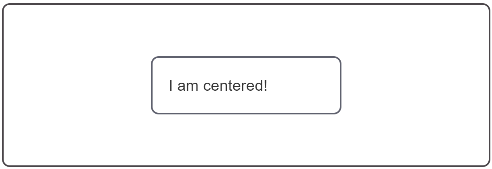

{{CSSRef}}

In this recipe you will see how to center one box inside another. Centering both horizontally and vertically was difficult before flexbox, with the Box Alignment properties it is now straightforward.

## Requirements

To place an item into the center of another box horizontally and vertically.

## Recipe

{{EmbedGHLiveSample("css-examples/css-cookbook/center.html", '100%', 720)}}

> **Callout:**
>
> [Download this example](https://github.com/mdn/css-examples/blob/main/css-cookbook/center--download.html)

## Choices made

To center one box inside another we make the containing box a flex container. Then set {{cssxref("align-items")}} to center to perform centering on the block axis, and {{cssxref("justify-content")}} to center to perform centering on the inline axis.

In the future we may be able to center elements without needing to turn the parent into a flex container, as the Box Alignment properties used here are specified to apply to block layout too. However, support is currently limited for box alignment properties on block layout, so currently centering using Flexbox is the most robust way to achieve this.

## Browser compatibility

{{Compat}}

## Resources on MDN

- [Box Alignment in Flexbox](/en-US/docs/Web/CSS/CSS_Box_Alignment/Box_Alignment_in_Flexbox)
- [CSS Box alignment guide](/en-US/docs/Web/CSS/CSS_Box_Alignment)
