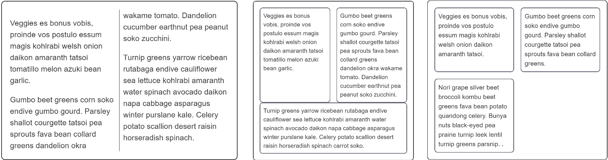

{{CSSRef}}

You will often need to create a layout which has a number of columns, and CSS provides several ways to do this. Whether you use Grid, Flexbox or Multi-column layout will depend on what you are trying to achieve, and in this recipe we explore these options.

## Requirements

There are a number of design patterns you might want to achieve with your columns:

- A continuous thread of content broken up into newspaper-style columns.
- A single row of items arranged as columns, with all heights being equal.
- Multiple rows of columns lined up by row and column.

## The recipes

You need to choose different layout methods in order to achieve your requirements.

### A continuous thread of content — multi-column layout

If you create columns using multi-column layout your text will remain as a continuous stream filling each column in turn. The columns must all be the same size, and you are unable to target an individual column or the content of an individual column.

You can control the gaps between columns with the {{cssxref("column-gap")}} property, and add a rule between columns using {{cssxref("column-rule")}}.

{{EmbedGHLiveSample("css-examples/css-cookbook/columns-multicol.html", '100%', 720)}}

> **Callout:**
>
> [Download this example](https://github.com/mdn/css-examples/blob/main/css-cookbook/columns-multicol--download.html)

Use multicol when:

- You want your text to display in newspaper-like columns.
- You have a set of small items you want to break into columns.
- You do not need to target individual column boxes for styling.

### A single row of items with equal heights — flexbox

Flexbox can be used to break content into columns by setting {{cssxref("flex-direction")}} to `row`, however flexbox targets the elements inside the flex container and will place each direct child into a new column. This is a different behavior to what you saw with multicol.

There is currently no way to add a rule between flex items, and browser support for the {{cssxref("column-gap")}} and {{cssxref("row-gap")}} properties is limited. Therefore to create gaps between items use a margin.

{{EmbedGHLiveSample("css-examples/css-cookbook/columns-flexbox.html", '100%', 720)}}

> **Callout:**
>
> [Download this example](https://github.com/mdn/css-examples/blob/main/css-cookbook/columns-flexbox--download.html)

Flexbox can also be used to create layouts where the flex items wrap onto new rows, by setting the {{cssxref("flex-wrap")}} property on the container to `wrap`. These new flex lines will distribute space along that line only — the items in the new line will not line up with items in the line above, as you'll see in the example below. This is why flexbox is described as one-dimensional. It is designed for controlling layout as a row or a column, but not both at the same time.

{{EmbedGHLiveSample("css-examples/css-cookbook/columns-flexbox-wrapping.html", '100%', 720)}}

> **Callout:**
>
> [Download this example](https://github.com/mdn/css-examples/blob/main/css-cookbook/columns-flexbox-wrapping--download.html)

Use flexbox:

- For single rows or columns of items.
- When you want to do alignment on the cross axis after laying out your items.
- When you are happy for wrapped items to share out space along their line only and not line up with items in other lines.

### Lining items up in rows and columns — grid layout

If what you want is a layout where items line up in rows and columns then you should choose CSS Grid Layout. Grid Layout works on the direct children of the grid container in a similar way to the manner in which flexbox works on the direct children of the flex container, however with CSS Grid you can line your items up in rows and columns — it is described as two-dimensional.

{{EmbedGHLiveSample("css-examples/css-cookbook/columns-grid.html", '100%', 720)}}

> **Callout:**
>
> [Download this example](https://github.com/mdn/css-examples/blob/main/css-cookbook/columns-grid--download.html)

Use Grid:

- For multiple rows or columns of items.
- When you want to be able to align the items on the block and inline axes.
- When you want items to line up in rows and columns.

## Browser compatibility

{{Compat}}

## Resources on MDN

- [Guide to Multi-column Layout](/en-US/docs/Web/CSS/CSS_Columns)
- [Guide to Flexbox](/en-US/docs/Web/CSS/CSS_Flexible_Box_Layout)
- [Guide to CSS Grid Layout](/en-US/docs/Web/CSS/CSS_Grid_Layout)
