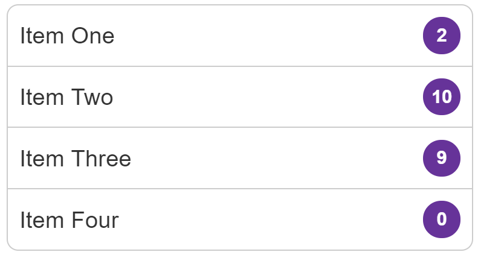

{{CSSRef}}

In this recipe we will create a list group pattern with badges that indicate a count.

## Requirements

Our list items should be displayed with the badges lined up on the right, no matter how much content the item has. The badge should always be centered vertically whether there is a single line of content, or more than one.

## Recipe

{{EmbedGHLiveSample("css-examples/css-cookbook/list-group-badges.html", '100%', 720)}}

> **Callout:**
>
> [Download this example](https://github.com/mdn/css-examples/blob/main/css-cookbook/list-group-badges--download.html)

## Choices made

Flexbox makes this particular pattern straightforward and also makes it easy to make changes to the layout.

To ensure the text and badge line up correctly I use the {{cssxref("justify-content")}} property with a value of `space-between`. This places any extra space between the items. In the live example, if you remove this property and you will see the badge move to the end of the text on items with text shorter than the one line.

To align the content horizontally, I use the {{cssxref("align-items")}} property to align the text and badge on the cross axis. If instead, you want the badge to align to the top of the content, change this to `align-items: flex-start`.

## Browser compatibility

{{Compat}}

## See also

- [Box alignment in Flexbox](/en-US/docs/Web/CSS/CSS_box_alignment/Box_alignment_in_flexbox)
- [Aligning items in a flex container](/en-US/docs/Web/CSS/CSS_flexible_box_layout/Aligning_items_in_a_flex_container)
