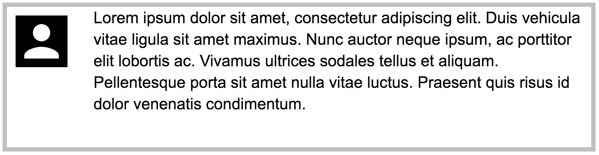

{{CSSRef}}

The _Media Object_ is a pattern we see all over the web. [Named by Nicole Sullivan](http://www.stubbornella.org/content/2010/06/25/the-media-object-saves-hundreds-of-lines-of-code/) it refers to a two-column box with an image on one side and descriptive text on the other, e.g. a facebook post or tweet.

## Requirements

Media Object pattern needs some or all of the following characteristics:

- Stacked on Mobile, two columns on Desktop.
- The image can be on the left or right.
- The image might be small or large.
- Media Objects can be nested.
- The Media Object should clear the contents no matter which side is tallest.

## The recipe

{{EmbedGHLiveSample("css-examples/css-cookbook/media-objects.html", '100%', 2700)}}

> **Callout:**
>
> [Download this example](https://github.com/mdn/css-examples/blob/main/css-cookbook/media-objects--download.html)

## Choices made

I have chosen to use [Grid Layout](/en-US/docs/Web/CSS/CSS_Grid_Layout) for the media object as it allows me to control the layout in two dimensions when I need to. This means that when we have a footer, with short content above, the footer can be pushed down to the bottom of the media object.

Another reason to use Grid Layout is in order that I can use {{cssxref("fit-content")}} for the track sizing of the image. By using `fit-content` with a maximum size of 200 pixels, when we have a small image such as the icon, the track only gets as large as the size of that image — the `max-content` size. If the image is larger, the track stops growing at 200 pixels and as the image has a {{cssxref("max-width")}} of 100% applied, it scales down so that it continues to fit inside the column.

By using {{cssxref("grid-template-areas")}} to achieve the layout, I can see the pattern in the CSS. I define my grid once we have a max-width of 500 pixels, so on smaller devices the media object stacks.

An option for the pattern is to flip it to switch the image to the other side — this is done by adding the `media-flip` class, which defines a flipped grid template causing the layout to be mirrored.

When we nest one media object inside another we need to place it into the second track in the regular layout, and the first track when flipped.

## Fallbacks

There are a number of possible fallbacks for this pattern, depending on the browsers you wish to support. A good catch-all would be to float the image left, and to add a clearfix to the box to ensure that it contained the floats.

{{EmbedGHLiveSample("css-examples/css-cookbook/media-objects-fallback.html", '100%', 3000)}}

> **Callout:**
>
> [Download this example](https://github.com/mdn/css-examples/blob/main/css-cookbook/media-objects-fallback--download.html)

Once floated elements become grid items the float no longer applies so you don't need to do anything special to clear the float.

What you will need to do is remove any margins applied to the item, and any widths which we don't need in a grid context (we have the {{cssxref("gap")}} property to control it in grids, and the track takes control of the sizing).

## Relevant resources on MDN

- [CSS Grid Layout](/en-US/docs/Web/CSS/CSS_Grid_Layout)
- [Progressive Enhancement and Grid Layout](/en-US/docs/Web/CSS/CSS_Grid_Layout/CSS_Grid_and_Progressive_Enhancement)
- [Using Grid Template Areas](/en-US/docs/Web/CSS/CSS_Grid_Layout/Grid_Template_Areas)
- [fit-content](/en-US/docs/Web/CSS/fit-content)
- [Grid-template-areas](/en-US/docs/Web/CSS/CSS_Grid_Layout/Grid_Template_Areas)

## Browser compatibility

{{Compat}}
