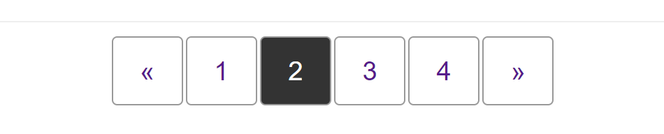

{{CSSRef}}

This cookbook pattern demonstrates the navigation pattern used to display pagination, where the user can move between pages of content such as search results.



## Requirements

The pagination pattern typically displays items in a row. To ensure that the pagination is understandable by people using a screen reader, we mark the items up as a list inside a {{htmlelement("nav")}} element, and then use CSS to display the layout visually as a row.

Typically, the pagination component will be centered horizontally underneath the content.

## Recipe

{{EmbedGHLiveSample("css-examples/css-cookbook/pagination.html", '100%', 720)}}

> **Callout:**
>
> [Download this example](https://github.com/mdn/css-examples/blob/main/css-cookbook/pagination--download.html)

## Choices made

This pattern is laid out using [flexbox](/en-US/docs/Web/CSS/CSS_Flexible_Box_Layout) — one flex container nested inside another. The {{htmlelement("nav")}} element is designated a flex container in order that we can center the list inside using the {{cssxref("justify-content")}} property.

The list itself also becomes a flex container to lay the items out as a row. To space the items out we will use a {{cssxref("margin")}} on the flex items.

## Alternative methods

Once the {{cssxref("column-gap")}} property has implementation in browsers this could be used instead of margins to space out the items.

```css
.pagination {
  list-style: none;
  margin: 0;
  padding: 0;
  display: flex;
  column-gap: 2px;
}
```

## Accessibility concerns

We want to ensure that a person using a screen reader understands what this navigation does, and where they will go when clicking a link. To help with this we have added [`aria-label="pagination"`](/en-US/docs/Web/Accessibility/ARIA/Attributes/aria-label) on the `<nav>` element.

We have also added some additional content that would be read by a screen reader but is hidden visually, and set the [`aria-hidden`](/en-US/docs/Web/Accessibility/ARIA/Attributes/aria-hidden) attribute on the paging arrows.

The "See Also" section at the end of this document has links to related accessibility topics.

## Specifications

{{Specifications}}

## Browser compatibility

{{Compat}}

## See also

- {{Cssxref("justify-content")}}, {{Cssxref("column-gap")}}
- [Know your ARIA: 'Hidden' vs 'None'](https://www.scottohara.me/blog/2018/05/05/hidden-vs-none.html)
- [Invisible content just for screen reader users](https://webaim.org/techniques/css/invisiblecontent/#techniques)
- [Writing CSS With Accessibility in mind](https://medium.com/@matuzo/writing-css-with-accessibility-in-mind-8514a0007939)
- [a11y Style Guide: Pagination](https://a11y-style-guide.com/style-guide/section-navigation.html#kssref-navigation-pagination)
