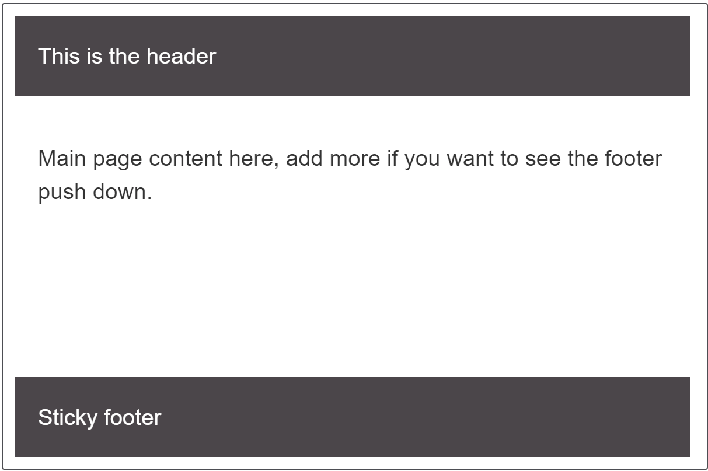

{{CSSRef}}

A sticky footer pattern is one where the footer of your page "sticks" to the bottom of the viewport in cases where the content is shorter than the viewport height. We'll look at a couple of techniques for creating one in this recipe.



## Requirements

The Sticky footer pattern needs to meet the following requirements:

- Footer sticks to the bottom of the viewport when content is short.
- If the content of the page extends past the viewport bottom, the footer then sits below the content as normal.

## The recipe

Click "Play" in the code blocks below to edit the example in the MDN Playground:

```html live-sample___sticky-footer-example
<div class="wrapper">
  <header class="page-header">This is the header</header>
  <main class="page-body">
    <p contenteditable>
      Main page content here, add more to this text if you want to see the
      footer push down.
    </p>
  </main>
  <footer class="page-footer">Sticky footer</footer>
</div>
```

```css live-sample___sticky-footer-example
* {
  box-sizing: inherit;
}

html {
  height: 100%;
  box-sizing: border-box;
}

body {
  height: 100%;
  font: 1.2em sans-serif;
}

.wrapper {
  min-height: 100%;
  display: grid;
  grid-template-rows: auto 1fr auto;
}

.page-header,
.page-footer {
  background-color: rgb(75 70 74);
  color: #fff;
  padding: 20px;
}

.page-body {
  padding: 20px;
}

.page-body p {
  border: 1px solid grey;
}
```

{{EmbedLiveSample("sticky-footer-example", "", "400px")}}

> [!NOTE]
> In this example and the following one we are using a wrapper set to `min-height: 100%`. You can also achieve this for a full page by setting a {{cssxref("min-height")}} of `100vh` on the {{htmlelement("body")}} and then using it as your grid container.

## Choices made

In the above example we achieve the sticky footer using CSS grid layout. The `.wrapper` has a minimum height of `100%` which means it is as tall as the container it is in. We then create a single column grid layout with three rows, one row for each part of our layout.

Grid auto-placement will place our items in source order and so the header goes into the first auto sized track, the main content into the `1fr` track and the footer into the final auto sized track. The `1fr` track will take up all available space and so grows to fill the gap.

## Alternate method

You can also use flexbox to create a sticky footer.

```html live-sample___sticky-footer-flexbox-example
<div class="wrapper">
  <header class="page-header">This is the header</header>
  <main class="page-body">
    <p contenteditable>
      Main page content here, add more to this text if you want to see the
      footer push down.
    </p>
  </main>
  <footer class="page-footer">Sticky footer</footer>
</div>
```

```css live-sample___sticky-footer-flexbox-example
* {
  box-sizing: border-box;
}

html,
body {
  box-sizing: border-box;
  height: 100%;
  padding: 0;
  margin: 0;
  font: 1.2em sans-serif;
}

.wrapper {
  box-sizing: border-box;
  min-height: 100%;

  display: flex;
  flex-direction: column;
}

.page-header,
.page-footer {
  background-color: rgb(75 70 74);
  color: #fff;
  padding: 20px;

  flex-grow: 0;
  flex-shrink: 0;
}

.page-body {
  padding: 20px;

  flex-grow: 1;
}

.page-body p {
  border: 1px solid grey;
}
```

{{EmbedLiveSample("sticky-footer-flexbox-example", "", "400px")}}

The flexbox example starts out in the same way, but we use `display:flex` rather than `display:grid` on the `.wrapper`; we also set `flex-direction` to `column`. Then we set our main content to `flex-grow: 1` and the other two elements to `flex-shrink: 0` — this prevents them from shrinking smaller when content fills the main area.

## Resources on MDN

- CSS properties: {{cssxref("display")}}, {{cssxref("min-height")}}, {{cssxref("grid-template-rows")}}, {{cssxref("flex-direction")}}, {{cssxref("flex-grow")}}, {{cssxref("flex-shrink")}}
- [Basic concepts of grid layout](/en-US/docs/Web/CSS/CSS_grid_layout/Basic_concepts_of_grid_layout)
- [CSS grid layout](/en-US/docs/Web/CSS/CSS_grid_layout) module
- [Basic concepts of flexbox](/en-US/docs/Web/CSS/CSS_flexible_box_layout/Basic_concepts_of_flexbox)
- [CSS flexible box layout](/en-US/docs/Web/CSS/CSS_flexible_box_layout) module
