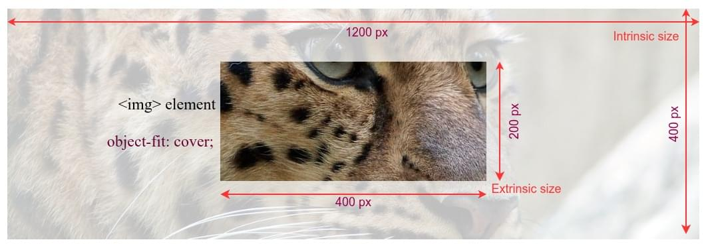

{{CSSRef}}

The **`object-view-box`** [CSS](/en-US/docs/Web/CSS) property defines a rectangle as a viewable area (view box) within a {{glossary("replaced elements", "replaced element")}}, enabling the content of an element to be zoomed or panned. It works similarly to the SVG {{SVGAttr("viewBox")}} attribute.

{{InteractiveExample("CSS Demo: object-view-box")}}

```css interactive-example-choice
object-view-box: inset(0 0);
```

```css interactive-example-choice
object-view-box: inset(20%);
```

```css interactive-example-choice
object-view-box: xywh(95px 20px 60px 60px);
```

```css interactive-example-choice
object-view-box: rect(110px 120px 200px 45px);
```

```css interactive-example-choice
object-view-box: none;
```

```html interactive-example
<section id="default-example">
  
</section>
```

```css interactive-example
#example-element {
  height: 100%;
  width: 100%;
  border: 2px dotted #888;
}

@supports not (object-view-box: none) {
  body::before {
    content: "Your browser does not support the 'object-view-box' property.";
    color: black;
    background-color: #ffcd33;
    display: block;
    width: 100%;
    text-align: center;
  }
}
```

## Syntax

```css
/* keywords */
object-view-box: none;

/* Rectangular shape functions */
object-view-box: inset(20%);
object-view-box: inset(20% 30%);
object-view-box: inset(10px 0 25px 33px);
object-view-box: xywh(95px 20px 60px 60px);
object-view-box: rect(10px 30px 30px 10px);

/* Global values */
object-view-box: inherit;
object-view-box: initial;
object-view-box: revert;
object-view-box: revert-layer;
object-view-box: unset;
```

### Values

- `none`
  - : The default. The element does not have a view box.

- [`<basic-shape-rect>`](/en-US/docs/Web/CSS/basic-shape#basic-shape-rect)
  - : A {{cssxref("basic-shape/inset","inset()")}}, {{cssxref("basic-shape/xywh","xywh()")}}, or {{cssxref("basic-shape/rect","rect()")}} function specifying a view box for an element with natural dimensions (replaced elements). Resolves to `none` otherwise.

## Description

The `object-view-box` property can be used to define a view box within {{glossary("replaced elements")}}, enabling the display of just a section of the replaced content. The subsection of the element displayed can be presented zoomed in, panned out, or at original size, while maintaining the content's intrinsic {{glossary("aspect ratio")}}.

Replaced elements have two sizes; an [extrinsic size](/en-US/docs/Glossary/Intrinsic_Size#extrinsic_sizing) and an {{glossary("intrinsic size")}}.

The extrinsic size is the dimension of the HTML element in which the content is rendered based on the box and visual formatting models. The [box model](/en-US/docs/Web/CSS/CSS_box_model/Introduction_to_the_CSS_box_model) and [visual formatting model](/en-US/docs/Web/CSS/CSS_display/Visual_formatting_model) determine the size of rendered elements based on content, HTML attributes, CSS applied to elements and their ancestors, and the viewport size.

The intrinsic size is the original size of the content itself; the size the element is when no styles are applied and without any layout constraints. While these don't have to be the same size, it is generally important to maintain a replaced element's intrinsic {{glossary("aspect ratio")}}.

CSS has many sizing properties. When it comes to sizing replaced elements, the [`object-fit`](/en-US/docs/Web/CSS/object-fit) property enables us to control how replaced elements are rendered in with a defined box to some extent. For example, the following 1200 x 400 image is displayed using a {{htmlelement("img")}} element that is sized to 400 x 200. The image content is positioned using `object-fit: none;` declaration.



The `object-view-box` property is more flexible than the `object-fit` property, and it is capable of doing more things. For example, it can be used to crop, zoom, and pan images. The property sets viewable area (view box), which defines what part of the content to show and how to fit it inside the extrinsic size. The view box value contains a rectangle and its position relative to the intrinsic area of the content, but _physical size of the view box remains equal to the extrinsic size_. The view box marks the area in the content to be displayed, and then it is transformed to match the extrinsic dimensions fitting into the HTML element. In the following image, we have the same leopard picture in a 400 x 150 image element. However, this time we have used `object-view-box` property to crop the leopard's eye portion of the picture.


As the rectangle defined by the `object-view-box` property and the rectangle viewbox of the `` element are the same size, i.e., 400 x 150 pixels, the aspect ratios of both are the same and the replaced element is not scaled.

Maintaining the same aspect ratio prevents image distortion. With `object-view-box`, we can accomplish various image operations while having different extrinsic and view box sizes, without distorting the replaced element as it scales up and down.

### Crop and pan operations when view box size equals extrinsic size

When both sizes are the same, the view box is not transformed to match the extrinsic size. So the content resolution remains the same. We get a fixed window into the content, as shown in the last image of the previous section.

If we change only the coordinates of the view box window, in `xywh()` function, and keep the size the same, we get a panning operation.

### Zoom-in operation when view box size is less than extrinsic size

In this case, the smaller view box is stretched to fit the extrinsic size. As the portion of the image is stretched, it gives a zoom-in effect.

### Zoom-out operation when view box size is greater than extrinsic size

In this case, the bigger view box is shrunk to fit extrinsic size. As the portion of the image is shrunk, it gives a zoom-out effect.

## Formal definition

{{cssinfo}}

## Formal syntax

{{csssyntax}}

## Examples

### Live zoom-in using object-view-box property

In this example, we display part of a large image of a leopard. Users can zoom in and out on the image, with the eye of the leopard serving as the focal point. Using the `object-view-box` property, we can do this without changing the dimensions of the HTML image element itself.

#### HTML

We include an {{htmlelement("img")}} and a [`range`](Web/HTML/Reference/Elements/input/range) {{htmlelement("input")}} element, associating a {{htmlelement("label")}} with the `<input>` . The natural dimensions of the original image is `1244px` by `416px` tall, with an {{glossary("aspect ratio")}} of `3:1`.

```html

<p>
  <label for="box-size">Zoom-in: </label>
  <input type="range" id="box-size" min="100" max="350" value="150" />
</p>
```

#### CSS

We define a custom property `--box-size` to adjust the view box size. Decreasing the size of the view box gives a zoom-in effect. Increasing the view box size gives a zoom-out effect. The {{cssxref("basic-shape/xywh","xywh()")}} function accepts an offset point and size of the view box as parameters. The view box's offset point, the focal point in our zoom effects, is set at `(500px, 30px)`, which corresponds to the top-left corner of the leopard's right eye.

```css hidden
input {
  width: 350px;
}

@supports not (object-view-box: none) {
  body::before {
    content: "Your browser does not support the 'object-view-box' property.";
    color: black;
    background-color: #ffcd33;
    display: block;
    width: 100%;
    text-align: center;
  }
}
```

```css
img {
  width: 350px;
  height: 350px;

  --box-size: 150px;
  object-view-box: xywh(500px 30px var(--box-size) var(--box-size));
}
```

Note, in order not to distort the rendered image portion, the extrinsic (350x350 px) and view box window aspect ratios have been kept the same, that is, 1:1.

#### JavaScript

```js
const img = document.querySelector("img");
const zoom = document.getElementById("box-size");

function update() {
  img.style.setProperty("--box-size", `${500 - zoom.value}px`);
}

zoom.addEventListener("input", update);
update();
```

Reducing the view box size increases the zoom-in effect, because smaller content is stretched to fit the HTML element's dimensions. To increase the zoom-in effect when the slider is moved to the right, the slider's value is inverted by subtracting it from 500px.

#### Result

{{ EmbedLiveSample("Live zoom in using object-view-box property", 500, 450) }}

Move the slider to the right to increase the zoom-in effect. The slider controls only the dimensions of the view box. As we are not changing the x and y positions of the view box, the picture zooms in diagonally towards the bottom right corner.

### Panning using object-view-box property

In this example, we keep the view box dimensions constant and change only the horizontal position. This gives a horizontal panning effect. Most of the code remains the same as the previous example.

#### HTML

```html

<p>
  <label for="position">Horizontal pan: </label>
  <input type="range" id="position" min="0" max="900" value="450" />
</p>
```

#### CSS

```css hidden
input {
  width: 350px;
}

@supports not (object-view-box: none) {
  body::before {
    content: "Your browser does not support the 'object-view-box' property.";
    color: black;
    background-color: #ffcd33;
    display: block;
    width: 100%;
    text-align: center;
  }
}
```

```css
img {
  width: 400px;
  height: 400px;

  --x-position: 0;
  object-view-box: xywh(var(--x-position) 30px 400px 400px);
}
```

The HTML image element determines the 400x400 px window size. The `--x-position` variable allows adjustable horizontal positioning.
Both the element size and view box have the same dimensions, which keeps the aspect ratio the same and prevents image distortion.

#### JavaScript

```js
const img = document.querySelector("img");
const position = document.getElementById("position");

function update() {
  img.style.setProperty("--x-position", `${position.value}px`);
}

position.addEventListener("input", update);
update();
```

#### Result

{{ EmbedLiveSample("Live zoom in using object-view-box property", 500, 500) }}

Move the slider to pan the picture horizontally.

## Specifications

{{Specifications}}

## Browser compatibility

{{Compat}}

## See also

- {{cssxref("object-fit")}}
- {{cssxref("object-position")}}
- {{cssxref("background-size")}}
- [Understanding aspect ratio](/en-US/docs/Web/CSS/CSS_box_sizing/Understanding_aspect-ratio)
