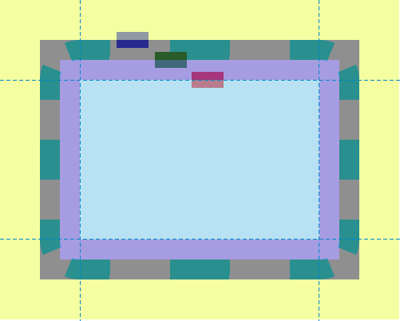

{{CSSRef}}

The **`offset-path`** [CSS](/en-US/docs/Web/CSS) property specifies a path for an element to follow and the element's positioning within the path's parent container or SVG coordinate system. The path is a geometrical shape along which the element gets positioned or moves.

The `offset-path` property is used in combination with the {{cssxref("offset-distance")}}, {{cssxref("offset-rotate")}}, and {{cssxref("offset-anchor")}} properties to control the position and orientation of the element along a path.

{{EmbedInteractiveExample("pages/css/offset-path.html")}}

## Syntax

```css
/* Default */
offset-path: none;

/* Line segment */
offset-path: ray(45deg closest-side contain);
offset-path: ray(contain 150deg at center center);
offset-path: ray(45deg);

/* URL */
offset-path: url(#myCircle);

/* Basic shape */
offset-path: circle(50% at 25% 25%);
offset-path: inset(50% 50% 50% 50%);
offset-path: polygon(30% 0%, 70% 0%, 100% 50%, 30% 100%, 0% 70%, 0% 30%);
offset-path: path("M 0,200 Q 200,200 260,80 Q 290,20 400,0 Q 300,100 400,200");

/* Coordinate box */
offset-path: content-box;
offset-path: padding-box;
offset-path: border-box;
offset-path: fill-box;
offset-path: stroke-box;
offset-path: view-box;

/* Global values */
offset-path: inherit;
offset-path: initial;
offset-path: revert;
offset-path: revert-layer;
offset-path: unset;
```

### Values

You can either specify the `none` keyword or one or both of `<offset-path>` and `<coord-box>` values.

- `none`

  - : Specifies that the element does not follow any offset path. This is the default value. This value is equivalent of the element not having any [offset transform](/en-US/docs/Web/CSS/offset). The element's movement in this case is determined by its default position properties, such as {{cssxref("top")}} and {{cssxref("left")}}, instead of an offset path.

- `<offset-path>`

  - : Specifies the geometrical offset path. This parameter is optional. If not specified, the default value of the path shape is `inset(0 round X)`, where `X` is the value of {{cssxref("border-radius")}} of the element that establishes the [containing block](/en-US/docs/Web/CSS/Containing_block). `<offset-path>` is specified as one of the following three values:

    - {{cssxref("ray","ray()")}}

      - : Defines the path, which is a line segment, from an element's starting position and extending at the specified angle. This value accepts up to four parameters – an {{CSSxRef("angle")}}, an optional size value, the optional keyword `contain`, and an optional `at <position>`.

    - {{cssxref("url","url()")}}

      - : Specifies the URL reference of an SVG shape element — `circle`, `ellipse`, `line`, `path`, `polygon`, `polyline`, or `rect`. The referenced shape's geometry is the equivalent offset path. If the URL does not reference a shape element (because it references a different element or resolves to a non-SVG document or doesn't resolve at all), the derived offset path is `path("M0,0")` (that is, a `<basic-shape>`).

    - [`<basic-shape>`](/en-US/docs/Web/CSS/basic-shape)

      - : Specifies the offset path as the equivalent path of a [basic shape](/en-US/docs/Web/CSS/CSS_shapes/Basic_shapes) function such as [`circle()`](/en-US/docs/Web/CSS/basic-shape/circle), [`ellipse()`](/en-US/docs/Web/CSS/basic-shape/ellipse), [`inset()`](/en-US/docs/Web/CSS/basic-shape/inset), {{cssxref("path","path()")}}, or [`polygon()`](/en-US/docs/Web/CSS/basic-shape/polygon). For example, if the `<basic_shape>` is an `ellipse()` function, then the path is the outline of the circle/ellipse – it starts at the rightmost point of the circle/ellipse, and then is composed of four circular arcs, each comprising a quarter of the circle/ellipse, proceeding clockwise, ending with a segment-completing close path operation. If a `<basic-shape>` type accepts the `at <position>` parameter but the parameter is omitted, and the element has an {{cssxref("offset-position")}}, the `offset-position` value is used for the `at <position>` parameter. Otherwise, the `at <position>` parameter defaults as specified for each shape function.

- {{cssxref("box_value","&lt;coord-box&gt;")}}

  - : Specifies the size information of the reference box containing the path. The reference box is derived from the element that establishes the containing block for this element. This parameter is optional. If not specified, the default value is `border-box`. In SVG, the value is treated as `view-box`. If `ray()` or `<basic-shape>` is used to define the offset path, the `<coord-box>` value provides the reference box for the ray or the `<basic-shape>`, respectively. If `url()` is used to define the offset path, the `<coord-box>` value provides the viewport and user coordinate system for the shape element, with the origin (`0 0`) at the top left corner and size being `1px`.

## Description

The `offset-path` property defines a path an animated element can follow. An offset path is either a specified path with one or multiple sub-paths or the geometry of a not-styled basic shape. The element's exact position on the offset path is determined by the {{cssxref("offset-distance")}} property. Each shape or path must define an initial position for the computed value of `0` for {{cssxref("offset-distance")}} and an initial direction which specifies the rotation of the object to the initial position.

Early versions of the spec called this property `motion-path`. It was changed to `offset-path` because the property describes static positions, not motion.

## Formal definition

{{cssinfo}}

## Formal syntax

{{csssyntax}}

## Examples

### Creating an offset-path using coord-box positioning

This example shows the how `<coord-box>` parameter of `offset-path` works in with {{cssxref("border-radius")}}.

```html hidden
<div class="box blueBox"></div>
<div class="box redBox"></div>
<div class="box greenBox"></div>
```

```css
body {
  width: 300px;
  height: 200px;
  border-radius: 50px;
  border: dashed aqua;
  border-width: 25px;
  padding: 25px;
  margin: 50px;
}

.box {
  width: 40px;
  height: 20px;
  animation: move 8000ms infinite ease-in-out;
}

.blueBox {
  background-color: blue;
  offset-path: border-box;
  offset-distance: 5%;
}

.greenBox {
  background-color: green;
  offset-path: padding-box;
  offset-distance: 8%;
}

.redBox {
  background-color: red;
  offset-path: content-box;
  offset-distance: 12%;
}

@keyframes move {
  0%,
  20% {
    offset-distance: 0%;
  }
  80%,
  100% {
    offset-distance: 100%;
  }
}
```

In this example, the margin, border, and padding have been purposely been given large values to demonstrate the placement of the blue, green, and red boxes on their respective `coord-box` edges: border-box, padding-box, and content-box.



#### Result

{{EmbedLiveSample('Creating an offset-path using coord-box positioning', '100%', 400)}}

### Animating an element with offset-path

The `offset-path` properties in the CSS code sample defines a path that is identical to the `<path>` element in the SVG. The path, as can be seen in the rendering of the SVG code, is a line drawing of a house with a chimney.

#### SVG

The top and bottom halves of the scissors would appear in the top left of the canvas were they not positioned along the starting point of the path defined by `offset-path`.

```html
<svg
  xmlns="http://www.w3.org/2000/svg"
  width="700"
  height="450"
  viewBox="350 0 1400 900">
  <title>House and Scissors</title>
  <rect x="595" y="423" width="610" height="377" fill="blue" />
  <polygon points="506,423 900,190 1294,423" fill="yellow" />
  <polygon points="993,245 993,190 1086,190 1086,300" fill="red" />
  <path
    id="house"
    d="M900,190 L993,245 V201 A11,11 0 0,1 1004,190 H1075 A11,11 0 0,1 1086,201 V300 L1294,423 H1216 A11,11 0 0,0 1205,434 V789 A11,11 0 0,1 1194,800 H606 A11,11 0 0,1 595,789 V434 A11,11 0 0,0 584,423 H506 L900,190"
    fill="none"
    stroke="black"
    stroke-width="13"
    stroke-linejoin="round"
    stroke-linecap="round" />
  <path
    id="firstScissorHalf"
    class="scissorHalf"
    d="M30,0 H-10 A10,10 0 0,0 -20,10 A20,20 0 1,1 -40,-10 H20 A10,10 0 0,1 30,0 M-40,20 A10,10 1 0,0 -40,0 A10,10 1 0,0 -40,20 M0,0"
    transform="translate(0,0)"
    fill="green"
    stroke="black"
    stroke-width="5"
    stroke-linejoin="round"
    stroke-linecap="round"
    fill-rule="evenodd" />
  <path
    id="secondScissorHalf"
    class="scissorHalf"
    d="M30,0 H-10 A10,10 0 0,1 -20,-10 A20,20 0 1,0 -40,10 H20 A10,10 0 0,0 30,0 M-40,-20 A10,10 1 0,0 -40,0 A10,10 1 0,0 -40,-20 M0,0"
    transform="translate(0,0)"
    fill="forestgreen"
    stroke="black"
    stroke-width="5"
    stroke-linejoin="round"
    stroke-linecap="round"
    fill-rule="evenodd" />
</svg>
```

#### CSS

```css
.scissorHalf {
  offset-path: path(
    "M900,190  L993,245 V201  A11,11 0 0,1 1004,190  H1075  A11,11 0 0,1 1086,201  V300  L1294,423 H1216  A11,11 0 0,0 1205,434  V789  A11,11 0 0,1 1194,800  H606  A11,11 0 0,1 595,789  V434  A11,11 0 0,0 584,423  H506 L900,190"
  );
  animation: followpath 4s linear infinite;
}

@keyframes followpath {
  to {
    offset-distance: 100%;
  }
}
```

#### Result

{{EmbedLiveSample('Animating_an_element_with_offset-path', '100%', '450')}}

## Specifications

{{Specifications}}

## Browser compatibility

{{Compat}}

## See also

- {{cssxref("offset")}}
- {{cssxref("offset-distance")}}
- {{cssxref("offset-rotate")}}
- [SVG \<path>](/en-US/docs/Web/SVG/Tutorial/Paths)
- {{cssxref("path","path()")}}
- Other demos:
  - [Examples using various shapes values](https://codepen.io/team/css-tricks/pen/WZdKMq) on Codepen by CSS-Tricks
  - [Moving a triangle along a curved path](https://codepen.io/ericwilligers/pen/jMbJPp) on Codepen by Eric Willigers
  - [Moving a pair of scissors along the shape of a house](https://codepen.io/ericwilligers/pen/bwVZNa) on Codepen by Eric Willigers
  - [Moving multiple pairs of eyes](https://jsfiddle.net/ericwilligers/r1snqdan/) on JSFiddle by Eric Willigers
