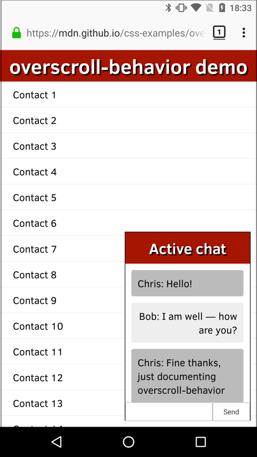

{{CSSRef}}

The **`overscroll-behavior`** [CSS](/en-US/docs/Web/CSS) property sets what a browser does when reaching the boundary of a scrolling area.

{{InteractiveExample("CSS Demo: overscroll-behavior")}}

```css interactive-example-choice
overscroll-behavior: auto;
```

```css interactive-example-choice
overscroll-behavior: contain;
```

```css interactive-example-choice
overscroll-behavior: none;
```

```css interactive-example-choice
overscroll-behavior: auto;
```

```css interactive-example-choice
overscroll-behavior: contain;
```

```html interactive-example
<section class="default-example" id="default-example">
  <div class="example-container">
    <div class="box">
      This is a scrollable container. Michaelmas term lately over, and the Lord
      Chancellor sitting in Lincoln's Inn Hall. Implacable November weather. As
      much mud in the streets as if the waters had but newly retired from the
      face of the earth.
      <br /><br />
      Lorem Ipsum has been the industry's standard dummy text ever since the
      1500s, when an unknown printer took a galley of type and scrambled it to
      make a type specimen book. It has survived not only five centuries, but
      also the leap into electronic typesetting, remaining essentially
      unchanged.
    </div>
    <div id="example-element">
      This is the inner container. Focus on this container, scroll to the bottom
      and when you reach the bottom keep scrolling.
      <p>
        If you have
        <code class="language-css">overscroll-behavior: auto;</code> selected
        the outer container will start to scroll.
      </p>
      If you have
      <code class="language-css">overscroll-behavior: contain;</code> selected,
      the outer container will not scroll unless you move your cursor out of the
      inner container and try to perform scroll on the outer container.
    </div>
  </div>
</section>
```

```css interactive-example
.example-container {
  width: 35em;
  height: 18em;
  border: medium dotted;
  padding: 0.75em;
  text-align: left;
  overflow: auto;
  display: flex;
}

.box {
  width: 50%;
}

#example-element {
  width: 50%;
  height: 12em;
  border: medium dotted #1b76c4;
  padding: 0.3em;
  margin: 0 0.3em;
  text-align: left;
  overflow: auto;
  overscroll-behavior: contain;
}
```

## Constituent properties

This property is a shorthand for the following CSS properties:

- {{Cssxref("overscroll-behavior-x")}}
- {{Cssxref("overscroll-behavior-y")}}

## Syntax

```css
/* Keyword values */
overscroll-behavior: auto; /* default */
overscroll-behavior: contain;
overscroll-behavior: none;

/* Two values */
overscroll-behavior: auto contain;

/* Global values */
overscroll-behavior: inherit;
overscroll-behavior: initial;
overscroll-behavior: revert;
overscroll-behavior: revert-layer;
overscroll-behavior: unset;
```

The `overscroll-behavior` property is specified as one or two keywords chosen from the list of values below.

Two keywords specifies the `overscroll-behavior` value on the `x` and `y` axes respectively. If only one value is specified, both x and y are assumed to have the same value.

### Values

- `auto`
  - : The default scroll overflow behavior occurs as normal.
- `contain`
  - : Default scroll overflow behavior (e.g., "bounce" effects) is observed inside the element where this value is set. However, no scroll chaining occurs on neighboring scrolling areas; the underlying elements will not scroll. The `contain` value disables native browser navigation, including the vertical pull-to-refresh gesture and horizontal swipe navigation.
- `none`
  - : No scroll chaining occurs to neighboring scrolling areas, and default scroll overflow behavior is prevented.

## Description

By default, mobile browsers tend to provide a "bounce" effect or even a page refresh when the top or bottom of a page (or other scroll area) is reached. You may also have noticed that when you have a dialog box with scrolling content at the top of a page that also has scrolling content, once the dialog box's {{Glossary("Scroll_boundary", "scroll boundary")}} is reached, the underlying page will then start to scroll — this is called {{Glossary("Scroll_chaining", "scroll chaining")}}.

In some cases, these behaviors are not desirable. You can use `overscroll-behavior` to get rid of unwanted scroll chaining and the browser's Facebook/Twitter app-inspired "pull to refresh"-type behavior.

Note that this property applies only to {{Glossary("Scroll_container", "scroll containers")}}. In particular, since an [`<iframe>`](/en-US/docs/Web/HTML/Element/iframe) is not a scroll container, setting this property on an iframe has no effect. To control scroll chaining from an iframe, set `overscroll-behavior` on both the [`<html>`](/en-US/docs/Web/HTML/Element/html) and the [`<body>`](/en-US/docs/Web/HTML/Element/body) elements of the iframe's document.

## Formal definition

{{cssinfo}}

## Formal syntax

{{csssyntax}}

## Examples

### Preventing an underlying element from scrolling

In our [overscroll-behavior example](https://mdn.github.io/css-examples/overscroll-behavior/) (see the [source code](https://github.com/mdn/css-examples/tree/main/overscroll-behavior) also), we present a full-page list of fake contacts, and a dialog box containing a chat window.



Both of these areas scroll; normally if you scrolled the chat window until you hit a scroll boundary, the underlying contacts window would start to scroll too, which is not desirable. This can be stopped using `overscroll-behavior-y` (`overscroll-behavior` would also work) on the chat window, like this:

```css
.messages {
  height: 220px;
  overflow: auto;
  overscroll-behavior-y: contain;
}
```

We also wanted to get rid of the standard overscroll effects when the contacts are scrolled to the top or bottom (e.g. Chrome on Android refreshes the page when you scroll past the top boundary). This can be prevented by setting `overscroll-behavior: none` on the {{htmlelement("html")}} element:

```css
html {
  margin: 0;
  overscroll-behavior: none;
}
```

## Specifications

{{Specifications}}

## Browser compatibility

{{Compat}}

## See also

- [CSS overscroll behavior](/en-US/docs/Web/CSS/CSS_overscroll_behavior) module
- [Take control of your scroll: customizing pull-to-refresh and overflow effects](https://developer.chrome.com/blog/overscroll-behavior) on developer.chrome.com (2017)
