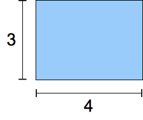
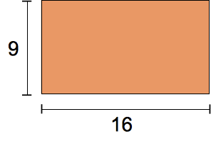
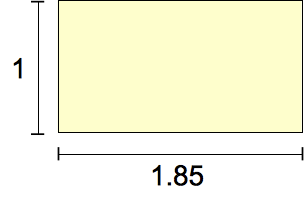
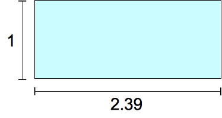

{{CSSRef}}

The **`<ratio>`** [CSS](/en-US/docs/Web/CSS) [data type](/en-US/docs/Web/CSS/CSS_Types), used for describing [aspect ratios](/en-US/docs/Web/CSS/@media/aspect-ratio) in [media queries](/en-US/docs/Web/CSS/CSS_media_queries), denotes the proportion between two unitless values.

## Syntax

In Media Queries Level 3, the `<ratio>` data type consisted of a strictly positive {{cssxref("&lt;integer&gt;")}} followed by a forward slash ('/', Unicode `U+002F SOLIDUS`) and a second strictly positive {{cssxref("&lt;integer&gt;")}}. Spaces before and after the slash are optional. The first number represents the width, while the second represents the height.

In Media Queries Level 4, the `<ratio>` date type is updated to consist of a strictly positive {{cssxref("&lt;number&gt;")}} followed by a forward slash ('/', Unicode `U+002F SOLIDUS`) and a second strictly positive {{cssxref("&lt;number&gt;")}}. In addition a single {{cssxref("&lt;number&gt;")}} as a value is allowable.

## Formal syntax

{{csssyntax}}

## Examples

### Use in a media query

```css
@media screen and (min-aspect-ratio: 16/9) {
  /* … */
}
```

### Common aspect ratios

|                                                                              | Ratio               | Usage                                           |
| ---------------------------------------------------------------------------- | ------------------- | ----------------------------------------------- |
|     | `4/3`               | Traditional TV format in the twentieth century. |
|  | `16/9`              | Modern "widescreen" TV format.                  |
|       | `185/100` = `91/50` | The most common movie format since the 1960s.   |
|       | `239/100`           | "Widescreen," anamorphic movie format.          |

## Specifications

{{Specifications}}

## Browser compatibility

{{Compat}}

## See also

- [`aspect-ratio`](/en-US/docs/Web/CSS/@media/aspect-ratio) media feature
