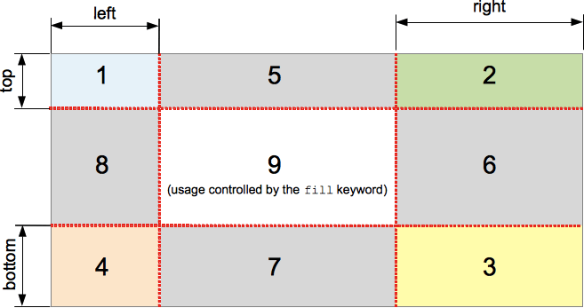

The **`border-image-slice`** [CSS](/en-US/docs/Web/CSS) property divides the image specified by {{cssxref("border-image-source")}} into regions. These regions form the components of an element's [border image](/en-US/docs/Web/CSS/Reference/Properties/border-image).

{{InteractiveExample("CSS Demo: border-image-slice")}}

```css interactive-example-choice
border-image-slice: 30;
```

```css interactive-example-choice
border-image-slice: 30 fill;
```

```css interactive-example-choice
border-image-slice: 44;
```

```css interactive-example-choice
border-image: url("/shared-assets/images/examples/border-florid.svg") round;
border-image-slice: calc(50 / 184 * 100%) calc(80 / 284 * 100%) fill;
border-image-width: 30px 48px;
```

```html interactive-example
<section id="default-example">
  <div id="example-element">This is a box with a border around it.</div>
</section>
```

```css interactive-example
#example-element {
  width: 80%;
  height: 80%;
  display: flex;
  align-items: center;
  justify-content: center;
  padding: 50px;
  background: #fff3d4;
  color: black;
  border: 30px solid;
  border-image: url("/shared-assets/images/examples/border-diamonds.png") 30
    round;
  font-size: 1.2em;
}
```

## Syntax

```css
/* All sides */
border-image-slice: 30%;

/* top and bottom | left and right */
border-image-slice: 10% 30%;

/* top | left and right | bottom */
border-image-slice: 30 30% 45;

/* top | right | bottom | left */
border-image-slice: 7 12 14 5;

/* Using the `fill` keyword */
border-image-slice: 10% fill;
border-image-slice: fill 10%;

/* Global values */
border-image-slice: inherit;
border-image-slice: initial;
border-image-slice: revert;
border-image-slice: revert-layer;
border-image-slice: unset;
```

The `border-image-slice` property may be specified using one to four `<number-percentage>` values to represent the position of each image slice. Negative values are invalid; values greater than their corresponding dimension are clamped to `100%`.

- When **one** position is specified, it creates all four slices at the same distance from their respective sides.
- When **two** positions are specified, the first value creates slices measured from the **top and bottom**, the second creates slices measured from the **left and right**.
- When **three** positions are specified, the first value creates a slice measured from the **top**, the second creates slices measured from the **left and right**, the third creates a slice measured from the **bottom**.
- When **four** positions are specified, they create slices measured from the **top**, **right**, **bottom**, and **left** in that order (clockwise).

The optional `fill` value, if used, can be placed anywhere in the declaration.

### Values

- {{cssxref("&lt;number&gt;")}}
  - : Represents an edge offset in _pixels_ for raster images and _coordinates_ for vector images. For vector images without natural dimensions, the image is first sized using the border image area as the default object size, so percentages can be easier to use when the slices should follow proportions of the image.
- {{cssxref("&lt;percentage&gt;")}}
  - : Represents an edge offset as a percentage of the source image's size: the width of the image for horizontal offsets, the height for vertical offsets.
- `fill`
  - : Preserves the middle image region and displays it like a background image, but stacked above the actual {{cssxref("background")}}. Its width and height are sized to match the top and left image regions, respectively.

## Description

The slicing process creates nine regions in total: four corners, four edges, and a middle region. Four slice lines, set a given distance from their respective sides, control the size of the regions.



The above diagram illustrates the location of each region.

- Zones 1-4 are corner regions. Each one is used a single time to form the corners of the final border image.
- Zones 5-8 are edge regions. These are [repeated, scaled, or otherwise modified](/en-US/docs/Web/CSS/Reference/Properties/border-image-repeat) in the final border image to match the dimensions of the element.
- Zone 9 is the middle region. It is discarded by default, but is used like a background image if the keyword `fill` is set.

The {{cssxref("border-image-repeat")}}, {{cssxref("border-image-width")}}, and {{cssxref("border-image-outset")}} properties determine how these regions are used to form the final border image.

## Formal definition

{{CSSInfo}}

## Formal syntax

{{csssyntax}}

## Examples

### Adjustable border width and slice

The following example shows a `<div>` with a border image set on it. The source image for the borders is as follows:


The diamonds in the source image are 30px across, so setting 30 pixels as the value for both {{cssxref("border-width")}} and `border-image-slice` will get you complete and fairly crisp diamonds in your border:

```css
border-width: 30px;
border-image-slice: 30;
```

These are the default values we have used in this example. However, we have also provided two sliders to allow you to dynamically change the values of the above two properties, allowing you to appreciate the effect they have:

`border-image-slice` Changes the size of the image slice sampled for use in each border and border corner (and the content area, if the `fill` keyword is used) — varying this away from 30 causes the border to look somewhat irregular, but can have some interesting effects.

`border-width`: Changes the width of the border. The sampled image size is scaled to fit inside the border, which means that if the width is bigger than the slice, the image can start to look somewhat pixelated (unless of course you use an SVG image).

#### HTML

```html
<div class="wrapper">
  <div></div>
</div>

<ul>
  <li>
    <label for="width">slide to adjust <code>border-width</code></label>
    <input type="range" min="10" max="45" id="width" />
    <output id="width-output">30px</output>
  </li>
  <li>
    <label for="slice">slide to adjust <code>border-image-slice</code></label>
    <input type="range" min="10" max="45" id="slice" />
    <output id="slice-output">30</output>
  </li>
</ul>
```

#### CSS

```css
.wrapper {
  width: 400px;
  height: 300px;
}

div > div {
  width: 300px;
  height: 200px;
  border-width: 30px;
  border-style: solid;
  border-image: url("/shared-assets/images/examples/border-diamonds.png");
  border-image-slice: 30;
  border-image-repeat: round;
}

li {
  display: flex;
  place-content: center;
}
```

#### JavaScript

```js
const widthSlider = document.getElementById("width");
const sliceSlider = document.getElementById("slice");
const widthOutput = document.getElementById("width-output");
const sliceOutput = document.getElementById("slice-output");
const divElem = document.querySelector("div > div");

widthSlider.addEventListener("input", () => {
  const newValue = `${widthSlider.value}px`;
  divElem.style.borderWidth = newValue;
  widthOutput.textContent = newValue;
});

sliceSlider.addEventListener("input", () => {
  const newValue = sliceSlider.value;
  divElem.style.borderImageSlice = newValue;
  sliceOutput.textContent = newValue;
});
```

#### Result

{{EmbedLiveSample('Adjustable_border_width_and_slice', '100%', 400)}}

### Sizing SVG border images

This example compares three SVG border images with identical artwork. The first SVG has neither natural size nor {{SVGAttr("viewBox")}}; the second has no natural size but has `viewBox`; the third has both. All three elements use the same slice offsets and border widths.

```html live-sample___svg-artwork
<svg xmlns="http://www.w3.org/2000/svg" viewBox="0 0 100 100">
  <rect width="100" height="100" fill="gold" />
  <rect x="10" width="80" height="10" fill="red" />
  <rect x="90" y="10" width="10" height="80" fill="green" />
  <rect x="10" y="90" width="80" height="10" fill="blue" />
  <rect y="10" width="10" height="80" fill="purple" />
  <rect width="10" height="10" fill="black" />
  <rect x="90" width="10" height="10" fill="orange" />
  <rect x="90" y="90" width="10" height="10" fill="cyan" />
  <rect y="90" width="10" height="10" fill="deeppink" />
</svg>
```

```css hidden live-sample___svg-artwork
svg {
  width: 100px;
  height: 100px;
}
```

{{EmbedLiveSample('svg-artwork', '100%', 120)}}

#### HTML

```html live-sample___svg-border-comparison
<label for="slice">border-image-slice:</label>
<select id="slice">
  <option value="10">10</option>
  <option value="10%">10%</option>
</select>
<p class="without-viewbox">Without viewBox</p>
<p class="with-viewbox">With viewBox</p>
<p class="with-dimensions">With viewBox and natural dimensions</p>
```

#### CSS

The SVGs are embedded as data URLs. The slices initially use numeric offsets of `10`; selecting `10%` instead selects the outer tenth of each source image. The resulting slices are stretched to form a `20px` border.

```css live-sample___svg-border-comparison
p {
  box-sizing: content-box;
  width: 200px;
  height: 100px;
  padding: 0;
  border: 20px solid;
  border-image-slice: 10;
  border-image-width: 1;
  border-image-repeat: stretch;
  overflow: auto;
  resize: both;
}
```

#### JavaScript

We use the same artwork for all three images, changing only the root SVG attributes.

```js live-sample___svg-border-comparison
const artwork = `
  <rect width="100" height="100" fill="gold" />
  <rect x="10" width="80" height="10" fill="red" />
  <rect x="90" y="10" width="10" height="80" fill="green" />
  <rect x="10" y="90" width="80" height="10" fill="blue" />
  <rect y="10" width="10" height="80" fill="purple" />
  <rect width="10" height="10" fill="black" />
  <rect x="90" width="10" height="10" fill="orange" />
  <rect x="90" y="90" width="10" height="10" fill="cyan" />
  <rect y="90" width="10" height="10" fill="deeppink" />
`;

const variants = {
  ".without-viewbox": "",
  ".with-viewbox": 'viewBox="0 0 100 100"',
  ".with-dimensions": 'viewBox="0 0 100 100" width="100" height="100"',
};

for (const [selector, attributes] of Object.entries(variants)) {
  const svg = `<svg xmlns="http://www.w3.org/2000/svg" ${attributes}>${artwork}</svg>`;
  const url = `data:image/svg+xml,${encodeURIComponent(svg)}`;
  document.querySelector(selector).style.borderImageSource = `url("${url}")`;
}

const sliceSelect = document.querySelector("#slice");
sliceSelect.addEventListener("change", () => {
  for (const selector of Object.keys(variants)) {
    document.querySelector(selector).style.borderImageSlice = sliceSelect.value;
  }
});
```

#### Result

Switch between numeric and percentage slices, and drag the bottom-right corner of each element to resize it.

{{EmbedLiveSample('svg-border-comparison', '100%', 540)}}

Before slicing, the browser determines each image's [concrete size](/en-US/docs/Web/CSS/Reference/Values/image#concrete_size), using the border image area as the default object size. Initially, this area is 240 by 140.

- The first SVG has neither natural dimensions nor a natural aspect ratio, so its source viewport is initially 240 by 140. The artwork remains 100 by 100 in the top-left corner, so the right and bottom borders are initially transparent. Resizing the element changes which parts of the artwork fall inside the slices, but the artwork itself never scales with the element.
- The second SVG has a square natural aspect ratio due to the `viewBox`, so its source viewport is 140 by 140, and the artwork is scaled to fill that viewport. With `10%`, the slices follow the scaled edges and corners. With `10`, the fixed offsets can cut through the scaled corners, leaving parts of them in the edge slices that are stretched along the border.
- The third SVG is sized to its natural dimensions of 100 by 100 before slicing, regardless of the element's size. Both `10` and `10%` select a 10-unit edge or corner, so the border stays consistent even as the element resizes.

## Specifications

{{Specifications}}

## Browser compatibility

{{Compat}}

## See also

- [Illustrated description of the 1-to-4-value syntax](/en-US/docs/Web/CSS/Guides/Cascade/Shorthand_properties#tricky_edge_cases)
- [Border images in CSS: A key focus area for Interop 2023](/en-US/blog/border-images-interop-2023/) on MDN blog (2023)
