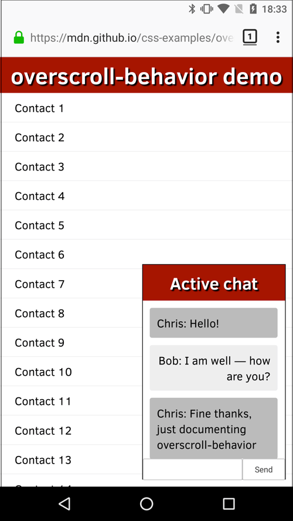

The **`overscroll-behavior-y`** [CSS](/en-US/docs/Web/CSS) property sets the browser's behavior when the vertical boundary of a scrolling area is reached.

See {{cssxref("overscroll-behavior")}} for a full explanation.

## Syntax

```css
/* Keyword values */
overscroll-behavior-y: auto; /* default */
overscroll-behavior-y: contain;
overscroll-behavior-y: none;

/* Global values */
overscroll-behavior-y: inherit;
overscroll-behavior-y: initial;
overscroll-behavior-y: revert;
overscroll-behavior-y: revert-layer;
overscroll-behavior-y: unset;
```

The `overscroll-behavior-y` property is specified as a keyword chosen from the list of values below.

### Values

This property is specified as one of the following keyword values:

- `auto`
  - : Allows the default behavior at a scroll boundary. Scrolling may continue in an another scroll container.
- `contain`
  - : Prevents scrolling from continuing outside the scroll container. "Bounce" effects may still occur.
- `chain`
  - : Allows scrolling to continue outside the scroll container, but prevents overscroll "bounce" effects
- `none`
  - : Prevents scrolling from continuing outside the scroll container and also prevents overscroll "bounce" effects.

## Formal definition

{{cssinfo}}

## Formal syntax

{{csssyntax}}

## Examples

### Preventing an underlying element from scrolling

In our [overscroll-behavior example](https://mdn.github.io/css-examples/overscroll-behavior/) (see the [source code](https://github.com/mdn/css-examples/tree/main/overscroll-behavior) also), we present a full-page list of fake contacts, and a dialog box containing a chat window.



Both of these areas scroll; normally if you scrolled the chat window until you hit a scroll boundary, the underlying contacts window would start to scroll too, which is not desirable. This can be stopped using `overscroll-behavior-y` (`overscroll-behavior` would also work) on the chat window, like this:

```css
.messages {
  height: 220px;
  overflow: auto;
  overscroll-behavior-y: contain;
}
```

We also wanted to get rid of the standard overscroll effects when the contacts are scrolled to the top or bottom (e.g., Chrome on Android refreshes the page when you scroll past the top boundary). This can be prevented by setting `overscroll-behavior: none` on the {{htmlelement("html")}} element:

```css
html {
  margin: 0;
  overscroll-behavior: none;
}
```

## Specifications

{{Specifications}}

## Browser compatibility

{{Compat}}

## See also

- {{cssxref("overscroll-behavior")}}
- {{cssxref("overscroll-behavior-x")}}
- {{cssxref("overscroll-behavior-inline")}}
- {{cssxref("overscroll-behavior-block")}}
- [CSS overscroll behavior](/en-US/docs/Web/CSS/Guides/Overscroll_behavior) module
