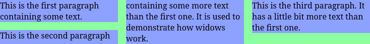

The **`widows`** [CSS](/en-US/docs/Web/CSS) property sets the minimum number of lines in a block container that must be shown at the _top_ of a [page](/en-US/docs/Web/CSS/Guides/Paged_media), region, or [column](/en-US/docs/Web/CSS/Guides/Multicol_layout).

In typography, a _widow_ is the last line of a paragraph that appears alone at the top of a page. (The paragraph is continued from a prior page.)

## Syntax

```css
/* <integer> values */
widows: 2;
widows: 3;

/* Global values */
widows: inherit;
widows: initial;
widows: revert;
widows: revert-layer;
widows: unset;
```

### Values

- {{cssxref("&lt;integer&gt;")}}
  - : The minimum number of lines that can stay by themselves at the top of a new fragment after a fragmentation break. The value must be positive.

## Formal definition

{{CSSInfo}}

## Formal syntax

{{CSSSyntax}}

## Examples

### Controlling column widows

This example shows three columns with a widows value of `2`.
So supporting browsers will avoid wrapping if not enough space is left for 2 lines:


This prevents breaking off a small number of lines like here:


#### HTML

```html
<div>
  <p>This is the first paragraph containing some text.</p>
  <p>
    This is the second paragraph containing some more text than the first one.
    It is used to demonstrate how widows work.
  </p>
  <p>
    This is the third paragraph. It has a little bit more text than the first
    one.
  </p>
</div>
```

#### CSS

```css
div {
  background-color: #8cffa0;
  columns: 3;
  widows: 2;
}

p {
  background-color: #8ca0ff;
}

p:first-child {
  margin-top: 0;
}
```

#### Result

{{EmbedLiveSample("Controlling_column_widows", 400, 160)}}

## Specifications

{{Specifications}}

## Browser compatibility

{{Compat}}

## See also

- {{cssxref("orphans")}}
- [Paged media](/en-US/docs/Web/CSS/Guides/Paged_media)
