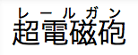
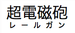

{{CSSRef}}

The **`ruby-position`** CSS property defines the position of a ruby element relatives to its base element. It can be positioned over the element (`over`), under it (`under`), or between the characters on their right side (`inter-character`).

{{EmbedInteractiveExample("pages/css/ruby-position.html")}}

## Syntax

```css
/* Keyword values */
ruby-position: over;
ruby-position: under;
ruby-position: inter-character;
ruby-position: alternate;

/* Global values */
ruby-position: inherit;
ruby-position: initial;
ruby-position: revert;
ruby-position: revert-layer;
ruby-position: unset;
```

### Values

- `over`
  - : Is a keyword indicating that the ruby has to be placed over the main text for horizontal scripts and right to it for vertical scripts.
- `under`
  - : Is a keyword indicating that the ruby has to be placed under the main text for horizontal scripts and left to it for vertical scripts.
- `inter-character` {{Experimental_Inline}}
  - : Is a keyword indicating that the ruby has to be placed between the different characters.
- `alternate` {{Experimental_Inline}}
  - : Is a keyword indicating that the ruby alternates between over and under, when there are multiple levels of annotation.

## Formal definition

{{cssinfo}}

## Formal syntax

{{csssyntax}}

## Examples

### Ruby positioned over the text

#### HTML

```html
<ruby>
  <rb>超電磁砲</rb>
  <rp>（</rp><rt>レールガン</rt><rp>）</rp>
</ruby>
```

#### CSS

```css
ruby {
  ruby-position: over;
}
```

#### Result

{{EmbedLiveSample("Ruby_positioned_over_the_text", 100, 40)}}

### Ruby positioned under the text

#### HTML

```html
<ruby>
  <rb>超電磁砲</rb>
  <rp>（</rp><rt>レールガン</rt><rp>）</rp>
</ruby>
```

#### CSS

```css
ruby {
  ruby-position: under;
}
```

#### Result

{{EmbedLiveSample("Ruby_positioned_under_the_text", 100, 40)}}

### Ruby alternate

#### HTML

```html
<ruby>
  <rb>A</rb><rb>B</rb><rb>C</rb>
  <rtc>Above</rtc>
  <rtc>Below</rtc>
</ruby>
```

#### CSS

```css
ruby {
  ruby-position: alternate; /* this is also the initial value */
}
```

#### Result

{{EmbedLiveSample("Ruby_alternate", 100, 40)}}

## Specifications

{{Specifications}}

## Browser compatibility

{{Compat}}

## See also

- HTML Ruby elements: {{HTMLElement("ruby")}}, {{HTMLElement("rt")}}, {{HTMLElement("rp")}}, and {{HTMLElement("rtc")}}.
- CSS Ruby properties: {{cssxref("ruby-align")}}, {{cssxref("ruby-merge")}}.
