{{CSSRef}}

Given the flexibility of SVG images, there's a lot to keep in mind when using them as background images with the {{ cssxref("background-image") }} property, and even more to keep in mind when also scaling them using the {{ cssxref("background-size") }} property. This article describes how scaling of SVG images is handled when using these properties.

## The algorithm, in summary

The algorithm can for the most part be summarized by these four rules. There are some edge cases that aren't covered by these rules, but this covers the majority of cases.

1. If {{ cssxref("background-size") }} specifies a fixed dimension (that is, percentages and relative units are fixed by their context), that dimension wins.
2. If the image has an intrinsic ratio (that is, its width:height ratio is constant, such as 16:9, 4:3, 2.39:1, 1:1, and so forth), the rendered size preserves that ratio.
3. If the image specifies a size, and the size isn't modified by constrain or cover, that specified size wins.
4. If none of the above cases are met, the image is rendered at the same size as the background area.

It's worth noting that the sizing algorithm only cares about the image's dimensions and proportions, or lack thereof. An SVG image with fixed dimensions will be treated just like a raster image of the same size.

> [!NOTE]
> If you are trying to stretch your SVG to a different {{glossary("aspect ratio")}} with CSS—for example in order to stretch it over the page background—make sure your SVG includes `preserveAspectRatio="none"`. Find out more about {{svgattr("preserveAspectRatio")}}.

## Source image examples

Before diving in to look at the results of using different kinds of source images and seeing how they look when used with {{ cssxref("background-size") }}, it would be helpful to look at a few example source images that have different dimensions and sizing settings.

In each case, we show what the source image looks like rendered in a 150x150 box, and provide a link to the SVG source.

### Dimensionless and proportionless

This image is both dimensionless and proportionless. It doesn't care what size it is, nor does it care about remaining at a particular aspect ratio. This would make a good gradient desktop background that would work regardless of your screen size and its aspect ratio.

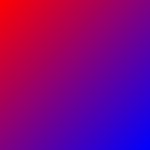

[SVG source](https://mdn.dev/archives/media/attachments/2012/07/09/3469/6587a382ffb2c944462a6b110b079496/no-dimensions-or-ratio.svg)

### One specified dimension and proportionless

This image specifies a width of 100 pixels but no height or intrinsic ratio. This is, basically, a thin strip of wallpaper that could be stretched across the entire height of a block.


[SVG source](https://mdn.dev/archives/media/attachments/2012/07/09/3468/af73bea307a10ffe2559df42fad199e3/100px-wide-no-height-or-ratio.svg)

### One specified dimension with intrinsic ratio

This image specifies a 100 pixel height but no width. It also specifies an intrinsic aspect ratio of 3:4. This ensures that its width:height ratio is always 3:4, unless it's deliberately scaled to a disproportionate size (that is, by explicitly specifying both width and height that aren't of that ratio).

This is very much like specifying a specific width and height, since once you have one dimension and a ratio, the other dimension is implied, but it's still a useful example.

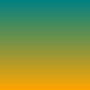

[SVG source](https://mdn.dev/archives/media/attachments/2012/07/09/3467/fd0c534c506be06d52f0a954a59863a6/100px-height-3x4-ratio.svg)

### No width or height with intrinsic ratio

This image doesn't specify either a width or a height; instead, it specifies an intrinsic ratio of 1:1. Think of this like a program icon. It's always square, and is usable at any size, such as 32x32, 128x128, or 512x512, for example.


[SVG source](https://mdn.dev/archives/media/attachments/2012/07/09/3466/a3398e03c058d99fb2b7837167cdbc26/no-dimensions-1x1-ratio.svg)

## Scaling examples

Now let's see some examples of what happens as we apply different scaling to these images. In each of the examples below, the enclosing rectangles are 300 pixels wide and 200 pixels tall. In addition, the backgrounds have {{ cssxref("background-repeat") }} set to no-repeat for clarity.

> [!NOTE]
> The screenshots below show the **expected** rendering. Not all browsers currently render these correctly.

### Specifying fixed lengths for both dimensions

If you use {{ cssxref("background-size") }} to specify fixed lengths for both dimensions, those lengths are always used, per rule 1 above. In other words, the image will always get stretched to the dimensions you specify, regardless of whether or not the source image has specified its dimensions and/or aspect ratio.

#### Source: No dimensions or intrinsic ratio

Given this CSS:

```css
background: url(no-dimensions-or-ratio.svg);
background-size: 125px 175px;
```

The rendered output would look like this:

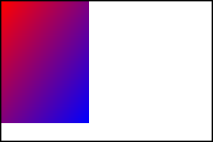

#### Source: One specified dimension, no intrinsic ratio

Given this CSS:

```css
background: url(100px-wide-no-height-or-ratio.svg);
background-size: 250px 150px;
```

The rendered output would look like this:

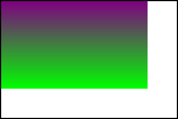

#### Source: One specified dimension with intrinsic ratio

Given this CSS:

```css
background: url(100px-height-3x4-ratio.svg);
background-size: 275px 125px;
```

The rendered output would look like this:


#### Source: No specified width or height with intrinsic ratio

Given this CSS:

```css
background: url(no-dimensions-1x1-ratio.svg);
background-size: 250px 100px;
```

The rendered output would look like this:

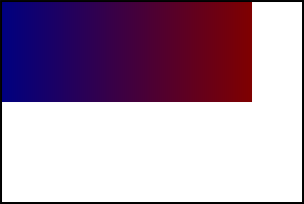

### Using contain or cover

Specifying `cover` for {{ cssxref("background-size") }} makes the picture as small as possible while still covering the entire background area. `contain`, on the other hand, makes the image as large as possible while not being clipped by the background area.

For an image with an intrinsic ratio, exactly one size matches the `cover`/fit criteria alone. But if there is no intrinsic ratio specified, `cover`/fit isn't sufficient, so the large/small constraints choose the resulting size.

#### Source: No dimensions or intrinsic ratio

If an image doesn't specify either dimensions or an intrinsic ratio, neither rule 2 nor rule 3 apply, so rule 4 takes over: the background image is rendered covering the entire background area. This satisfies the largest-or-smallest constraint.

```css
background: url(no-dimensions-or-ratio.svg);
background-size: contain;
```

The rendered output looks like this:

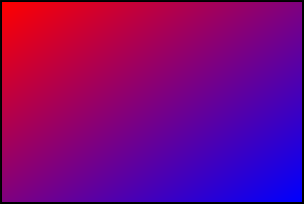

#### Source: One specified dimension, no intrinsic ratio

Similarly, if the image has one dimension specified but no intrinsic ratio, rule 4 applies, and the image is scaled to cover the entire background area.

```css
background: url(100px-wide-no-height-or-ratio.svg);
background-size: contain;
```

The rendered output looks like this:

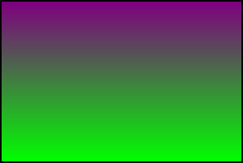

#### Source: One specified dimension with intrinsic ratio

Things change when you specify an intrinsic ratio. In this case, rule 1 isn't relevant, so rule 2 is applied: we try to preserve any intrinsic ratio (while respecting `contain` or `cover`). For example, preserving a 3:4 intrinsic aspect ratio for a 300x200 box with `contain` means drawing a 150x200 background.

##### contain case

```css
background: url(100px-height-3x4-ratio.svg);
background-size: contain;
```

The rendered output looks like this:

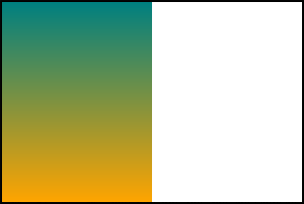

Notice how the entire image is rendered, fitting as best as possible into the box without clipping any of it away.

##### cover case

```css
background: url(100px-height-3x4-ratio.svg);
background-size: cover;
```

The rendered output looks like this:

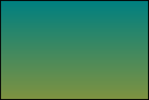

Here, the 3:4 ratio is preserved while still stretching the image to fill the entire box. That causes the bottom of the image to be clipped away.

#### Source: No dimensions with intrinsic ratio

When using an image with no intrinsic dimensions but an intrinsic ratio, things work similarly.

##### contain case

```css
background: url(no-dimensions-1x1-ratio.svg);
background-size: contain;
```

The rendered output looks like this:

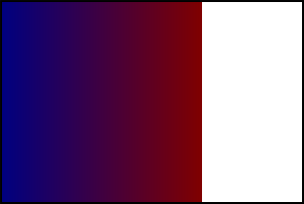

Notice that the image is sized to fit the smallest dimension while preserving the 1:1 aspect ratio.

##### cover case

```css
background: url(no-dimensions-1x1-ratio.svg);
background-size: cover;
```

The rendered output looks like this:

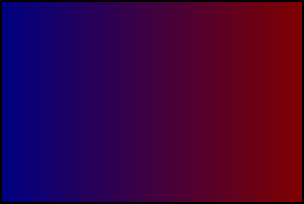

Here, the image is sized so that it fills the largest dimension. The 1:1 aspect ratio has been preserved, although with this source image, that can be difficult to see.

### Automatic sizing using "auto" for both dimensions

If {{ cssxref("background-size") }} is set to `auto` or `auto auto`, rule 2 says that rendering must preserve any intrinsic ratio that's provided.

#### Source: No dimensions or intrinsic ratio

When no intrinsic ratio or dimensions are specified by the source image, rule 4 takes effect, and the image is rendered to fill the background area.

```css
background: url(no-dimensions-or-ratio.svg);
background-size: auto auto;
```

The rendered output looks like this:


#### Source: One dimension and no intrinsic ratio

If no intrinsic ratio is specified, but at least one dimension is specified, rule 3 takes effect, and we render the image obeying those dimensions.

```css
background: url(100px-wide-no-height-or-ratio.svg);
background-size: auto auto;
```

The rendered output looks like this:

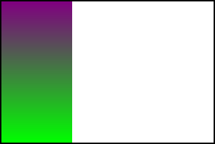

Note here that the width, which is specified in the source SVG at 100 pixels, is obeyed, while the height fills the background area since it's not specified (either explicitly or by an intrinsic ratio).

#### Source: One dimension and an intrinsic ratio

If we have an intrinsic ratio with a fixed dimension, that fixes both dimensions in place. Knowing one dimension and a ratio is, as has been mentioned already, the same as specifying both dimensions explicitly.

```css
background: url(100px-height-3x4-ratio.svg);
background-size: auto auto;
```

The rendered output looks like this:

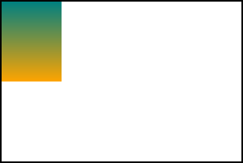

Since this image has an explicit 100 pixel height, the 3:4 ratio explicitly sets its width at 75 pixels, so that's how it's rendered in the `auto` case.

#### Source: No fixed dimensions with intrinsic ratio

When an intrinsic ratio is specified, but no dimensions, rule 4 is applied — except that rule 2 also applies. The image is therefore rendered just like for the `contain` case.

```css
background: url(no-dimensions-1x1-ratio.svg);
background-size: auto auto;
```

The rendered output looks like this:


### Using "auto" and one specific length

Given rule 1, specified dimensions are always used, so we need to use our rules only to determine the second dimension.

#### Source: No dimensions or intrinsic ratio

If the image has no dimensions or intrinsic ratio, rule 4 applies, and we use the background area's dimension to determine the value for the `auto` dimension.

```css
background: url(no-dimensions-or-ratio.svg);
background-size: auto 150px;
```

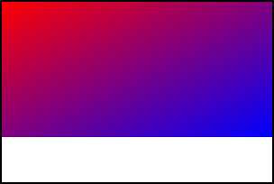

Here, the width is determined using the background area's width per rule 4, while the height is the 140px specified in the CSS.

#### Source: One specified dimension with no intrinsic ratio

If the image has one specified dimension but no intrinsic ratio, that specified dimension is used per rule 3 if that dimension is set to `auto` in the CSS.

```css
background: url(100px-wide-no-height-or-ratio.svg);
background-size: 200px auto;
```

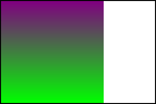

Here, the 200px specified in the CSS overrides the 100px width specified in the SVG, per rule 1. Since there's no intrinsic ratio or height provided, `auto` selects the height of the background area as the height for the rendered image.

```css
background: url(100px-wide-no-height-or-ratio.svg);
background-size: auto 125px;
```

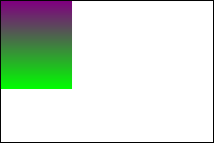

In this case, the width is specified as auto in the CSS, so the 100px width specified in the SVG is selected, per rule 3. The height is set at 125px in the CSS, so that is selected per rule 1.

#### Source: One specified dimension with intrinsic ratio

When a dimension is specified, rule 1 applies that dimension from the SVG to the rendered background unless specifically overridden by the CSS. When an intrinsic ratio is also specified, that's used to determine the other dimension.

```css
background: url(100px-height-3x4-ratio.svg);
background-size: 150px auto;
```


In this case, we use the width of the image specified in the CSS set at 150px, so rule 1 is applied. The intrinsic 3:4 aspect ratio then determines the height for the `auto` case.

#### Source: No specified dimensions with intrinsic ratio

If no dimensions are specified in the SVG, the specified dimension in the CSS is applied, then the intrinsic ratio is used to select the other dimension, per rule 2.

```css
background: url(no-dimensions-1x1-ratio.svg);
background-size: 150px auto;
```

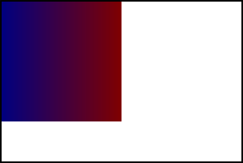

The width is set by the CSS to 150px. The `auto` value for the height is computed using that width and the 1:1 aspect ratio to be 150px as well, resulting in the image above.

## See also

- {{cssxref("background-size")}}
- Blog post: [Properly resizing vector image backgrounds](https://whereswalden.com/2011/10/21/properly-resizing-vector-image-backgrounds/)
