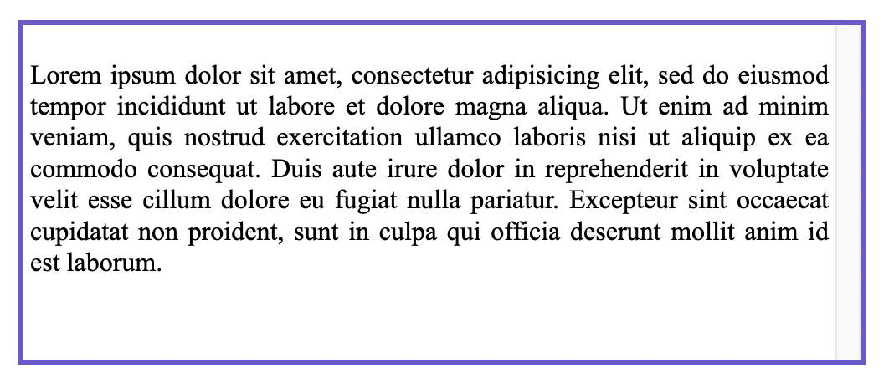
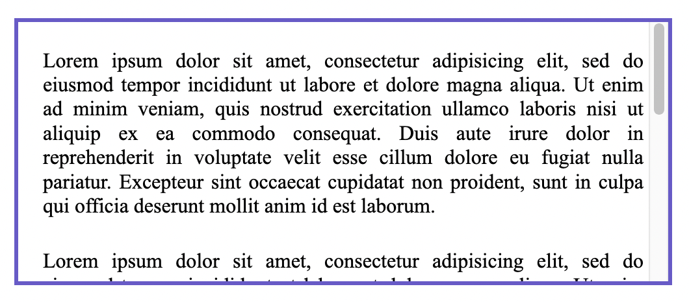
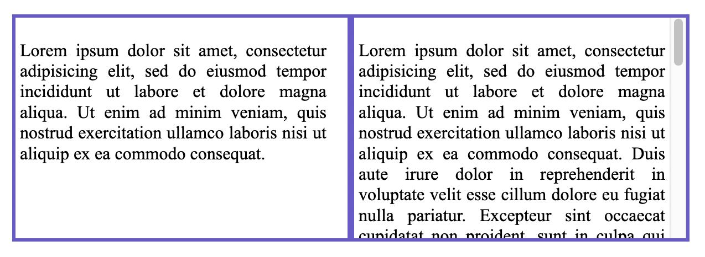
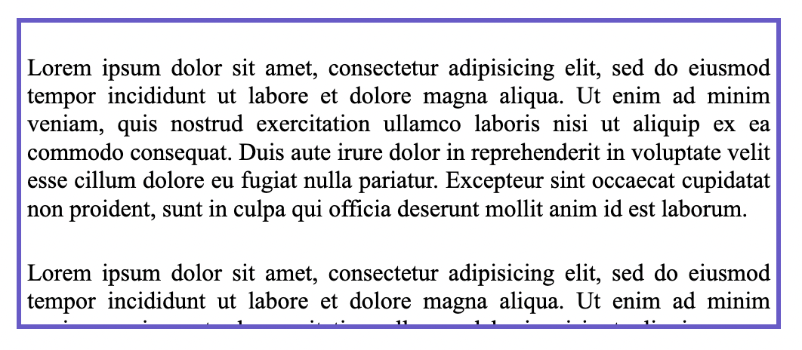

{{CSSRef}}

The **`scrollbar-gutter`** [CSS](/en-US/docs/Web/CSS) property allows authors to reserve space for the scrollbar, preventing unwanted layout changes as the content grows while also avoiding unnecessary visuals when scrolling isn't needed.

An element's _scrollbar gutter_ is the space between the inner border edge and the outer padding edge, where the browser may display a scrollbar. If no scrollbar is present, the gutter will be painted as an extension of the padding.

The browser determines whether _classic_ scrollbars or _overlay_ scrollbars are used:

- Classic scrollbars are always placed in a gutter, consuming space when present.
- Overlay scrollbars are placed over the content, not in a gutter, and are usually partially transparent.

## Syntax

```css
/* Initial value */
scrollbar-gutter: auto;

/* "stable" keyword, with optional modifier */
scrollbar-gutter: stable;
scrollbar-gutter: stable both-edges;

/* Global values */
scrollbar-gutter: inherit;
scrollbar-gutter: initial;
scrollbar-gutter: revert;
scrollbar-gutter: revert-layer;
scrollbar-gutter: unset;
```

### Values

- `auto`
  - : The initial value. Classic scrollbars create a gutter when `overflow` is `scroll`, or when `overflow` is `auto` and the box is overflowing. Overlay scrollbars do not consume space.
- `stable`
  - : When using classic scrollbars, the gutter will be present if `overflow` is `auto`, `scroll`, or `hidden` even if the box is not overflowing. When using overlay scrollbars, the gutter will not be present.
- `both-edges`
  - : If a gutter would be present on one of the inline start/end edges of the box, another will be present on the opposite edge as well.

## Formal definition

{{cssinfo}}

## Formal syntax

{{csssyntax}}

## Examples

The examples below show how the different values for the `scrollbar-gutter` property would affect a scrollable `div` element (`.container`) with one or more paragraphs contained within.

> [!NOTE]
> In the images for the examples, the user's system settings are set to classic scrollbars (always shown).

### Example 1

Prevent unneeded layout changes as the content growing or shrinking causes the scrollbar to appear/disappear, a space is reserved for it.

```css
.container {
  scrollbar-gutter: stable;
}
```



### Example 2

Add symmetric spacing to both sides of the box so the content is centered:

```css
.container {
  scrollbar-gutter: stable both-edges;
}
```



### Example 3

Align the contents of a non-scrolling element and a scrolling one adjacent to it:
This example shows two divs side by side. The one on the left has no scroll, but the one on the right does. Both have `scrollbar-gutter` applied, which also reserves space for the div on the left which doesn't have scrollable content. This is a good technique to use to keep the width of content consistent.

```css
.container1 {
  overflow: hidden;
  scrollbar-gutter: stable;
}

.container2 {
  scrollbar-gutter: stable;
}
```



### Overlay scrollbars

For reference, this image shows the same div as above, but with the user's system settings set to overlay scrollbars. Note here the scrollbar will only show when the user is scrolling and on top of the content, so no space is reserved for it and the `scrollbar-gutter` property has no effect.



## Specifications

{{Specifications}}

## Browser compatibility

{{Compat}}

## See also

- [CSS overflow](/en-US/docs/Web/CSS/CSS_overflow) module
- [CSS scrollbars styling](/en-US/docs/Web/CSS/CSS_scrollbars_styling) module
- {{CSSxRef("overflow")}}
- {{CSSxRef("scrollbar-width")}}
- {{CSSxRef("scrollbar-color")}}
