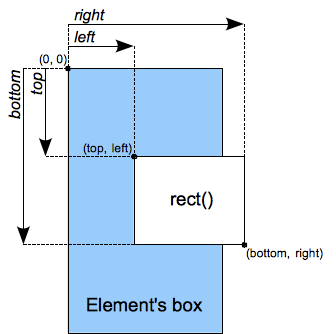

{{CSSRef}}{{deprecated_header}}

The **`<shape>`** [CSS](/en-US/docs/Web/CSS) [data type](/en-US/docs/Web/CSS/CSS_Types) defines the specific form (shape) of a region. The region represents the part of an element to which the {{cssxref("clip")}} property applies.

> **Note:** `<shape>` and `rect()` work in conjunction with {{cssxref("clip")}}, which has been deprecated in favor of {{cssxref("clip-path")}}. When possible, use `clip-path` and the {{cssxref("&lt;basic-shape&gt;")}} data type instead.

## Syntax

The `<shape>` data type is specified using the `rect()` function, which produces a region in the form of a rectangle.

`rect()`

```css
rect(top, right, bottom, left)
```

### Values



- _top_
  - : Is a {{cssxref("length")}} representing the offset for the top of the rectangle relative to the top border of the element's box.
- _right_
  - : Is a {{cssxref("length")}} representing the offset for the right of the rectangle relative to the left border of the element's box.
- _bottom_
  - : Is a {{cssxref("length")}} representing the offset for the bottom of the rectangle relative to the top border of the element's box.
- _left_
  - : Is a {{cssxref("length")}} representing the offset for the left of the rectangle relative to the left border of the element's box.

## Interpolation

When animated, values of the `<shape>` data type are interpolated over their `top`, `right`, `bottom`, and `left` components, each treated as a real, floating-point number. The speed of the interpolation is determined by the [timing function](/en-US/docs/Web/CSS/easing-function) associated with the animation.

## Example

### Example demonstrating correct use of the rect() function

```css
img.clip04 {
  clip: rect(10px, 20px, 20px, 10px);
}
```

## Specifications

{{Specifications}}

## Browser compatibility

{{Compat}}

## See also

- Related CSS property: {{ cssxref("clip") }}
- The [`-moz-image-rect()`](/en-US/docs/Web/CSS/-moz-image-rect) function has similar coordinate values to `rect()`.
