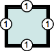
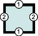
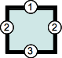
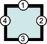
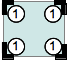
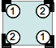
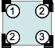
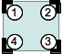

{{CSSRef}}

**_Shorthand properties_** are CSS properties that let you set the values of multiple other CSS properties simultaneously. Using a shorthand property, you can write more concise (and often more readable) style sheets, saving time and energy.

The CSS specification defines shorthand properties to group the definition of common properties acting on the same theme. For instance, the CSS {{cssxref("background")}} property is a shorthand property that's able to define the values of {{cssxref("background-color")}}, {{cssxref("background-image")}}, {{cssxref("background-repeat")}}, and {{cssxref("background-position")}}. Similarly, the most common font-related properties can be defined using the shorthand {{cssxref("font")}}, and the different margins around a box can be defined using the {{cssxref("margin")}} shorthand.

## Tricky edge cases

There are a few edge cases to keep in mind when using shorthand properties.

### Omitting properties

A value which is not specified is set to its initial value. That means that it **overrides** previously set values. For example:

```css
p {
  background-color: red;
  background: url(images/bg.gif) no-repeat left top;
}
```

This will not set the color of the background to `red` but to the default value for {{cssxref("background-color")}}, which is `transparent`.

Only the individual properties values can inherit. As missing values are replaced by their initial value, it is impossible to allow inheritance of individual properties by omitting them. The keyword `inherit` can be applied to a property, but only as a whole, not as a keyword for one value or another. That means that the only way to make some specific value to be inherited is to use the longhand property with the keyword `inherit`.

### Ordering properties

Shorthand properties try not to force a specific order for the values of the properties they replace. This works well when these properties use values of different types, as the order has no importance, but this does not work as easily when several properties can have identical values.

Two important cases here are:

- properties related to the edges of a box, like {{cssxref("border-style")}}, {{cssxref("margin")}} or {{cssxref("padding")}}
- properties related to the corners of a box, like {{cssxref("border-radius")}}

#### Edges of a box

Shorthands handling properties related to edges of a box, like {{cssxref("border-style")}}, {{cssxref("margin")}} or {{cssxref("padding")}}, always use a consistent 1-to-4-value syntax representing those edges:

- **1-value syntax:** `border-width: 1em` — The single value represents all edges: 

- **2-value syntax:** `border-width: 1em 2em` — The first value represents the vertical, that is top and bottom, edges, the second the horizontal ones, that is the left and right ones: 

- **3-value syntax:** `border-width: 1em 2em 3em` — The first value represents the top edge, the second, the horizontal, that is left and right, ones, and the third value the bottom edge: 

- **4-value syntax:** `border-width: 1em 2em 3em 4em` — The four values represent the top, right, bottom and left edges respectively, always in that order, that is clock-wise starting at the top:  The initial letter of Top-Right-Bottom-Left matches the order of the consonant of the word _trouble_: TRBL. You can also remember it as the order that the hands would rotate on a clock: `1em` starts in the 12 o'clock position, then `2em` in the 3 o'clock position, then `3em` in the 6 o'clock position, and `4em` in the 9 o'clock position.

#### Corners of a box

Similarly, shorthands handling properties related to corners of a box, like {{cssxref("border-radius")}}, always use a consistent 1-to-4-value syntax representing those corners:

- **1-value syntax:** `border-radius: 1em` — The single value represents all corners: 

- **2-value syntax:** `border-radius: 1em 2em` — The first value represents the top left and bottom right corner, the second the top right and bottom left ones: 

- **3-value syntax:** `border-radius: 1em 2em 3em` — The first value represents the top left corner, the second the top right and bottom left ones, and the third value the bottom right corner: 

- **4-value syntax:** `border-radius: 1em 2em 3em 4em` — The four values represent the top left, top right, bottom right and bottom left corners respectively, always in that order, that is clock-wise starting at the top left: 

## Background properties

Consider a background with the following properties

```css
background-color: #000;
background-image: url(images/bg.gif);
background-repeat: no-repeat;
background-position: left top;
```

These four declarations can be shortened to just one:

```css
background: #000 url(images/bg.gif) no-repeat left top;
```

(The shorthand form is actually the equivalent of the longhand properties above plus `background-attachment: scroll` and, in CSS3, some additional properties.)

See {{cssxref("background")}} for more detailed information, including CSS3 properties.

## Font properties

Consider the following declarations:

```css
font-style: italic;
font-weight: bold;
font-size: 0.8em;
line-height: 1.2;
font-family: Arial, sans-serif;
```

These 5 statements can be shortened to the following:

```css
font:
  italic bold 0.8em/1.2 Arial,
  sans-serif;
```

This shorthand declaration is actually equivalent to the longhand declarations above plus `font-variant: normal`, `font-size-adjust: none`, and `font-stretch: normal`.

## Border properties

With borders, the width, color, and style can be simplified into one declaration. For example, consider the following CSS:

```css
border-width: 1px;
border-style: solid;
border-color: #000;
```

It can be simplified as:

```css
border: 1px solid #000;
```

## Margin and padding properties

Shorthand versions of margin and padding values work similarly; the margin property allows for shorthand values to be specified using one, two, three, or four values. Consider the following CSS declarations:

```css
margin-top: 10px;
margin-right: 5px;
margin-bottom: 10px;
margin-left: 5px;
```

They are the same as the following declaration using the four value shorthand. Note that the values are in clockwise order, beginning at the top: top, right, bottom, then left (TRBL, the consonants in "trouble").

```css
margin: 10px 5px 10px 5px;
```

Margin shorthand rules for one, two, three and four value declarations are:

- When **one** value is specified, it applies the same margin to **all four sides**.
- When **two** values are specified, the first margin applies to the **top and bottom**, the second to the **left and right**.
- When **three** values are specified, the first margin applies to the **top**, the second to the **left and right**, the third to the **bottom**.
- When **four** values are specified, the margins apply to the **top**, **right**, **bottom**, and **left** in that order (clockwise).

## Position properties

With position, the shorthand versions of top, right, bottom and left can be simplified into one declaration. For example, consider the following CSS:

```css
top: 0;
right: 20px;
bottom: 0;
left: 20px;
```

It can be simplified as:

```css
inset: 0 20px 0 20px;
```

Just like margins and paddings, the inset values are ordered clockwise - top, right, bottom, then left (TRBL).

## The universal shorthand property

CSS provides a universal shorthand property, {{cssxref("all")}}, which applies its value to every property in the document. Its purpose is to change the properties' inheritance model.

See [Handling conflicts](/en-US/docs/Learn_web_development/Core/Styling_basics/Handling_conflicts) or [Introducing the CSS Cascade](/en-US/docs/Web/CSS/CSS_cascade/Cascade) for more information about how inheritance works in CSS.

## Shorthand properties

- {{cssxref("all")}}
- {{cssxref("animation")}}
- {{cssxref("animation-range")}}
- {{cssxref("background")}}
- {{cssxref("border")}}
- {{cssxref("border-block")}}
- {{cssxref("border-block-end")}}
- {{cssxref("border-block-start")}}
- {{cssxref("border-bottom")}}
- {{cssxref("border-color")}}
- {{cssxref("border-image")}}
- {{cssxref("border-inline")}}
- {{cssxref("border-inline-end")}}
- {{cssxref("border-inline-start")}}
- {{cssxref("border-left")}}
- {{cssxref("border-radius")}}
- {{cssxref("border-right")}}
- {{cssxref("border-style")}}
- {{cssxref("border-top")}}
- {{cssxref("border-width")}}
- {{cssxref("column-rule")}}
- {{cssxref("columns")}}
- {{cssxref("contain-intrinsic-size")}}
- {{cssxref("container")}}
- {{cssxref("flex")}}
- {{cssxref("flex-flow")}}
- {{cssxref("font")}}
- {{cssxref("font-synthesis")}}
- {{cssxref("font-variant")}}
- {{cssxref("gap")}}
- {{cssxref("grid")}}
- {{cssxref("grid-area")}}
- {{cssxref("grid-column")}}
- {{cssxref("grid-row")}}
- {{cssxref("grid-template")}}
- {{cssxref("inset")}}
- {{cssxref("inset-block")}}
- {{cssxref("inset-inline")}}
- {{cssxref("list-style")}}
- {{cssxref("margin")}}
- {{cssxref("margin-block")}}
- {{cssxref("margin-inline")}}
- {{cssxref("mask")}}
- {{cssxref("mask-border")}}
- {{cssxref("offset")}}
- {{cssxref("outline")}}
- {{cssxref("overflow")}}
- {{cssxref("overscroll-behavior")}}
- {{cssxref("padding")}}
- {{cssxref("padding-block")}}
- {{cssxref("padding-inline")}}
- {{cssxref("place-content")}}
- {{cssxref("place-items")}}
- {{cssxref("place-self")}}
- {{cssxref("position-try")}}
- {{cssxref("scroll-margin")}}
- {{cssxref("scroll-margin-block")}}
- {{cssxref("scroll-margin-inline")}}
- {{cssxref("scroll-padding")}}
- {{cssxref("scroll-padding-block")}}
- {{cssxref("scroll-padding-inline")}}
- {{cssxref("scroll-timeline")}}
- {{cssxref("text-decoration")}}
- {{cssxref("text-emphasis")}}
- {{cssxref("text-wrap")}}
- {{cssxref("transition")}}
- {{cssxref("view-timeline")}}
- {{cssxref("-webkit-text-stroke")}}
- {{cssxref("-webkit-border-before")}}
- {{cssxref("-webkit-mask-box-image")}}

## See also

- [CSS syntax](/en-US/docs/Web/CSS/CSS_syntax/Syntax)
- [At-rules](/en-US/docs/Web/CSS/CSS_syntax/At-rule)
- [Specificity](/en-US/docs/Web/CSS/CSS_cascade/Specificity)
- [Inheritance](/en-US/docs/Web/CSS/CSS_cascade/Inheritance)
- [Introducing the CSS Cascade](/en-US/docs/Web/CSS/CSS_cascade/Cascade)
- [Learn: Handling conflicts](/en-US/docs/Learn_web_development/Core/Styling_basics/Handling_conflicts)
- [Learn: Cascade layers](/en-US/docs/Learn_web_development/Core/Styling_basics/Cascade_layers)
- [CSS cascading and inheritance](/en-US/docs/Web/CSS/CSS_cascade) module
- [Visual formatting models](/en-US/docs/Web/CSS/Visual_formatting_model)
- [Initial](/en-US/docs/Web/CSS/CSS_cascade/initial_value), [computed](/en-US/docs/Web/CSS/CSS_cascade/computed_value), [used](/en-US/docs/Web/CSS/CSS_cascade/used_value), and [actual](/en-US/docs/Web/CSS/CSS_cascade/actual_value) values
- [Value definition syntax](/en-US/docs/Web/CSS/Value_definition_syntax)
