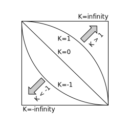

The **`superellipse()`** [CSS](/en-US/docs/Web/CSS) [function](/en-US/docs/Web/CSS/CSS_Values_and_Units/CSS_Value_Functions) defines the curvature of an ellipse, and is used to specify [corner shapes](/en-US/docs/Web/CSS/corner-shape) either directly, or via {{cssxref("&lt;corner-shape-value>")}} keywords.

## Syntax

```css
superellipse(infinity)
superellipse(4)
superellipse(1.7)
superellipse(0)
superellipse(-2.8)
superellipse(-3)
superellipse(-infinity)
```

### Parameters

- {{cssxref("&lt;number>")}}
  - : A number in the range of `-infinity` to `infinity`, inclusive.

### Return value

A superellipse shape.

## Description

The `superellipse()` function returns a superellipse shape, which is used to specify {{cssxref("corner-shape")}} values. The superellipse shape is calculated using a modified version of the equation that defines a circle:

<math display="block">
  <mrow>
    <msup>
      <mi>x</mi>
      <mn>2</mn>
    </msup>
    <mo>+</mo>
    <msup>
      <mi>y</mi>
      <mn>2</mn>
    </msup>
    <mo>=</mo>
    <mn>1</mn>
  </mrow>
</math>

The `x` and `y` variables refer to the `x` and `y` coordinates of points on the circle's circumference; a circle is defined by all the points `(x,y)` that satisfy the equation, and a given ellipse can be produced by scaling this shape along the x and/or y axis. A superellipse is created by replacing the 2 exponent in each case with 2<sup>K</sup>, `K` being the argument passed to `superellipse()`, which modifies the curvature of the ellipse:

<math display="block">
  <mrow>
    <msup>
      <mi>x</mi>
      <msup>
        <mn>2</mn>
        <mi>K</mi>
      </msup>
    </msup>
    <mo>+</mo>
    <msup>
      <mi>y</mi>
      <msup>
        <mn>2</mn>
        <mi>K</mi>
      </msup>
    </msup>
    <mo>=</mo>
    <mn>1</mn>
  </mrow>
</math>

The following diagram illustrates different `superellipse()` values for the top right corner of a container: `infinity`, `1`, `0`, `-1`, and `-infinity`:



- A `K` value of `0` creates a perfect diamond shape, used to create bevelled corners. This corresponds to the {{cssxref("&lt;corner-shape-value>")}} `bevel` keyword.
- A `K` value of `1` creates an ordinary ellipse, corresponding to the `round` keyword.
- A `K` value of `>1` makes the ellipse shape more square; `2` corresponds to the `squircle` keyword.
- A `K` value of `infinity` creates a perfect square (corresponding to the `square` keyword), although `K` values of `10` or more are indistinguishable from a square.
- Negative `K` values result in a concave curve, resulting in corner shapes that are curved inward, or "scooped out". A `K` value of `-1` corresponds to the `scoop` keyword and `-infinity` corresponds to the `notch` keyword.

A negative or positive superellipse would appear symmetrical to a superellipse with its inverse value.

## Formal syntax

{{CSSSyntax}}

## Examples

### `superellipse()` value comparison

In this example, we provide two [`<input type="range">`](/en-US/docs/Web/HTML/Reference/Elements/input/range) sliders allowing you to cycle through many different `corner-shape` `superellipse()` values and {{cssxref("border-radius")}} values to compare the effects of each on a container. We've hidden the code for the example here, for brevity, but you can find a [full explanation of it](/en-US/docs/Web/CSS/corner-shape#superellipse_value_comparison) along with other related examples on the {{cssxref("corner-shape")}} reference page.

```html hidden live-sample___value-comparison
<form>
  <div>
    <label for="superellipse-slider">Choose a superellipse() value:</label>
    <input
      type="range"
      id="superellipse-slider"
      min="-5"
      value="0"
      max="5"
      step="0.1" />
  </div>
  <div>
    <label for="radius-slider">Choose a border-radius value:</label>
    <input type="range" id="radius-slider" min="0" value="45" max="90" />
  </div>
</form>
<section></section>
```

```css hidden live-sample___value-comparison
html {
  font-family: Arial, Helvetica, sans-serif;
}

body {
  width: fit-content;
  margin: 20px auto;
}

section {
  display: flex;
  justify-content: center;
  align-items: center;
  flex: 100%;
  margin-top: 20px;
}

form div {
  margin-top: 5px;
  display: flex;
}

section {
  width: 100%;
  height: 180px;
  background-color: orange;
  background-image: linear-gradient(
    to bottom,
    rgb(255 255 255 / 0),
    rgb(255 255 255 / 0.5)
  );
}

section {
  box-shadow: 1px 1px 3px gray;
}
```

```js hidden live-sample___value-comparison
const rectangle = document.querySelector("section");
const superEllipseRange = document.getElementById("superellipse-slider");
const borderRadiusRange = document.getElementById("radius-slider");

function setCorners() {
  const seValue = `superellipse(${superEllipseRange.value})`;
  rectangle.style.cornerShape = seValue;
  const brValue = `${borderRadiusRange.value}px`;
  rectangle.style.borderRadius = brValue;
  rectangle.innerHTML = `<div><code>corner-shape: ${seValue}</code><br><code>border-radius: ${brValue}</code></div>`;
}

superEllipseRange.addEventListener("input", setCorners);
borderRadiusRange.addEventListener("input", setCorners);
setCorners();
```

{{EmbedLiveSample("value-comparison", "100%", "300")}}

> [!NOTE]
> See also the [`<corner-shape-value>` value comparison](/en-US/docs/Web/CSS/corner-shape-value#corner-shape-value_value_comparison) example.

## Specifications

{{Specifications}}

## Browser compatibility

{{Compat}}

## See also

- {{cssxref("corner-shape")}}
- {{cssxref("&lt;corner-shape-value>")}}
