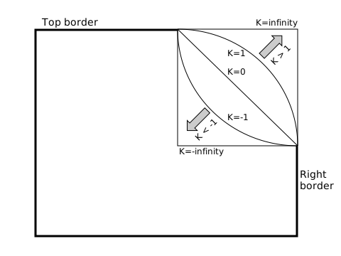

The **`superellipse()`** [CSS](/en-US/docs/Web/CSS) [function](/en-US/docs/Web/CSS/CSS_Values_and_Units/CSS_Value_Functions) returns an ellipse shape, which defines the {{cssxref("&lt;corner-shape-value>")}} values used to specify corner shapes.

## Syntax

```css
superellipse(infinity)
superellipse(4)
superellipse(1.7)
superellipse(0)
superellipse(-2.8)
superellipse(-3)
superellipse(-infinity)
```

### Parameters

- `K`
  - : A number in the range of `-infinity` to `infinity`, inclusive.

### Return value

A superellipse shape.

This is calculated using a modified version of the equation that defines a circle:

x<sup>2</sup> + y<sup>2</sup> = 1

The circle is made from all points `(x,y)` that satisfy the equation. A given ellipse can be produced by scaling this shape along the x and/or y axis. This is done by replacing the 2 exponent in each case with 2<sup>K</sup>, `K` being the argument passed to `superellipse()`.



- A `K` value of `1` creates a perfect ellipse.
- A `K` value of `>1` makes the ellipse shape more square; `2` is used to create the traditional "squircle" shape.
- A `K` value of `infinity` creates a perfect square, although `K` values of `10` or more are indistinguishable from a square.
- A `K` value of `0` creates a perfect diamond shape, used to create bevelled corners.
- Negative `K` values create concave curves, resulting in corner shapes that are "scooped out".

## Formal syntax

{{CSSSyntax}}

## Examples

### `superellipse()` value comparison

In this example, we provide an [`<input type="range">`](/en-US/docs/Web/HTML/Reference/Elements/input/range) slider allowing you to cycle through many different `corner-shape` {{cssxref("superellipse()")}} values to compare the effects of each. We've hidden the code for the example here, for brevity, but you can find a [full explanation of it](/en-US/docs/Web/CSS/corner-shape#superellipse_range_slider) along with other related examples on the {{cssxref("corner-shape")}} reference page.

```html hidden live-sample___value-comparison
<form>
  <label for="superellipse-slider">Choose a superellipse() value:</label>
  <input
    type="range"
    id="superellipse-slider"
    min="-5"
    value="0"
    max="5"
    step="0.1" />
</form>
<div></div>
```

```css hidden live-sample___value-comparison
html {
  font-family: Arial, Helvetica, sans-serif;
}

body {
  width: fit-content;
  margin: 20px auto;
}

div {
  display: flex;
  justify-content: center;
  align-items: center;
  margin-top: 20px;
}

div {
  width: 100%;
  height: 180px;
  background-color: orange;
  background-image: linear-gradient(
    to bottom,
    rgb(255 255 255 / 0),
    rgb(255 255 255 / 0.5)
  );
}

div {
  box-shadow: 1px 1px 3px gray;
  border-radius: 30px;
}
```

```js hidden live-sample___value-comparison
const rectangle = document.querySelector("div");
const range = document.querySelector("input");

function setSuperEllipse() {
  const seValue = `superellipse(${range.value})`;
  rectangle.style.cornerShape = seValue;
  rectangle.innerHTML = `<code>corner-shape: ${seValue}</code>`;
}

range.addEventListener("input", setSuperEllipse);
setSuperEllipse();
```

{{EmbedLiveSample("value-comparison", "100%", "270")}}

## Specifications

{{Specifications}}

## Browser compatibility

{{Compat}}

## See also

- {{cssxref("corner-shape")}}
- {{cssxref("&lt;corner-shape-value>")}}
