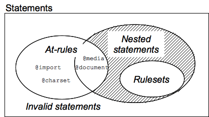

{{CSSRef}}

The basic goal of the Cascading Stylesheet ([CSS](/en-US/docs/Web/CSS)) language is to allow a browser engine to paint elements of the page with specific features, like colors, positioning, or decorations. The _CSS syntax_ reflects this goal and its basic building blocks are:

- The **property** which is an identifier, that is a human-readable _name_, that defines which feature is considered.
- The **value** which describe how the feature must be handled by the engine. Each property has a set of valid values, defined by a formal grammar, as well as a semantic meaning, implemented by the browser engine.

## CSS declarations

Setting CSS properties to specific values is the core function of the CSS language. A property and value pair is called a **declaration**, and any CSS engine calculates which declarations apply to every single element of a page in order to appropriately lay it out, and to style it.

Both properties and values are case-insensitive by default in CSS. The pair is separated by a colon, '`:`' (`U+003A COLON`), and white spaces before, between, and after properties and values, but not necessarily inside, are ignored.

There are [hundreds of different properties](/en-US/docs/Web/CSS/Reference) in CSS and a practically endless number of different values. Not all pairs of properties and values are allowed and each property defines what are the valid values. When a value is not valid for a given property, the declaration is deemed _invalid_ and is wholly ignored by the CSS engine.

## CSS declaration blocks

Declarations are grouped in **blocks**, that is in a structure delimited by an opening brace, '`{`' (`U+007B LEFT CURLY BRACKET`), and a closing one, '`}`' (`U+007D RIGHT CURLY BRACKET`). Blocks sometimes can be nested, so opening and closing braces must be matched.

Such blocks are naturally called **declaration blocks** and declarations inside them are separated by a semicolon, '`;`' (`U+003B SEMICOLON`). A declaration block may be empty, that is containing null declaration. White spaces around declarations are ignored. The last declaration of a block doesn't need to be terminated by a semicolon, though it is often considered _good style_ to do it as it prevents forgetting to add it when extending the block with another declaration.

A CSS declaration block is visualized in the diagram below.

> **Note:** The content of a CSS declaration block, that is a list of semicolon-separated declarations, without the initial and closing braces, can be put inside an HTML [`style`](/en-US/docs/Web/HTML/Global_attributes#style) attribute.

## CSS rulesets

If style sheets could only apply a declaration to each element of a Web page, they would be pretty useless. The real goal is to apply different declarations to different parts of the document.

CSS allows this by associating conditions with declarations blocks. Each (valid) declaration block is preceded by one or more comma-separated [**selectors**](/en-US/docs/Web/CSS/CSS_selectors), which are conditions selecting some elements of the page. A [selector list](/en-US/docs/Web/CSS/Selector_list) and an associated declarations block, together, are called a **ruleset**, or often a **rule**.

A CSS ruleset (or rule) is visualized in the diagram below.

As an element of the page may be matched by several selectors, and therefore by several rules potentially containing a given property several times, with different values, the CSS standard defines which one has precedence over the other and must be applied: this is called the [cascade](/en-US/docs/Learn/CSS/Building_blocks/Cascade_and_inheritance) algorithm.

> **Note:** It is important to note that even if a ruleset characterized by a group of selectors is a kind of shorthand replacing rulesets with a single selector each, this doesn't apply to the validity of the ruleset itself.
>
> This leads to an important consequence: if one single basic selector is invalid, like when using an unknown pseudo-element or pseudo-class, the whole _selector_ is invalid and therefore the entire rule is ignored (as invalid too).

## CSS statements

Rulesets are the main building blocks of a style sheet, which often consists of only a big list of them. But there is other information that a Web author wants to convey in the style sheet, like the character set, other external style sheets to import, font face or list counter descriptions and many more. It will use other and specific kinds of statements to do that.

A **statement** is a building block that begins with any non-space characters and ends at the first closing brace or semicolon (outside a string, non-escaped and not included into another {}, () or \[] pair).

There are two kinds of statements:

- **Rulesets** (or _rules_) that, as seen, associate a collection of CSS declarations to a condition described by a [selector](/en-US/docs/Web/CSS/CSS_selectors).
- **At-rules** that start with an at sign, '`@`' (`U+0040 COMMERCIAL AT`), followed by an identifier and then continuing up to the end of the statement, that is up to the next semicolon (;) outside of a block, or the end of the next block. Each type of [at-rules](/en-US/docs/Web/CSS/At-rule), defined by the identifier, may have its own internal syntax, and semantics of course. They are used to convey meta-data information (like {{ cssxref("@layer") }} or {{ cssxref("@import") }}), conditional information (like {{ cssxref("@media") }} or {{ cssxref("@document") }}), or descriptive information (like {{ cssxref("@font-face") }}).

Any statement which isn't a ruleset or an at-rule is invalid and ignored.

### Nested statements

There is another group of statements – the **nested statements**. These are statements that can be used in a specific subset of at-rules – the _conditional group rules_. These statements only apply if a specific condition is matched: the `@media` at-rule content is applied only if the device on which the browser runs matches the expressed condition; the `@document` at-rule content is applied only if the current page matches some conditions, and so on. In CSS1 and CSS2.1, only _rulesets_ could be used inside conditional group rules. That was very restrictive and this restriction was lifted in [_CSS Conditionals Level 3_](/en-US/docs/Web/CSS/CSS_conditional_rules). Now, though still experimental and not supported by every browser, conditional group rules can contain a wider range of content: rulesets but also some, but not all, at-rules.

## See also

- CSS key concepts:
  - **CSS syntax**
  - [Comments](/en-US/docs/Web/CSS/Comments)
  - [Specificity](/en-US/docs/Web/CSS/Specificity)
  - [Inheritance](/en-US/docs/Web/CSS/Inheritance)
  - [Box model](/en-US/docs/Web/CSS/CSS_box_model/Introduction_to_the_CSS_box_model)
  - [Layout modes](/en-US/docs/Web/CSS/Layout_mode)
  - [Visual formatting models](/en-US/docs/Web/CSS/Visual_formatting_model)
  - [Margin collapsing](/en-US/docs/Web/CSS/CSS_box_model/Mastering_margin_collapsing)
  - Values
    - [Initial values](/en-US/docs/Web/CSS/initial_value)
    - [Computed values](/en-US/docs/Web/CSS/computed_value)
    - [Used values](/en-US/docs/Web/CSS/used_value)
    - [Actual values](/en-US/docs/Web/CSS/actual_value)
  - [Value definition syntax](/en-US/docs/Web/CSS/Value_definition_syntax)
  - [Shorthand properties](/en-US/docs/Web/CSS/Shorthand_properties)
  - [Replaced elements](/en-US/docs/Web/CSS/Replaced_element)
