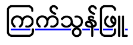

{{CSSRef}}

The **`text-decoration-skip-ink`** [CSS](/en-US/docs/Web/CSS) property specifies how overlines and underlines are drawn when they pass over glyph ascenders and descenders.

{{EmbedInteractiveExample("pages/css/text-decoration-skip-ink.html")}}

`text-decoration-skip-ink` is not part of the {{cssxref("text-decoration")}} shorthand.

## Syntax

```css
/* Single keyword */
text-decoration-skip-ink: none;
text-decoration-skip-ink: auto;
text-decoration-skip-ink: all;

/* Global keywords */
text-decoration-skip-ink: inherit;
text-decoration-skip-ink: initial;
text-decoration-skip-ink: revert;
text-decoration-skip-ink: revert-layer;
text-decoration-skip-ink: unset;
```

### Values

- `none`
  - : Underlines and overlines are drawn across the full length of the text content, including parts that cross over glyph descenders and ascenders.
- `auto`
  - : The default — the browser _may_ interrupt underlines and overlines so that they do not touch or closely approach a glyph. That is, they are interrupted where they would otherwise cross over a glyph.
- `all`

  - : The browser _must_ interrupt underlines and overlines so that they do not touch or closely approach a glyph. This can be helpful with certain Chinese, Japanese, or Korean (CJK) fonts, where the `auto` behavior might not create interruptions.

    

## Formal definition

{{CSSInfo}}

## Formal syntax

{{csssyntax}}

## Examples

### HTML

```html
<p>You should go on a quest for a cup of coffee.</p>
<p class="no-skip-ink">Or maybe you'd prefer some tea?</p>
<p>この文は、 text-decoration-skip-ink: auto の使用例を示しています。</p>
<p class="skip-ink-all">
  この文は、 text-decoration-skip-ink: all の使用例を示しています。
</p>
```

### CSS

```css
p {
  font-size: 1.5em;
  text-decoration: underline blue;
  text-decoration-skip-ink: auto; /* this is the default anyway */
}

.no-skip-ink {
  text-decoration-skip-ink: none;
}

.skip-ink-all {
  text-decoration-skip-ink: all;
}
```

### Result

{{EmbedLiveSample("Examples", "100%", 250)}}

## Specifications

{{Specifications}}

## Browser compatibility

{{Compat}}

## See also

- {{cssxref('text-decoration')}}
- {{cssxref('text-decoration-skip')}}
