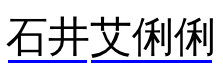

{{CSSRef}}{{SeeCompatTable}}

The **`text-decoration-skip`** [CSS](/en-US/docs/Web/CSS) property sets what parts of an element's content any text decoration affecting the element must skip over. It controls all text decoration lines drawn by the element and also any text decoration lines drawn by its ancestors.

> **Note:** Most other browsers are converging on supporting the simpler {{cssxref("text-decoration-skip-ink")}} property.

```css
/* Keyword values */
text-decoration-skip: none;
text-decoration-skip: objects;
text-decoration-skip: spaces;
text-decoration-skip: edges;
text-decoration-skip: box-decoration;

/* Multiple keywords */
text-decoration-skip: objects spaces;
text-decoration-skip: leading-spaces trailing-spaces;
text-decoration-skip: objects edges box-decoration;

/* Global values */
text-decoration-skip: inherit;
text-decoration-skip: initial;
text-decoration-skip: revert;
text-decoration-skip: revert-layer;
text-decoration-skip: unset;
```

## Syntax

### Values

- `none`
  - : Nothing is skipped. Thus, text decoration is drawn for all text content and across atomic inline-level boxes.
- `objects`
  - : The entire margin box of the element is skipped if it is an atomic inline such as an image or inline-block.
- `spaces`
  - : All spacing is skipped: all [Unicode white space characters](https://www.unicode.org/reports/tr44/#White_Space) and all word separators, plus any adjacent {{cssxref("letter-spacing")}} or {{cssxref("word-spacing")}}.
- `leading-spaces`
  - : The same as `spaces`, except that only leading spaces are skipped.
- `trailing-spaces`
  - : The same as `spaces`, except that only trailing spaces are skipped.
- `edges`

  - : The start and end of the text decoration is inset slightly (e.g., by half of the line thickness) from the content edge of the decorating box. Thus, adjacent elements receive separate underlines. (This is important in Chinese, where underlining is a form of punctuation.)

    

- `box-decoration`
  - : The text decoration is skipped over the box's margin, border, and padding areas. This only has an effect on decorations imposed by an ancestor; a _decorating box_ never draws over its own box decoration.

## Formal definition

{{CSSInfo}}

## Formal syntax

{{csssyntax}}

## Examples

### Skipping edges

#### HTML

```html
<p>Hey, grab a cup of <em>coffee!</em></p>
```

#### CSS

```css
p {
  margin: 0;
  font-size: 3em;
  text-decoration: underline;
  text-decoration-skip: edges;
}
```

#### Result

{{EmbedLiveSample("Skipping_edges", "100%", 150)}}

## Specifications

{{Specifications}}

## Browser compatibility

{{Compat}}

## See also

- [`text-decoration-skip-ink`](/en-US/docs/Web/CSS/text-decoration-skip-ink)
