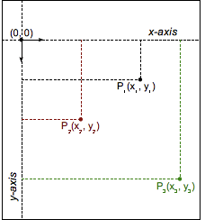

{{CSSRef}}

The **`<transform-function>`** [CSS](/en-US/docs/Web/CSS) [data type](/en-US/docs/Web/CSS/CSS_Types) represents a transformation that affects an element's appearance. Transformation [functions](/en-US/docs/Web/CSS/CSS_Functions) can rotate, resize, distort, or move an element in 2D or 3D space. It is used in the {{cssxref("transform")}} property.

## Syntax

The `<transform-function>` data type is specified using one of the transformation functions listed below. Each function applies a geometric operation in either 2D or 3D.

### Matrix transformation

- [`matrix()`](/en-US/docs/Web/CSS/transform-function/matrix)
  - : Describes a homogeneous 2D transformation matrix.
- [`matrix3d()`](/en-US/docs/Web/CSS/transform-function/matrix3d)
  - : Describes a 3D transformation as a 4×4 homogeneous matrix.

### Perspective

- [`perspective()`](/en-US/docs/Web/CSS/transform-function/perspective)
  - : Sets the distance between the user and the z=0 plane.

### Rotation

- [`rotate()`](/en-US/docs/Web/CSS/transform-function/rotate)
  - : Rotates an element around a fixed point on the 2D plane.
- [`rotate3d()`](/en-US/docs/Web/CSS/transform-function/rotate3d)
  - : Rotates an element around a fixed axis in 3D space.
- [`rotateX()`](/en-US/docs/Web/CSS/transform-function/rotateX)
  - : Rotates an element around the horizontal axis.
- [`rotateY()`](/en-US/docs/Web/CSS/transform-function/rotateY)
  - : Rotates an element around the vertical axis.
- [`rotateZ()`](/en-US/docs/Web/CSS/transform-function/rotateZ)
  - : Rotates an element around the z-axis.

### Scaling (resizing)

- [`scale()`](/en-US/docs/Web/CSS/transform-function/scale)
  - : Scales an element up or down on the 2D plane.
- [`scale3d()`](/en-US/docs/Web/CSS/transform-function/scale3d)
  - : Scales an element up or down in 3D space.
- [`scaleX()`](/en-US/docs/Web/CSS/transform-function/scaleX)
  - : Scales an element up or down horizontally.
- [`scaleY()`](/en-US/docs/Web/CSS/transform-function/scaleY)
  - : Scales an element up or down vertically.
- [`scaleZ()`](/en-US/docs/Web/CSS/transform-function/scaleZ)
  - : Scales an element up or down along the z-axis.

### Skewing (distortion)

- [`skew()`](/en-US/docs/Web/CSS/transform-function/skew)
  - : Skews an element on the 2D plane.
- [`skewX()`](/en-US/docs/Web/CSS/transform-function/skewX)
  - : Skews an element in the horizontal direction.
- [`skewY()`](/en-US/docs/Web/CSS/transform-function/skewY)
  - : Skews an element in the vertical direction.

### Translation (moving)

- [`translate()`](/en-US/docs/Web/CSS/transform-function/translate)
  - : Translates an element on the 2D plane.
- [`translate3d()`](/en-US/docs/Web/CSS/transform-function/translate3d)
  - : Translates an element in 3D space.
- [`translateX()`](/en-US/docs/Web/CSS/transform-function/translateX)
  - : Translates an element horizontally.
- [`translateY()`](/en-US/docs/Web/CSS/transform-function/translateY)
  - : Translates an element vertically.
- [`translateZ()`](/en-US/docs/Web/CSS/transform-function/translateZ)
  - : Translates an element along the z-axis.

## Description

Various coordinate models can be used to describe an HTML element's size and shape, as well as any transformations applied to it. The most common is the [Cartesian coordinate system](https://en.wikipedia.org/wiki/Cartesian_coordinate_system), although [homogeneous coordinates](https://en.wikipedia.org/wiki/Homogeneous_coordinates) are also sometimes used.

### Cartesian coordinates

In the Cartesian coordinate system, a two-dimensional point is described using two values: an x coordinate (abscissa) and a y coordinate (ordinate). This is represented by the vector notation `(x, y)`.



In CSS (and most computer graphics), the origin `(0, 0)` represents the _top-left_ corner of any element. Positive coordinates are down and to the right of the origin, while negative ones are up and to the left. Thus, a point that's 2 units to the right and 5 units down would be `(2, 5)`, while a point 3 units to the left and 12 units up would be `(-3, -12)`.

### Transformation functions

Transformation functions alter the appearance of an element by manipulating the values of its coordinates. A linear transformation function is described using a 2×2 matrix, like this:

<math><mrow><mo>(</mo><mtable><mtr><mtd><mi>a</mi></mtd><mtd><mi>c</mi></mtd></mtr> <mtr><mtd><mi>b</mi></mtd><mtd><mi>d</mi></mtd></mtr></mtable><mo>)</mo></mrow></math>

The function is applied to an element by using matrix multiplication. Thus, each coordinate changes based on the values in the matrix:

<math><mrow><mo>(</mo><mtable><mtr><mtd><mi>a</mi></mtd><mtd><mi>c</mi></mtd></mtr> <mtr><mtd><mi>b</mi></mtd><mtd><mi>d</mi></mtd></mtr> </mtable><mo>)</mo></mrow><mrow><mo>(</mo><mtable><mtr><mtd><mi>x</mi></mtd></mtr><mtr><mtd><mi>y</mi></mtd></mtr> </mtable><mo>)</mo></mrow><mo>=</mo> <mrow><mo>(</mo><mtable><mtr><mtd><mi>a</mi><mi>x</mi><mo>+</mo><mi>c</mi><mi>y</mi></mtd> </mtr><mtr><mtd><mi>b</mi><mi>x</mi><mo>+</mo><mi>d</mi><mi>y</mi></mtd></mtr></mtable><mo>)</mo></mrow></math>

It is even possible to apply several transformations in a row:

<math><mrow><mo>(</mo><mtable><mtr><mtd><msub><mi>a</mi><mn>1</mn></msub></mtd> <mtd><msub><mi>c</mi><mn>1</mn></msub></mtd> </mtr><mtr><mtd><msub><mi>b</mi><mn>1</mn></msub></mtd> <mtd><msub><mi>d</mi><mn>1</mn></msub></mtd> </mtr></mtable><mo>)</mo></mrow><mrow><mo>(</mo><mtable><mtr><mtd><msub><mi>a</mi><mn>2</mn></msub></mtd> <mtd><msub><mi>c</mi><mn>2</mn></msub></mtd> </mtr><mtr><mtd><msub><mi>b</mi><mn>2</mn></msub></mtd> <mtd><msub><mi>d</mi><mn>2</mn></msub></mtd> </mtr></mtable><mo>)</mo></mrow><mo>=</mo> <mrow><mo>(</mo><mtable><mtr><mtd><msub><mi>a</mi><mn>1</mn></msub> <msub><mi>a</mi><mn>2</mn></msub> <mo>+</mo> <msub><mi>c</mi><mn>1</mn></msub> <msub><mi>b</mi><mn>2</mn></msub> </mtd><mtd><msub><mi>a</mi><mn>1</mn></msub> <msub><mi>c</mi><mn>2</mn></msub> <mo>+</mo> <msub><mi>c</mi><mn>1</mn></msub> <msub><mi>d</mi><mn>2</mn></msub> </mtd></mtr><mtr><mtd><msub><mi>b</mi><mn>1</mn></msub> <msub><mi>a</mi><mn>2</mn></msub> <mo>+</mo> <msub><mi>d</mi><mn>1</mn></msub> <msub><mi>b</mi><mn>2</mn></msub> </mtd><mtd><msub><mi>b</mi><mn>1</mn></msub> <msub><mi>c</mi><mn>2</mn></msub> <mo>+</mo> <msub><mi>d</mi><mn>1</mn></msub> <msub><mi>d</mi><mn>2</mn></msub></mtd></mtr></mtable><mo>)</mo></mrow></math>

With this notation, it is possible to describe, and therefore compose, most common transformations: rotations, scaling, or skewing. (In fact, all transformations that are linear functions can be described.) Composite transformations are effectively applied in order from right to left.

However, one major transformation is not linear, and therefore must be special-cased when using this notation: translation. The translation vector `(tx, ty)` must be expressed separately, as two additional parameters.

> **Note:** Though trickier than Cartesian coordinates, [homogeneous coordinates](https://en.wikipedia.org/wiki/Homogeneous_coordinates) in [projective geometry](https://en.wikipedia.org/wiki/Projective_geometry) lead to 3×3 transformation matrices, and can express translations as linear functions.

## Examples

### Transform function comparison

The following example provides a 3D cube created from DOM elements and transforms, and a select menu allowing you to choose different transform functions to transform the cube with, so you can compare the effects of the different types.

Choose one, and the transform is applied to the cube; after 2 seconds, the cube reverts back to its starting state. The cube's starting state is slightly rotated using `transform3d()`, to allow you to see the effect of all the transforms.

#### HTML

```html
<main>
  <section id="example-element">
    <div class="face front">1</div>
    <div class="face back">2</div>
    <div class="face right">3</div>
    <div class="face left">4</div>
    <div class="face top">5</div>
    <div class="face bottom">6</div>
  </section>

  <div class="select-form">
    <label for="transfunction">Select a transform function</label>
    <select id="transfunction">
      <option selected>Choose a function</option>
      <option>rotate(360deg)</option>
      <option>rotateX(360deg)</option>
      <option>rotateY(360deg)</option>
      <option>rotateZ(360deg)</option>
      <option>rotate3d(1, 1, 1, 90deg)</option>
      <option>scale(1.5)</option>
      <option>scaleX(1.5)</option>
      <option>scaleY(1.5)</option>
      <option>scaleZ(1.5)</option>
      <option>scale3d(1, 1.5, 1.5)</option>
      <option>skew(17deg, 13deg)</option>
      <option>skewX(17deg)</option>
      <option>skewY(17deg)</option>
      <option>translate(100px, 100px)</option>
      <option>translateX(100px)</option>
      <option>translateY(100px)</option>
      <option>translateZ(100px)</option>
      <option>translate3d(50px, 50px, 50px)</option>
      <option>perspective(200px)</option>
      <option>matrix(1, 2, -1, 1, 80, 80)</option>
      <option>matrix3d(1,0,0,0,0,1,3,0,0,0,1,0,50,100,0,1.1)</option>
    </select>
  </div>
</main>
```

#### CSS

```css
main {
  width: 400px;
  height: 200px;
  padding: 50px;
  background-image: linear-gradient(135deg, white, cyan, white);
}

#example-element {
  width: 100px;
  height: 100px;
  transform-style: preserve-3d;
  transition: transform 1.5s;
  transform: rotate3d(1, 1, 1, 30deg);
}

.face {
  display: flex;
  align-items: center;
  justify-content: center;
  width: 100%;
  height: 100%;
  position: absolute;
  backface-visibility: inherit;
  font-size: 60px;
  color: #fff;
}

.front {
    background: rgba(90,90,90,.7);
    transform: translateZ(50px);
}

.back {
    background: rgba(0,210,0,.7);
    transform: rotateY(180deg) translateZ(50px);
}

.right {
  background: rgba(210,0,0,.7);
  transform: rotateY(90deg) translateZ(50px);
}

.left {
  background: rgba(0,0,210,.7);
  transform: rotateY(-90deg) translateZ(50px);
}

.top {
  background: rgba(210,210,0,.7);
  transform: rotateX(90deg) translateZ(50px);
}

.bottom {
  background: rgba(210,0,210,.7);
  transform: rotateX(-90deg) translateZ(50px);
}

.select-form {
  margin-top: 50px;
}
```

#### JavaScript

```js
const selectElem = document.querySelector('select');
const example = document.querySelector('#example-element');

selectElem.addEventListener('change', () => {
  if (selectElem.value === 'Choose a function') {
    return;
  } else {
    example.style.transform = `rotate3d(1, 1, 1, 30deg) ${selectElem.value}`;
    setTimeout(() => {
      example.style.transform = 'rotate3d(1, 1, 1, 30deg)';
    }, 2000)
  }
})
```

#### Result

{{EmbedLiveSample('Transform_function_comparison', '100%', 300)}}

## Specifications

{{Specifications}}

## Browser compatibility

{{Compat}}

## See also

- CSS {{cssxref("transform")}} property
