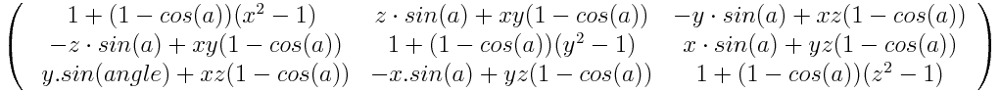
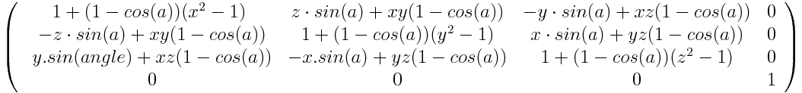

{{CSSRef}}

The **`rotate3d()`** [CSS](/en-US/docs/Web/CSS) [function](/en-US/docs/Web/CSS/CSS_Functions) defines a transformation that rotates an element around a
fixed axis in 3D space, without deforming it. Its result is a {{cssxref("&lt;transform-function&gt;")}} data type.

{{EmbedInteractiveExample("pages/css/rotate3d.html")}}

In 3D space, rotations have three degrees of freedom, which together describe a single axis of rotation. The axis of
rotation is defined by an \[x, y, z] vector and pass by the origin (as defined by the {{ cssxref("transform-origin") }}
property). If, as specified, the vector is not _normalized_ (i.e., if the sum of the square of its three
coordinates is not 1), the {{glossary("user agent")}} will normalize it internally. A non-normalizable vector, such as
the null vector, \[0, 0, 0], will cause the rotation to be ignored, but without invalidating the whole CSS property.

> **Note:** Unlike rotations in the 2D plane, the composition of 3D rotations is usually
> not commutative. In other words, the order in which the rotations are applied impacts the result.

## Syntax

The amount of rotation created by `rotate3d()` is specified by three {{cssxref("&lt;number&gt;")}}s and
one {{cssxref("&lt;angle&gt;")}}. The `<number>`s represent the x-, y-, and z-coordinates of the
vector denoting the axis of rotation. The `<angle>` represents the angle of rotation; if positive,
the movement will be clockwise; if negative, it will be counter-clockwise.

```css
rotate3d(x, y, z, a)
```

### Values

- `x`
  - : Is a {{cssxref("&lt;number&gt;")}} describing the x-coordinate of the vector denoting the axis of rotation which
    can be a positive or negative number.
- `y`
  - : Is a {{cssxref("&lt;number&gt;")}} describing the y-coordinate of the vector denoting the axis of rotation which
    can be a positive or negative number.
- `z`
  - : Is a {{cssxref("&lt;number&gt;")}} describing the z-coordinate of the vector denoting the axis of rotation which
    can be a positive or negative number.
- `a`
  - : Is an {{ cssxref("&lt;angle&gt;") }} representing the angle of the rotation. A positive angle denotes a clockwise
    rotation, a negative angle a counter-clockwise one.

<table class="standard-table">
  <tbody>
    <tr>
      <th scope="col">Cartesian coordinates on ℝ^2</th>
      <td rowspan="2">
        This transformation applies to the 3D space and can't be represented on
        the plane.
      </td>
    </tr>
    <tr>
      <th scope="col">Homogeneous coordinates on ℝℙ^2</th>
    </tr>
    <tr>
      <th scope="col">Cartesian coordinates on ℝ^3</th>
      <td>
        <a
          href="/en-US/docs/Web/CSS/transform-function/rotate3d/transform-functions-rotate3d_cart.png"
          ></a
        ><math>
          <mrow><mo>(</mo
            ><mtable
              ><mtr
                ><mtd
                  ><mn>1</mn>
                  <mo>+</mo>
                  <mo>(</mo>
                  <mn>1</mn>
                  <mo>-</mo>
                  <mo>cos</mo>
                  <mo>(</mo>
                  <mi>a</mi>
                  <mo>)</mo>
                  <mo>)</mo>
                  <mo>(</mo>
                  <msup
                    ><mi>x</mi>
                    <mn>2</mn> </msup
                  ><mo>-</mo>
                  <mn>1</mn>
                  <mo>)</mo> </mtd
                ><mtd
                  ><mi>z</mi>
                  <mo>·</mo>
                  <mo>sin</mo>
                  <mo>(</mo>
                  <mi>a</mi>
                  <mo>)</mo>
                  <mo>+</mo>
                  <mi>x</mi>
                  <mi>y</mi>
                  <mo>(</mo>
                  <mn>1</mn>
                  <mo>-</mo>
                  <mo>cos</mo>
                  <mo>(</mo>
                  <mi>a</mi>
                  <mo>)</mo>
                  <mo>)</mo> </mtd
                ><mtd
                  ><mo>-</mo>
                  <mi>y</mi>
                  <mo>·</mo>
                  <mo>sin</mo>
                  <mo>(</mo>
                  <mi>a</mi>
                  <mo>)</mo>
                  <mo>+</mo>
                  <mi>x</mi>
                  <mi>z</mi>
                  <mo>·</mo>
                  <mo>(</mo>
                  <mn>1</mn>
                  <mo>-</mo>
                  <mo>cos</mo>
                  <mo>(</mo>
                  <mi>a</mi>
                  <mo>)</mo>
                  <mo>)</mo>
                </mtd></mtr
              ><mtr
                ><mtd
                  ><mo>-</mo>
                  <mi>z</mi>
                  <mo>·</mo>
                  <mo>sin</mo>
                  <mo>(</mo>
                  <mi>a</mi>
                  <mo>)</mo>
                  <mo>+</mo>
                  <mi>x</mi>
                  <mi>y</mi>
                  <mo>·</mo>
                  <mo>(</mo>
                  <mn>1</mn>
                  <mo>-</mo>
                  <mo>cos</mo>
                  <mo>(</mo>
                  <mi>a</mi>
                  <mo>)</mo>
                  <mo>)</mo> </mtd
                ><mtd
                  ><mn>1</mn>
                  <mo>+</mo>
                  <mo>(</mo>
                  <mn>1</mn>
                  <mo>-</mo>
                  <mo>cos</mo>
                  <mo>(</mo>
                  <mi>a</mi>
                  <mo>)</mo>
                  <mo>)</mo>
                  <mo>(</mo>
                  <mi>y2</mi>
                  <mo>-</mo>
                  <mn>1</mn>
                  <mo>)</mo> </mtd
                ><mtd
                  ><mi>x</mi>
                  <mo>·</mo>
                  <mo>sin</mo>
                  <mo>(</mo>
                  <mi>a</mi>
                  <mo>)</mo>
                  <mo>+</mo>
                  <mi>y</mi>
                  <mi>z</mi>
                  <mo>·</mo>
                  <mo>(</mo>
                  <mn>1</mn>
                  <mo>-</mo>
                  <mo>cos</mo>
                  <mo>(</mo>
                  <mi>a</mi>
                  <mo>)</mo>
                  <mo>)</mo>
                </mtd></mtr
              ><mtr
                ><mtd
                  ><mi>y</mi>
                  <mo>sin</mo>
                  <mo>(</mo>
                  <mi>a</mi>
                  <mo>)</mo>
                  <mo>+</mo>
                  <mi>xz</mi>
                  <mo>(</mo>
                  <mn>1</mn>
                  <mo>-</mo>
                  <mo>cos</mo>
                  <mo>(</mo>
                  <mi>a</mi>
                  <mo>)</mo>
                  <mo>)</mo> </mtd
                ><mtd
                  ><mo>-</mo>
                  <mi>x</mi>
                  <mo>sin</mo>
                  <mo>(</mo>
                  <mi>a</mi>
                  <mo>)</mo>
                  <mo>+</mo>
                  <mi>yz</mi>
                  <mo>(</mo>
                  <mn>1</mn>
                  <mo>-</mo>
                  <mo>cos</mo>
                  <mo>(</mo>
                  <mi>a</mi>
                  <mo>)</mo>
                  <mo>)</mo> </mtd
                ><mtd
                  ><mn>1</mn>
                  <mo>+</mo>
                  <mo>(</mo>
                  <mn>1</mn>
                  <mo>-</mo>
                  <mo>cos</mo>
                  <mo>(</mo>
                  <mi>a</mi>
                  <mo>)</mo>
                  <mo>)</mo>
                  <mo>(</mo>
                  <mi>z2</mi>
                  <mo>-</mo>
                  <mn>1</mn>
                  <mo>)</mo> </mtd
                ><mtd><mi>t</mi></mtd> </mtr
              ><mtr
                ><mtd><mn>0</mn> </mtd><mtd><mn>0</mn> </mtd
                ><mtd><mn>0</mn> </mtd><mtd><mn>1</mn></mtd></mtr
              ></mtable
            ><mo>)</mo></mrow
          ></math
        >
      </td>
    </tr>
    <tr>
      <th scope="col">Homogeneous coordinates on ℝℙ^3</th>
      <td>
        <a
          href="/en-US/docs/Web/CSS/transform-function/rotate3d/transform-functions-rotate3d_hom4.png"
          ></a>
      </td>
    </tr>
  </tbody>
</table>

## Examples

### Rotating on the y-axis

#### HTML

```html
<div>Normal</div>
<div class="rotated">Rotated</div>
```

#### CSS

```css
body {
  perspective: 800px;
}

div {
  width: 80px;
  height: 80px;
  background-color: skyblue;
}

.rotated {
  transform: rotate3d(0, 1, 0, 60deg);
  background-color: pink;
}
```

#### Result

{{EmbedLiveSample("Rotating_on_the_y-axis", "auto", 180)}}

### Rotating on a custom axis

#### HTML

```html
<div>Normal</div>
<div class="rotated">Rotated</div>
```

#### CSS

```css
body {
  perspective: 800px;
}

div {
  width: 80px;
  height: 80px;
  background-color: skyblue;
}

.rotated {
  transform: rotate3d(1, 2, -1, 192deg);
  background-color: pink;
}
```

#### Result

{{EmbedLiveSample("Rotating_on_a_custom_axis", "auto", 180)}}

## Specifications

{{Specifications}}

## Browser compatibility

{{Compat}}

## See also

- {{cssxref("transform")}} property
- {{cssxref("rotate")}} property
- {{cssxref("&lt;transform-function&gt;")}}
