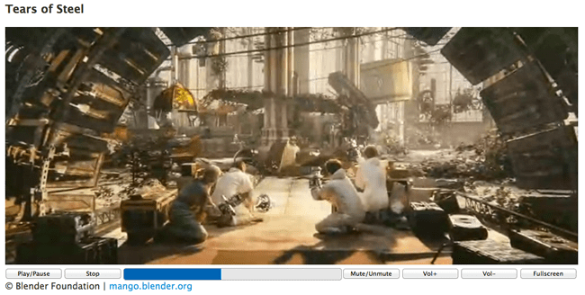

This article describes a simple HTML video player that uses the Media and Fullscreen APIs and works across most major desktop and mobile browsers. As well as working fullscreen, the player features custom controls rather than just using the browser defaults. The player controls themselves won't be styled beyond the basics required to get them working; full styling of the player will be taken care of in a future article.

## Working example

Our example video player displays a clip from an open source movie called [Tears of Steel](https://mango.blender.org/about/), and includes typical video controls.



> **Note:** You can see the [example running live](https://iandevlin.github.io/mdn/video-player/), or check out the [source code on GitHub](https://github.com/iandevlin/iandevlin.github.io/tree/master/mdn/video-player).

## HTML Markup

To start off with, let's take a look at the HTML that makes up the player.

### The video

First of all the {{ htmlelement("video") }} element is defined, contained within a {{ htmlelement("figure") }} element that acts as the video container. To anyone familiar with HTML markup and the {{ htmlelement("video") }} element, there should be nothing here that surprises you.

```html
<figure id="videoContainer">
   <video id="video" controls preload="metadata" poster="img/poster.jpg">
      <source src="video/tears-of-steel-battle-clip-medium.mp4" type="video/mp4">
      <source src="video/tears-of-steel-battle-clip-medium.webm" type="video/webm">
      <source src="video/tears-of-steel-battle-clip-medium.ogg" type="video/ogg">
      <!-- Flash fallback -->
      <object type="application/x-shockwave-flash" data="flash-player.swf?videoUrl=video/tears-of-steel-battle-clip-medium.mp4" width="1024" height="576">
         <param name="movie" value="flash-player.swf?videoUrl=video/tears-of-steel-battle-clip-medium.mp4" />
         <param name="allowfullscreen" value="true" />
         <param name="wmode" value="transparent" />
         <param name="flashvars" value="controlbar=over&amp;image=img/poster.jpg&amp;file=flash-player.swf?videoUrl=video/tears-of-steel-battle-clip-medium.mp4" />
         
      </object>
      <!-- Offer download -->
      <a href="video/tears-of-steel-battle-clip-medium.mp4">Download MP4</a>
   </video>
   <figcaption>&copy; Blender Foundation | <a href="http://mango.blender.org">mango.blender.org</a></figcaption>
</figure>
```

Even though this player will define its own custom control set, the `controls` attribute is still added to the {{ htmlelement("video") }} element, and the player's default control set is switched off later with JavaScript. Doing things this way still allows users who have JavaScript turned off (for whatever reason) to still have access to the browser's native controls.

A poster image is defined for the video, and the `preload` attribute is set to `metadata`, which informs the browser that it should initially only attempt to load the metadata from the video file rather than the entire video file. This provides the player with data such as video duration and format.

> **Note:** IE9 behaves differently than most other browsers when a `poster` attribute is set. Most browsers interpret the presence of a `poster` attribute to mean that the specified image is to be displayed until the user chooses to play the video. IE9 will only use the specified poster image in this way if `preload="none"` is set; otherwise, it will take the first still of the video and display that instead.

Three different video sources are provided for the player: MP4, WebM, and Ogg. Using these different source formats gives the best chance of being supported across all browsers that support HTML video. For further information on video formats and browser compatibility, see [supported media formats](/en-US/docs/Web/Media/Formats#browser_compatibility).

For browsers that do not support HTML video, a Flash player is provided that will allow playback of the MP4 video source, provided the end user has Flash installed. In addition a download link is displayed to allow users to download the MP4 video file, should they wish to (providing those without Flash installed with a method of viewing the video, a fallback for a fallback if you like).

The code above would allow playback of the video in most browsers, using the browser's default control set. The next step is to define a custom control set, also in HTML, which will be used to control the video.

### The control set

Most browser's default video controls have the following functionality:

- Play/pause
- Mute
- Volume control
- Progress bar
- Skip ahead
- Go fullscreen

The custom control set will also support this functionality, with the addition of a stop button.

Once again the HTML is quite straightforward, using an unordered list with `list-style-type:none` set to enclose the controls, each of which is a list item with `float:left`. For the progress bar, the `progress` element is taken advantage of, with a fallback provided for browsers that don't support it (e.g. IE8 and IE9). This list is inserted after the {{ htmlelement("video") }} element, but inside the {{ htmlelement("figure") }} element (this is important for the fullscreen functionality, which is explained later on).

```html
<ul id="video-controls" class="controls">
   <li><button id="playpause" type="button">Play/Pause</button></li>
   <li><button id="stop" type="button">Stop</button></li>
   <li class="progress">
      <progress id="progress" value="0" min="0">
         <span id="progress-bar"></span>
      </progress>
   </li>
   <li><button id="mute" type="button">Mute/Unmute</button></li>
   <li><button id="volinc" type="button">Vol+</button></li>
   <li><button id="voldec" type="button">Vol-</button></li>
   <li><button id="fs" type="button">Fullscreen</button></li>
</ul>
```

Each button is given an `id` so it can be easily accessed with JavaScript. The `span` within the {{ htmlelement("progress") }} element is for [browsers that do not support the `progress` element](https://caniuse.com/#search=progress) and will be updated at the same time as `progress` (this `span` element won't be visible on browsers that support `progress`).

The controls are initially hidden with a CSS `display:none` and will be enabled with JavaScript. Again if a user has JavaScript disabled, the custom control set will not appear and they can use the browser's default control set unhindered.

Of course this custom control set is currently useless and doesn't do a thing: Let's improve the situation with JavaScript.

## Using the Media API

HTML comes with a JavaScript [Media API](/en-US/docs/Web/API/HTMLMediaElement) that allows developers access to and control of HTML media. This API will be used to make the custom control set defined above actually do something. In addition, the fullscreen button will use the [Fullscreen API](/en-US/docs/Web/API/Fullscreen_API), another W3C API that controls the ability of web browsers to show apps using your computer's full screen.

### Setup

Before dealing with the individual buttons, a number of initialization calls are required.

To begin with, it's a good idea to first check if the browser actually supports the {{ htmlelement("video") }} element and to only setup the custom controls if it does. This is done by checking if a created {{ htmlelement("video") }} element supports [the `canPlayType()` method](https://html.spec.whatwg.org/multipage/media.html#dom-navigator-canplaytype), which any supported HTML {{ htmlelement("video") }} element should.

```js
const supportsVideo = !!document.createElement('video').canPlayType;
if (supportsVideo) {
   // set up custom controls
   // …
}
```

Once it has been confirmed that the browser does indeed support HTML video, it's time to set up the custom controls. A number of variables pointing to HTML elements are required:

```js
const videoContainer = document.getElementById('videoContainer');
const video = document.getElementById('video');
const videoControls = document.getElementById('video-controls');
```

As mentioned earlier, the browser's default controls now need to be disabled, and the custom controls need to be displayed:

```js
// Hide the default controls
video.controls = false;

// Display the user defined video controls
videoControls.style.display = 'block';
```

With that done, a variable pointing to each of the buttons is now required:

```js
const playpause = document.getElementById('playpause');
const stop = document.getElementById('stop');
const mute = document.getElementById('mute');
const volinc = document.getElementById('volinc');
const voldec = document.getElementById('voldec');
const progress = document.getElementById('progress');
const progressBar = document.getElementById('progress-bar');
const fullscreen = document.getElementById('fs');
```

Using these handles, events can now be attached to each of the custom control buttons making them interactive. Most of these buttons require a simple `click` event listener to be added, and a Media API defined method and/or attributes to be called/checked on the video.

### Play/Pause

```js
playpause.addEventListener('click', (e) => {
  if (video.paused || video.ended) {
    video.play();
  } else {
    video.pause();
  }
});
```

When a `click` event is detected on the play/pause button, the handler first of all checks if the video is currently paused or has ended (via the Media API's `paused` and `ended` attributes); if so, it uses the `play()` method to playback the video. Otherwise the video must be playing, so it is paused using the `pause()` method.

### Stop

```js
stop.addEventListener('click', (e) => {
  video.pause();
  video.currentTime = 0;
  progress.value = 0;
});
```

The Media API doesn't have a `stop` method, so to mimic this the video is paused, and its `currentTime` (i.e. the video's current playing position) and the {{ htmlelement("progress") }} element's position is set to 0 (more on the {{ htmlelement("progress") }} element later).

### Mute

```js
mute.addEventListener('click', (e) => {
  video.muted = !video.muted;
});
```

The mute button is a simple toggle button that uses the Media API's `muted` attribute to mute the video: this is a Boolean indicating whether the video is muted or not. To get it to toggle, we set it to the inverse of itself.

### Volume

```js
volinc.addEventListener('click', (e) => {
  alterVolume('+');
});
voldec.addEventListener('click', (e) => {
  alterVolume('-');
});
```

Two volume control buttons have been defined, one for increasing the volume and another for decreasing it. A user defined function, `alterVolume(direction)` has been created that deals with this:

```js
function alterVolume(dir) {
  const currentVolume = Math.floor(video.volume * 10) / 10;
  if (dir === '+' && currentVolume < 1) {
    video.volume += 0.1;
  } else if (dir === '-' && currentVolume > 0) {
    video.volume -= 0.1;
  }
}
```

This function makes use of the Media API's `volume` attribute, which holds the current volume value of the video. Valid values for this attribute are 0 and 1 and anything in between. The function checks the `dir` parameter, which indicates whether the volume is to be increased (+) or decreased (-) and acts accordingly. The function is defined to increase or decrease the video's `volume` attribute in steps of 0.1, ensuring that it doesn't go lower than 0 or higher than 1.

### Progress

When the {{ htmlelement("progress") }} element was defined above in the HTML, only two attributes were set, `value` and `min`, both being given a value of 0. The function of these attributes is self-explanatory, with `min` indicating the minimum allowed value of the `progress` element and `value` indicating its current value. It also needs to have a maximum value set so that it can display its range correctly, and this can be done via the `max` attribute, which needs to be set to the maximum playing time of the video. This is obtained from the video's `duration` attribute, which again is part of the Media API.

Ideally, the correct value of the video's `duration` attribute is available when the `loadedmetadata` event is raised, which occurs when the video's metadata has been loaded:

```js
video.addEventListener('loadedmetadata', () => {
  progress.setAttribute('max', video.duration);
});
```

Unfortunately in some mobile browsers, when `loadedmetadata` is raised — if it even _is_ raised — `video.duration` may not have the correct value, or even any value at all. So something else needs to be done. More on that below.

Another event, `timeupdate`, is raised periodically as the video is being played through. This event is ideal for updating the progress bar's value, setting it to the value of the video's `currentTime` attribute, which indicates how far through the video the current playback is.

```js
video.addEventListener('timeupdate', () => {
  progress.value = video.currentTime;
  progressBar.style.width = `${Math.floor(video.currentTime * 100 / video.duration)}%`;
});
```

As the `timeupdate` event is raised, the `progress` element's `value` attribute is set to the video's `currentTime`. The {{ htmlelement("span") }} element mentioned earlier, for browsers that do not support the {{ htmlelement("progress") }} element (e.g. Internet Explorer 9), is also updated at this time, setting its width to be a percentage of the total time played. This span has a solid CSS background color, which helps it provide the same visual feedback as a {{ htmlelement("progress") }} element.

Coming back to the `video.duration` problem mentioned above, when the `timeupdate` event is raised, in most mobile browsers the video's `duration` attribute should now have the correct value. This can be taken advantage of to set the `progress` element's `max` attribute if it is currently not set:

```js
video.addEventListener('timeupdate', () => {
  if (!progress.getAttribute('max')) progress.setAttribute('max', video.duration);
  progress.value = video.currentTime;
  progressBar.style.width = `${Math.floor(video.currentTime * 100 / video.duration)}%`;
});
```

> **Note:** for more information and ideas on progress bars and buffering feedback, read [Media buffering, seeking, and time ranges](/en-US/docs/Web/Guide/Audio_and_video_delivery/buffering_seeking_time_ranges).

### Skip Ahead

Another feature of most browser default video control sets is the ability to click on the video's progress bar to "skip ahead" to a different point in the video. This can also be achieved by adding a simple `click` event listener to the `progress` element:

```js
progress.addEventListener('click', (e) => {
  const rect = progress.getBoundingClientRect();
  const pos = (e.pageX  - rect.left) / progress.offsetWidth;
  video.currentTime = pos * video.duration;
});
```

This piece of code uses the clicked position to (roughly) work out where in the `progress` element the user has clicked, and to move the video to that position by setting its `currentTime` attribute.

### Fullscreen

The Fullscreen API should be straight forward to use: the user clicks a button, if the video is in fullscreen mode: cancel it, otherwise enter fullscreen mode.

Alas it has been implemented in browsers in a number of weird and wonderful ways which requires a lot of extra code to check for various prefixed versions of attributes and methods so as to call the right one.

The visibility of the fullscreen button depends on whether the browser supports the Fullscreen API and that it is enabled:

```js
if (!document?.fullscreenEnabled) {
  fullscreen.style.display = 'none';
}
```

Naturally the fullscreen button needs to actually do something, so, like the other buttons, a `click` event handler is attached in which we call a user defined function `handleFullscreen`:

```js
fullscreen.addEventListener('click', (e) => {
  handleFullscreen();
});
```

The `handleFullscreen` function is defined as follows:

```js
function handleFullscreen() {
  if (document.fullscreenElement !== null) {
    // The document is in fullscreen mode
    document.exitFullscreen();
    setFullscreenData(false);
  } else {
    // The document is not in fullscreen mode
    videoContainer.requestFullscreen();
    setFullscreenData(true);
  }
}
```

If the browser is currently in fullscreen mode, then it must be exited and vice versa. Interestingly `document` must be used for exiting/cancelling fullscreen mode, whereas any HTML element can request fullscreen mode, here the `videoContainer` is used as it also contains the custom controls which should also appear with the video in fullscreen mode.

Another user defined function — `setFullscreenData()` — is also called, which sets the value of a `data-fullscreen` attribute on the `videoContainer` (this makes use of [`data-states`](https://ultimatecourses.com/blog/stop-toggling-classes-with-js-use-behaviour-driven-dom-manipulation-with-data-states#data-state-attributes)).

```js
function setFullscreenData(state) {
  videoContainer.setAttribute('data-fullscreen', !!state);
}
```

This is used to set some basic CSS to improve the styling of the custom controls when they are in fullscreen (see the sample code for further details). When a video goes into fullscreen mode, it usually displays a message indicating that the user can press the _Esc_ key to exit fullscreen mode, so the code also needs to listen for relevant events in order to call the `setFullscreenData()` function to ensure the control styling is correct:

```js
document.addEventListener('fullscreenchange', (e) => {
  setFullscreenData(!!document.fullscreenElement);
});
```

## See also

- {{ htmlelement("video") }} for reference material
- [Using HTML audio and video](/en-US/docs/Learn/HTML/Multimedia_and_embedding/Video_and_audio_content) for more techniques
- [Media formats supported by the HTML audio and video elements](/en-US/docs/Web/Media/Formats)
- [Video for Everybody](http://camendesign.com/code/video_for_everybody): written by Kroc Camen, this is quite old, but still has some good relevant content and is a great starter article for cross-browser HTML video.
