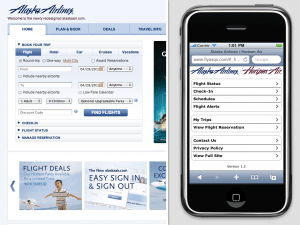

## What is Mobile Friendliness?

Mobile friendliness can mean a multitude of things, depending on who you're talking to. It can be helpful to think of it in terms of three goals for improving your site's user experience: Presentation, Content, and Performance.

### Goal #1 (Presentation)

_"Make websites that work well on a variety of screen sizes."_

These days, users can access the web on devices in a wide range of form factors, including phones, tablets, and eReaders. Needless to say, a fixed-width, three-column layout filled with complex JavaScript animations and mouse-over effects is not going to look or feel quite right on a phone with a 2-inch-wide screen and a diminutive processor. A slimmed-down, linearized page layout with elements [sized for a touchscreen](https://www.lukew.com/ff/entry.asp?1085) would be much more appropriate. That's why this first goal is all about presenting your content in a way that makes life easy for users on mobile device.

### Goal #2 (Content)

_"Adjust your content for mobile users."_

Think about what your users want to do at your site if they are on a phone. A great example of this is [Alaska Air's website](https://www.alaskaair.com/). Their desktop site focuses on getting visitors to book trips. Mobile users, however, are probably more interested in checking-in for a flight or seeing if their flight is delayed. They've adjusted their site's content to reflect this, and it meets the needs of mobile users.

### Goal #3 (Performance)

_"Give your users a smooth experience, even on a slow connection."_

Though things have been getting better in recent years, browsing the Internet over a wireless data connection can still be pretty painful. This makes it more essential than ever to practice [good performance practices](https://developer.yahoo.com/performance/rules.html), only sending the user the bits they will actually need.

### Know your audience

While not strictly a part of the definition of being mobile friendly, defining who your target audience is makes these goals much more concrete. For example, it is absolutely critical to keep in mind which browsers and devices you will target when picking a mobile strategy. If your audience is full of early-adopters, you can focus on tablets and smartphones with standards-friendly browsers. On the other hand, if many of your site's users are on devices with less capable browsers, that may eliminate certain strategies as viable options.

## Approaches to mobile Web development

The following approaches aim to achieve each of these goals by different means.

- [Separate sites](/en-US/docs/Web/Guide/Mobile/Separate_sites)
- [Responsive design](/en-US/docs/Learn/CSS/CSS_layout/Responsive_Design)
- [A hybrid approach](/en-US/docs/Web/Guide/Mobile/A_hybrid_approach)

## Original document information

Originally published on 4 May, 2011 on the Mozilla Webdev blog as "[Approaches to Mobile Web Development Part 1 - What is Mobile Friendliness?](https://blog.mozilla.org/webdev/2011/05/04/approaches-to-mobile-web-development-part-1-what-is-mobile-friendliness/)", by Jason Grlicky.
