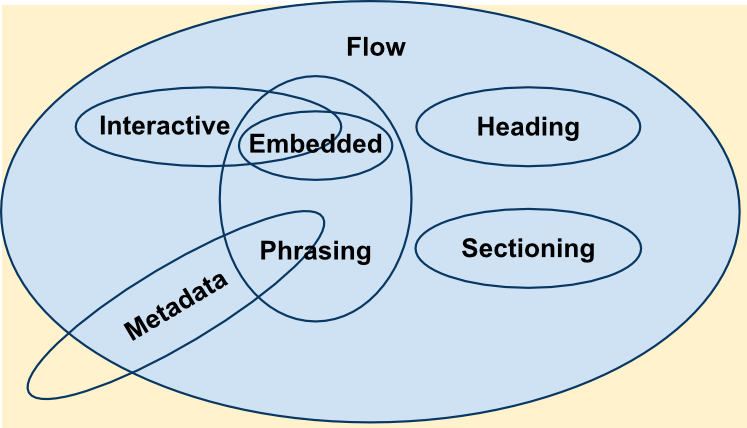

{{HTMLSidebar}}

Most [HTML](/en-US/docs/Web/HTML) elements are a member of one or more **content categories** — these categories group elements that share common characteristics. This is a loose grouping (it doesn't actually create a relationship among elements of these categories), but they help define and describe the categories' shared behavior and their associated rules, especially when you come upon their intricate details. It's also possible for elements to not be a member of _any_ of these categories.

There are three types of content categories:

- Main content categories, which describe common rules shared by many elements.
- Form-related content categories, which describe rules common to form-related elements.
- Specific content categories, which describe rare categories shared only by a few elements, sometimes only in a specific context.

> **Note:** A more detailed discussion of these content categories and their comparative functionalities is beyond the scope of this article; for that, you may wish to read the [relevant portions of the HTML specification](https://html.spec.whatwg.org/multipage/dom.html#kinds-of-content).

[](/en-US/docs/Web/HTML/Content_categories/content_categories_venn.png)

## Main content categories

### Metadata content

Elements belonging to the _metadata content_ category modify the presentation or the behavior of the rest of the document, set up links to other documents, or convey other _out-of-band_ information.

Elements belonging to this category are {{HTMLElement("base")}}, {{HTMLElement("link")}}, {{HTMLElement("meta")}}, {{HTMLElement("noscript")}}, {{HTMLElement("script")}}, {{HTMLElement("style")}} and {{HTMLElement("title")}}.

### Flow content

Flow content is a broad category that encompasses most elements that can go inside the {{HTMLElement("body")}} element, including heading elements, sectioning elements, phrasing elements, embedding elements, interactive elements, and form-related elements. It also includes text nodes (but not those that only consist of white space characters).

The flow elements are:

- {{HTMLElement("a")}}
- {{HTMLElement("abbr")}}
- {{HTMLElement("address")}}
- {{HTMLElement("article")}}
- {{HTMLElement("aside")}}
- {{HTMLElement("audio")}}
- {{HTMLElement("b")}}
- {{HTMLElement("bdo")}}
- {{HTMLElement("bdi")}}
- {{HTMLElement("blockquote")}}
- {{HTMLElement("br")}}
- {{HTMLElement("button")}}
- {{HTMLElement("canvas")}}
- {{HTMLElement("cite")}}
- {{HTMLElement("code")}}
- {{HTMLElement("data")}}
- {{HTMLElement("datalist")}}
- {{HTMLElement("del")}}
- {{HTMLElement("details")}}
- {{HTMLElement("dfn")}}
- {{HTMLElement("dialog")}}
- {{HTMLElement("div")}}
- {{HTMLElement("dl")}}
- {{HTMLElement("em")}}
- {{HTMLElement("embed")}}
- {{HTMLElement("fieldset")}}
- {{HTMLElement("figure")}}
- {{HTMLElement("footer")}}
- {{HTMLElement("form")}}
- {{HTMLElement("Heading_Elements", "<code>&lt;h1&gt;</code>-<code>&lt;h6&gt;</code>")}}
- {{HTMLElement("header")}}
- {{HTMLElement("hgroup")}}
- {{HTMLElement("hr")}}
- {{HTMLElement("i")}}
- {{HTMLElement("iframe")}}
- {{HTMLElement("img")}}
- {{HTMLElement("input")}}
- {{HTMLElement("ins")}}
- {{HTMLElement("kbd")}}
- {{HTMLElement("label")}}
- {{HTMLElement("main")}}
- {{HTMLElement("map")}}
- {{HTMLElement("mark")}}
- {{MathMLElement("math")}}
- {{HTMLElement("menu")}}
- {{HTMLElement("meter")}}
- {{HTMLElement("nav")}}
- {{HTMLElement("noscript")}}
- {{HTMLElement("object")}}
- {{HTMLElement("ol")}}
- {{HTMLElement("output")}}
- {{HTMLElement("p")}}
- {{HTMLElement("picture")}}
- {{HTMLElement("pre")}}
- {{HTMLElement("progress")}}
- {{HTMLElement("q")}}
- {{HTMLElement("ruby")}}
- {{HTMLElement("s")}}
- {{HTMLElement("samp")}}
- {{HTMLElement("search")}}
- {{HTMLElement("script")}}
- {{HTMLElement("section")}}
- {{HTMLElement("select")}}
- {{HTMLElement("slot")}}
- {{HTMLElement("small")}}
- {{HTMLElement("span")}}
- {{HTMLElement("strong")}}
- {{HTMLElement("sub")}}
- {{HTMLElement("sup")}}
- {{SVGElement("svg")}}
- {{HTMLElement("table")}}
- {{HTMLElement("template")}}
- {{HTMLElement("textarea")}}
- {{HTMLElement("time")}}
- {{HTMLElement("u")}}
- {{HTMLElement("ul")}}
- {{HTMLElement("var")}}
- {{HTMLElement("video")}}
- {{HTMLElement("wbr")}}
- plain text

A few other elements belong to this category, but only if a specific condition is fulfilled:

- {{HTMLElement("area")}}, if it is a descendant of a {{HTMLElement("map")}} element
- {{HTMLElement("link")}}, if the [itemprop](/en-US/docs/Web/HTML/Global_attributes/itemprop) attribute is present
- {{HTMLElement("meta")}}, if the [itemprop](/en-US/docs/Web/HTML/Global_attributes/itemprop) attribute is present

### Sectioning content

Sectioning content, a subset of flow content, creates a [section in the current outline](/en-US/docs/Web/HTML/Element/Heading_Elements) defining the scope of {{HTMLElement("header")}} and {{HTMLElement("footer")}} elements.

Elements belonging to this category are {{HTMLElement("article")}}, {{HTMLElement("aside")}}, {{HTMLElement("nav")}}, and {{HTMLElement("section")}}.

### Heading content

Heading content, a subset of flow content, defines the title of a section. This definition applies both to sections marked by an explicit [sectioning content](#sectioning_content) elements and to those implicitly defined by the heading content itself.

Elements belonging to this category are {{HTMLElement("Heading_Elements", "<code>&lt;h1&gt;</code>-<code>&lt;h6&gt;</code>")}} and {{HTMLElement("hgroup")}}.

> **Note:** Though likely to contain heading content, the {{HTMLElement("header")}} is not heading content itself.

### Phrasing content

Phrasing content, a subset of flow content, refers to the text and the markup within a document. Sequences of phrasing content make up paragraphs.

Elements belonging to this category are:

- {{HTMLElement("abbr")}}
- {{HTMLElement("audio")}}
- {{HTMLElement("b")}}
- {{HTMLElement("bdi")}}
- {{HTMLElement("bdo")}}
- {{HTMLElement("br")}}
- {{HTMLElement("button")}}
- {{HTMLElement("canvas")}}
- {{HTMLElement("cite")}}
- {{HTMLElement("code")}}
- {{HTMLElement("data")}}
- {{HTMLElement("datalist")}}
- {{HTMLElement("dfn")}}
- {{HTMLElement("em")}}
- {{HTMLElement("embed")}}
- {{HTMLElement("i")}}
- {{HTMLElement("iframe")}}
- {{HTMLElement("img")}}
- {{HTMLElement("input")}}
- {{HTMLElement("kbd")}}
- {{HTMLElement("label")}}
- {{HTMLElement("mark")}}
- {{MathMLElement("math")}}
- {{HTMLElement("meter")}}
- {{HTMLElement("noscript")}}
- {{HTMLElement("object")}}
- {{HTMLElement("output")}}
- {{HTMLElement("picture")}}
- {{HTMLElement("progress")}}
- {{HTMLElement("q")}}
- {{HTMLElement("ruby")}}
- {{HTMLElement("s")}}
- {{HTMLElement("samp")}}
- {{HTMLElement("script")}}
- {{HTMLElement("select")}}
- {{HTMLElement("slot")}}
- {{HTMLElement("small")}}
- {{HTMLElement("span")}}
- {{HTMLElement("strong")}}
- {{HTMLElement("sub")}}
- {{HTMLElement("sup")}}
- {{SVGElement("svg")}}
- {{HTMLElement("template")}}
- {{HTMLElement("textarea")}}
- {{HTMLElement("time")}}
- {{HTMLElement("u")}}
- {{HTMLElement("var")}}
- {{HTMLElement("video")}}
- {{HTMLElement("wbr")}}
- plain text (including more than just whitespace characters)

A few other elements belong to this category, but only if a specific condition is fulfilled:

- {{HTMLElement("a")}}, if it contains only phrasing content
- {{HTMLElement("area")}}, if it is a descendant of a {{HTMLElement("map")}} element
- {{HTMLElement("del")}}, if it contains only phrasing content
- {{HTMLElement("ins")}}, if it contains only phrasing content
- {{HTMLElement("link")}}, if the [itemprop](/en-US/docs/Web/HTML/Global_attributes/itemprop) attribute is present
- {{HTMLElement("map")}}, if it contains only phrasing content
- {{HTMLElement("meta")}}, if the [itemprop](/en-US/docs/Web/HTML/Global_attributes/itemprop) attribute is present

### Embedded content

Embedded content, a subset of flow content, imports another resource or inserts content from another markup language or namespace into the document. Elements that belong to this category include:

- {{HTMLElement("audio")}}
- {{HTMLElement("canvas")}}
- {{HTMLElement("embed")}}
- {{HTMLElement("iframe")}}
- {{HTMLElement("img")}}
- {{MathMLElement("math")}}
- {{HTMLElement("object")}}
- {{HTMLElement("picture")}}
- {{SVGElement("svg")}}
- {{HTMLElement("video")}}

### Interactive content

Interactive content, a subset of flow content, includes elements that are specifically designed for user interaction. Elements that belong to this category include:

- {{HTMLElement("button")}}
- {{HTMLElement("details")}}
- {{HTMLElement("embed")}}
- {{HTMLElement("iframe")}}
- {{HTMLElement("label")}}
- {{HTMLElement("select")}}
- {{HTMLElement("textarea")}}

Some elements belong to this category only under specific conditions:

- {{HTMLElement("a")}}, if the [`href`](/en-US/docs/Web/HTML/Element/a#href) attribute is present
- {{HTMLElement("audio")}}, if the [`controls`](/en-US/docs/Web/HTML/Element/audio#controls) attribute is present
- {{HTMLElement("img")}}, if the [`usemap`](/en-US/docs/Web/HTML/Element/img#usemap) attribute is present
- {{HTMLElement("input")}}, if the [type](/en-US/docs/Web/HTML/Element/input#type) attribute is not in the hidden state
- {{HTMLElement("object")}}, if the [`usemap`](/en-US/docs/Web/HTML/Element/object#usemap) attribute is present
- {{HTMLElement("video")}}, if the [`controls`](/en-US/docs/Web/HTML/Element/video#controls) attribute is present

### Palpable content

Content is palpable when it's neither empty nor hidden; it is content that is rendered and is substantive. Elements whose model is flow content should have at least one node which is palpable.

### Form-associated content

Form-associated content is a subset of flow content comprising elements that have a form owner, exposed by a **form** attribute, and can be used everywhere flow content is expected. A form owner is either the containing {{HTMLElement("form")}} element or the element whose id is specified in the **form** attribute.

- {{HTMLElement("button")}}
- {{HTMLElement("fieldset")}}
- {{HTMLElement("input")}}
- {{HTMLElement("label")}}
- {{HTMLElement("meter")}}
- {{HTMLElement("object")}}
- {{HTMLElement("output")}}
- {{HTMLElement("progress")}}
- {{HTMLElement("select")}}
- {{HTMLElement("textarea")}}

This category contains several sub-categories:

- listed
  - : Elements that are listed in the {{domxref("HTMLFormElement.elements", "form.elements")}} and `fieldset.elements` collections. Contains {{HTMLElement("button")}}, {{HTMLElement("fieldset")}}, {{HTMLElement("input")}}, {{HTMLElement("object")}}, {{HTMLElement("output")}}, {{HTMLElement("select")}}, and {{HTMLElement("textarea")}}.
- labelable
  - : Elements that can be associated with {{HTMLElement("label")}} elements. Contains {{HTMLElement("button")}}, {{HTMLElement("input")}}, {{HTMLElement("meter")}}, {{HTMLElement("output")}}, {{HTMLElement("progress")}}, {{HTMLElement("select")}}, and {{HTMLElement("textarea")}}.
- submittable
  - : Elements that can be used for constructing the form data set when the form is submitted. Contains {{HTMLElement("button")}}, {{HTMLElement("input")}}, {{HTMLElement("object")}}, {{HTMLElement("select")}}, and {{HTMLElement("textarea")}}.
- resettable
  - : Elements that can be affected when a form is reset. Contains {{HTMLElement("input")}}, {{HTMLElement("output")}}, {{HTMLElement("select")}}, and {{HTMLElement("textarea")}}.

## Secondary content categories

There are some secondary classifications of elements that can be useful to be aware of as well.

### Script-supporting elements

**Script-supporting elements** are elements that don't directly contribute to a document's rendered output. Instead, they serve to support scripts, either by containing or specifying script code directly or by specifying data that will be used by scripts.

The script-supporting elements are:

- {{HTMLElement("script")}}
- {{HTMLElement("template")}}

## Transparent content model

If an element has a transparent content model, then its contents must be structured such that they would be valid HTML, even if the transparent element were removed and replaced by the child elements.

For example, the {{HTMLElement("del")}} and {{HTMLElement("ins")}} elements are transparent:

```html
<p><del>Shopping</del> <ins>Returns</ins> list</p>
<ul>
  <del>
    <li>Oranges</li>
    <li>Toilet paper</li>
  </del>
  <li>Toothpaste</li>
</ul>
```

If those elements were removed, this fragment would still be valid HTML (if not correct English).

```html
<p>Shopping Returns list</p>
<ul>
  <li>Oranges</li>
  <li>Toilet paper</li>
  <li>Toothpaste</li>
</ul>
```
