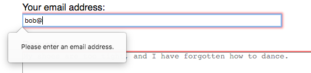
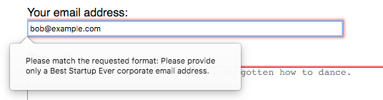

{{HTMLSidebar}}

{{HTMLElement("input")}} elements of type **`email`** are used to let the user enter and edit an email address, or, if the [`multiple`](/en-US/docs/Web/HTML/Attributes/multiple) attribute is specified, a list of email addresses.

{{EmbedInteractiveExample("pages/tabbed/input-email.html", "tabbed-shorter")}}

The input value is automatically validated to ensure that it's either empty or a properly-formatted email address (or list of addresses) before the form can be submitted. The {{cssxref(":valid")}} and {{cssxref(":invalid")}} CSS pseudo-classes are automatically applied as appropriate to visually denote whether the current value of the field is a valid email address or not.

## Value

The {{HTMLElement("input")}} element's [`value`](/en-US/docs/Web/HTML/Element/input#value) attribute contains a string which is automatically validated as conforming to email syntax. More specifically, there are three possible value formats that will pass validation:

1. An empty string ("") indicating that the user did not enter a value or that the value was removed.
2. A single properly-formed email address. This doesn't necessarily mean the email address exists, but it is at least formatted correctly. In simple terms, this means `username@domain` or `username@domain.tld`. There's more to it than that, of course; see [Validation](#validation) for a {{Glossary("regular expression")}} that matches the email address validation algorithm.
3. If and only if the [`multiple`](/en-US/docs/Web/HTML/Element/input#multiple) attribute is specified, the value can be a list of properly-formed comma-separated email addresses. Any trailing and leading whitespace is removed from each address in the list.

See [Validation](#validation) for details on how email addresses are validated to ensure that they're formatted properly.

## Additional attributes

In addition to the [global attributes](/en-US/docs/Web/HTML/Global_attributes), and the attributes that operate on all {{HTMLElement("input")}} elements regardless of their type, `email` inputs support the following attributes.

> [!NOTE]
> The [`autocorrect`](/en-US/docs/Web/HTML/Global_attributes/autocorrect) global attribute can be added to email inputs, but the stored state is always `off`.

### list

The values of the list attribute is the {{domxref("Element.id", "id")}} of a {{HTMLElement("datalist")}} element located in the same document. The {{HTMLElement("datalist")}} provides a list of predefined values to suggest to the user for this input. Any values in the list that are not compatible with the [`type`](/en-US/docs/Web/HTML/Element/input#type) are not included in the suggested options. The values provided are suggestions, not requirements: users can select from this predefined list or provide a different value.

### maxlength

The maximum string length (measured in UTF-16 code units) that the user can enter into the `email` input. This must be an integer value of 0 or higher. If no `maxlength` is specified, or an invalid value is specified, the `email` input has no maximum length. This value must also be greater than or equal to the value of `minlength`.

The input will fail [constraint validation](/en-US/docs/Web/HTML/Constraint_validation) if the length of the text value of the field is greater than `maxlength` UTF-16 code units long. Constraint validation is only applied when the value is changed by the user.

### minlength

The minimum string length (measured in UTF-16 code units) that the user can enter into the `email` input. This must be a non-negative integer value smaller than or equal to the value specified by `maxlength`. If no `minlength` is specified, or an invalid value is specified, the `email` input has no minimum length.

The input will fail [constraint validation](/en-US/docs/Web/HTML/Constraint_validation) if the length of the text entered into the field is fewer than `minlength` UTF-16 code units long. Constraint validation is only applied when the value is changed by the user.

### multiple

A Boolean attribute which, if present, indicates that the user can enter a list of multiple email addresses, separated by commas and, optionally, whitespace characters. See [Allowing multiple email addresses](#allowing_multiple_email_addresses) for an example, or [HTML attribute: multiple](/en-US/docs/Web/HTML/Attributes/multiple) for more details.

> [!NOTE]
> Normally, if you specify the [`required`](/en-US/docs/Web/HTML/Element/input#required) attribute, the user must enter a valid email address for the field to be considered valid. However, if you add the `multiple` attribute, a list of zero email addresses (an empty string, or one which is entirely whitespace) is a valid value. In other words, the user does not have to enter even one email address when `multiple` is specified, regardless of the value of `required`.

### pattern

The `pattern` attribute, when specified, is a regular expression that the input's [`value`](/en-US/docs/Web/HTML/Element/input#value) must match for the value to pass [constraint validation](/en-US/docs/Web/HTML/Constraint_validation). It must be a valid JavaScript regular expression, as used by the {{jsxref("RegExp")}} type, and as documented in our [guide on regular expressions](/en-US/docs/Web/JavaScript/Guide/Regular_expressions); the `'u'` flag is specified when compiling the regular expression so that the pattern is treated as a sequence of Unicode code points, instead of as {{Glossary("ASCII")}}. No forward slashes should be specified around the pattern text.

If the specified pattern is not specified or is invalid, no regular expression is applied and this attribute is ignored completely.

> [!NOTE]
> Use the [`title`](/en-US/docs/Web/HTML/Element/input#title) attribute to specify text that most browsers will display as a tooltip to explain what the requirements are to match the pattern. You should also include other explanatory text nearby.

See the section [Pattern validation](#pattern_validation) for details and an example.

### `placeholder`

The `placeholder` attribute is a string that provides a brief hint to the user as to what kind of information is expected in the field. It should be a word or short phrase that demonstrates the expected type of data, rather than an explanatory message. The text _must not_ include carriage returns or line feeds.

If the control's content has one directionality ({{Glossary("LTR")}} or {{Glossary("RTL")}}) but needs to present the placeholder in the opposite directionality, you can use Unicode bidirectional algorithm formatting characters to override directionality within the placeholder; see [How to use Unicode controls for bidi text](https://www.w3.org/International/questions/qa-bidi-unicode-controls) for more information.

> [!NOTE]
> Avoid using the `placeholder` attribute if you can. It is not as semantically useful as other ways to explain your form, and can cause unexpected technical issues with your content. See [`<input>` labels](/en-US/docs/Web/HTML/Element/input#labels) for more information.

### `readonly`

A Boolean attribute which, if present, means this field cannot be edited by the user. Its `value` can, however, still be changed by JavaScript code directly setting the {{domxref("HTMLInputElement")}} `value` property.

> [!NOTE]
> Because a read-only field cannot have a value, `required` does not have any effect on inputs with the `readonly` attribute also specified.

### `size`

The `size` attribute is a numeric value indicating how many characters wide the input field should be. The value must be a number greater than zero, and the default value is 20. Since character widths vary, this may or may not be exact and should not be relied upon to be so; the resulting input may be narrower or wider than the specified number of characters, depending on the characters and the font ({{cssxref("font")}} settings in use).

This does _not_ set a limit on how many characters the user can enter into the field. It only specifies approximately how many can be seen at a time. To set an upper limit on the length of the input data, use the [`maxlength`](#maxlength) attribute.

## Using email inputs

Email addresses are among the most frequently-inputted textual data forms on the web; they're used when logging into websites, when requesting information, to allow order confirmation, for webmail, and so forth. As such, the `email` input type can make your job as a web developer much easier since it can help simplify your work when building the user interface and logic for email addresses. When you create an email input with the proper `type` value, `email`, you get automatic validation that the entered text is at least in the correct form to potentially be a legitimate email address. This can help avoid cases in which the user mistypes their address, or provides an invalid address.

It's important, however, to note that this is not enough to ensure that the specified text is an email address which actually exists, corresponds to the user of the site, or is acceptable in any other way. It ensures that the value of the field is properly formatted to be an email address.

> [!NOTE]
> It's also crucial to remember that a user can tinker with your HTML behind the scenes, so your site _must not_ use this validation for any security purposes. You _must_ verify the email address on the server side of any transaction in which the provided text may have any security implications of any kind.

### A basic email input

Currently, all browsers which implement this element implement it as a standard text input field with basic validation features. The specification does, however, allow browsers latitude on this. For example, the element could be integrated with the user's device's built-in address book to allow picking email addresses from that list. In its most basic form, an `email` input can be implemented like this:

```html
<input id="emailAddress" type="email" />
```

{{ EmbedLiveSample('A_basic_email_input', 600, 40) }}

Notice that it's considered valid when empty and when a single validly-formatted email address is entered, but is otherwise not considered valid. By adding the [`required`](/en-US/docs/Web/HTML/Element/input#required) attribute, only validly-formed email addresses are allowed; the input is no longer considered valid when empty.

### Allowing multiple email addresses

By adding the [`multiple`](/en-US/docs/Web/HTML/Attributes/multiple) Boolean attribute, the input can be configured to accept multiple email addresses.

```html
<input id="emailAddress" type="email" multiple />
```

{{ EmbedLiveSample('Allowing multiple email addresses', 600, 40) }}

The input is now considered valid when a single email address is entered, or when any number of email addresses separated by commas and, optionally, some number of whitespace characters are present.

> [!NOTE]
> When `multiple` is used, the value _is_ allowed to be empty.

Some examples of valid strings when `multiple` is specified:

- `""`
- `"me@example"`
- `"me@example.org"`
- `"me@example.org,you@example.org"`
- `"me@example.org, you@example.org"`
- `"me@example.org,you@example.org, us@example.org"`

Some examples of invalid strings:

- `","`
- `"me"`
- `"me@example.org you@example.org"`

### Placeholders

Sometimes it's helpful to offer an in-context hint as to what form the input data should take. This can be especially important if the page design doesn't offer descriptive labels for each {{HTMLElement("input")}}. This is where **placeholders** come in. A placeholder is a value that demonstrates the form the `value` should take by presenting an example of a valid value, which is displayed inside the edit box when the element's `value` is "". Once data is entered into the box, the placeholder disappears; if the box is emptied, the placeholder reappears.

Here, we have an `email` input with the placeholder `sophie@example.com`. Note how the placeholder disappears and reappears as you manipulate the contents of the edit field.

```html
<input type="email" placeholder="sophie@example.com" />
```

{{ EmbedLiveSample('Placeholders', 600, 40) }}

### Controlling the input size

You can control not only the physical length of the input box, but also the minimum and maximum lengths allowed for the input text itself.

#### Physical input element size

The physical size of the input box can be controlled using the [`size`](/en-US/docs/Web/HTML/Element/input#size) attribute. With it, you can specify the number of characters the input box can display at a time. In this example the `email` edit box is 15 characters wide:

```html
<input type="email" size="15" />
```

{{ EmbedLiveSample('Physical_input_element_size', 600, 40) }}

#### Element value length

The `size` is separate from the length limitation on the entered email address itself so that you can have fields fit in a small space while still allowing longer email address strings to be entered. You can specify a minimum length, in characters, for the entered email address using the [`minlength`](/en-US/docs/Web/HTML/Element/input#minlength) attribute; similarly, use [`maxlength`](/en-US/docs/Web/HTML/Element/input#maxlength) to set the maximum length of the entered email address.

The example below creates a 32 character-wide email address entry box, requiring that the contents be no shorter than 3 characters and no longer than 64 characters.

```html
<input type="email" size="32" minlength="3" maxlength="64" />
```

{{EmbedLiveSample("Element_value_length", 600, 40) }}

### Providing default options

#### Providing a single default using the value attribute

As always, you can provide a default value for an `email` input box by setting its [`value`](/en-US/docs/Web/HTML/Element/input#value) attribute:

```html
<input type="email" value="default@example.com" />
```

{{EmbedLiveSample("Providing_a_single_default_using_the_value_attribute", 600, 40)}}

#### Offering suggested values

Taking it a step further, you can provide a list of default options from which the user can select by specifying the [`list`](/en-US/docs/Web/HTML/Element/input#list) attribute. This doesn't limit the user to those options, but does allow them to select commonly-used email addresses more quickly. This also offers hints to [`autocomplete`](/en-US/docs/Web/HTML/Element/input#autocomplete). The `list` attribute specifies the ID of a {{HTMLElement("datalist")}}, which in turn contains one {{HTMLElement("option")}} element per suggested value; each `option`'s `value` is the corresponding suggested value for the email entry box.

```html
<input type="email" size="40" list="defaultEmails" />

<datalist id="defaultEmails">
  <option value="jbond007@mi6.defence.gov.uk"></option>
  <option value="jbourne@unknown.net"></option>
  <option value="nfury@shield.org"></option>
  <option value="tony@starkindustries.com"></option>
  <option value="hulk@grrrrrrrr.arg"></option>
</datalist>
```

{{EmbedLiveSample("Offering_suggested_values", 600, 40)}}

With the {{HTMLElement("datalist")}} element and its {{HTMLElement("option")}}s in place, the browser will offer the specified values as potential values for the email address; this is typically presented as a popup or drop-down menu containing the suggestions. While the specific user experience may vary from one browser to another, typically clicking in the edit box presents a drop-down of the suggested email addresses. Then, as the user types, the list is filtered to show only matching values. Each typed character narrows down the list until the user makes a selection or types a custom value.

## Validation

There are two levels of content validation available for `email` inputs. First, there's the standard level of validation offered to all {{HTMLElement("input")}}s, which automatically ensures that the contents meet the requirements to be a valid email address. But there's also the option to add additional filtering to ensure that your own specialized needs are met, if you have any.

> [!WARNING]
> HTML form validation is _not_ a substitute for scripts that ensure that the entered data is in the proper format. It's far too easy for someone to make adjustments to the HTML that allow them to bypass the validation, or to remove it completely. It's also possible for someone to bypass your HTML entirely and submit the data directly to your server. If your server-side code fails to validate the data it receives, disaster could strike when improperly-formatted data (or data which is too large, is of the wrong type, and so forth) is entered into your database.

### Basic validation

Browsers automatically provide validation to ensure that only text that matches the standard format for Internet email addresses is entered into the input box. Browsers use an algorithm equivalent to the following regular expression:

```js
/^[a-zA-Z0-9.!#$%&'*+/=?^_`{|}~-]+@[a-zA-Z0-9](?:[a-zA-Z0-9-]{0,61}[a-zA-Z0-9])?(?:\.[a-zA-Z0-9](?:[a-zA-Z0-9-]{0,61}[a-zA-Z0-9])?)*$/;
```

To learn more about how form validation works and how to take advantage of the {{cssxref(":valid")}} and {{cssxref(":invalid")}} CSS properties to style the input based on whether the current value is valid, see [Form data validation](/en-US/docs/Learn_web_development/Extensions/Forms/Form_validation).

> [!NOTE]
> There are known specification issues related to international domain names and the validation of email addresses in HTML. See [W3C bug 15489](https://www.w3.org/Bugs/Public/show_bug.cgi?id=15489) for details.

### Pattern validation

If you need the entered email address to be restricted further than just "any string that looks like an email address," you can use the [`pattern`](/en-US/docs/Web/HTML/Element/input#pattern) attribute to specify a {{Glossary("regular expression")}} the value must match for it to be valid. If the [`multiple`](/en-US/docs/Web/HTML/Element/input#multiple) attribute is specified, each individual item in the comma-delineated list of values must match the {{Glossary("regular expression")}}.

For example, let's say you're building a page for employees of Best Startup Ever, Inc. which will let them contact their IT department for help. In our simplified form, the user needs to enter their email address and a message describing the problem they need help with. We want to ensure that not only does the user provide a valid email address, but for security purposes, we require that the address be an internal corporate email address.

Since inputs of type `email` validate against both the standard email address validation _and_ the specified [`pattern`](/en-US/docs/Web/HTML/Element/input#pattern), you can implement this easily. Let's see how:

```css hidden
body {
  font: 16px sans-serif;
}

.emailBox {
  padding-bottom: 20px;
}

.messageBox {
  padding-bottom: 20px;
}

label {
  line-height: 22px;
}

label::after {
  content: ":";
}
```

```html
<form>
  <div class="emailBox">
    <label for="emailAddress">Your email address</label><br />
    <input
      id="emailAddress"
      type="email"
      size="64"
      maxlength="64"
      required
      placeholder="username@beststartupever.com"
      pattern=".+@beststartupever\.com"
      title="Please provide only a Best Startup Ever corporate email address" />
  </div>

  <div class="messageBox">
    <label for="message">Request</label><br />
    <textarea
      id="message"
      cols="80"
      rows="8"
      required
      placeholder="My shoes are too tight, and I have forgotten how to dance."></textarea>
  </div>
  <input type="submit" value="Send Request" />
</form>
```

{{EmbedLiveSample("Pattern_validation", 700, 300)}}

Our {{HTMLElement("form")}} contains one {{HTMLElement("input")}} of type `email` for the user's email address, a {{HTMLElement("textarea")}} to enter their message for IT into, and an `<input>` of type [`"submit"`](/en-US/docs/Web/HTML/Element/input/submit), which creates a button to submit the form. Each text entry box has a {{HTMLElement("label")}} associated with it to let the user know what's expected of them.

Let's take a closer look at the email address entry box. Its [`size`](/en-US/docs/Web/HTML/Element/input#size) and [`maxlength`](/en-US/docs/Web/HTML/Element/input#maxlength) attributes are both set to 64 in order to show room for 64 characters worth of email address, and to limit the number of characters actually entered to a maximum of 64. The [`required`](/en-US/docs/Web/HTML/Element/input#required) attribute is specified, making it mandatory that a valid email address be provided.

An appropriate [`placeholder`](/en-US/docs/Web/HTML/Element/input#placeholder) is provided—`username@beststartupever.com`—to demonstrate what constitutes a valid entry. This string demonstrates both that an email address should be entered, and suggests that it should be a corporate beststartupever.com account. This is in addition to the fact that using type `email` will validate the text to ensure that it's formatted like an email address. If the text in the input box isn't an email address, you'll get an error message that looks something like this:



If we left things at that, we would at least be validating on legitimate email addresses. But we want to go one step farther: we want to make sure that the email address is in fact in the form `[username]@beststartupever.com`. This is where we'll use [`pattern`](/en-US/docs/Web/HTML/Element/input#pattern). We set `pattern` to `.+@beststartupever.com`. This regular expression requests a string that consists of at least one character of any kind, then an "@" followed by the domain name "beststartupever.com".

Note that this is not even close to an adequate filter for valid email addresses; it would allow things such as " @beststartupever.com" (note the leading space) or "@@beststartupever.com", neither of which is valid. However, the browser runs both the standard email address filter _and_ our custom pattern against the specified text. As a result, we wind up with a validation which says "make sure this resembles a valid email address, and if it is, make sure it's also a beststartupever.com address."

It's advisable to use the [`title`](/en-US/docs/Web/HTML/Global_attributes/title) attribute along with `pattern`. If you do, the `title` _must_ describe the pattern. That is, it should explain what format the data should take on, rather than any other information. That's because the `title` may be displayed or spoken as part of a validation error message. For example, the browser might present the message "The entered text doesn't match the required pattern." followed by your specified `title`. If your `title` is something like "Email address", the result would be the message "The entered text doesn't match the required pattern. Email address", which isn't very good.

That's why, instead, we specify the string "Please provide only a Best Startup Ever corporate email address" By doing that, the resulting full error message might be something like "The entered text doesn't match the required pattern. Please provide only a Best Startup Ever corporate email address."



> [!NOTE]
> If you run into trouble while writing your validation regular expressions and they're not working properly, check your browser's console; there may be helpful error messages there to aid you in solving the problem.

## Examples

Here we have an email input with the ID `emailAddress` which is allowed to be up to a maximum of 256 characters long. The input box itself is physically 64 characters wide, and displays the text `user@example.gov` as a placeholder anytime the field is empty. In addition, by using the [`multiple`](/en-US/docs/Web/HTML/Attributes/multiple) attribute, the box is configured to allow the user to enter zero or more email addresses, separated by commas, as described in [Allowing multiple email addresses](#allowing_multiple_email_addresses). As a final touch, the [`list`](/en-US/docs/Web/HTML/Element/input#list) attribute contains the ID of a {{HTMLElement("datalist")}} whose {{HTMLElement("option")}}s specify a set of suggested values the user can choose from.

As an added touch, the {{HTMLElement("label")}} element is used to establish a label for the email entry box, with its [`for`](/en-US/docs/Web/HTML/Element/label#for) attribute referencing the `emailAddress` ID of the {{HTMLElement("input")}} element. By associating the two elements in this way, clicking on the label will focus the input element.

```html
<label for="emailAddress">Email</label><br />
<input
  id="emailAddress"
  type="email"
  placeholder="user@example.gov"
  list="defaultEmails"
  size="64"
  maxlength="256"
  multiple />

<datalist id="defaultEmails">
  <option value="jbond007@mi6.defence.gov.uk"></option>
  <option value="jbourne@unknown.net"></option>
  <option value="nfury@shield.org"></option>
  <option value="tony@starkindustries.com"></option>
  <option value="hulk@grrrrrrrr.arg"></option>
</datalist>
```

{{EmbedLiveSample('Examples', 600, 80)}}

## Technical summary

<table class="properties">
  <tbody>
    <tr>
      <td><strong><a href="#value">Value</a></strong></td>
      <td>
        A string representing an email address, or
        empty
      </td>
    </tr>
    <tr>
      <td><strong>Events</strong></td>
      <td>
        {{domxref("HTMLElement/change_event", "change")}} and
        {{domxref("Element/input_event", "input")}}
      </td>
    </tr>
    <tr>
      <td><strong>Supported Common Attributes</strong></td>
      <td>
        <a href="/en-US/docs/Web/HTML/Element/input#autocomplete"><code>autocomplete</code></a>,
        <a href="/en-US/docs/Web/HTML/Element/input#list"><code>list</code></a>,
        <a href="/en-US/docs/Web/HTML/Element/input#maxlength"><code>maxlength</code></a>,
        <a href="/en-US/docs/Web/HTML/Element/input#minlength"><code>minlength</code></a>,
        <a href="/en-US/docs/Web/HTML/Element/input#multiple"><code>multiple</code></a>,
        <a href="/en-US/docs/Web/HTML/Element/input#name"><code>name</code></a>,
        <a href="/en-US/docs/Web/HTML/Element/input#pattern"><code>pattern</code></a>,
        <a href="/en-US/docs/Web/HTML/Element/input#placeholder"><code>placeholder</code></a>,
        <a href="/en-US/docs/Web/HTML/Element/input#readonly"><code>readonly</code></a>,
        <a href="/en-US/docs/Web/HTML/Element/input#required"><code>required</code></a>,
        <a href="/en-US/docs/Web/HTML/Element/input#size"><code>size</code></a>, and
        <a href="/en-US/docs/Web/HTML/Element/input#type"><code>type</code></a>
      </td>
    </tr>
    <tr>
      <td><strong>IDL attributes</strong></td>
      <td><code>list</code> and <code>value</code></td>
    </tr>
    <tr>
      <td><strong>DOM interface</strong></td>
      <td><p>{{domxref("HTMLInputElement")}}</p></td>
    </tr>
    <tr>
      <td><strong>Methods</strong></td>
      <td>
        {{domxref("HTMLInputElement.select", "select()")}}
      </td>
    </tr>
    <tr>
      <td><strong>Implicit ARIA Role</strong></td>
      <td>
        with no <code>list</code> attribute:
        <code><a href="/en-US/docs/Web/Accessibility/ARIA/Roles/textbox_role">textbox</a></code><br />
        with <code>list</code> attribute: <code><a href="/en-US/docs/Web/Accessibility/ARIA/Roles/combobox_role">combobox</a></code>
      </td>
    </tr>
  </tbody>
</table>

## Specifications

{{Specifications}}

## Browser compatibility

{{Compat}}

## See also

- [HTML forms guide](/en-US/docs/Learn_web_development/Extensions/Forms)
- {{HTMLElement("input")}}
- [`<input type="tel">`](/en-US/docs/Web/HTML/Element/input/tel)
- [`<input type="url">`](/en-US/docs/Web/HTML/Element/input/url)
- Attributes:
  - [`list`](/en-US/docs/Web/HTML/Element/input#list)
  - [`minlength`](/en-US/docs/Web/HTML/Attributes/minlength)
  - [`maxlength`](/en-US/docs/Web/HTML/Attributes/maxlength)
  - [`multiple`](/en-US/docs/Web/HTML/Attributes/multiple)
  - [`pattern`](/en-US/docs/Web/HTML/Attributes/pattern)
  - [`placeholder`](/en-US/docs/Web/HTML/Element/input#placeholder)
  - [`readonly`](/en-US/docs/Web/HTML/Attributes/readonly)
  - [`size`](/en-US/docs/Web/HTML/Attributes/size)
