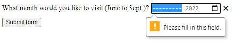

{{HTMLSidebar}}

{{HTMLElement("input")}} elements of type **`month`** create input fields that let the user enter a month and year allowing a month and year to be easily entered.
The value is a string whose value is in the format "`YYYY-MM`", where `YYYY` is the four-digit year and `MM` is the month number.

{{EmbedInteractiveExample("pages/tabbed/input-month.html", "tabbed-shorter")}}

The control's UI varies in general from browser to browser; at the moment support is patchy, with only Chrome/Opera and Edge on desktop — and most modern mobile browser versions — having usable implementations.
In browsers that don't support `month` inputs, the control degrades gracefully to a simple [`<input type="text">`](/en-US/docs/Web/HTML/Element/input/text), although there may be automatic validation of the entered text to ensure it's formatted as expected.

For those of you using a browser that doesn't support `month`, the screenshot below shows what it looks like in Chrome and Opera.
Clicking the down arrow on the right-hand side brings up a date picker that lets you select the month and year.


The Microsoft Edge `month` control looks like this:


## Value

A string representing the value of the month and year entered into the input, in the form YYYY-MM (four or more digit year, then a hyphen ("`-`"), followed by the two-digit month).
The format of the month string used by this input type is described in [Month strings](/en-US/docs/Web/HTML/Date_and_time_formats#month_strings).

### Setting a default value

You can set a default value for the input control by including a month and year inside the [`value`](/en-US/docs/Web/HTML/Element/input#value) attribute, like so:

```html
<label for="bday-month">What month were you born in?</label>
<input id="bday-month" type="month" name="bday-month" value="2001-06" />
```

{{EmbedLiveSample('Setting_a_default_value', 600, 60)}}

One thing to note is that the displayed date format differs from the actual `value`; most {{Glossary("user agent", "user agents")}} display the month and year in a locale-appropriate form, based on the set locale of the user's operating system, whereas the date `value` is always formatted `yyyy-MM`.

When the above value is submitted to the server, for example, it will look like `bday-month=1978-06`.

### Setting the value using JavaScript

You can also get and set the date value in JavaScript using the {{domxref("HTMLInputElement.value")}} property, for example:

```html
<label for="bday-month">What month were you born in?</label>
<input id="bday-month" type="month" name="bday-month" />
```

```js
const monthControl = document.querySelector('input[type="month"]');
monthControl.value = "2001-06";
```

{{EmbedLiveSample("Setting_the_value_using_JavaScript", 600, 60)}}

## Additional attributes

In addition to the attributes common to {{HTMLElement("input")}} elements, month inputs offer the following attributes.

### list

The values of the list attribute is the {{domxref("Element.id", "id")}} of a {{HTMLElement("datalist")}} element located in the same document.
The {{HTMLElement("datalist")}} provides a list of predefined values to suggest to the user for this input.
Any values in the list that are not compatible with the [`type`](/en-US/docs/Web/HTML/Element/input#type) are not included in the suggested options.
The values provided are suggestions, not requirements: users can select from this predefined list or provide a different value.

### max

The latest year and month, in the string format discussed in the [Value](#value) section above, to accept.
If the [`value`](/en-US/docs/Web/HTML/Element/input#value) entered into the element exceeds this, the element fails [constraint validation](/en-US/docs/Web/HTML/Constraint_validation).
If the value of the `max` attribute isn't a valid string in "`yyyy-MM`" format, then the element has no maximum value.

This value must specify a year-month pairing later than or equal to the one specified by the `min` attribute.

### min

The earliest year and month to accept, in the same "`yyyy-MM`" format described above.
If the [`value`](/en-US/docs/Web/HTML/Element/input#value) of the element is less than this, the element fails [constraint validation](/en-US/docs/Web/HTML/Constraint_validation).
If a value is specified for `min` that isn't a valid year and month string, the input has no minimum value.

This value must be a year-month pairing which is earlier than or equal to the one specified by the `max` attribute.

### readonly

A Boolean attribute which, if present, means this field cannot be edited by the user.
Its `value` can, however, still be changed from JavaScript code that directly sets the value of the {{domxref("HTMLInputElement.value")}} property.

> **Note:** Because a read-only field cannot have a value, `required` does not have any effect on inputs with the `readonly` attribute also specified.

### step

The `step` attribute is a number that specifies the granularity that the value must adhere to, or the special value `any`, which is described below.
Only values which are equal to the basis for stepping ([`min`](#min) if specified, [`value`](/en-US/docs/Web/HTML/Element/input#value) otherwise, and an appropriate default value if neither of those is provided) are valid.

A string value of `any` means that no stepping is implied, and any value is allowed (barring other constraints, such as [`min`](#min) and [`max`](#max)).

> **Note:** When the data entered by the user doesn't adhere to the stepping configuration, the {{Glossary("user agent")}} may round to the nearest valid value, preferring numbers in the positive direction when there are two equally close options.

For `month` inputs, the value of `step` is given in months, with a scaling factor of 1 (since the underlying numeric value is also in months).
The default value of `step` is 1 month.

## Using month inputs

Date-related inputs (including `month`) sound convenient at first glance; they promise an easy UI for choosing dates, and they normalize the data format sent to the server, regardless of the user's locale.
However, there are issues with `<input type="month">` because at this time, many major browsers don't yet support it.

We'll look at basic and more complex uses of `<input type="month">`, then offer advice on mitigating the browser support issue in the section [Handling browser support](#handling_browser_support)).

### Basic uses of month

The simplest use of `<input type="month">` involves a basic {{HTMLElement("input")}} and {{htmlelement("label")}} element combination, as seen below:

```html
<form>
  <label for="bday-month">What month were you born in?</label>
  <input id="bday-month" type="month" name="bday-month" />
</form>
```

{{EmbedLiveSample('Basic_uses_of_month', 600, 40)}}

### Setting maximum and minimum dates

You can use the [`min`](/en-US/docs/Web/HTML/Element/input#min) and [`max`](/en-US/docs/Web/HTML/Element/input#max) attributes to restrict the range of dates that the user can choose.
In the following example we specify a minimum month of `1900-01` and a maximum month of `2013-12`:

```html
<form>
  <label for="bday-month">What month were you born in?</label>
  <input
    id="bday-month"
    type="month"
    name="bday-month"
    min="1900-01"
    max="2013-12" />
</form>
```

{{EmbedLiveSample('Setting_maximum_and_minimum_dates', 600, 40)}}

The result here is that:

- Only months between in January 1900 and December 2013 can be selected; months outside that range can't be scrolled to in the control.
- Depending on what browser you are using, you might find that months outside the specified range might not be selectable in the month picker (e.g. Edge), or invalid (see [Validation](#validation)) but still available (e.g. Chrome).

### Controlling input size

`<input type="month">` doesn't support form sizing attributes such as [`size`](/en-US/docs/Web/HTML/Element/input#size).
You'll have to resort to [CSS](/en-US/docs/Web/CSS) for sizing needs.

## Validation

By default, `<input type="month">` does not apply any validation to entered values.
The UI implementations generally don't let you enter anything that isn't a date — which is helpful — but you can still submit the form with the `month` input empty, or enter an invalid date (e.g. the 32nd of April).

To help avoid this, you can use [`min`](/en-US/docs/Web/HTML/Element/input#min) and [`max`](/en-US/docs/Web/HTML/Element/input#max) to restrict the available dates (see [Setting maximum and minimum dates](#setting_maximum_and_minimum_dates)), and in addition use the [`required`](/en-US/docs/Web/HTML/Element/input#required) attribute to make filling in the date mandatory.
As a result, supporting browsers will display an error if you try to submit a date that is outside the set bounds, or an empty date field.

Let's look at an example; here we've set minimum and maximum dates, and also made the field required:

```html
<form>
  <div>
    <label for="month">
      What month would you like to visit (June to Sept.)?
    </label>
    <input
      id="month"
      type="month"
      name="month"
      min="2022-06"
      max="2022-09"
      required />
    <span class="validity"></span>
  </div>
  <div>
    <input type="submit" value="Submit form" />
  </div>
</form>
```

If you try to submit the form without both the month and year specified (or with a date outside the set bounds), the browser displays an error.
Try playing with the example now:

{{ EmbedLiveSample('Validation', 600, 120) }}

Here's a screenshot for those of you who aren't using a supporting browser:



Here's the CSS used in the above example.
Here we make use of the {{cssxref(":valid")}} and {{cssxref(":invalid")}} CSS properties to style the input based on whether the current value is valid.
We had to put the icons on a {{htmlelement("span")}} next to the input, not on the input itself, because in Chrome the generated content is placed inside the form control, and can't be styled or shown effectively.

```css
div {
  margin-bottom: 10px;
  position: relative;
}

input[type="number"] {
  width: 100px;
}

input + span {
  padding-right: 30px;
}

input:invalid + span::after {
  position: absolute;
  content: "✖";
  padding-left: 5px;
}

input:valid + span::after {
  position: absolute;
  content: "✓";
  padding-left: 5px;
}
```

> **Warning:** HTML form validation is _not_ a substitute for scripts that ensure that the entered data is in the proper format.
> It's far too easy for someone to make adjustments to the HTML that allow them to bypass the validation, or to remove it entirely.
> It's also possible for someone to bypass your HTML entirely and submit the data directly to your server.
> If your server-side code fails to validate the data it receives, disaster could strike when improperly-formatted data is submitted (or data which is too large, of the wrong type, and so forth).

## Handling browser support

As mentioned above, the major problem with using date inputs at the time of writing is that many major browsers don't yet implement them all; only Chrome/Opera and Edge support it on desktop, and most modern browsers on mobile.
As an example, the `month` picker on Chrome for Android looks like this:


Non-supporting browsers gracefully degrade to a text input, but this creates problems both in terms of consistency of user interface (the presented control will be different), and data handling.

The second problem is the more serious of the two.
As mentioned earlier, with a `month` input the actual value is always normalized to the format `yyyy-mm`.
On the other hand, in its default configuration, a `text` input has no idea what format the date should be in, and this is an issue because of the number of different ways in which people write dates.
For example:

- `mmyyyy` (072022)
- `mm/yyyy` (07/2022)
- `mm-yyyy` (07-2022)
- `yyyy-mm` (2022-07)
- `Month yyyy` (July 2022)
- and so forth…

One way around this is to put a [`pattern`](/en-US/docs/Web/HTML/Element/input#pattern) attribute on your `month` input.
Even though the `month` input doesn't use it, if the browser falls back to treating it like a `text` input, the pattern will be used.
For example, try viewing the following demo in a browser that doesn't support `month` inputs:

```html
<form>
  <div>
    <label for="month">
      What month would you like to visit (June to Sept.)?
    </label>
    <input
      id="month"
      type="month"
      name="month"
      min="2022-06"
      max="2022-09"
      required
      pattern="[0-9]{4}-[0-9]{2}" />
    <span class="validity"></span>
  </div>
  <div>
    <input type="submit" value="Submit form" />
  </div>
</form>
```

{{ EmbedLiveSample('Handling_browser_support', 600, 100) }}

If you try submitting it, you'll see that the browser now displays an error message (and highlights the input as invalid) if your entry doesn't match the pattern `nnnn-nn`, where `n` is a number from 0 to 9.
Of course, this doesn't stop people from entering invalid dates (such as `0000-42`), or incorrectly formatted dates that follow the pattern.

There's also the problem that the user won't necessarily know which of the many date formats is expected.
We have work left to do.

```css hidden
div {
  margin-bottom: 10px;
  position: relative;
}

input[type="number"] {
  width: 100px;
}

input + span {
  padding-right: 30px;
}

input:invalid + span::after {
  position: absolute;
  content: "✖";
  padding-left: 5px;
}

input:valid + span::after {
  position: absolute;
  content: "✓";
  padding-left: 5px;
}
```

The best way to deal with dates in forms in a cross-browser way (until all major browsers have supported them for a while) is to get the user to enter the month and year in separate controls ({{htmlelement("select")}} elements being popular; see below for an implementation), or use JavaScript libraries such as the [jQuery date picker](https://jqueryui.com/datepicker/) plugin.

## Examples

In this example, we create two sets of UI elements, each designed to let the user select a month and year.
The first is a native `month` input, and the other is a pair of {{HTMLElement("select")}} elements that allow choosing a month and year independently, for compatibility with browsers that don't yet support `<input type="month">`.

{{EmbedLiveSample('Examples', 600, 140)}}

### HTML

The form that requests the month and year looks like this:

```html
<form>
  <div class="nativeDatePicker">
    <label for="month-visit">What month would you like to visit us?</label>
    <input type="month" id="month-visit" name="month-visit" />
    <span class="validity"></span>
  </div>
  <p class="fallbackLabel">What month would you like to visit us?</p>
  <div class="fallbackDatePicker">
    <div>
      <span>
        <label for="month">Month:</label>
        <select id="month" name="month">
          <option selected>January</option>
          <option>February</option>
          <option>March</option>
          <option>April</option>
          <option>May</option>
          <option>June</option>
          <option>July</option>
          <option>August</option>
          <option>September</option>
          <option>October</option>
          <option>November</option>
          <option>December</option>
        </select>
      </span>
      <span>
        <label for="year">Year:</label>
        <select id="year" name="year"></select>
      </span>
    </div>
  </div>
</form>
```

The {{HTMLElement("div")}} with the ID `nativeDatePicker` uses the `month` input type to request the month and year, while the `<div>` with the ID `fallbackDatePicker` instead uses a pair of `<select>` elements.
The first requests the month, and the second the year.

The `<select>` for choosing the month is hardcoded with the names of the months, as they don't change (leaving localization out of things).
The list of available year values is dynamically generated depending on the current year (see the code comments below for detailed explanations of how these functions work).

```css hidden
div {
  margin-bottom: 10px;
  position: relative;
}

input[type="number"] {
  width: 100px;
}

input + span {
  padding-right: 30px;
}

input:invalid + span::after {
  position: absolute;
  content: "✖";
  padding-left: 5px;
}

input:valid + span::after {
  position: absolute;
  content: "✓";
  padding-left: 5px;
}
```

### JavaScript

The JavaScript code that handles selecting which approach to use and to set up the list of years to include in the non-native year `<select>` follows.

The part of the example that may be of most interest is the feature detection code.
In order to detect whether the browser supports `<input type="month">`, we create a new {{htmlelement("input")}} element, try setting its `type` to `month`, then immediately check what its type is set to.
Browsers that don't support type `month` will return `text`, since that's What month falls back to when not supported.
If `<input type="month">` is not supported, we hide the native picker and show the fallback picker UI instead.

```js
// Get UI elements
const nativePicker = document.querySelector(".nativeDatePicker");
const fallbackPicker = document.querySelector(".fallbackDatePicker");
const fallbackLabel = document.querySelector(".fallbackLabel");

const yearSelect = document.querySelector("#year");
const monthSelect = document.querySelector("#month");

// Hide fallback initially
fallbackPicker.style.display = "none";
fallbackLabel.style.display = "none";

// Test whether a new date input falls back to a text input or not
const test = document.createElement("input");

try {
  test.type = "month";
} catch (e) {
  console.log(e.description);
}

// If it does, run the code inside the if () {} block
if (test.type === "text") {
  // Hide the native picker and show the fallback
  nativePicker.style.display = "none";
  fallbackPicker.style.display = "block";
  fallbackLabel.style.display = "block";

  // Populate the years dynamically
  // (the months are always the same, therefore hardcoded)
  populateYears();
}

function populateYears() {
  // Get the current year as a number
  const date = new Date();
  const year = date.getFullYear();

  // Make this year, and the 100 years before it available in the year <select>
  for (let i = 0; i <= 100; i++) {
    const option = document.createElement("option");
    option.textContent = year - i;
    yearSelect.appendChild(option);
  }
}
```

> **Note:** Remember that some years have 53 weeks in them (see [Weeks per year](https://en.wikipedia.org/wiki/ISO_week_date#Weeks_per_year))!
> You'll need to take this into consideration when developing production apps.

## Technical summary

<table class="properties">
  <tbody>
    <tr>
      <td><strong><a href="#value">Value</a></strong></td>
      <td>
        A string representing a month and year, or
        empty.
      </td>
    </tr>
    <tr>
      <td><strong>Events</strong></td>
      <td>
        {{domxref("HTMLElement/change_event", "change")}} and
        {{domxref("Element/input_event", "input")}}
      </td>
    </tr>
    <tr>
      <td><strong>Supported common attributes</strong></td>
      <td>
        <a href="/en-US/docs/Web/HTML/Element/input#autocomplete"><code>autocomplete</code></a>,
        <a href="/en-US/docs/Web/HTML/Element/input#list"><code>list</code></a>,
        <a href="/en-US/docs/Web/HTML/Element/input#readonly"><code>readonly</code></a>,
        <a href="/en-US/docs/Web/HTML/Element/input#step"><code>step</code></a>
      </td>
    </tr>
    <tr>
      <td><strong>IDL attributes</strong></td>
      <td>
        <a href="/en-US/docs/Web/HTML/Element/input#list"><code>list</code></a>,
        <a href="/en-US/docs/Web/HTML/Element/input#value"><code>value</code></a>,
        <code>valueAsDate</code>,
        <code>valueAsNumber</code>
      </td>
    </tr>
    <tr>
      <td><strong>DOM interface</strong></td>
      <td><p>{{domxref("HTMLInputElement")}}</p></td>
    </tr>
    <tr>
      <td><strong>Methods</strong></td>
      <td>
        {{domxref("HTMLInputElement.select", "select()")}},
        {{domxref("HTMLInputElement.stepDown", "stepDown()")}},
        {{domxref("HTMLInputElement.stepUp", "stepUp()")}}.
      </td>
    </tr>
    <tr>
      <td><strong>Implicit ARIA Role</strong></td>
      <td><a href="https://www.w3.org/TR/html-aria/#dfn-no-corresponding-role"><code>no corresponding role</code></a></td>
    </tr>
  </tbody>
</table>

## Specifications

{{Specifications}}

## Browser compatibility

{{Compat}}

## See also

- The generic {{HTMLElement("input")}} element and the interface used to manipulate it, {{domxref("HTMLInputElement")}}
- [Date and time formats used in HTML](/en-US/docs/Web/HTML/Date_and_time_formats)
- [Date and Time picker tutorial](/en-US/docs/Learn/Forms/HTML5_input_types#date_and_time_pickers)
- [`<input type="datetime-local">`](/en-US/docs/Web/HTML/Element/input/datetime-local), [`<input type="date">`](/en-US/docs/Web/HTML/Element/input/date), [`<input type="time">`](/en-US/docs/Web/HTML/Element/input/time), and [`<input type="week">`](/en-US/docs/Web/HTML/Element/input/week)
- [Compatibility of CSS properties](/en-US/docs/Learn/Forms/Property_compatibility_table_for_form_controls)
