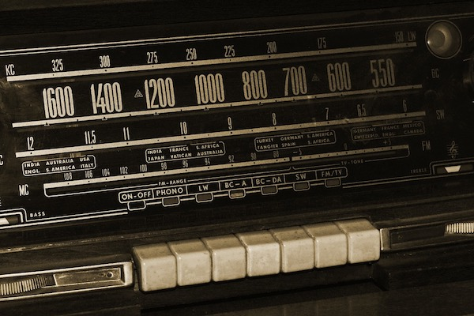

{{HTMLSidebar}}

{{htmlelement("input")}} elements of type **`radio`** are generally used in **radio groups**—collections of radio buttons describing a set of related options.

Only one radio button in a given group can be selected at the same time. Radio buttons are typically rendered as small circles, which are filled or highlighted when selected.

{{EmbedInteractiveExample("pages/tabbed/input-radio.html", "tabbed-standard")}}

They are called radio buttons because they look and operate in a similar manner to the push buttons on old-fashioned radios, such as the one shown below.



> **Note:** [Checkboxes](/en-US/docs/Web/HTML/Element/input/checkbox) are similar to radio buttons, but with an important distinction: radio buttons are designed for selecting one value out of a set, whereas checkboxes let you turn individual values on and off. Where multiple controls exist, radio buttons allow one to be selected out of them all, whereas checkboxes allow multiple values to be selected.

## Value

The `value` attribute is a string containing the radio button's value. The value is never shown to the user by their {{Glossary("user agent")}}. Instead, it's used to identify which radio button in a group is selected.

### Defining a radio group

A radio group is defined by giving each of radio buttons in the group the same [`name`](/en-US/docs/Web/HTML/Element/input#name). Once a radio group is established, selecting any radio button in that group automatically deselects any currently-selected radio button in the same group.

You can have as many radio groups on a page as you like, as long as each has its own unique `name`.

For example, if your form needs to ask the user for their preferred contact method, you might create three radio buttons, each with the `name` property set to `contact` but one with the value `email`, one with the value `phone`, and one with the value `mail`. The user never sees the `value` or the `name` (unless you expressly add code to display it).

The resulting HTML looks like this:

```html
<form>
  <fieldset>
    <legend>Please select your preferred contact method:</legend>
    <div>
      <input type="radio" id="contactChoice1" name="contact" value="email" />
      <label for="contactChoice1">Email</label>

      <input type="radio" id="contactChoice2" name="contact" value="phone" />
      <label for="contactChoice2">Phone</label>

      <input type="radio" id="contactChoice3" name="contact" value="mail" />
      <label for="contactChoice3">Mail</label>
    </div>
    <div>
      <button type="submit">Submit</button>
    </div>
  </fieldset>
</form>
```

Here you see the three radio buttons, each with the `name` set to `contact` and each with a unique `value` that uniquely identifies that individual radio button within the group. They each also have a unique {{domxref("Element.id", "id")}}, which is used by the {{HTMLElement("label")}} element's [`for`](/en-US/docs/Web/HTML/Element/label#for) attribute to associate the labels with the radio buttons.

You can try out this example here:

{{EmbedLiveSample('Defining_a_radio_group', 600, 130)}}

### Data representation of a radio group

When the above form is submitted with a radio button selected, the form's data includes an entry in the form `contact=value`. For example, if the user clicks on the "Phone" radio button then submits the form, the form's data will include the line `contact=phone`.

If you omit the `value` attribute in the HTML, the submitted form data assigns the value `on` to the group. In this scenario, if the user clicked on the "Phone" option and submitted the form, the resulting form data would be `contact=on`, which isn't helpful. So don't forget to set your `value` attributes!

> **Note:** If no radio button is selected when the form is submitted, the radio group is not included in the submitted form data at all, since there is no value to report.

It's fairly uncommon to actually want to allow the form to be submitted without any of the radio buttons in a group selected, so it is usually wise to have one default to the `checked` state. See [Selecting a radio button by default](#selecting_a_radio_button_by_default) below.

Let's add a bit of code to our example so we can examine the data generated by this form. The HTML is revised to add a {{HTMLElement("pre")}} block to output the form data into:

```html
<form>
  <fieldset>
    <legend>Please select your preferred contact method:</legend>
    <div>
      <input type="radio" id="contactChoice1" name="contact" value="email" />
      <label for="contactChoice1">Email</label>
      <input type="radio" id="contactChoice2" name="contact" value="phone" />
      <label for="contactChoice2">Phone</label>
      <input type="radio" id="contactChoice3" name="contact" value="mail" />
      <label for="contactChoice3">Mail</label>
    </div>
    <div>
      <button type="submit">Submit</button>
    </div>
  </fieldset>
</form>
<pre id="log"></pre>
```

Then we add some [JavaScript](/en-US/docs/Web/JavaScript) to set up an event listener on the {{domxref("HTMLFormElement/submit_event", "submit")}} event, which is sent when the user clicks the "Submit" button:

```js
const form = document.querySelector("form");
const log = document.querySelector("#log");

form.addEventListener(
  "submit",
  (event) => {
    const data = new FormData(form);
    let output = "";
    for (const entry of data) {
      output = `${output}${entry[0]}=${entry[1]}\r`;
    }
    log.innerText = output;
    event.preventDefault();
  },
  false,
);
```

Try this example out and see how there's never more than one result for the `contact` group.

{{EmbedLiveSample("Data_representation_of_a_radio_group", 600, 130)}}

## Additional attributes

In addition to the common attributes shared by all {{HTMLElement("input")}} elements, `radio` inputs support the following attributes.

- `checked`

  - : A Boolean attribute which, if present, indicates that this radio button is the default selected one in the group.

    Unlike other browsers, Firefox by default [persists the dynamic checked state](https://stackoverflow.com/questions/5985839/bug-with-firefox-disabled-attribute-of-input-not-resetting-when-refreshing) of an `<input>` across page loads. Use the [`autocomplete`](/en-US/docs/Web/HTML/Element/input#autocomplete) attribute to control this feature.

- `value`

  - : The `value` attribute is one which all {{HTMLElement("input")}}s share; however, it serves a special purpose for inputs of type `radio`: when a form is submitted, only radio buttons which are currently checked are submitted to the server, and the reported value is the value of the `value` attribute. If the `value` is not otherwise specified, it is the string `on` by default. This is demonstrated in the section [Value](#value) above.

- `required`
  - : The `required` attribute is one which most {{HTMLElement("input")}}s share. If any radio button in a same-named group of radio buttons has the `required` attribute, a radio button in that group must be checked, although it doesn't have to be the one with the attribute applied.

## Using radio inputs

We already covered the fundamentals of radio buttons above. Let's now look at the other common radio-button-related features and techniques you may need to know about.

### Selecting a radio button by default

To make a radio button selected by default, you include `checked` attribute, as shown in this revised version of the previous example:

```html
<form>
  <fieldset>
    <legend>Please select your preferred contact method:</legend>
    <div>
      <input
        type="radio"
        id="contactChoice1"
        name="contact"
        value="email"
        checked />
      <label for="contactChoice1">Email</label>

      <input type="radio" id="contactChoice2" name="contact" value="phone" />
      <label for="contactChoice2">Phone</label>

      <input type="radio" id="contactChoice3" name="contact" value="mail" />
      <label for="contactChoice3">Mail</label>
    </div>
    <div>
      <button type="submit">Submit</button>
    </div>
  </fieldset>
</form>
```

{{EmbedLiveSample('Selecting_a_radio_button_by_default', 600, 130)}}

In this case, the first radio button is now selected by default.

> **Note:** If you put the `checked` attribute on more than one radio button, later instances will override earlier ones; that is, the last `checked` radio button will be the one that is selected. This is because only one radio button in a group can ever be selected at once, and the user agent automatically deselects others each time a new one is marked as checked.

### Providing a bigger hit area for your radio buttons

In the above examples, you may have noticed that you can select a radio button by clicking on its associated {{htmlelement("label")}} element, as well as on the radio button itself. This is a really useful feature of HTML form labels that makes it easier for users to click the option they want, especially on small-screen devices like smartphones.

Beyond accessibility, this is another good reason to properly set up `<label>` elements on your forms.

## Validation

Radio buttons don't participate in constraint validation; they have no real value to be constrained.

## Styling radio inputs

The following example shows a slightly more thorough version of the example we've seen throughout the article, with some additional styling, and with better semantics established through use of specialized elements. The HTML looks like this:

```html
<form>
  <fieldset>
    <legend>Please select your preferred contact method:</legend>
    <div>
      <input
        type="radio"
        id="contactChoice1"
        name="contact"
        value="email"
        checked />
      <label for="contactChoice1">Email</label>

      <input type="radio" id="contactChoice2" name="contact" value="phone" />
      <label for="contactChoice2">Phone</label>

      <input type="radio" id="contactChoice3" name="contact" value="mail" />
      <label for="contactChoice3">Mail</label>
    </div>
    <div>
      <button type="submit">Submit</button>
    </div>
  </fieldset>
</form>
```

The CSS involved in this example is a bit more significant:

```css
html {
  font-family: sans-serif;
}

div:first-of-type {
  display: flex;
  align-items: flex-start;
  margin-bottom: 5px;
}

label {
  margin-right: 15px;
  line-height: 32px;
}

input {
  appearance: none;

  border-radius: 50%;
  width: 16px;
  height: 16px;

  border: 2px solid #999;
  transition: 0.2s all linear;
  margin-right: 5px;

  position: relative;
  top: 4px;
}

input:checked {
  border: 6px solid black;
}

button,
legend {
  color: white;
  background-color: black;
  padding: 5px 10px;
  border-radius: 0;
  border: 0;
  font-size: 14px;
}

button:hover,
button:focus {
  color: #999;
}

button:active {
  background-color: white;
  color: black;
  outline: 1px solid black;
}
```

Most notable here is the use of the {{cssxref("appearance")}} property (with prefixes needed to support some browsers). By default, radio buttons (and [checkboxes](/en-US/docs/Web/HTML/Element/input/checkbox)) are styled with the operating system's native styles for those controls. By specifying `appearance: none`, you can remove the native styling altogether, and create your own styles for them. Here we've used a {{cssxref("border")}} along with {{cssxref("border-radius")}} and a {{cssxref("transition")}} to create a nice animating radio selection. Notice also how the {{cssxref(":checked")}} pseudo-class is used to specify the styles for the radio button's appearance when selected.

> **Note:** If you wish to use the {{cssxref("appearance")}} property, you should test it very carefully. Although it is supported in most modern browsers, its implementation varies widely. In older browsers, even the keyword `none` does not have the same effect across different browsers, and some do not support it at all. The differences are smaller in the newest browsers.

{{EmbedLiveSample('Styling_radio_inputs', 600, 120)}}

Notice that when clicking on a radio button, there's a nice, smooth fade out/in effect as the two buttons change state. In addition, the style and coloring of the legend and submit button are customized to have strong contrast. This might not be a look you'd want in a real web application, but it definitely shows off the possibilities.

## Technical summary

<table class="properties">
  <tbody>
    <tr>
      <td><strong><a href="#value">Value</a></strong></td>
      <td>
        A string representing the value of the radio
        button.
      </td>
    </tr>
    <tr>
      <td><strong>Events</strong></td>
      <td>{{domxref("HTMLElement/change_event", "change")}} and {{domxref("HTMLElement/input_event", "input")}}</td>
    </tr>
    <tr>
      <td><strong>Supported common attributes</strong></td>
      <td>
        <code><a href="#checked">checked</a></code
        >, <code><a href="#value">value</a></code> and
        <code
          ><a href="/en-US/docs/Web/HTML/Attributes/required">required</a></code
        >
      </td>
    </tr>
    <tr>
      <td><strong>IDL attributes</strong></td>
      <td><code>checked</code> and <code>value</code></td>
    </tr>
    <tr>
      <td><strong>DOM interface</strong></td>
      <td><p>{{domxref("HTMLInputElement")}}</p></td>
    </tr>
    <tr>
      <td><strong>Methods</strong></td>
      <td>
        {{domxref("HTMLInputElement.select", "select()")}}
      </td>
    </tr>
     <tr>
      <td><strong>Implicit ARIA Role</strong></td>
      <td>
        <code><a href="/en-US/docs/Web/Accessibility/ARIA/Roles/radio_role">radio</a></code>
      </td>
    </tr>
  </tbody>
</table>

## Specifications

{{Specifications}}

## Browser compatibility

{{Compat}}

## See also

- {{HTMLElement("input")}} and the {{domxref("HTMLInputElement")}} interface that implements it.
- {{domxref("RadioNodeList")}}: the interface that describes a list of radio buttons
- [Compatibility of CSS properties](/en-US/docs/Learn/Forms/Property_compatibility_table_for_form_controls)
