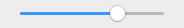
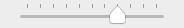
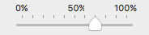

{{HTMLRef("Input_types")}}

{{HTMLElement("input")}} elements of type **`range`** let the user specify a numeric value which must be no less than a given value, and no more than another given value. The precise value, however, is not considered important. This is typically represented using a slider or dial control rather than a text entry box like the {{HTMLElement('input/number', 'number')}} input type.

Because this kind of widget is imprecise, it should only be used if the control's exact value isn't important.

{{EmbedInteractiveExample("pages/tabbed/input-range.html", "tabbed-standard")}}

If the user's browser doesn't support type `range`, it will fall back and treat it as a `{{HTMLElement('input/text', 'text')}}` input.

<table class="properties">
  <tbody>
    <tr>
      <td><strong><a href="#value">Value</a></strong></td>
      <td>
        A string containing the string representation
        of the selected numeric value; use
        {{domxref("HTMLInputElement.valueAsNumber", "valueAsNumber")}}
        to get the value as a number.
      </td>
    </tr>
    <tr>
      <td><strong>Events</strong></td>
      <td>
        {{domxref("HTMLElement/change_event", "change")}} and
        {{domxref("HTMLElement/input_event", "input")}}
      </td>
    </tr>
    <tr>
      <td><strong>Supported common attributes</strong></td>
      <td>
        {{htmlattrxref("autocomplete", "input")}},
        {{htmlattrxref("list", "input")}},
        {{htmlattrxref("max", "input")}},
        {{htmlattrxref("min", "input")}}, and
        {{htmlattrxref("step", "input")}}
      </td>
    </tr>
    <tr>
      <td><strong>IDL attributes</strong></td>
      <td>
        <code>list</code>, <code>value</code>, and <code>valueAsNumber</code>
      </td>
    </tr>
    <tr>
      <td><strong>DOM interface</strong></td>
      <td><p>{{domxref("HTMLInputElement")}}</p></td>
    </tr>
    <tr>
      <td><strong>Methods</strong></td>
      <td>
        {{domxref("HTMLInputElement.stepDown", "stepDown()")}}
        and {{domxref("HTMLInputElement.stepUp", "stepUp()")}}
      </td>
    </tr>
  </tbody>
</table>

### Validation

There is no pattern validation available; however, the following forms of automatic validation are performed:

- If the {{htmlattrxref("value", "input")}} is set to something which can't be converted into a valid floating-point number, validation fails because the input is suffering from a bad input.
- The value won't be less than {{htmlattrxref("min", "input")}}. The default is 0.
- The value won't be greater than {{htmlattrxref("max", "input")}}. The default is 100.
- The value will be a multiple of {{htmlattrxref("step", "input")}}. The default is 1.

### Value

The {{htmlattrxref("value", "input")}} attribute contains a string which contains a string representation of the selected number. The value is never an empty string (`""`). The default value is halfway between the specified minimum and maximum—unless the maximum is actually less than the minimum, in which case the default is set to the value of the `min` attribute. The algorithm for determining the default value is:

```js
defaultValue = (rangeElem.max < rangeElem.min) ? rangeElem.min
               : rangeElem.min + (rangeElem.max - rangeElem.min)/2;
```

If an attempt is made to set the value lower than the minimum, it is set to the minimum. Similarly, an attempt to set the value higher than the maximum results in it being set to the maximum.

## Additional attributes

In addition to the attributes shared by all {{HTMLElement("input")}} elements, range inputs offer the following attributes.

### list

The values of the list attribute is the {{domxref("Element.id", "id")}} of a {{HTMLElement("datalist")}} element located in the same document. The {{HTMLElement("datalist")}} provides a list of predefined values to suggest to the user for this input. Any values in the list that are not compatible with the {{htmlattrxref("type", "input")}} are not included in the suggested options. The values provided are suggestions, not requirements: users can select from this predefined list or provide a different value.

See the [range control with hash marks](#a_range_control_with_hash_marks) below for an example of how the options on a range are denoted in supported browsers.

### max

The greatest value in the range of permitted values. If the {{htmlattrxref("value", "input")}} entered into the element exceeds this, the element fails [constraint validation](/en-US/docs/Web/Guide/HTML/Constraint_validation). If the value of the [`max`](/en-US/docs/Web/HTML/Attributes/max) attribute isn't a number, then the element has no maximum value.

This value must be greater than or equal to the value of the [`min`](/en-US/docs/Web/HTML/Attributes/min) attribute. See the HTML [`max`](/en-US/docs/Web/HTML/Attributes/max) attribute.

### min

The lowest value in the range of permitted values. If the {{htmlattrxref("value", "input")}} of the element is less than this, the element fails [constraint validation](/en-US/docs/Web/Guide/HTML/Constraint_validation). If a value is specified for `min` that isn't a valid number, the input has no minimum value.

This value must be less than or equal to the value of the [`max`](/en-US/docs/Web/HTML/Attributes/max) attribute. See the HTML [`min`](/en-US/docs/Web/HTML/Attributes/min) attribute.

### step

The `step` attribute is a number that specifies the granularity that the value must adhere to, or the special value `any`, which is described below. Only values which are equal to the basis for stepping ([`min`](#min) if specified, {{htmlattrxref("value", "input")}} otherwise, and an appropriate default value if neither of those is provided) are valid.

A string value of `any` means that no stepping is implied, and any value is allowed (barring other constraints, such as [`min`](#min) and [`max`](#max)).

> **Note:** When the data entered by the user doesn't adhere to the stepping configuration, the {{Glossary("user agent")}} may round to the nearest valid value, preferring numbers in the positive direction when there are two equally close options.

The default stepping value for `range` inputs is 1, allowing only integers to be entered, _unless_ the stepping base is not an integer; for example, if you set `min` to -10 and `value` to 1.5, then a `step` of 1 will allow only values such as 1.5, 2.5, 3.5,… in the positive direction and -0.5, -1.5, -2.5,… in the negative direction. See the [HTML `step` attribute](/en-US/docs/Web/HTML/Attributes/step).

## Non Standard Attributes

### orient

Similar to the -moz-orient non-standard CSS property impacting the {{htmlelement('progress')}} and {{htmlelement('meter')}} elements, the `orient` attribute defines the orientation of the range slider. Values include `horizontal`, meaning the range is rendered horizontally, and `vertical`, where the range is rendered vertically.

> **Note:** The following input attributes do not apply to the input range: `accept`, `alt`, `checked`, `dirname`, `formaction`, `formenctype`, `formmethod`, `formnovalidate`, `formtarget`, `height`, `maxlength`, `minlength`, `multiple`, `pattern`, `placeholder`, `readonly`, `required`, `size`, `src`, and `width`. Any of these attributes, if included, will be ignored.

## Examples

While the `number` type lets users enter a number with optional constraints forcing their value to be between a minimum and a maximum value, it does require that they enter a specific value. The `range` input type lets you ask the user for a value in cases where the user may not even care—or know—what the specific numeric value selected is.

A few examples of situations in which range inputs are commonly used:

- Audio controls such as volume and balance, or filter controls.
- Color configuration controls such as color channels, transparency, brightness, etc.
- Game configuration controls such as difficulty, visibility distance, world size, and so forth.
- Password length for a password manager's generated passwords.

As a rule, if the user is more likely to be interested in the percentage of the distance between minimum and maximum values than the actual number itself, a range input is a great candidate. For example, in the case of a home stereo volume control, users typically think "set volume at halfway to maximum" instead of "set volume to 0.5".

### Specifying the minimum and maximum

By default, the minimum is 0 and the maximum is 100. If that's not what you want, you can easily specify different bounds by changing the values of the {{htmlattrxref("min", "input")}} and/or {{htmlattrxref("max", "input")}} attributes. These can be any floating-point value.

For example, to ask the user for a value between -10 and 10, you can use:

```html
<input type="range" min="-10" max="10">
```

{{EmbedLiveSample("Specifying_the_minimum_and_maximum", 600, 40)}}

### Setting the value's granularity

By default, the granularity, is 1, meaning that the value is always an integer. You can change the {{htmlattrxref("step")}} attribute to control the granularity. For example, If you need a value between 5 and 10, accurate to two decimal places, you should set the value of `step` to 0.01:

#### Setting the step attribute

```html
<input type="range" min="5" max="10" step="0.01">
```

{{EmbedLiveSample("Setting_the_step_attribute", 600, 40)}}

#### Setting step to "any"

If you want to accept any value regardless of how many decimal places it extends to, you can specify a value of `any` for the {{htmlattrxref("step", "input")}} attribute:

```html
<input type="range" min="0" max="3.14" step="any">
```

{{EmbedLiveSample("Setting_step_to_any", 600, 40)}}

This example lets the user select any value between 0 and π without any restriction on the fractional part of the value selected.

### Adding hash marks and labels

The HTML specification gives browsers some flexibility on how to present the range control. Nowhere is this flexibility more apparent than in the area of hash marks and, to a lesser degree, labels. The specification describes how to add custom points to the range control using the {{htmlattrxref("list", "input")}} attribute and a {{HTMLElement("datalist")}} element, but does not have any requirements or even recommendations for standardized hash or tick marks along the length of the control.

#### Range control mockups

Since browsers have this flexibility, and to date none support all of the features HTML defines for range controls, here are some mockups to show you what you might get on macOS in a browser which supports them.

##### An unadorned range control

This is what you get if you don't specify a {{htmlattrxref("list", "input")}} attribute, or if the browser doesn't support it.

<table class="fullwidth standard-table">
  <tbody>
    <tr>
      <th>HTML</th>
      <th>Examples</th>
    </tr>
    <tr>
      <td rowspan="4">
        <pre class="brush: html">&#x3C;input type="range"></pre>
      </td>
      <th>Screenshot</th>
    </tr>
    <tr>
      <td>
        
      </td>
    </tr>
    <tr>
      <th>Live</th>
    </tr>
    <tr>
      <td>
        {{EmbedLiveSample("An_unadorned_range_control",200,55,"","", "nobutton")}}
      </td>
    </tr>
  </tbody>
</table>

##### A range control with hash marks

This range control is using a `list` attribute specifying the ID of a {{HTMLElement("datalist")}} which defines a series of hash marks on the control. There are eleven of them, so that there's one at 0% as well as at each 10% mark. Each point is represented using an {{HTMLElement("option")}} element with its {{htmlattrxref("value", "option")}} set to the range's value at which a mark should be drawn.

<table class="fullwidth standard-table">
  <tbody>
    <tr>
      <th>HTML</th>
      <th>Examples</th>
    </tr>
    <tr>
      <td rowspan="4">
        <pre class="brush: html">
&#x3C;input type="range" list="tickmarks">

&#x3C;datalist id="tickmarks">
&#x3C;option value="0">&#x3C;/option>
&#x3C;option value="10">&#x3C;/option>
&#x3C;option value="20">&#x3C;/option>
&#x3C;option value="30">&#x3C;/option>
&#x3C;option value="40">&#x3C;/option>
&#x3C;option value="50">&#x3C;/option>
&#x3C;option value="60">&#x3C;/option>
&#x3C;option value="70">&#x3C;/option>
&#x3C;option value="80">&#x3C;/option>
&#x3C;option value="90">&#x3C;/option>
&#x3C;option value="100">&#x3C;/option>
&#x3C;/datalist>

</pre
        >
      </td>
      <th>Screenshot</th>
    </tr>
    <tr>
      <td>
        
      </td>
    </tr>
    <tr>
      <th>Live</th>
    </tr>
    <tr>
      <td>
        {{EmbedLiveSample("A_range_control_with_hash_marks_and_labels",200,55,"","", "nobutton")}}
      </td>
    </tr>
  </tbody>
</table>

##### A range control with hash marks and labels

You can add labels to your range control by adding the {{htmlattrxref("label", "option")}} attribute to the {{HTMLElement("option")}} elements corresponding to the tick marks you wish to have labels for.

<table class="fullwidth standard-table">
  <tbody>
    <tr>
      <th>HTML</th>
      <th>Examples</th>
    </tr>
    <tr>
      <td rowspan="4">
        <pre class="brush: html">
&#x3C;input type="range" list="tickmarks">

&#x3C;datalist id="tickmarks">
&#x3C;option value="0" label="0%">&#x3C;/option>
&#x3C;option value="10">&#x3C;/option>
&#x3C;option value="20">&#x3C;/option>
&#x3C;option value="30">&#x3C;/option>
&#x3C;option value="40">&#x3C;/option>
&#x3C;option value="50" label="50%">&#x3C;/option>
&#x3C;option value="60">&#x3C;/option>
&#x3C;option value="70">&#x3C;/option>
&#x3C;option value="80">&#x3C;/option>
&#x3C;option value="90">&#x3C;/option>
&#x3C;option value="100" label="100%">&#x3C;/option>
&#x3C;/datalist>

</pre
        >
      </td>
      <th>Screenshot</th>
    </tr>
    <tr>
      <td>
        
      </td>
    </tr>
    <tr>
      <th>Live</th>
    </tr>
    <tr>
      <td>
        {{EmbedLiveSample("A_range_control_with_hash_marks_and_labels",200,55,"","", "nobutton")}}
      </td>
    </tr>
  </tbody>
</table>

> **Note:** Currently, no browser fully supports these features. Firefox doesn't support hash marks and labels at all, for example, while Chrome supports hash marks but doesn't support labels. Version 66 (66.0.3359.181) of Chrome supports labels but the {{htmlelement("datalist")}} tag has to be styled with CSS as its {{cssxref("display")}} property is set to `none` by default, hiding the labels.

### Creating vertical range controls

By default, if a browser renders a range input as a slider, it will render it so that the knob slides left and right. When supported, we will be able to make the range vertical, to slide up and down with CSS by declaring a height value greater than the width value. This is not actually implemented yet by any of the major browsers. (See Firefox {{bug(981916)}}, [Chrome bug 341071](https://bugs.chromium.org/p/chromium/issues/detail?id=341071)). It also, perhaps, may still be [under discussion](https://github.com/whatwg/html/issues/4177).

In the meantime, we can make the range vertical by rotating it using CSS transforms, or, by targeting each browser engine with their own method, which includes setting the {{cssxref('appearance')}} to `slider-vertical`, by using a non-standard `orient` attribute in Firefox, or by changing the text direction for Internet Explorer and Edge.

#### Horizontal range control

Consider this range control:

```html
<input type="range" id="volume" min="0" max="11" value="7" step="1">
```

{{EmbedLiveSample("Horizontal_range_control", 200, 200, "orientation_sample1.png")}}

This control is horizontal (at least on most if not all major browsers; others might vary).

#### Standards-based vertical range control

According to the specification, making it vertical requires adding CSS to change the dimensions of the control so that it's taller than it is wide, like this:

```css
#volume {
  height: 150px;
  width: 50px;
}
```

```html
<input type="range" id="volume" min="0" max="11" value="7" step="1">
```

{{EmbedLiveSample("Standards-based_vertical_range_control", 200, 200, "orientation_sample2.png")}}

Unfortunately, no major browsers currently support vertical range controls directly.

#### Using transform

You can create a vertical range control by drawing a horizontal range control on its side. The easiest way is to use CSS: by applying a {{cssxref("transform")}} to rotate the element, you can make it vertical. Let's take a look.

The HTML needs to be updated to wrap the {{HTMLElement("input")}} in a {{HTMLElement("div")}} to let us correct the layout after the transform is performed (since transforms don't automatically affect the layout of the page):

```html
<div class="slider-wrapper">
  <input type="range" min="0" max="11" value="7" step="1">
</div>
```

Now we need some CSS. First is the CSS for the wrapper itself; this specifies the display mode and size we want so that the page lays out correctly; in essence, it's reserving an area of the page for the slider so that the rotated slider fits into the reserved space without making a mess of things.

```css
.slider-wrapper {
  display: inline-block;
  width: 20px;
  height: 150px;
  padding: 0;
}
```

Then comes the style information for the `<input>` element within the reserved space:

```css
.slider-wrapper input {
  width: 150px;
  height: 20px;
  margin: 0;
  transform-origin: 75px 75px;
  transform: rotate(-90deg);
}
```

The size of the control is set to be 150 pixels long by 20 pixels tall. The margins are set to 0 and the {{cssxref("transform-origin")}} is shifted to the middle of the space the slider rotates through; since the slider is configured to be 150 pixels wide, it rotates through a box which is 150 pixels on each side. Offsetting the origin by 75px on each axis means we will rotate around the center of that space. Finally, we rotate counter-clockwise by 90°. The result: a range input which is rotated so the maximum value is at the top and the minimum value is at the bottom.

{{EmbedLiveSample("Using_transform", 200, 200, "orientation_sample3.png")}}

#### Using the appearance property

The {{cssxref('appearance')}} property has a non-standard value of `slider-vertical` that, well, makes sliders vertical.

We use the same HTML as in the previous examples:

```html
<input type="range" min="0" max="11" value="7" step="1">
```

We target just the inputs with a type of range:

```css
input[type="range"] {
  -webkit-appearance: slider-vertical;
}
```

{{EmbedLiveSample("Using_the_appearance_property", 200, 200)}}

#### Using the orient attribute

In Firefox only, there is a non-standard `orient` property.

Use similar HTML as in the previous examples, we add the attribute with a value of `vertical`:

```html
<input type="range" min="0" max="11" value="7" step="1" orient="vertical">
```

{{EmbedLiveSample("Using_the_orient_attribute", 200, 200)}}

#### writing-mode: bt-lr;

The {{cssxref('writing-mode')}} property should generally not be used to alter text direction for internationalization or localization purposes, but can be used for special effects.

We use the same HTML as in the previous examples:

```html
<input type="range" min="0" max="11" value="7" step="1">
```

We target just the inputs with a type of range, changing the writing mode from the default to `bt-lr`, or bottom-to-top and left-to-right:

```css
input[type="range"] {
  writing-mode: bt-lr;
}
```

{{EmbedLiveSample("writing-mode_bt-lr", 200, 200)}}

#### Putting it all together

As each of the above examples works in different browsers, you can put all of them in a single example to make it work cross browser:

We keep the `orient` attribute with a value of `vertical` for Firefox:

```html
<input type="range" min="0" max="11" value="7" step="1" orient="vertical">
```

We target just the inputs with a type of range, changing the writing mode from the default to `bt-lr`, or bottom-to-top and left-to-right, for Edge and Internet Explorer, and add `-webkit-appearance: slider-vertical` for all -webkit-based browsers:

```css
input[type="range"] {
  writing-mode: bt-lr;
  -webkit-appearance: slider-vertical;
}
```

{{EmbedLiveSample("Putting_it_all_together", 200, 200)}}

## Specifications

{{Specifications}}

## Browser compatibility

{{Compat}}

## See also

- [HTML Forms](/en-US/docs/Learn/Forms)
- {{HTMLElement("input")}} and the {{domxref("HTMLInputElement")}} interface it's based upon
- [`<input type="number">`](/en-US/docs/Web/HTML/Element/input/number)
- {{domxref('validityState.rangeOverflow')}} and {{domxref('validityState.rangeUnderflow')}}
- [Controlling multiple parameters with ConstantSourceNode](/en-US/docs/Web/API/Web_Audio_API/Controlling_multiple_parameters_with_ConstantSourceNode)
- [Styling the range element](https://css-tricks.com/sliding-nightmare-understanding-range-input/)
- [Compatibility of CSS properties](/en-US/docs/Learn/Forms/Property_compatibility_table_for_form_controls)
