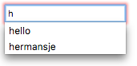

{{HTMLRef("Input_types")}}

{{HTMLElement("input")}} elements of type **`search`** are text fields designed for the user to enter search queries into. These are functionally identical to [`text`](/en-US/docs/Web/HTML/Element/input/text) inputs, but may be styled differently by the {{Glossary("user agent")}}.

{{EmbedInteractiveExample("pages/tabbed/input-search.html", "tabbed-standard")}}

<table class="properties">
  <tbody>
    <tr>
      <td><strong><a href="#value">Value</a></strong></td>
      <td>
        A string representing the value contained in
        the search field.
      </td>
    </tr>
    <tr>
      <td><strong>Events</strong></td>
      <td>
        {{domxref("HTMLElement/change_event", "change")}} and
        {{domxref("HTMLElement/input_event", "input")}}
      </td>
    </tr>
    <tr>
      <td><strong>Supported Common Attributes</strong></td>
      <td>
        {{htmlattrxref("autocomplete", "input")}},
        {{htmlattrxref("list", "input")}},
        {{htmlattrxref("maxlength", "input")}},
        {{htmlattrxref("minlength", "input")}},
        {{htmlattrxref("pattern", "input")}},
        {{htmlattrxref("placeholder", "input")}},
        {{htmlattrxref("required", "input")}},
        {{htmlattrxref("size", "input")}}.
      </td>
    </tr>
    <tr>
      <td><strong>IDL attributes</strong></td>
      <td><code>value</code></td>
    </tr>
    <tr>
      <td><strong>DOM interface</strong></td>
      <td><p>{{domxref("HTMLInputElement")}}</p></td>
    </tr>
    <tr>
      <td><strong>Methods</strong></td>
      <td>
        {{domxref("HTMLInputElement.select", "select()")}},
        {{domxref("HTMLInputElement.setRangeText", "setRangeText()")}},
        {{domxref("HTMLInputElement.setSelectionRange", "setSelectionRange()")}}.
      </td>
    </tr>
  </tbody>
</table>

## Value

The {{htmlattrxref("value", "input")}} attribute contains a string representing the value contained in the search field. You can retrieve this using the {{domxref("HTMLInputElement.value")}} property in JavaScript.

```js
searchTerms = mySearch.value;
```

If no validation constraints are in place for the input (see [Validation](#validation) for more details), the value can be any text string or an empty string (`""`).

## Additional attributes

In addition to the attributes that operate on all {{HTMLElement("input")}} elements regardless of their type, search field inputs support the following attributes.

### list

The values of the list attribute is the {{domxref("Element.id", "id")}} of a {{HTMLElement("datalist")}} element located in the same document. The {{HTMLElement("datalist")}} provides a list of predefined values to suggest to the user for this input. Any values in the list that are not compatible with the {{htmlattrxref("type", "input")}} are not included in the suggested options. The values provided are suggestions, not requirements: users can select from this predefined list or provide a different value.

### maxlength

The maximum number of characters (as UTF-16 code units) the user can enter into the search field. This must be an integer value 0 or higher. If no `maxlength` is specified, or an invalid value is specified, the search field has no maximum length. This value must also be greater than or equal to the value of `minlength`.

The input will fail [constraint validation](/en-US/docs/Web/Guide/HTML/Constraint_validation) if the length of the text entered into the field is greater than `maxlength` UTF-16 code units long.

### minlength

The minimum number of characters (as UTF-16 code units) the user can enter into the search field. This must be a non-negative integer value smaller than or equal to the value specified by `maxlength`. If no `minlength` is specified, or an invalid value is specified, the search input has no minimum length.

The search field will fail [constraint validation](/en-US/docs/Web/Guide/HTML/Constraint_validation) if the length of the text entered into the field is fewer than `minlength` UTF-16 code units long.

### pattern

The `pattern` attribute, when specified, is a regular expression that the input's {{htmlattrxref("value")}} must match in order for the value to pass [constraint validation](/en-US/docs/Web/Guide/HTML/Constraint_validation). It must be a valid JavaScript regular expression, as used by the {{jsxref("RegExp")}} type, and as documented in our [guide on regular expressions](/en-US/docs/Web/JavaScript/Guide/Regular_Expressions); the `'u'` flag is specified when compiling the regular expression, so that the pattern is treated as a sequence of Unicode code points, instead of as ASCII. No forward slashes should be specified around the pattern text.

If the specified pattern is not specified or is invalid, no regular expression is applied and this attribute is ignored completely.

> **Note:** Use the {{htmlattrxref("title", "input")}} attribute to specify text that most browsers will display as a tooltip to explain what the requirements are to match the pattern. You should also include other explanatory text nearby.

See the section [Specifying a pattern](#specifying_a_pattern) for details and an example.

### placeholder

The `placeholder` attribute is a string that provides a brief hint to the user as to what kind of information is expected in the field. It should be a word or short phrase that demonstrates the expected type of data, rather than an explanatory message. The text _must not_ include carriage returns or line feeds.

If the control's content has one directionality ({{Glossary("LTR")}} or {{Glossary("RTL")}}) but needs to present the placeholder in the opposite directionality, you can use Unicode bidirectional algorithm formatting characters to override directionality within the placeholder; see [How to use Unicode controls for bidi text](https://www.w3.org/International/questions/qa-bidi-unicode-controls) for more information.

> **Note:** Avoid using the `placeholder` attribute if you can. It is not as semantically useful as other ways to explain your form, and can cause unexpected technical issues with your content. See {{SectionOnPage("/en-US/docs/Web/HTML/Element/input", "Labels and placeholders")}} for more information.

### readonly

A Boolean attribute which, if present, means this field cannot be edited by the user. Its `value` can, however, still be changed by JavaScript code directly setting the {{domxref("HTMLInputElement")}} `value` property.

> **Note:** Because a read-only field cannot have a value, `required` does not have any effect on inputs with the `readonly` attribute also specified.

### size

The `size` attribute is a numeric value indicating how many characters wide the input field should be. The value must be a number greater than zero, and the default value is 20. Since character widths vary, this may or may not be exact and should not be relied upon to be so; the resulting input may be narrower or wider than the specified number of characters, depending on the characters and the font ({{cssxref("font")}} settings in use).

This does _not_ set a limit on how many characters the user can enter into the field. It only specifies approximately how many can be seen at a time. To set an upper limit on the length of the input data, use the [`maxlength`](#maxlength) attribute.

### spellcheck

`spellcheck` is a global attribute which is used to indicate whether or not to enable spell checking for an element. It can be used on any editable content, but here we consider specifics related to the use of `spellcheck` on {{HTMLElement("input")}} elements. The permitted values for `spellcheck` are:

- `false`
  - : Disable spell checking for this element.
- `true`
  - : Enable spell checking for this element.
- "" (empty string) or no value
  - : Follow the element's default behavior for spell checking. This may be based upon a parent's `spellcheck` setting or other factors.

An input field can have spell checking enabled if it doesn't have the [readonly](#readonly) attribute set and is not disabled.

The value returned by reading `spellcheck` may not reflect the actual state of spell checking within a control, if the {{Glossary("user agent", "user agent's")}} preferences override the setting.

## Non-standard attributes

The following non-standard attributes are available to search input fields. As a general rule, you should avoid using them unless it can't be helped.

### autocorrect

A Safari extension, the `autocorrect` attribute is a string which indicates whether or not to activate automatic correction while the user is editing this field. Permitted values are:

- `on`
  - : Enable automatic correction of typos, as well as processing of text substitutions if any are configured.
- `off`
  - : Disable automatic correction and text substitutions.

### incremental

The Boolean attribute `incremental` is a WebKit and Blink extension (so supported by Safari, Opera, Chrome, etc.) which, if present, tells the {{Glossary("user agent")}} to process the input as a live search. As the user edits the value of the field, the user agent sends {{domxref("HTMLInputElement/search_event", "search")}} events to the {{domxref("HTMLInputElement")}} object representing the search box. This allows your code to update the search results in real time as the user edits the search.

If `incremental` is not specified, the {{domxref("HTMLInputElement/search_event", "search")}} event is only sent when the user explicitly initiates a search (such as by pressing the <kbd>Enter</kbd> or <kbd>Return</kbd> key while editing the field).

The `search` event is rate-limited so that it is not sent more frequently than an implementation-defined interval.

### mozactionhint

A Mozilla extension, which provides a hint as to what sort of action will be taken if the user presses the <kbd>Enter</kbd> or <kbd>Return</kbd> key while editing the field.

This attribute has been deprecated: use the {{htmlattrxref("enterkeyhint")}} global attribute instead.

### results

The `results` attribute—supported only by Safari—is a numeric value that lets you override the maximum number of entries to be displayed in the {{HTMLElement("input")}} element's natively-provided drop-down menu of previous search queries.

The value must be a non-negative decimal number. If not provided, or an invalid value is given, the browser's default maximum number of entries is used.

## Using search inputs

`<input>` elements of type `search` are very similar to those of type `text`, except that they are specifically intended for handling search terms. They are basically equivalent in behavior, but user agents may choose to style them differently by default (and, of course, sites may use stylesheets to apply custom styles to them).

### Basic example

```html
<form>
  <div>
    <input type="search" id="mySearch" name="q">
    <button>Search</button>
  </div>
</form>
```

This renders like so:

{{EmbedLiveSample("Basic_example", 600, 40)}}

`q` is the most common `name` given to search inputs, although it's not mandatory. When submitted, the data name/value pair sent to the server will be `q=searchterm`.

> **Note:** You must remember to set a {{htmlattrxref("name", "input")}} for your input, otherwise nothing will be submitted.

### Differences between search and text types

The main basic differences come in the way browsers handle them. The first thing to note is that some browsers show a cross icon that can be clicked on to remove the search term instantly if desired, in Chrome this action is also triggered when pressing escape. The following screenshot comes from Chrome:


In addition, modern browsers also tend to automatically store search terms previously entered across domains, which then come up as autocomplete options when subsequent searches are performed in search inputs on that domain. This helps users who tend to do searches on the same or similar search queries over time. This screenshot is from Firefox:

At this point, let's look at some useful techniques you can apply to your search forms.

### Setting placeholders

You can provide a useful placeholder inside your search input that could give a hint on what to do using the {{htmlattrxref("placeholder","input")}} attribute. Look at the following example:

```html
<form>
  <div>
    <input type="search" id="mySearch" name="q"
     placeholder="Search the site…">
    <button>Search</button>
  </div>
</form>
```

You can see how the placeholder is rendered below:

{{EmbedLiveSample("Setting_placeholders", 600, 40)}}

### Search form labels and accessibility

One problem with search forms is their accessibility; a common design practice is not to provide a label for the search field (although there might be a magnifying glass icon or similar), as the purpose of a search form is normally fairly obvious for sighted users due to placement ([this example shows a typical pattern](https://mdn.github.io/learning-area/accessibility/aria/website-aria-roles/)).

This could, however, cause confusion for screen reader users, since they will not have any verbal indication of what the search input is. One way around this that won't impact on your visual design is to use [WAI-ARIA](/en-US/docs/Learn/Accessibility/WAI-ARIA_basics) features:

- A `role` attribute of value `search` on the `<form>` element will cause screen readers to announce that the form is a search form.
- If that isn't enough, you can use an [`aria-label`](/en-US/docs/Web/Accessibility/ARIA/Attributes/aria-label) attribute on the {{HTMLElement("input")}} itself. This should be a descriptive text label that will be read out by the screen reader; it's used as a non-visual equivalent to `<label>`.

Let's have a look at an example:

```html
<form role="search">
  <div>
    <input type="search" id="mySearch" name="q"
     placeholder="Search the site…"
     aria-label="Search through site content">
    <button>Search</button>
  </div>
</form>
```

You can see how this is rendered below:

{{EmbedLiveSample("Search_form_labels_and_accessibility", 600, 40)}}

There is no visual difference from the previous example, but screen reader users have way more information available to them.

> **Note:** See [Signposts/Landmarks](/en-US/docs/Learn/Accessibility/WAI-ARIA_basics#signpostslandmarks) for more information about such accessibility features.

### Physical input element size

The physical size of the input box can be controlled using the {{htmlattrxref("size", "input")}} attribute. With it, you can specify the number of characters the input box can display at a time. In this example, for instance, the search box is 30 characters wide:

```html
<form>
  <div>
    <input type="search" id="mySearch" name="q"
    placeholder="Search the site…" size="30">
    <button>Search</button>
  </div>
</form>
```

The result is this wider input box:

{{ EmbedLiveSample('Physical_input_element_size', 600, 40) }}

## Validation

`<input>` elements of type `search` have the same validation features available to them as regular `text` inputs. It is less likely that you'd want to use validation features in general for search boxes. In many cases, users should just be allowed to search for anything, but there are a few cases to consider, such as searches against data of a known format.

> **Note:** HTML form validation is _not_ a substitute for scripts that ensure that the entered data is in the proper format. It's far too easy for someone to make adjustments to the HTML that allow them to bypass the validation, or to remove it entirely. It's also possible for someone to bypass your HTML entirely and submit the data directly to your server. If your server-side code fails to validate the data it receives, disaster could strike when improperly-formatted data (or data which is too large, is of the wrong type, and so forth) is entered into your database.

### A note on styling

There are useful pseudo-classes available for styling valid/invalid form elements: {{cssxref(":valid")}} and {{cssxref(":invalid")}}. In this section, we'll use the following CSS, which will place a check (tick) next to inputs containing valid values, and a cross next to inputs containing invalid values.

```css
input:invalid ~ span::after {
    content: '✖';
    padding-left: 5px;
    position: absolute;
}

input:valid ~ span::after {
    content: '✓';
    padding-left: 5px;
    position: absolute;
}
```

The technique also requires a {{htmlelement("span")}} element to be placed after the form element, which acts as a holder for the icons. This was necessary because some input types on some browsers don't display icons placed directly after them very well.

### Making input required

You can use the {{htmlattrxref("required", "input")}} attribute as an easy way of making entering a value required before form submission is allowed:

```html
<form>
  <div>
    <input type="search" id="mySearch" name="q"
    placeholder="Search the site…" required>
    <button>Search</button>
    <span class="validity"></span>
  </div>
</form>
```

```css hidden
input {
  margin-right: 10px;
}

input:invalid ~ span::after {
    content: '✖';
    padding-left: 5px;
    position: absolute;
}

input:valid ~ span::after {
    content: '✓';
    padding-left: 5px;
    position: absolute;
}
```

This renders like so:

{{ EmbedLiveSample('Making_input_required', 600, 40) }}

In addition, if you try to submit the form with no search term entered into it, the browser will show a message. The following example is from Firefox:


Different messages will be shown when you try to submit the form with different types of invalid data contained inside the inputs; see the below examples.

### Input value length

You can specify a minimum length, in characters, for the entered value using the {{htmlattrxref("minlength", "input")}} attribute; similarly, use {{htmlattrxref("maxlength", "input")}} to set the maximum length of the entered value.

The example below requires that the entered value be 4–8 characters in length.

```html
<form>
  <div>
    <label for="mySearch">Search for user</label>
    <input type="search" id="mySearch" name="q"
    placeholder="User IDs are 4–8 characters in length" required
    size="30" minlength="4" maxlength="8">
    <button>Search</button>
    <span class="validity"></span>
  </div>
</form>
```

```css hidden
input {
  margin-right: 10px;
}

input:invalid ~ span::after {
    content: '✖';
    padding-left: 5px;
    position: absolute;
}

input:valid ~ span::after {
    content: '✓';
    padding-left: 5px;
    position: absolute;
}
```

This renders like so:

{{ EmbedLiveSample('Input_value_length', 600, 40) }}

If you try to submit the form with less than 4 characters, you'll be given an appropriate error message (which differs between browsers). If you try to go beyond 8 characters in length, the browser won't let you.

### Specifying a pattern

You can use the {{htmlattrxref("pattern", "input")}} attribute to specify a regular expression that the inputted value must follow to be considered valid (see [Validating against a regular expression](/en-US/docs/Learn/Forms/Form_validation#validating_against_a_regular_expression) for a simple crash course).

Let's look at an example. Say we wanted to provide a product ID search form, and the IDs were all codes of two letters followed by four numbers. The following example covers it:

```html
<form>
  <div>
    <label for="mySearch">Search for product by ID:</label>
    <input type="search" id="mySearch" name="q"
    placeholder="two letters followed by four numbers" required
    size="30" pattern="[A-z]{2}[0-9]{4}">
    <button>Search</button>
    <span class="validity"></span>
  </div>
</form>
```

```css hidden
input {
  margin-right: 10px;
}

input:invalid ~ span::after {
    content: '✖';
    padding-left: 5px;
    position: absolute;
}

input:valid ~ span::after {
    content: '✓';
    padding-left: 5px;
    position: absolute;
}
```

This renders like so:

{{ EmbedLiveSample('Specifying_a_pattern', 600, 40) }}

## Examples

You can see a good example of a search form used in context at our [website-aria-roles](https://github.com/mdn/learning-area/tree/main/accessibility/aria/website-aria-roles) example ([see it live](https://mdn.github.io/learning-area/accessibility/aria/website-aria-roles/)).

## Specifications

{{Specifications}}

## Browser compatibility

{{Compat}}

## See also

- [HTML Forms](/en-US/docs/Learn/Forms)
- {{HTMLElement("input")}} and the {{domxref("HTMLInputElement")}} interface it's based upon
- [`<input type="text">`](/en-US/docs/Web/HTML/Element/input/text)
- [Compatibility of CSS properties](/en-US/docs/Learn/Forms/Property_compatibility_table_for_form_controls)
