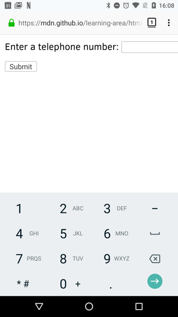
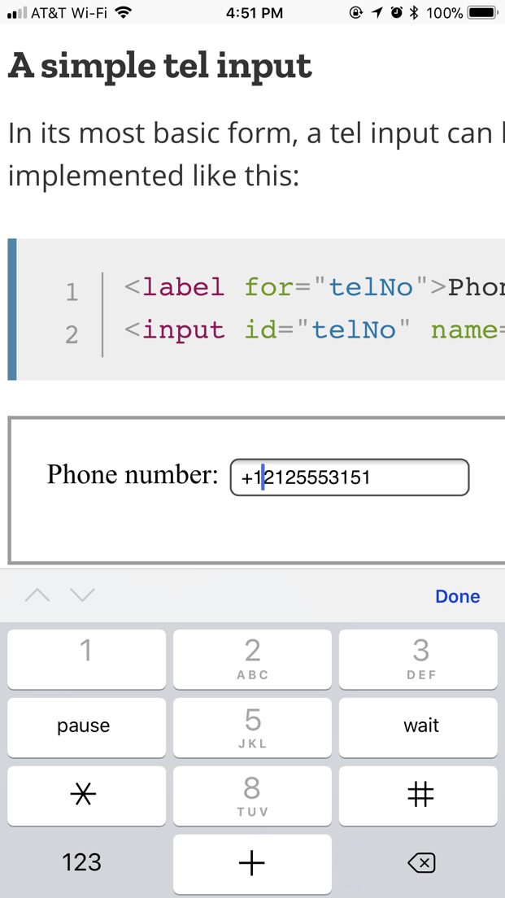
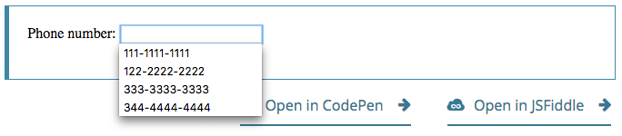

{{HTMLSidebar}}

{{HTMLElement("input")}} elements of type **`tel`** are used to let the user enter and edit a telephone number. Unlike [`<input type="email">`](/en-US/docs/Web/HTML/Element/input/email) and [`<input type="url">`](/en-US/docs/Web/HTML/Element/input/url), the input value is not automatically validated to a particular format before the form can be submitted, because formats for telephone numbers vary so much around the world.

{{EmbedInteractiveExample("pages/tabbed/input-tel.html", "tabbed-standard")}}

Despite the fact that inputs of type `tel` are functionally identical to standard `text` inputs, they do serve useful purposes; the most quickly apparent of these is that mobile browsers — especially on mobile phones — may opt to present a custom keypad optimized for entering phone numbers. Using a specific input type for telephone numbers also makes adding custom validation and handling of phone numbers more convenient.

> **Note:** Browsers that don't support type `tel` fall back to being a standard {{HTMLElement("input/text", "text")}} input.

## Value

The {{HTMLElement("input")}} element's [`value`](/en-US/docs/Web/HTML/Element/input#value) attribute contains a string that either represents a telephone number or is an empty string (`""`).

## Additional attributes

In addition to the attributes that operate on all {{HTMLElement("input")}} elements regardless of their type, telephone number inputs support the following attributes.

### list

The values of the list attribute is the {{domxref("Element.id", "id")}} of a {{HTMLElement("datalist")}} element located in the same document. The {{HTMLElement("datalist")}} provides a list of predefined values to suggest to the user for this input. Any values in the list that are not compatible with the [`type`](/en-US/docs/Web/HTML/Element/input#type) are not included in the suggested options. The values provided are suggestions, not requirements: users can select from this predefined list or provide a different value.

### maxlength

The maximum string length (measured in UTF-16 code units) that the user can enter into the telephone number field. This must be an integer value of 0 or higher. If no `maxlength` is specified, or an invalid value is specified, the telephone number field has no maximum length. This value must also be greater than or equal to the value of `minlength`.

The input will fail [constraint validation](/en-US/docs/Web/HTML/Constraint_validation) if the length of the text entered into the field is greater than `maxlength` UTF-16 code units long.

### minlength

The minimum string length (measured in UTF-16 code units) that the user can enter into the telephone number field. This must be a non-negative integer value smaller than or equal to the value specified by `maxlength`. If no `minlength` is specified, or an invalid value is specified, the telephone number input has no minimum length.

The telephone number field will fail [constraint validation](/en-US/docs/Web/HTML/Constraint_validation) if the length of the text entered into the field is fewer than `minlength` UTF-16 code units long.

### pattern

The `pattern` attribute, when specified, is a regular expression that the input's [`value`](/en-US/docs/Web/HTML/Element/input#value) must match for the value to pass [constraint validation](/en-US/docs/Web/HTML/Constraint_validation). It must be a valid JavaScript regular expression, as used by the {{jsxref("RegExp")}} type, and as documented in our [guide on regular expressions](/en-US/docs/Web/JavaScript/Guide/Regular_expressions); the `'u'` flag is specified when compiling the regular expression so that the pattern is treated as a sequence of Unicode code points, instead of as ASCII. No forward slashes should be specified around the pattern text.

If the specified pattern is not specified or is invalid, no regular expression is applied and this attribute is ignored completely.

> **Note:** Use the [`title`](/en-US/docs/Web/HTML/Element/input#title) attribute to specify text that most browsers will display as a tooltip to explain what the requirements are to match the pattern. You should also include other explanatory text nearby.

See [Pattern validation](#pattern_validation) below for details and an example.

### placeholder

The `placeholder` attribute is a string that provides a brief hint to the user as to what kind of information is expected in the field. It should be a word or short phrase that demonstrates the expected type of data, rather than an explanatory message. The text _must not_ include carriage returns or line feeds.

If the control's content has one directionality ({{Glossary("LTR")}} or {{Glossary("RTL")}}) but needs to present the placeholder in the opposite directionality, you can use Unicode bidirectional algorithm formatting characters to override directionality within the placeholder; see [How to use Unicode controls for bidi text](https://www.w3.org/International/questions/qa-bidi-unicode-controls) for more information.

> **Note:** Avoid using the `placeholder` attribute if you can. It is not as semantically useful as other ways to explain your form, and can cause unexpected technical issues with your content. See [`<input>` labels](/en-US/docs/Web/HTML/Element/input#labels) for more information.

### readonly

A Boolean attribute which, if present, means this field cannot be edited by the user. Its `value` can, however, still be changed by JavaScript code directly setting the {{domxref("HTMLInputElement")}} `value` property.

> **Note:** Because a read-only field cannot have a value, `required` does not have any effect on inputs with the `readonly` attribute also specified.

### size

The `size` attribute is a numeric value indicating how many characters wide the input field should be. The value must be a number greater than zero, and the default value is 20. Since character widths vary, this may or may not be exact and should not be relied upon to be so; the resulting input may be narrower or wider than the specified number of characters, depending on the characters and the font ({{cssxref("font")}} settings in use).

This does _not_ set a limit on how many characters the user can enter into the field. It only specifies approximately how many can be seen at a time. To set an upper limit on the length of the input data, use the [`maxlength`](#maxlength) attribute.

## Non-standard attributes

The following non-standard attributes are available to telephone number input fields. As a general rule, you should avoid using them unless it can't be helped.

### autocorrect

A Safari extension, the `autocorrect` attribute is a string which indicates whether to activate automatic correction while the user is editing this field. Permitted values are:

- `on`
  - : Enable automatic correction of typos, as well as processing of text substitutions if any are configured.
- `off`
  - : Disable automatic correction and text substitutions.

### mozactionhint

A Mozilla extension, which provides a hint as to what sort of action will be taken if the user presses the <kbd>Enter</kbd> or <kbd>Return</kbd> key while editing the field.

This attribute has been deprecated: use the [`enterkeyhint`](/en-US/docs/Web/HTML/Global_attributes#enterkeyhint) global attribute instead.

## Using tel inputs

Telephone numbers are a very commonly collected type of data on the web. When creating any kind of registration or e-commerce site, for example, you will likely need to ask the user for a telephone number, whether for business purposes or for emergency contact purposes. Given how commonly-entered phone numbers are, it's unfortunate that a "one size fits all" solution for validating phone numbers is not practical.

Fortunately, you can consider the requirements of your own site and implement an appropriate level of validation yourself. See [Validation](#validation), below, for details.

### Custom keyboards

One of the main advantages of `<input type="tel">` is that it causes mobile browsers to display a special keyboard for entering phone numbers. For example, here's what the keypads look like on a couple of devices.

| Firefox for Android                                    | WebKit iOS (Safari/Chrome/Firefox)                           |
| ------------------------------------------------------ | ------------------------------------------------------------ |
|  |  |

### A simple tel input

In its most basic form, a tel input can be implemented like this:

```html
<label for="telNo">Phone number:</label>
<input id="telNo" name="telNo" type="tel" />
```

{{ EmbedLiveSample('A_simple_tel_input', 600, 40) }}

There is nothing magical going on here. When submitted to the server, the above input's data would be represented as, for example, `telNo=+12125553151`.

### Placeholders

Sometimes it's helpful to offer an in-context hint as to what form the input data should take. This can be especially important if the page design doesn't offer descriptive labels for each {{HTMLElement("input")}}. This is where **placeholders** come in. A placeholder is a value that demonstrates the form the `value` should take by presenting an example of a valid value, which is displayed inside the edit box when the element's `value` is `""`. Once data is entered into the box, the placeholder disappears; if the box is emptied, the placeholder reappears.

Here, we have an `tel` input with the placeholder `123-4567-8901`. Note how the placeholder disappears and reappears as you manipulate the contents of the edit field.

```html
<input id="telNo" name="telNo" type="tel" placeholder="123-4567-8901" />
```

{{ EmbedLiveSample('Placeholders', 600, 40) }}

### Controlling the input size

You can control not only the physical length of the input box, but also the minimum and maximum lengths allowed for the input text itself.

#### Physical input element size

The physical size of the input box can be controlled using the [`size`](/en-US/docs/Web/HTML/Element/input#size) attribute. With it, you can specify the number of characters the input box can display at a time. In this example, for instance, the `tel` edit box is 20 characters wide:

```html
<input id="telNo" name="telNo" type="tel" size="20" />
```

{{ EmbedLiveSample('Physical_input_element_size', 600, 40) }}

#### Element value length

The `size` is separate from the length limitation on the entered telephone number. You can specify a minimum length, in characters, for the entered telephone number using the [`minlength`](/en-US/docs/Web/HTML/Element/input#minlength) attribute; similarly, use [`maxlength`](/en-US/docs/Web/HTML/Element/input#maxlength) to set the maximum length of the entered telephone number.

The example below creates a 20-character wide telephone number entry box, requiring that the contents be no shorter than 9 characters and no longer than 14 characters.

```html
<input
  id="telNo"
  name="telNo"
  type="tel"
  size="20"
  minlength="9"
  maxlength="14" />
```

{{EmbedLiveSample("Element_value_length", 600, 40) }}

> **Note:** The above attributes do affect [Validation](#validation) — the above example's inputs will count as invalid if the length of the value is less than 9 characters, or more than 14. Most browser won't even let you enter a value over the max length.

### Providing default options

#### Providing a single default using the value attribute

As always, you can provide a default value for an `tel` input box by setting its [`value`](/en-US/docs/Web/HTML/Element/input#value) attribute:

```html
<input id="telNo" name="telNo" type="tel" value="333-4444-4444" />
```

{{EmbedLiveSample("Providing_a_single_default_using_the_value_attribute", 600, 40)}}

#### Offering suggested values

Taking it a step further, you can provide a list of default phone number values from which the user can select. To do this, use the [`list`](/en-US/docs/Web/HTML/Element/input#list) attribute. This doesn't limit the user to those options, but does allow them to select commonly-used telephone numbers more quickly. This also offers hints to [`autocomplete`](/en-US/docs/Web/HTML/Element/input#autocomplete). The `list` attribute specifies the ID of a {{HTMLElement("datalist")}} element, which in turn contains one {{HTMLElement("option")}} element per suggested value; each `option`'s `value` is the corresponding suggested value for the telephone number entry box.

```html
<label for="telNo">Phone number: </label>
<input id="telNo" name="telNo" type="tel" list="defaultTels" />

<datalist id="defaultTels">
  <option value="111-1111-1111"></option>
  <option value="122-2222-2222"></option>
  <option value="333-3333-3333"></option>
  <option value="344-4444-4444"></option>
</datalist>
```

{{EmbedLiveSample("Offering_suggested_values", 600, 40)}}

With the {{HTMLElement("datalist")}} element and its {{HTMLElement("option")}}s in place, the browser will offer the specified values as potential values for the phone number; this is typically presented as a popup or drop-down menu containing the suggestions. While the specific user experience may vary from one browser to another, typically clicking in the edit box presents a drop-down of the suggested phone numbers. Then, as the user types, the list is adjusted to show only filtered matching values. Each typed character narrows down the list until the user makes a selection or types a custom value.

Here's a screenshot of what that might look like:



## Validation

As we've touched on before, it's quite difficult to provide a one-size-fits-all client-side validation solution for phone numbers. So what can we do? Let's consider some options.

> **Warning:** HTML form validation is _not_ a substitute for server-side scripts that ensure the entered data is in the proper format before it is allowed into the database. It's far too easy for someone to make adjustments to the HTML that allow them to bypass the validation, or to remove it entirely. It's also possible for someone to bypass your HTML entirely and submit the data directly to your server. If your server-side code fails to validate the data it receives, disaster could strike when improperly-formatted data (or data which is too large, is of the wrong type, and so forth) is entered into your database.

### Making telephone numbers required

You can make it so that an empty input is invalid and won't be submitted to the server using the [`required`](/en-US/docs/Web/HTML/Element/input#required) attribute. For example, let's use this HTML:

```html
<form>
  <div>
    <label for="telNo">Enter a telephone number (required): </label>
    <input id="telNo" name="telNo" type="tel" required />
    <span class="validity"></span>
  </div>
  <div>
    <button>Submit</button>
  </div>
</form>
```

And let's include the following CSS to highlight valid entries with a checkmark and invalid entries with a cross:

```css
div {
  margin-bottom: 10px;
  position: relative;
}

input[type="number"] {
  width: 100px;
}

input + span {
  padding-right: 30px;
}

input:invalid + span::after {
  position: absolute;
  content: "✖";
  padding-left: 5px;
  color: #8b0000;
}

input:valid + span::after {
  position: absolute;
  content: "✓";
  padding-left: 5px;
  color: #009000;
}
```

The output looks like this:

{{EmbedLiveSample("Making_telephone_numbers_required", 700, 70)}}

### Pattern validation

If you want to further restrict entered numbers so they also have to conform to a specific pattern, you can use the [`pattern`](/en-US/docs/Web/HTML/Element/input#pattern) attribute, which takes as its value a {{Glossary("regular expression")}} that entered values have to match.

In this example we'll use the same CSS as before, but our HTML is changed to look like this:

```html
<form>
  <div>
    <label for="telNo">
      Enter a telephone number (in the form xxx-xxx-xxxx):
    </label>
    <input
      id="telNo"
      name="telNo"
      type="tel"
      required
      pattern="[0-9]{3}-[0-9]{3}-[0-9]{4}" />
    <span class="validity"></span>
  </div>
  <div>
    <button>Submit</button>
  </div>
</form>
```

```css hidden
div {
  margin-bottom: 10px;
  position: relative;
}

input[type="number"] {
  width: 100px;
}

input + span {
  padding-right: 30px;
}

input:invalid + span::after {
  position: absolute;
  content: "✖";
  padding-left: 5px;
  color: #8b0000;
}

input:valid + span::after {
  position: absolute;
  content: "✓";
  padding-left: 5px;
  color: #009000;
}
```

{{EmbedLiveSample("Pattern_validation", 700, 70)}}

Notice how the entered value is reported as invalid unless the pattern xxx-xxx-xxxx is matched; for instance, 41-323-421 won't be accepted. Neither will 800-MDN-ROCKS. However, 865-555-6502 will be accepted. This particular pattern is obviously only useful for certain locales — in a real application you'd probably have to vary the pattern used depending on the locale of the user.

## Examples

In this example, we present a simple interface with a {{htmlelement("select")}} element that lets the user choose which country they're in, and a set of `<input type="tel">` elements to let them enter each part of their phone number; there is no reason why you can't have multiple `tel` inputs.

Each input has a [`placeholder`](/en-US/docs/Web/HTML/Element/input#placeholder) attribute to show a hint to sighted users about what to enter into it, a [`pattern`](/en-US/docs/Web/HTML/Element/input#pattern) to enforce a specific number of characters for the desired section, and an [`aria-label`](/en-US/docs/Web/Accessibility/ARIA/Attributes/aria-label) attribute to contain a hint to be read out to screen reader users about what to enter into it.

```html
<form>
  <div>
    <label for="country">Choose your country:</label>
    <select id="country" name="country">
      <option>UK</option>
      <option selected>US</option>
      <option>Germany</option>
    </select>
  </div>
  <div>
    <p>Enter your telephone number:</p>
    <span class="areaDiv">
      <input
        id="areaNo"
        name="areaNo"
        type="tel"
        required
        placeholder="Area code"
        pattern="[0-9]{3}"
        aria-label="Area code" />
      <span class="validity"></span>
    </span>
    <span class="number1Div">
      <input
        id="number1"
        name="number1"
        type="tel"
        required
        placeholder="First part"
        pattern="[0-9]{3}"
        aria-label="First part of number" />
      <span class="validity"></span>
    </span>
    <span class="number2Div">
      <input
        id="number2"
        name="number2"
        type="tel"
        required
        placeholder="Second part"
        pattern="[0-9]{4}"
        aria-label="Second part of number" />
      <span class="validity"></span>
    </span>
  </div>
  <div>
    <button>Submit</button>
  </div>
</form>
```

The JavaScript is relatively simple — it contains an {{domxref("HTMLElement.change_event", "onchange")}} event handler that, when the `<select>` value is changed, updates the `<input>` element's `pattern`, `placeholder`, and `aria-label` to suit the format of telephone numbers in that country/territory.

```js
const selectElem = document.querySelector("select");
const inputElems = document.querySelectorAll("input");

selectElem.onchange = () => {
  for (let i = 0; i < inputElems.length; i++) {
    inputElems[i].value = "";
  }

  if (selectElem.value === "US") {
    inputElems[2].parentNode.style.display = "inline";

    inputElems[0].placeholder = "Area code";
    inputElems[0].pattern = "[0-9]{3}";

    inputElems[1].placeholder = "First part";
    inputElems[1].pattern = "[0-9]{3}";
    inputElems[1].setAttribute("aria-label", "First part of number");

    inputElems[2].placeholder = "Second part";
    inputElems[2].pattern = "[0-9]{4}";
    inputElems[2].setAttribute("aria-label", "Second part of number");
  } else if (selectElem.value === "UK") {
    inputElems[2].parentNode.style.display = "none";

    inputElems[0].placeholder = "Area code";
    inputElems[0].pattern = "[0-9]{3,6}";

    inputElems[1].placeholder = "Local number";
    inputElems[1].pattern = "[0-9]{4,8}";
    inputElems[1].setAttribute("aria-label", "Local number");
  } else if (selectElem.value === "Germany") {
    inputElems[2].parentNode.style.display = "inline";

    inputElems[0].placeholder = "Area code";
    inputElems[0].pattern = "[0-9]{3,5}";

    inputElems[1].placeholder = "First part";
    inputElems[1].pattern = "[0-9]{2,4}";
    inputElems[1].setAttribute("aria-label", "First part of number");

    inputElems[2].placeholder = "Second part";
    inputElems[2].pattern = "[0-9]{4}";
    inputElems[2].setAttribute("aria-label", "Second part of number");
  }
};
```

The example looks like this:

{{EmbedLiveSample('Examples', 600, 140)}}

This is an interesting idea, which goes to show a potential solution to the problem of dealing with international phone numbers. You would have to extend the example of course to provide the correct pattern for potentially every country, which would be a lot of work, and there would still be no foolproof guarantee that the users would enter their numbers correctly.

It makes you wonder if it is worth going to all this trouble on the client-side, when you could just let the user enter their number in whatever format they wanted on the client-side and then validate and sanitize it on the server. But this choice is yours to make.

```css hidden
div {
  margin-bottom: 10px;
  position: relative;
}

input[type="number"] {
  width: 100px;
}

input + span {
  padding-right: 30px;
}

input:invalid + span::after {
  position: absolute;
  content: "✖";
  padding-left: 5px;
  color: #8b0000;
}

input:valid + span::after {
  position: absolute;
  content: "✓";
  padding-left: 5px;
  color: #009000;
}
```

## Technical Summary

<table class="properties">
  <tbody>
    <tr>
      <td><strong><a href="#value">Value</a></strong></td>
      <td>
        A string representing a telephone number, or
        empty
      </td>
    </tr>
    <tr>
      <td><strong>Events</strong></td>
      <td>
        {{domxref("HTMLElement/change_event", "change")}} and
        {{domxref("HTMLElement/input_event", "input")}}
      </td>
    </tr>
    <tr>
      <td><strong>Supported common attributes</strong></td>
      <td>
        <a href="/en-US/docs/Web/HTML/Element/input#autocomplete"><code>autocomplete</code></a>,
        <a href="/en-US/docs/Web/HTML/Element/input#list"><code>list</code></a>,
        <a href="/en-US/docs/Web/HTML/Element/input#maxlength"><code>maxlength</code></a>,
        <a href="/en-US/docs/Web/HTML/Element/input#minlength"><code>minlength</code></a>,
        <a href="/en-US/docs/Web/HTML/Element/input#pattern"><code>pattern</code></a>,
        <a href="/en-US/docs/Web/HTML/Element/input#placeholder"><code>placeholder</code></a>,
        <a href="/en-US/docs/Web/HTML/Element/input#readonly"><code>readonly</code></a>, and
        <a href="/en-US/docs/Web/HTML/Element/input#size"><code>size</code></a>
      </td>
    </tr>
    <tr>
      <td><strong>IDL attributes</strong></td>
      <td>
        <code>list</code>, <code>selectionStart</code>,
        <code>selectionEnd</code>, <code>selectionDirection</code>, and
        <code>value</code>
      </td>
    </tr>
    <tr>
      <td><strong>DOM interface</strong></td>
      <td><p>{{domxref("HTMLInputElement")}}</p></td>
    </tr>
    <tr>
      <td><strong>Methods</strong></td>
      <td>
        {{domxref("HTMLInputElement.select", "select()")}},
        {{domxref("HTMLInputElement.setRangeText", "setRangeText()")}},
        {{domxref("HTMLInputElement.setSelectionRange", "setSelectionRange()")}}
      </td>
    </tr>
    <tr>
      <td><strong>Implicit ARIA Role</strong></td>
      <td>with no <code>list</code> attribute:
                <code><a href="/en-US/docs/Web/Accessibility/ARIA/Roles/textbox_role">textbox</a></code></td>
      <td>with <code>list</code> attribute: <code><a href="/en-US/docs/Web/Accessibility/ARIA/Roles/combobox_role">combobox</a></code></td>
    </tr>
  </tbody>
</table>

## Specifications

{{Specifications}}

## Browser compatibility

{{Compat}}

## See also

- [HTML forms guide](/en-US/docs/Learn/Forms)
- {{HTMLElement("input")}}

  - [`<input type="text">`](/en-US/docs/Web/HTML/Element/input/text)
  - [`<input type="email">`](/en-US/docs/Web/HTML/Element/input/email)

- [Compatibility of CSS properties](/en-US/docs/Learn/Forms/Property_compatibility_table_for_form_controls)
