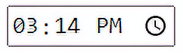
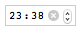
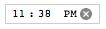
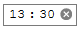
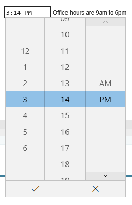

{{HTMLRef("Input_types")}}

{{htmlelement("input")}} elements of type **`time`** create input fields designed to let the user easily enter a time (hours and minutes, and optionally seconds).

The control's user interface varies from browser to browser; see [Browser compatibility](#browser_compatibility) for further details. In unsupported browsers, the control degrades gracefully to [`<input type="text">`](/en-US/docs/Web/HTML/Element/input/text).

{{EmbedInteractiveExample("pages/tabbed/input-time.html", "tabbed-standard")}}

## Appearance

### Chrome and Opera

In Chrome/Opera the `time` control is simple, with slots to enter hours and minutes in 12 or 24-hour format depending on operating system locale, and up and down arrows to increment and decrement the currently selected component. In some versions, an "X" button is provided to clear the control's value.

 12-hour

 24-hour

### Firefox

Firefox's `time` control is very similar to Chrome's, except that it doesn't have the up and down arrows. It also uses a 12- or 24-hour format for inputting times, based on system locale. An "X" button is provided to clear the control's value.

 12-hour

 24-hour

### Edge

The Edge `time` control is somewhat more elaborate, opening up an hour and minute picker with sliding reels. It, like Chrome, uses a 12- or 24-hour format for inputting times, based on system locale:

 12-hour

 24-hour

<table class="properties">
  <tbody>
    <tr>
      <td><strong><a href="#value">Value</a></strong></td>
      <td>A string representing a time, or empty.</td>
    </tr>
    <tr>
      <td><strong>Events</strong></td>
      <td>
        {{domxref("HTMLElement/change_event", "change")}} and
        {{domxref("HTMLElement/input_event", "input")}}
      </td>
    </tr>
    <tr>
      <td><strong>Supported common attributes</strong></td>
      <td>
        {{htmlattrxref("autocomplete", "input")}},
        {{htmlattrxref("list", "input")}},
        {{htmlattrxref("readonly", "input")}}, and
        {{htmlattrxref("step", "input")}}
      </td>
    </tr>
    <tr>
      <td><strong>IDL attributes</strong></td>
      <td>
        <code>value</code>, <code>valueAsDate</code>,
        <code>valueAsNumber</code>, and <code>list</code>.
      </td>
    </tr>
    <tr>
      <td><strong>DOM interface</strong></td>
      <td><p>{{domxref("HTMLInputElement")}}</p></td>
    </tr>
    <tr>
      <td><strong>Methods</strong></td>
      <td>
        {{domxref("HTMLInputElement.select", "select()")}},
        {{domxref("HTMLInputElement.stepDown", "stepDown()")}},
        and
        {{domxref("HTMLInputElement.stepUp", "stepUp()")}}.
      </td>
    </tr>
  </tbody>
</table>

## Value

A string containing the value of the time entered into the input.

### Setting the value attribute

You can set a default value for the input by including a valid time in the {{htmlattrxref("value", "input")}} attribute when creating the `<input>` element, like so:

```html
<label for="appt-time">Choose an appointment time: </label>
<input id="appt-time" type="time" name="appt-time" value="13:30">
```

{{ EmbedLiveSample('Setting_the_value_attribute', 600, 60) }}

### Setting the value using JavaScript

You can also get and set the date value in JavaScript using the {{domxref("HTMLInputElement")}} `value` property, for example:

```js
const timeControl = document.querySelector('input[type="time"]');
timeControl.value = '15:30';
```

### Time value format

The `value` of the `time` input is always in 24-hour format that includes leading zeros: `hh:mm`, regardless of the input format, which is likely to be selected based on the user's locale (or by the user agent). If the time includes seconds (see [Using the step attribute](#using_the_step_attribute)), the format is always `hh:mm:ss`. You can learn more about the format of the time value used by this input type in {{SectionOnPage("/en-US/docs/Web/HTML/Date_and_time_formats", "Time strings")}}.

In this example, you can see the time input's value by entering a time and seeing how it changes afterward.

First, a look at the HTML. This is simple enough, with the label and input as we've seen before, but with the addition of a {{HTMLElement("p")}} element with a {{HTMLElement("span")}} to display the value of the `time` input:

```html
<form>
  <label for="startTime">Start time: </label>
  <input type="time" id="startTime">
  <p>
    Value of the <code>time</code> input: <code>
            "<span id="value">n/a</span>"</code>.
  </p>
</form>
```

The JavaScript code adds code to the time input to watch for the {{domxref("HTMLElement/input_event", "input")}} event, which is triggered every time the contents of an input element change. When this happens, the contents of the `<span>` are replaced with the new value of the input element.

```js
const startTime = document.getElementById("startTime");
const valueSpan = document.getElementById("value");

startTime.addEventListener("input", () => {
  valueSpan.innerText = startTime.value;
}, false);
```

{{EmbedLiveSample("Time_value_format", 600, 80)}}

When a form including a `time` input is submitted, the value is encoded before being included in the form's data. The form's data entry for a time input will always be in the form `name=hh%3Amm`, or `name=hh%3Amm%3Ass` if seconds are included (see [Using the step attribute](#using_the_step_attribute)).

## Additional attributes

In addition to the attributes common to all {{HTMLElement("input")}} elements, `time` inputs offer the following attributes.

> **Note:** Unlike many data types, time values have a **periodic domain**, meaning that the values reach the highest possible value, then wrap back around to the beginning again. For example, specifying a `min` of `14:00` and a `max` of `2:00` means that the permitted time values start at 2:00 PM, run through midnight to the next day, ending at 2:00 AM. See more in the [making min and max cross midnight](#making_min_and_max_cross_midnight) section of this article.

### list

The values of the list attribute is the {{domxref("Element.id", "id")}} of a {{HTMLElement("datalist")}} element located in the same document. The {{HTMLElement("datalist")}} provides a list of predefined values to suggest to the user for this input. Any values in the list that are not compatible with the {{htmlattrxref("type", "input")}} are not included in the suggested options. The values provided are suggestions, not requirements: users can select from this predefined list or provide a different value.

### max

A string indicating the latest time to accept, specified in the same [time value format](#time_value_format) as described above. If the specified string isn't a valid time, no maximum value is set.

### min

A string specifying the earliest time to accept, given in the [time value format](#time_value_format) described previously. If the value specified isn't a valid time string, no minimum value is set.

### readonly

A Boolean attribute which, if present, means this field cannot be edited by the user. Its `value` can, however, still be changed by JavaScript code directly setting the {{domxref("HTMLInputElement")}} `value` property.

> **Note:** Because a read-only field cannot have a value, `required` does not have any effect on inputs with the `readonly` attribute also specified.

### step

The `step` attribute is a number that specifies the granularity that the value must adhere to, or the special value `any`, which is described below. Only values which are equal to the basis for stepping ([`min`](#min) if specified, {{htmlattrxref("value", "input")}} otherwise, and an appropriate default value if neither of those is provided) are valid.

A string value of `any` means that no stepping is implied, and any value is allowed (barring other constraints, such as [`min`](#min) and [`max`](#max)).

> **Note:** When the data entered by the user doesn't adhere to the stepping configuration, the {{Glossary("user agent")}} may round to the nearest valid value, preferring numbers in the positive direction when there are two equally close options.

For `time` inputs, the value of `step` is given in seconds, with a scaling factor of 1000 (since the underlying numeric value is in milliseconds). The default value of `step` is 60, indicating 60 seconds (or 1 minute, or 60,000 milliseconds).

_At this time, it's unclear what a value of `any` means for `step` when used with `time` inputs. This will be updated as soon as that information is determined._

## Using time inputs

### Basic uses of time

The simplest use of `<input type="time">` involves a basic `<input>` and {{htmlelement("label")}} element combination, as seen below:

```html
<form>
  <label for="appt-time">Choose an appointment time: </label>
  <input id="appt-time" type="time" name="appt-time">
</form>
```

{{EmbedLiveSample('Basic_uses_of_time', 600, 40)}}

### Controlling input size

`<input type="time">` doesn't support form sizing attributes such as {{htmlattrxref("size", "input")}}, since times are always about the same number of characters long. You'll have to resort to [CSS](/en-US/docs/Web/CSS) for sizing needs.

### Using the step attribute

You can use the {{htmlattrxref("step", "input")}} attribute to vary the amount of time jumped whenever the time is incremented or decremented (for example, so the time moves by 10 minutes at a time when clicking the little arrow widgets).

> **Note:** This property has some strange effects across browsers, so is not completely reliable.

It takes an integer value that equates to the number of seconds you want to increment by; the default value is 60 seconds, or one minute. If you specify a value of less than 60 seconds (1 minute), the `time` input will show a seconds input area alongside the hours and minutes:

```html
<form>
  <label for="appt-time">Choose an appointment time: </label>
  <input id="appt-time" type="time" name="appt-time" step="2">
</form>
```

{{EmbedLiveSample('Using_the_step_attribute', 600, 40)}}

In Chrome and Opera, which are the only browsers to show up/down iteration arrows, clicking the arrows changes the seconds value by two seconds, but doesn't affect the hours or minutes. Minutes (or hours) can only be used for stepping when you specify a number of minutes (or hours) in seconds, such as 120 for 2 minutes, or 7200 for 2 hours).

In Firefox, there are no arrows, so the `step` value isn't used. However, providing it _does_ add the seconds input area adjacent to the minutes section.

The steps value seems to have no effect in Edge.

> **Note:** Using `step` seems to cause validation to not work properly (as seen in the next section).

## Validation

By default, `<input type="time">` does not apply any validation to entered values, other than the user agent's interface generally not allowing you to enter anything other than a time value. This is helpful (assuming the `time` input is fully supported by the user agent), but you can't entirely rely on the value to be a proper time string, since it might be an empty string (`""`), which is allowed. It's also possible for the value to look roughly like a valid time but not be correct, such as `25:05`.

### Setting maximum and minimum times

You can use the {{htmlattrxref("min", "input")}} and {{htmlattrxref("max", "input")}} attributes to restrict the valid times that can be chosen by the user. In the following example we are setting a minimum time of `12:00` and a maximum time of `18:00`:

```html
<form>
  <label for="appt-time">Choose an appointment time (opening hours 12:00 to 18:00): </label>
  <input id="appt-time" type="time" name="appt-time"
         min="12:00" max="18:00">
  <span class="validity"></span>
</form>
```

{{ EmbedLiveSample('Setting_maximum_and_minimum_times', 600, 40) }}

Here's the CSS used in the above example. Here we make use of the {{cssxref(":valid")}} and {{cssxref(":invalid")}} CSS properties to style the input based on whether or not the current value is valid. We had to put the icons on a {{htmlelement("span")}} next to the input, not on the input itself, because in Chrome the generated content is placed inside the form control, and can't be styled or shown effectively.

```css
div {
  margin-bottom: 10px;
  position: relative;
}

input[type="number"] {
  width: 100px;
}

input + span {
  padding-right: 30px;
}

input:invalid + span::after {
  position: absolute;
  content: "✖";
  padding-left: 5px;
}

input:valid + span::after {
  position: absolute;
  content: "✓";
  padding-left: 5px;
}
```

The result here is that:

- Only times between 12:00 and 18:00 will be seen as valid; times outside that range will be denoted as invalid.
- Depending on what browser you're using, you might find that times outside the specified range might not even be selectable in the time picker (e.g. Edge).

#### Making min and max cross midnight

By setting a {{htmlattrxref("min", "input")}} attribute greater than the {{htmlattrxref("max", "input")}} attribute, the valid time range will wrap around midnight to produce a valid time range which crosses midnight. This functionality is not supported by any other input types. While this feature is [in the HTML spec](https://html.spec.whatwg.org/multipage/input.html#has-a-reversed-range), it is not yet universally supported. Chrome-based browsers support it starting in version 82 and Firefox added it in version 76. Safari as of version 14.1 does not support this. Be prepared for this situation to arise:

```js
const input = document.createElement('input');
input.type = 'time';
input.min = '23:00';
input.max = '01:00';
input.value = '23:59';

if (input.validity.valid && input.type === 'time') {
  // <input type=time> reversed range supported
} else {
  // <input type=time> reversed range unsupported
}
```

### Making times required

In addition, you can use the {{htmlattrxref("required", "input")}} attribute to make filling in the time mandatory. As a result, supporting browsers will display an error if you try to submit a time that is outside the set bounds, or an empty time field.

Let's look at an example; here we've set minimum and maximum times, and also made the field required:

```html
<form>
  <div>
    <label for="appt-time">Choose an appointment time (opening hours 12:00 to 18:00): </label>
    <input id="appt-time" type="time" name="appt-time"
           min="12:00" max="18:00" required>
    <span class="validity"></span>
  </div>
  <div>
      <input type="submit" value="Submit form">
  </div>
</form>
```

If you try to submit the form with an incomplete time (or with a time outside the set bounds), the browser displays an error. Try playing with the example now:

{{ EmbedLiveSample('Making_times_required', 600, 120) }}

> **Warning:** HTML form validation is _not_ a substitute for scripts that ensure that the entered data is in the proper format. It's far too easy for someone to make adjustments to the HTML that allow them to bypass the validation, or to remove it entirely. It's also possible for someone to bypass your HTML entirely and submit the data directly to your server. If your server-side code fails to validate the data it receives, disaster could strike when improperly-formatted data is submitted (or data which is too large, of the wrong type, and so forth).

## Handling browser support

As mentioned, older versions of Safari and a few other, less common, browsers don't support time inputs natively. In general, otherwise, support is good — especially on mobile platforms, which tend to have very nice user interfaces for specifying a time value. For example, the `time` picker on Chrome for Android looks like this:


Browsers that don't support time inputs gracefully degrade to a text input, but this creates problems both in terms of consistency of user interface (the presented control will be different), and data handling.

The second problem is the more serious; as mentioned previously, `time` inputs' values are always normalized to the format `hh:mm` or `hh:mm:ss`. With a text input, on the other hand, by default the browser has no idea of what format the time should be in, and there are multiple ways in which people write times, such as:

- `3.00 pm`
- `3:00pm`
- `15:00`
- `3 o'clock in the afternoon`
- etc.

One way around this is to put a {{htmlattrxref("pattern", "input")}} attribute on your `time` input. Even though the `time` input doesn't use it, the `text` input fallback will. For example, try viewing the following demo in a browser that doesn't support time inputs:

```html
<form>
  <div>
    <label for="appt-time">Choose an appointment time (opening hours 12:00 to 18:00): </label>
    <input id="appt-time" type="time" name="appt-time"
           min="12:00" max="18:00" required
           pattern="[0-9]{2}:[0-9]{2}">
    <span class="validity"></span>
  </div>
  <div>
      <input type="submit" value="Submit form">
  </div>
</form>
```

{{ EmbedLiveSample('Handling_browser_support', 600, 100) }}

If you try submitting it, you'll see that non-supporting browsers now display an error message (and highlight the input as invalid) if your entry doesn't match the pattern `nn:nn`, where `n` is a number from 0 to 9. Of course, this doesn't stop people from entering invalid times, or incorrectly formatted times that follow the pattern.

Then there's the problem of the user having no idea exactly what format the time is expected to be in.

```css hidden
div {
  margin-bottom: 10px;
  position: relative;
}

input[type="number"] {
  width: 100px;
}

input + span {
  padding-right: 30px;
}

input:invalid + span::after {
  position: absolute;
  content: "✖";
  padding-left: 5px;
}

input:valid + span::after {
  position: absolute;
  content: "✓";
  padding-left: 5px;
}
```

The best way to deal with times in forms in a cross-browser way, for the time being, is to get the user to enter the hours and minutes (and seconds if required) in separate controls ({{htmlelement("select")}} elements are popular; see below for an example), or use JavaScript libraries such as the [jQuery timepicker plugin](https://timepicker.co/).

## Examples

In this example, we create two sets of interface elements for choosing times: a native picker created with `<input type="time">`, and a set of two {{htmlelement("select")}} elements for choosing hours/minutes in older browsers that don't support the native input.

{{ EmbedLiveSample('Examples', 600, 140) }}

The HTML looks like so:

```html
<form>
  <div class="nativeTimePicker">
    <label for="appt-time">Choose an appointment time (opening hours 12:00 to 18:00): </label>
      <input id="appt-time" type="time" name="appt-time"
             min="12:00" max="18:00" required>
      <span class="validity"></span>
    </div>
  <p class="fallbackLabel">Choose an appointment time (opening hours 12:00 to 18:00):</p>
  <div class="fallbackTimePicker">
    <div>
      <span>
        <label for="hour">Hour:</label>
        <select id="hour" name="hour">
        </select>
      </span>
      <span>
        <label for="minute">Minute:</label>
        <select id="minute" name="minute">
        </select>
      </span>
    </div>
  </div>
</form>
```

The hour and minutes values for their `<select>` elements are dynamically generated.

```css hidden
div {
  margin-bottom: 10px;
  position: relative;
}

input[type="number"] {
  width: 100px;
}

input + span {
  padding-right: 30px;
}

input:invalid + span::after {
  position: absolute;
  content: "✖";
  padding-left: 5px;
}

input:valid + span::after {
  position: absolute;
  content: "✓";
  padding-left: 5px;
}
```

The other part of the code that may be of interest is the feature detection code — to detect whether the browser supports `<input type="time">`, we create a new {{htmlelement("input")}} element, try setting its `type` to `time`, then immediately check what its type is set to — non-supporting browsers will return `text`, because the `time` type falls back to type `text`. If `<input type="time">` is not supported, we hide the native picker and show the fallback picker UI ({{htmlelement("select")}}s) instead.

```js
// Define variables
const nativePicker = document.querySelector('.nativeTimePicker');
const fallbackPicker = document.querySelector('.fallbackTimePicker');
const fallbackLabel = document.querySelector('.fallbackLabel');

const hourSelect = document.querySelector('#hour');
const minuteSelect = document.querySelector('#minute');

// Hide fallback initially
fallbackPicker.style.display = 'none';
fallbackLabel.style.display = 'none';

// Test whether a new date input falls back to a text input or not
const test = document.createElement('input');

try {
  test.type = 'time';
} catch (e) {
  console.log(e.description);
}

// If it does, run the code inside the if () {} block
if (test.type === 'text') {
  // Hide the native picker and show the fallback
  nativePicker.style.display = 'none';
  fallbackPicker.style.display = 'block';
  fallbackLabel.style.display = 'block';

  // Populate the hours and minutes dynamically
  populateHours();
  populateMinutes();
}

function populateHours() {
  // Populate the hours <select> with the 6 open hours of the day
  for (let i = 12; i <= 18; i++) {
    const option = document.createElement('option');
    option.textContent = i;
    hourSelect.appendChild(option);
  }
}

function populateMinutes() {
  // populate the minutes <select> with the 60 hours of each minute
  for (let i = 0; i <= 59; i++) {
    const option = document.createElement('option');
    option.textContent = (i < 10) ? `0${i}` : i;
    minuteSelect.appendChild(option);
  }
}

// make it so that if the hour is 18, the minutes value is set to 00
// — you can't select times past 18:00
 function setMinutesToZero() {
   if (hourSelect.value === '18') {
     minuteSelect.value = '00';
   }
 }

 hourSelect.onchange = setMinutesToZero;
 minuteSelect.onchange = setMinutesToZero;
```

## Specifications

{{Specifications}}

## Browser compatibility

{{Compat}}

## See also

- The generic {{HTMLElement("input")}} element and the interface used to manipulate it, {{domxref("HTMLInputElement")}}
- [Date and time formats used in HTML](/en-US/docs/Web/HTML/Date_and_time_formats)
- [Date and Time picker tutorial](/en-US/docs/Learn/Forms/Basic_native_form_controls#date_and_time_picker)
- [`<input type="datetime-local">`](/en-US/docs/Web/HTML/Element/input/datetime-local), [`<input type="date">`](/en-US/docs/Web/HTML/Element/input/date), [`<input type="week">`](/en-US/docs/Web/HTML/Element/input/week), and [`<input type="month">`](/en-US/docs/Web/HTML/Element/input/month)
- [Compatibility of CSS properties](/en-US/docs/Learn/Forms/Property_compatibility_table_for_form_controls)
