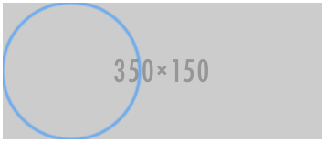
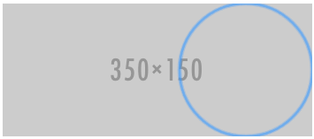

{{HTMLRef}}

The <strong><code>&lt;map&gt;</code></strong> <a href="/en-US/docs/Web/HTML">HTML</a> element is used with {{HTMLElement("area")}} elements to define an image map (a clickable link area).

{{EmbedInteractiveExample("pages/tabbed/map.html", "tabbed-standard")}}

<table class="properties">
 <tbody>
  <tr>
   <th scope="row"><a href="/en-US/docs/Web/Guide/HTML/Content_categories">Content categories</a></th>
   <td><a href="/en-US/docs/Web/Guide/HTML/Content_categories#flow_content">Flow content</a>, <a href="/en-US/docs/Web/Guide/HTML/Content_categories#phrasing_content">phrasing content</a>, palpable content.</td>
  </tr>
  <tr>
   <th scope="row">Permitted content</th>
   <td>Any <a href="/en-US/docs/Web/Guide/HTML/Content_categories#transparent_content_model">transparent</a> element.</td>
  </tr>
  <tr>
   <th scope="row">Tag omission</th>
   <td>{{no_tag_omission}}</td>
  </tr>
  <tr>
   <th scope="row">Permitted parents</th>
   <td>Any element that accepts <a href="/en-US/docs/Web/Guide/HTML/Content_categories#phrasing_content">phrasing content</a>.</td>
  </tr>
  <tr>
   <th scope="row">Implicit ARIA role</th>
   <td><a href="https://www.w3.org/TR/html-aria/#dfn-no-corresponding-role">No corresponding role</a></td>
  </tr>
  <tr>
   <th scope="row">Permitted ARIA roles</th>
   <td>No <code>role</code> permitted</td>
  </tr>
  <tr>
   <th scope="row">DOM interface</th>
   <td>{{domxref("HTMLMapElement")}}</td>
  </tr>
 </tbody>
</table>

<h2 id="Attributes">Attributes</h2>

This element includes the <a href="/en-US/docs/Web/HTML/Global_attributes">global attributes</a>.

<dl>
 <dt>{{htmlattrdef("name")}}</dt>
 <dd>The <code>name</code> attribute gives the map a name so that it can be referenced. The attribute must be present and must have a non-empty value with no space characters. The value of the <code>name</code> attribute must not be equal to the value of the <code>name</code> attribute of another <code>&lt;map&gt;</code> element in the same document. If the {{htmlattrxref("id")}} attribute is also specified, both attributes must have the same value.</dd>
</dl>

<h2 id="Examples">Examples</h2>

<pre class="brush: html">&lt;map name="primary"&gt;
  &lt;area shape="circle" coords="75,75,75" href="left.html"&gt;
  &lt;area shape="circle" coords="275,75,75" href="right.html"&gt;
&lt;/map&gt;
&lt;img usemap="#primary" src="https://via.placeholder.com/350x150" alt="350 x 150 pic"&gt;
</pre>

<h3 id="Result">Result</h3>

{{ EmbedLiveSample('Examples', '350', '166', '', 'Web/HTML/Element/map') }}

<h3 id="Expected_live_example_output">Expected live example output</h3>

The live example above should appear similar to the following images (when using your keyboard tab key):

<em>For the <code>left.html</code> link:</em> 
 

<em>For the <code>right.html</code> link</em> 
 

<h2 id="Specifications">Specifications</h2>

{{Specifications}}

<h2 id="Browser_compatibility">Browser compatibility</h2>

{{Compat}}

<h2 id="See_also">See also</h2>

<ul>
 <li>{{HTMLElement("a")}}</li>
 <li>{{HTMLElement("area")}}</li>
</ul>
