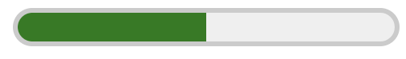
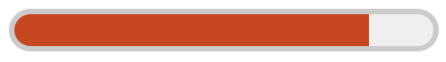

{{HTMLSidebar}}

The **`<meter>`** [HTML](/en-US/docs/Web/HTML) element represents either a scalar value within a known range or a fractional value.

{{EmbedInteractiveExample("pages/tabbed/meter.html", "tabbed-shorter")}}

<table class="properties">
  <tbody>
    <tr>
      <th scope="row">
        <a href="/en-US/docs/Web/HTML/Content_categories"
          >Content categories</a
        >
      </th>
      <td>
        <a href="/en-US/docs/Web/HTML/Content_categories#flow_content"
          >Flow content</a
        >,
        <a href="/en-US/docs/Web/HTML/Content_categories#phrasing_content"
          >phrasing content</a
        >, labelable content, palpable content.
      </td>
    </tr>
    <tr>
      <th scope="row">Permitted content</th>
      <td>
        <a href="/en-US/docs/Web/HTML/Content_categories#phrasing_content"
          >Phrasing content</a
        >, but there must be no <code>&#x3C;meter></code> element among its
        descendants.
      </td>
    </tr>
    <tr>
      <th scope="row">Tag omission</th>
      <td>{{no_tag_omission}}</td>
    </tr>
    <tr>
      <th scope="row">Permitted parents</th>
      <td>
        Any element that accepts
        <a href="/en-US/docs/Web/HTML/Content_categories#phrasing_content"
          >phrasing content</a
        >.
      </td>
    </tr>
    <tr>
      <th scope="row">Implicit ARIA role</th>
      <td>
        <a href="https://www.w3.org/TR/html-aria/#dfn-no-corresponding-role"
          >No corresponding role</a
        >
      </td>
    </tr>
    <tr>
      <th scope="row">Permitted ARIA roles</th>
      <td>No <code>role</code> permitted</td>
    </tr>
    <tr>
      <th scope="row">DOM interface</th>
      <td>{{domxref("HTMLMeterElement")}}</td>
    </tr>
  </tbody>
</table>

## Attributes

This element includes the [global attributes](/en-US/docs/Web/HTML/Global_attributes).

- `value`

  - : The current numeric value. This must be between the minimum and maximum values (`min` attribute and `max` attribute) if they are specified. If unspecified or malformed, the value is `0`. If specified, but not within the range given by the `min` attribute and `max` attribute, the value is equal to the nearest end of the range.

    > **Note:** Unless the `value` attribute is between `0` and `1` (inclusive), the `min` and `max` attributes should define the range so that the `value` attribute's value is within it.

- `min`
  - : The lower numeric bound of the measured range. This must be less than the maximum value (`max` attribute), if specified. If unspecified, the minimum value is `0`.
- `max`
  - : The upper numeric bound of the measured range. This must be greater than the minimum value (`min` attribute), if specified. If unspecified, the maximum value is `1`.
- `low`
  - : The upper numeric bound of the low end of the measured range. This must be greater than the minimum value (`min` attribute), and it also must be less than the high value and maximum value (`high` attribute and `max` attribute, respectively), if any are specified. If unspecified, or if less than the minimum value, the `low` value is equal to the minimum value.
- `high`
  - : The lower numeric bound of the high end of the measured range. This must be less than the maximum value (`max` attribute), and it also must be greater than the low value and minimum value (`low` attribute and `min` attribute, respectively), if any are specified. If unspecified, or if greater than the maximum value, the `high` value is equal to the maximum value.
- `optimum`
  - : This attribute indicates the optimal numeric value. It must be within the range (as defined by the `min` attribute and `max` attribute). When used with the `low` attribute and `high` attribute, it gives an indication where along the range is considered preferable. For example, if it is between the `min` attribute and the `low` attribute, then the lower range is considered preferred. The browser may color the meter's bar differently depending on whether the value is less than or equal to the optimum value.

## Examples

### Simple example

#### HTML

```html
<p>
  Heat the oven to <meter min="200" max="500" value="350">350 degrees</meter>.
</p>
```

#### Result

{{EmbedLiveSample("Simple_example", 300, 60)}}

On Google Chrome, the resulting meter looks like this:



### High and Low range example

Note that in this example the [`min`](#min) attribute is omitted. This is allowed, as it will default to `0`.

#### HTML

```html
<p>
  He got a <meter low="69" high="80" max="100" value="84">B</meter> on the exam.
</p>
```

#### Result

{{EmbedLiveSample("High_and_Low_range_example", 300, 60)}}

On Google Chrome, the resulting meter looks like this:



## Specifications

{{Specifications}}

## Browser compatibility

{{Compat}}

## See also

- {{HTMLElement("progress")}}
