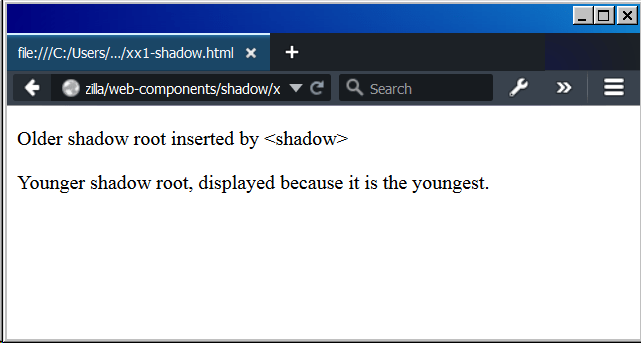

{{Deprecated_Header}}{{Non-standard_header}}

The **`<shadow>`** [HTML](/en-US/docs/Web/HTML) element—an obsolete part of the [Web Components](/en-US/docs/Web/Web_Components) technology suite—was intended to be used as a shadow DOM {{glossary("insertion point")}}. You might have used it if you have created multiple shadow roots under a shadow host. It is not useful in ordinary HTML.

<table class="properties">
  <tbody>
    <tr>
      <th scope="row">
        <a href="/en-US/docs/Web/Guide/HTML/Content_categories"
          >Content categories</a
        >
      </th>
      <td>
        <a
          href="/en-US/docs/Web/Guide/HTML/Content_categories#transparent_content_model"
          >Transparent content</a
        >
      </td>
    </tr>
    <tr>
      <th scope="row">Permitted content</th>
      <td>
        <a href="/en-US/docs/Web/Guide/HTML/Content_categories#flow_content"
          >Flow content</a
        >
      </td>
    </tr>
    <tr>
      <th scope="row">Tag omission</th>
      <td>{{no_tag_omission}}</td>
    </tr>
    <tr>
      <th scope="row">Permitted parents</th>
      <td>Any element that accepts flow content.</td>
    </tr>
    <tr>
      <th scope="row">Permitted ARIA roles</th>
      <td>None</td>
    </tr>
    <tr>
      <th scope="row">DOM interface</th>
      <td>{{domxref("HTMLShadowElement")}}</td>
    </tr>
  </tbody>
</table>

## Attributes

This element includes the [global attributes](/en-US/docs/Web/HTML/Global_attributes).

## Example

Here is a simple example of using the `<shadow>` element. It is an HTML file with everything needed in it.

> **Note:** This is an experimental technology. For this code to work, the browser you display it in must support Web Components. See [Enabling Web Components in Firefox](/en-US/docs/Web/Web_Components#enabling_web_components_in_firefox).

```html
<html lang="en">
  <head></head>
  <body>
    <!-- This <div> will hold the shadow roots. -->
    <div>
      <!-- This heading will not be displayed -->
      <h4>My Original Heading</h4>
    </div>
  <script>
    // Get the <div> above with its content
    const origContent = document.querySelector('div');
    // Create the first shadow root
    const shadowroot1 = origContent.createShadowRoot();
    // Create the second shadow root
    const shadowroot2 = origContent.createShadowRoot();

    // Insert something into the older shadow root
    shadowroot1.innerHTML =
      '<p>Older shadow root inserted by &lt;shadow&gt;</p>';

    // Insert into younger shadow root, including <shadow>.
    // The previous markup will not be displayed unless
    // <shadow> is used below.
    shadowroot2.innerHTML =
      '<shadow></shadow> <p>Younger shadow root, displayed because it is the youngest.</p>';
  </script>

  </body>
</html>
```

If you display this in a web browser it should look like the following.



## Specifications

This element is no longer defined by any specifications.

## Browser compatibility

{{Compat}}

## See also

- [Web Components](/en-US/docs/Web/Web_Components)
- {{HTMLElement("content")}}, {{HTMLElement("slot")}}, {{HTMLElement("template")}}, {{HTMLElement("element")}}

{{HTMLRef}}
