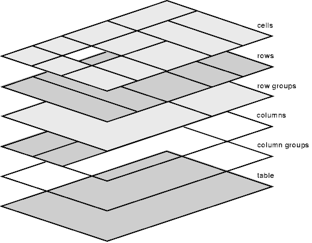

{{HTMLSidebar}}

The **`<table>`** [HTML](/en-US/docs/Web/HTML) element represents tabular data—that is, information presented in a two-dimensional table comprised of rows and columns of cells containing data.

{{EmbedInteractiveExample("pages/tabbed/table.html","tabbed-taller")}}

## Attributes

This element includes the [global attributes](/en-US/docs/Web/HTML/Global_attributes).

### Deprecated attributes

The following attributes are deprecated and should not be used. They are documented below for reference when updating existing code and for historical interest only.

- `align` {{deprecated_inline}}

  - : Specifies the horizontal alignment of the table within its parent element. The possible {{Glossary("enumerated")}} values are `left`, `center`, and `right`. Use the {{cssxref("margin-inline-start")}} and {{cssxref("margin-inline-end")}} CSS properties instead, as this attribute is deprecated.

- `bgcolor` {{deprecated_inline}}

  - : Defines the background color of the table. The value is an HTML color; either a [6-digit hexadecimal RGB code](/en-US/docs/Web/CSS/hex-color), prefixed by a '`#`', or a [color keyword](/en-US/docs/Web/CSS/named-color). Other CSS {{cssxref("color_value", "&lt;color&gt")}} values are not supported. Use the {{cssxref("background-color")}} CSS property instead, as this attribute is deprecated.

- `border` {{deprecated_inline}}

  - : Defines, as a non-negative integer value (in pixels), the size of the frame surrounding the table. If set to `0`, the [`frame`](#frame) attribute is set to void. Use the {{cssxref("border")}} CSS property instead, as this attribute is deprecated.

- `cellpadding` {{deprecated_inline}}

  - : Defines the space between the content of a cell and its border. This attribute is obsolete: instead of using it, apply the {{cssxref("padding")}} CSS property to the {{HTMLElement("th")}} and {{HTMLElement("td")}} elements.

- `cellspacing` {{deprecated_inline}}

  - : Defines the size of the space between two cells. This attribute is obsolete: instead of using it, set the {{cssxref("border-spacing")}} CSS property on the `<table>` element. Note that this has no effect if the `<table>` element's {{cssxref("border-collapse")}} CSS property is set to `collapse`.

- `frame` {{deprecated_inline}}

  - : Defines which side of the frame surrounding the table must be displayed. The possible {{Glossary("enumerated")}} values are `void`, `above`, `below`, `hsides`, `vsides`, `lhs`, `rhs`, `box` and `border`. Use the {{cssxref("border-style")}} and {{cssxref("border-width")}} CSS properties instead, as this attribute is deprecated.

- `rules` {{deprecated_inline}}

  - : Defines where rules (borders) are displayed in the table. The possible {{Glossary("enumerated")}} values are `none` (default value), `groups` ({{HTMLElement("thead")}}, {{HTMLElement("tbody")}}, and {{HTMLElement("tfoot")}} elements), `rows` (horizontal lines), `cols` (vertical lines), and `all` (border around every cell). Use the {{cssxref("border")}} CSS property on the appropriate table-related elements, as well as on the `<table>` itself, instead, as this attribute is deprecated.

- `summary` {{deprecated_inline}}

  - : Defines an alternative text that summarizes the content of the table. Use the {{htmlelement("caption")}} element instead, as this attribute is deprecated.

- `width` {{deprecated_inline}}

  - : Specifies the width of the table. Use the {{cssxref("width")}} CSS property instead, as this attribute is deprecated.

    > **Note:** While no HTML specification includes `height` as a `<table>` attribute, some browsers support a non-standard interpretation of `height`. The unitless value sets a minimum absolute height in pixels. If set as a percent value, the minimum table height will be relative to the parent container's height. Use the {{cssxref("min-height")}} CSS property instead, as this attribute is deprecated.

## Visual layout of table contents

Following elements are part of the table structure:

- {{HTMLElement("caption")}}
- {{HTMLElement("thead")}}
- {{HTMLElement("colgroup")}}
- {{HTMLElement("col")}}
- {{HTMLElement("th")}}
- {{HTMLElement("tbody")}}
- {{HTMLElement("tr")}}
- {{HTMLElement("td")}}
- {{HTMLElement("tfoot")}}

The `<table>` box establishes a table formatting context. Elements inside the `<table>` generate rectangular boxes. Each box occupies a number of table cells according to the following rules:

1. The row boxes fill the table in the source code order from top to bottom. Each row box occupies one row of cells.
2. A row group box occupies one or more row boxes.
3. Column boxes are placed next to each other in source code order. Depending on the value of the [`dir`](/en-US/docs/Web/HTML/Global_attributes/dir) attribute, the columns are laid in left-to-right or right-to-left direction. A column box occupies one or more columns of table cells.
4. A column group box occupies one or more column boxes.
5. A cell box may span over multiple rows and columns. User agents trim cells to fit in the available number of rows and columns.

Table cells do have padding. Boxes that make up a table do not have margins.

### Table layers and transparency

For styling purpose the table elements may be thought of as being put on six superimposed layers:



The background set on an element in one layer will be visible only if the layers above it have transparent background. A missing cell is rendered as if an anonymous table-cell box occupied that place.

## Accessibility

### Captions

By supplying a {{HTMLElement("caption")}} element whose value clearly and concisely describes the table's purpose, it helps the people decide if they need to check the rest of the table content or skip over it.

This helps people navigating with the aid of assistive technology such as a screen reader, people experiencing low vision conditions, and people with cognitive concerns.

- [MDN Adding a caption to your table with \<caption>](/en-US/docs/Learn/HTML/Tables/Advanced#adding_a_caption_to_your_table_with_caption)
- [Caption & Summary • Tables • W3C WAI Web Accessibility Tutorials](https://www.w3.org/WAI/tutorials/tables/caption-summary/)

### Scoping rows and columns

The [`scope`](/en-US/docs/Web/HTML/Element/th#scope) attribute on header cells ({{HTMLElement("th")}} elements) is redundant in simple contexts, because scope is inferred. However, some assistive technologies may fail to draw correct inferences, so specifying header scope may improve user experiences. In complex tables, [`scope`](/en-US/docs/Web/HTML/Element/th#scope) can be specified to provide necessary information about the cells related to a header.

- [MDN Tables for visually impaired users](/en-US/docs/Learn/HTML/Tables/Advanced#tables_for_visually_impaired_users)
- [Tables with two headers • Tables • W3C WAI Web Accessibility Tutorials](https://www.w3.org/WAI/tutorials/tables/two-headers/)
- [Tables with irregular headers • Tables • W3C WAI Web Accessibility Tutorials](https://www.w3.org/WAI/tutorials/tables/irregular/)
- [H63: Using the scope attribute to associate header cells and data cells in data tables | W3C Techniques for WCAG 2.0](https://www.w3.org/TR/WCAG20-TECHS/H63.html)

### Complicated tables

Assistive technologies such as screen readers may have difficulty parsing tables that are so complex that header cells can't be associated in a strictly horizontal or vertical way. This is typically indicated by the presence of the [`colspan`](/en-US/docs/Web/HTML/Element/td#colspan) and [`rowspan`](/en-US/docs/Web/HTML/Element/td#rowspan) attributes.

Ideally, consider alternate ways to present the table's content, including breaking it apart into a collection of smaller, related tables that don't have to rely on using the [`colspan`](/en-US/docs/Web/HTML/Element/td#colspan) and [`rowspan`](/en-US/docs/Web/HTML/Element/td#rowspan) attributes. In addition to helping people who use assistive technology understand the table's content, this may also benefit people with cognitive concerns who may have difficulty understanding the associations the table layout is describing.

If the table cannot be broken apart, use a combination of the [`id`](/en-US/docs/Web/HTML/Global_attributes#id) and [`headers`](/en-US/docs/Web/HTML/Element/td#headers) attributes to programmatically associate each table cell with the header(s) ({{HTMLElement("th")}} elements) the cell is associated with.

- [MDN Tables for visually impaired users](/en-US/docs/Learn/HTML/Tables/Advanced#tables_for_visually_impaired_users)
- [Tables with multi-level headers • Tables • W3C WAI Web Accessibility Tutorials](https://www.w3.org/WAI/tutorials/tables/multi-level/)
- [H43: Using id and headers attributes to associate data cells with header cells in data tables | Techniques for W3C WCAG 2.0](https://www.w3.org/TR/WCAG20-TECHS/H43.html)

## Examples

The examples below include tables of progressively increasing complexity. For additional examples, including an in-depth tutorial, see the [HTML tables](/en-US/docs/Learn/HTML/Tables) series in the [Learn web development](/en-US/docs/Learn) area, where you'll learn how to use the table elements and their attributes to correctly structure your tabular data. A [Styling tables](/en-US/docs/Learn/CSS/Building_blocks/Styling_tables) guide provides table styling information, including common, useful techniques.

Since the structure of a `<table>` involves the use of several table-related HTML elements along with various associated attributes, the following examples are intended to provide a simplified explanation that covers the basics and common standards. Additional and more detailed information can be found on the corresponding linked pages.

These table examples demonstrate how to create an {{Glossary("accessibility", "accessible")}} table that is structured with HTML and styled with [CSS](/en-US/docs/Web/CSS).

Because of how HTML tables are structured, the {{Glossary("markup", "markup")}} can quickly grow. For this reason, it is important to clearly define the table's purpose and final appearance to create the appropriate structure. A logical structure developed with {{Glossary("semantics", "semantic")}} markup is not only easier to style, but enables useful and accessible tables that can be understood and navigated by everyone, including search engines and users of assistive technologies.

The first example is basic, with subsequent examples growing in complexity. First, we will develop a very basic HTML table structure for the table. The first two examples contain no table section groups such as a defined head, body, or foot, and involve no cell spanning or explicitly defined cell relationships. Not even a caption is provided. As we work through the examples, they will be progressively enhanced to include all the table features that a complex data table should possess.

### Basic table

This example includes a _very_ basic table with three rows and two columns. To demonstrate default browser table styles, no CSS has been included in this example.

#### HTML

The table rows are defined with {{HTMLElement("tr")}} elements, and the columns are defined with table header and data cells within them. The first row contains the header cells ({{HTMLElement("th")}} elements) that serve as column headers for the data cells ({{HTMLElement("td")}} elements). Each element ({{HTMLElement("th")}} or {{HTMLElement("td")}}) per row is in its respective column—that is, the first element of a row is in the first column, and the second element of that row is in the second column.

```html
<table>
  <tr>
    <th>Name</th>
    <th>Age</th>
  </tr>
  <tr>
    <td>Maria Sanchez</td>
    <td>28</td>
  </tr>
  <tr>
    <td>Michael Johnson</td>
    <td>34</td>
  </tr>
</table>
```

#### Result

There is no custom [CSS](/en-US/docs/Web/CSS) or [user stylesheet](/en-US/docs/Web/CSS/Cascade#author_stylesheets) applied to this table. The styling results purely from the [user-agent stylesheet](/en-US/docs/Web/CSS/Cascade#user-agent_stylesheets).

{{EmbedLiveSample('Basic_table', 650, 80)}}

### Expanded table with header cells

This example extends the [basic table](#basic_table), extending the content and adding basic CSS styles.

#### HTML

The table comprises four rows ({{HTMLElement("tr")}} elements) now, with four columns each. The first row is a row of header cells (The first row contains only {{HTMLElement("th")}} elements). Subsequent rows include a header column ({{HTMLElement("th")}} elements as the first child elements of each row) and three data columns ({{HTMLElement("td")}} elements). As table sectioning elements are not used, the browser automatically defines the content group structure, i.e., all rows are wrapped within the body of the table of an implicit {{HTMLElement("tbody")}} element.

```html
<table>
  <tr>
    <th>Name</th>
    <th>ID</th>
    <th>Member Since</th>
    <th>Balance</th>
  </tr>
  <tr>
    <th>Margaret Nguyen</th>
    <td>427311</td>
    <td><time datetime="2010-06-03">June 3, 2010</time></td>
    <td>0.00</td>
  </tr>
  <tr>
    <th>Edvard Galinski</th>
    <td>533175</td>
    <td><time datetime="2011-01-13">January 13, 2011</time></td>
    <td>37.00</td>
  </tr>
  <tr>
    <th>Hoshi Nakamura</th>
    <td>601942</td>
    <td><time datetime="2012-07-23">July 23, 2012</time></td>
    <td>15.00</td>
  </tr>
</table>
```

#### CSS

With CSS, we provide the basic styling to create lines around the components of the table to make the data structure clearer. The CSS adds a solid border around the `<table>` and around each of the table's cells, including those specified with both {{HTMLElement("th")}} and {{HTMLElement("td")}} elements, demarcating every header and data cells.

```css
table {
  border: 2px solid rgb(140 140 140);
}

th,
td {
  border: 1px solid rgb(160 160 160);
}
```

#### Result

{{EmbedLiveSample("Expanded_table_with_header_cells", 650, 110)}}

### Specifying table cell relations

Before moving on to extend the table in more advanced ways, it's advisable to improve {{Glossary("accessibility", "accessibility")}} by defining relationships between the header and data cells ({{HTMLElement("th")}} and {{HTMLElement("td")}} elements).

#### HTML

This is accomplished by introducing the [`scope`](/en-US/docs/Web/HTML/Element/th#scope) attribute on the {{HTMLElement("th")}} elements and setting the values to the corresponding `col` (column) or `row` value.

```html
<table>
  <tr>
    <th scope="col">Name</th>
    <th scope="col">ID</th>
    <th scope="col">Member Since</th>
    <th scope="col">Balance</th>
  </tr>
  <tr>
    <th scope="row">Margaret Nguyen</th>
    <td>427311</td>
    <td><time datetime="2010-06-03">June 3, 2010</time></td>
    <td>0.00</td>
  </tr>
  <tr>
    <th scope="row">Edvard Galinski</th>
    <td>533175</td>
    <td><time datetime="2011-01-13">January 13, 2011</time></td>
    <td>37.00</td>
  </tr>
  <tr>
    <th scope="row">Hoshi Nakamura</th>
    <td>601942</td>
    <td><time datetime="2012-07-23">July 23, 2012</time></td>
    <td>15.00</td>
  </tr>
</table>
```

The CSS and visual result are unchanged—the adaptation provides valuable contextual information for assistive technologies such as screen readers to help identify which cells the headers relate to.

> **Note:** If the table structure is even more complex, the (additional) use of the [`headers`](/en-US/docs/Web/HTML/Element/th#headers) attribute on the {{HTMLElement("th")}} and {{HTMLElement("td")}} elements may improve accessibility and help assistive technologies identify the relationships between cells; see [Complicated tables](#complicated_tables).

### Explicitly specifying table section groups

In addition to improving accessibility by [specifying cell relations](#specifying_table_cell_relations), the {{Glossary("semantics", "semantics")}} of the table can be improved by introducing table section groups.

#### HTML

Since the first row ({{HTMLElement("tr")}} element) contains only column header cells and provides the header for the rest of the table's contents, it can be enclosed in the {{HTMLElement("thead")}} element to explicitly specify that row as the head section of the table. Moreover, what is automatically accomplished by the browser can also be defined explicitly—the body section of the table, which contains the main data of the table, is specified by enclosing the corresponding rows in the {{HTMLElement("tbody")}} element. The explicit use of the {{HTMLElement("tbody")}} element helps the browser to create the intended table structure, avoiding unwanted results.

```html
<table>
  <thead>
    <tr>
      <th scope="col">Name</th>
      <th scope="col">ID</th>
      <th scope="col">Member Since</th>
      <th scope="col">Balance</th>
    </tr>
  </thead>
  <tbody>
    <tr>
      <th scope="row">Margaret Nguyen</th>
      <td>427311</td>
      <td><time datetime="2010-06-03">June 3, 2010</time></td>
      <td>0.00</td>
    </tr>
    <tr>
      <th scope="row">Edvard Galinski</th>
      <td>533175</td>
      <td><time datetime="2011-01-13">January 13, 2011</time></td>
      <td>37.00</td>
    </tr>
    <tr>
      <th scope="row">Hoshi Nakamura</th>
      <td>601942</td>
      <td><time datetime="2012-07-23">July 23, 2012</time></td>
      <td>15.00</td>
    </tr>
  </tbody>
</table>
```

Once again, the CSS and visual result are unchanged—specifying such table section groups provides valuable contextual information for assistive technologies, including screen readers and search engines, as well as for styling in the CSS, which will be shown in a later example.

### Column and row spanning

In this example, we extend the table even more by adding a column and introducing a multi-row head section.

#### HTML

Building on the table created so far, a new column for a "Membership End Date" is added in each body row with the {{HTMLElement("td")}} element. An additional row ({{HTMLElement("tr")}} element) is also added within the head section ({{HTMLElement("thead")}} element) to introduce a "Membership Dates" header as a heading for the "Joined" and "Canceled" columns.

The creation of the second header row involves adding [`colspan`](/en-US/docs/Web/HTML/Element/th#colspan) and [`rowspan`](/en-US/docs/Web/HTML/Element/th#rowspan) attributes to the {{HTMLElement("th")}} elements to allocate the header cells to the correct columns and rows.

```html
<table>
  <thead>
    <tr>
      <th scope="col" rowspan="2">Name</th>
      <th scope="col" rowspan="2">ID</th>
      <th scope="col" colspan="2">Membership Dates</th>
      <th scope="col" rowspan="2">Balance</th>
    </tr>
    <tr>
      <th scope="col">Joined</th>
      <th scope="col">Canceled</th>
    </tr>
  </thead>
  <tbody>
    <tr>
      <th scope="row">Margaret Nguyen</th>
      <td>427311</td>
      <td><time datetime="2010-06-03">June 3, 2010</time></td>
      <td>n/a</td>
      <td>0.00</td>
    </tr>
    <tr>
      <th scope="row">Edvard Galinski</th>
      <td>533175</td>
      <td><time datetime="2011-01-13">January 13, 2011</time></td>
      <td><time datetime="2017-04-08">April 8, 2017</time></td>
      <td>37.00</td>
    </tr>
    <tr>
      <th scope="row">Hoshi Nakamura</th>
      <td>601942</td>
      <td><time datetime="2012-07-23">July 23, 2012</time></td>
      <td>n/a</td>
      <td>15.00</td>
    </tr>
  </tbody>
</table>
```

```css hidden
table {
  border: 2px solid rgb(140 140 140);
}

th,
td {
  border: 1px solid rgb(160 160 160);
}
```

#### Result

{{EmbedLiveSample("Column_and_row_spanning", 650, 130)}}

The head section now has two rows, one with the headers ({{HTMLElement("th")}} elements) "Name", "ID", "Membership Dates", and "Balance", and a "Membership Dates" header with two subheaders that are in a second row: "Joined" and "Canceled". This is accomplished by:

- The first row's "Name", "ID", and "Balance" header cells span both table header rows by using the [`rowspan`](/en-US/docs/Web/HTML/Element/th#rowspan) attribute, making them each two rows tall.
- The first row's "Membership Dates" header cell spans two columns using the [`colspan`](/en-US/docs/Web/HTML/Element/th#colspan) attribute, causing it to be two columns wide.
- The second row contains only the two header cells "Joined" and "Canceled" because the other three columns are merged with the cells in the first row that span two rows. The two header cells are correctly positioned under the "Membership Dates" header.

### Table caption and column summary

It's a common and advisable practice to provide a summary for the table's content, allowing users to quickly determine the table's relevance. Furthermore, the "Balance" column is summarized by displaying the sum of the balances of the individual members.

#### HTML

A table summary is added by using a table [caption](#captions) ({{HTMLElement("caption")}} element) as the first child element of the `<table>`. The caption provides the {{glossary("accessible description")}} for the table.

Lastly, a table foot section ({{HTMLElement("tfoot")}} element) is added below the body, with a row that summarizes the "Balance" column by displaying a sum. The elements and attributes introduced earlier are applied.

```html
<table>
  <caption>
    Status of the club members 2021
  </caption>
  <thead>
    <tr>
      <th scope="col" rowspan="2">Name</th>
      <th scope="col" rowspan="2">ID</th>
      <th scope="col" colspan="2">Membership Dates</th>
      <th scope="col" rowspan="2">Balance</th>
    </tr>
    <tr>
      <th scope="col">Joined</th>
      <th scope="col">Canceled</th>
    </tr>
  </thead>
  <tbody>
    <tr>
      <th scope="row">Margaret Nguyen</th>
      <td>427311</td>
      <td><time datetime="2010-06-03">June 3, 2010</time></td>
      <td>n/a</td>
      <td>0.00</td>
    </tr>
    <tr>
      <th scope="row">Edvard Galinski</th>
      <td>533175</td>
      <td><time datetime="2011-01-13">January 13, 2011</time></td>
      <td><time datetime="2017-04-08">April 8, 2017</time></td>
      <td>37.00</td>
    </tr>
    <tr>
      <th scope="row">Hoshi Nakamura</th>
      <td>601942</td>
      <td><time datetime="2012-07-23">July 23, 2012</time></td>
      <td>n/a</td>
      <td>15.00</td>
    </tr>
  </tbody>
  <tfoot>
    <tr>
      <th scope="row" colspan="4">Total balance</th>
      <td>52.00</td>
    </tr>
  </tfoot>
</table>
```

```css hidden
table {
  border: 2px solid rgb(140 140 140);
}

th,
td {
  border: 1px solid rgb(160 160 160);
}
```

#### Result

{{EmbedLiveSample("Table_caption_and_column_summary", 650, 180)}}

### Basic table styling

Let's apply a basic style to the table to adjust the typeface and add a {{cssxref("background-color")}} to the head and foot rows. The HTML is unchanged this time, so let's dive right into the CSS.

```html hidden
<table>
  <caption>
    Status of the club members 2021
  </caption>
  <thead>
    <tr>
      <th scope="col" rowspan="2">Name</th>
      <th scope="col" rowspan="2">ID</th>
      <th scope="col" colspan="2">Membership Dates</th>
      <th scope="col" rowspan="2">Balance</th>
    </tr>
    <tr>
      <th scope="col">Joined</th>
      <th scope="col">Canceled</th>
    </tr>
  </thead>
  <tbody>
    <tr>
      <th scope="row">Margaret Nguyen</th>
      <td>427311</td>
      <td><time datetime="2010-06-03">June 3, 2010</time></td>
      <td>n/a</td>
      <td>0.00</td>
    </tr>
    <tr>
      <th scope="row">Edvard Galinski</th>
      <td>533175</td>
      <td><time datetime="2011-01-13">January 13, 2011</time></td>
      <td><time datetime="2017-04-08">April 8, 2017</time></td>
      <td>37.00</td>
    </tr>
    <tr>
      <th scope="row">Hoshi Nakamura</th>
      <td>601942</td>
      <td><time datetime="2012-07-23">July 23, 2012</time></td>
      <td>n/a</td>
      <td>15.00</td>
    </tr>
  </tbody>
  <tfoot>
    <tr>
      <th scope="row" colspan="4">Total balance</th>
      <td>52.00</td>
    </tr>
  </tfoot>
</table>
```

#### CSS

While a {{cssxref("font")}} property is added to the `<table>` element here to set a more visually appealing typeface (or an abominable sans-serif typeface, depending on your personal opinion), the interesting part is the second style, where the {{HTMLElement("tr")}} elements located within the {{HTMLElement("thead")}} and {{HTMLElement("tfoot")}} are styled adding a light blue {{cssxref("background-color")}}. This is a way to quickly apply a background color to all the cells in specific sections simultaneously.

```css
table {
  border: 2px solid rgb(140 140 140);
  font:
    16px "Open Sans",
    Helvetica,
    Arial,
    sans-serif;
}

thead > tr,
tfoot > tr {
  background-color: rgb(228 240 245);
}

th,
td {
  border: 1px solid rgb(160 160 160);
}
```

#### Result

{{EmbedLiveSample("Basic_table_styling", 650, 180)}}

### Advanced table styling

Now we'll go all-out, with styles on rows in the header and body areas both, including alternating row colors, cells with different colors depending on position within a row, and so forth. Let's take a look at the result first this time.

#### Result

Here's what the final table will look like:

{{EmbedLiveSample("Advanced_table_styling", 650, 210)}}

There is no change to the HTML again. See what proper preparation of the HTML structure can do?

```html hidden
<table>
  <caption>
    Status of the club members 2021
  </caption>
  <thead>
    <tr>
      <th scope="col" rowspan="2">Name</th>
      <th scope="col" rowspan="2">ID</th>
      <th scope="col" colspan="2">Membership Dates</th>
      <th scope="col" rowspan="2">Balance</th>
    </tr>
    <tr>
      <th scope="col">Joined</th>
      <th scope="col">Canceled</th>
    </tr>
  </thead>
  <tbody>
    <tr>
      <th scope="row">Margaret Nguyen</th>
      <td>427311</td>
      <td><time datetime="2010-06-03">June 3, 2010</time></td>
      <td>n/a</td>
      <td>0.00</td>
    </tr>
    <tr>
      <th scope="row">Edvard Galinski</th>
      <td>533175</td>
      <td><time datetime="2011-01-13">January 13, 2011</time></td>
      <td><time datetime="2017-04-08">April 8, 2017</time></td>
      <td>37.00</td>
    </tr>
    <tr>
      <th scope="row">Hoshi Nakamura</th>
      <td>601942</td>
      <td><time datetime="2012-07-23">July 23, 2012</time></td>
      <td>n/a</td>
      <td>15.00</td>
    </tr>
  </tbody>
  <tfoot>
    <tr>
      <th scope="row" colspan="4">Total balance</th>
      <td>52.00</td>
    </tr>
  </tfoot>
</table>
```

#### CSS

The CSS is much more involved this time. It's not complicated, but there's a lot going on. Let's break it down.

Here the {{CSSxRef("border-collapse")}} and {{CSSxRef("border-spacing")}} properties are added to eliminate spacing between cells and collapse borders that touch one another to be a single border instead of winding up with double borders. Additionally, the {{HTMLElement("caption")}} is placed at the `bottom` of the table using the {{CSSxRef("caption-side")}} property:

```css
table {
  border-collapse: collapse;
  border-spacing: 0;
  border: 2px solid rgb(140 140 140);
  font:
    16px "Open Sans",
    Helvetica,
    Arial,
    sans-serif;
}

caption {
  caption-side: bottom;
  padding: 10px;
  font-weight: bold;
}
```

Next, the {{CSSxRef("padding")}} property is used to give all the table cells space around their content. The {{CSSxRef("vertical-align")}} property aligns the content of the header cells to the `bottom` of the cell, which can be seen on the cells in the head that span two rows:

```css
th,
td {
  border: 1px solid rgb(160 160 160);
  padding: 4px 6px;
}

th {
  vertical-align: bottom;
}
```

The next CSS rule sets the {{cssxref("background-color")}} of all {{HTMLElement("tr")}} elements in the table's head (as specified using {{HTMLElement("thead")}}). Then the bottom border of the head is set to be a two-pixel wide line. Notice, however, that we're using the {{CSSxRef(":nth-of-type")}} selector to apply the {{CSSxRef("border-bottom")}} property to the _second_ row in the head. Why? Because the head is made of two rows that are spanned by some of the cells. That means there are actually two rows there; applying the style to the first row would not give us the expected result:

```css
thead > tr {
  background-color: rgb(228 240 245);
}

thead > tr:nth-of-type(2) {
  border-bottom: 2px solid rgb(140 140 140);
}
```

Let's style the two header cells "Joined" and "Canceled" with green and red hues to represent the "good" of a new member and the "bummer" of a canceled membership. Here we dig into the last row of the table's head section using the {{CSSxRef(":last-of-type")}} selector and give the first header cell in it (the "Joined" header) a greenish color, and the second header cell in it (the "Canceled" header) a reddish hue:

```css
thead > tr:last-of-type > th:nth-of-type(1) {
  background-color: rgb(225 255 225);
}

thead > tr:last-of-type > th:nth-of-type(2) {
  background-color: rgb(255 225 225);
}
```

Since the first column should stand out as well, some custom styling is added here too. This CSS rule styles the first header cell in each row of the table's body with the {{CSSxRef("text-align")}} property to left-justify the member names, and with a somewhat different {{cssxref("background-color")}}:

```css
tbody > tr > th:first-of-type {
  text-align: left;
  background-color: rgb(225 229 244);
}
```

It's common to help improve the readability of table data by alternating row colors—this is sometimes referred to as "zebra striping". Let's add a bit of {{cssxref("background-color")}} to every even row:

```css
tbody > tr:nth-of-type(even) {
  background-color: rgb(237 238 242);
}
```

Since it's standard practice to right-justify currency values in tables, let's do that here. This just sets the {{CSSxRef("text-align")}} property for the last {{HTMLElement("td")}} in each body row to `right`:

```css
tbody > tr > td:last-of-type {
  text-align: right;
}
```

Finally, some styling similar to the head is applied to the foot section of the table to make it stand out as well:

```css
tfoot > tr {
  border-top: 2px dashed rgb(140 140 140);
  background-color: rgb(228 240 245);
}

tfoot th,
tfoot td {
  text-align: right;
  font-weight: bold;
}
```

### Displaying large tables in small spaces

A common issue with tables on the web is that they don't natively work very well on small screens when the amount of content is large, and the way to make them scrollable isn't obvious, especially when the markup may come from a CMS and cannot be modified to have a wrapper.

This example provides one way to display tables in small spaces. We've hidden the HTML content as it is very large, and there is nothing remarkable about it. The CSS is more useful to inspect in this example.

```html hidden
<table>
  <thead>
    <tr>
      <th>1<sup>3</sup> equals:
      <th>2<sup>3</sup> equals:
      <th>3<sup>3</sup> equals:
      <th>4<sup>3</sup> equals:
      <th>5<sup>3</sup> equals:
      <th>6<sup>3</sup> equals:
      <th>7<sup>3</sup> equals:
  <tbody>
    <tr>
      <td>row 1: 1
      <td>row 1: 8
      <td>row 1: 27
      <td>row 1: 64
      <td>row 1: 125
      <td>row 1: 216
      <td>row 1: 343
    <tr>
      <td>row 2: 1
      <td>row 2: 8
      <td>row 2: 27
      <td>row 2: 64
      <td>row 2: 125
      <td>row 2: 216
      <td>row 2: 343
    <tr>
      <td>row 3: 1
      <td>row 3: 8
      <td>row 3: 27
      <td>row 3: 64
      <td>row 3: 125
      <td>row 3: 216
      <td>row 3: 343
    <tr>
      <td>row 4: 1
      <td>row 4: 8
      <td>row 4: 27
      <td>row 4: 64
      <td>row 4: 125
      <td>row 4: 216
      <td>row 4: 343
    <tr>
      <td>row 5: 1
      <td>row 5: 8
      <td>row 5: 27
      <td>row 5: 64
      <td>row 5: 125
      <td>row 5: 216
      <td>row 5: 343
    <tr>
      <td>row 6: 1
      <td>row 6: 8
      <td>row 6: 27
      <td>row 6: 64
      <td>row 6: 125
      <td>row 6: 216
      <td>row 6: 343
    <tr>
      <td>row 7: 1
      <td>row 7: 8
      <td>row 7: 27
      <td>row 7: 64
      <td>row 7: 125
      <td>row 7: 216
      <td>row 7: 343
    <tr>
      <td>row 8: 1
      <td>row 8: 8
      <td>row 8: 27
      <td>row 8: 64
      <td>row 8: 125
      <td>row 8: 216
      <td>row 8: 343
    <tr>
      <td>row 9: 1
      <td>row 9: 8
      <td>row 9: 27
      <td>row 9: 64
      <td>row 9: 125
      <td>row 9: 216
      <td>row 9: 343
    <tr>
      <td>row 10: 1
      <td>row 10: 8
      <td>row 10: 27
      <td>row 10: 64
      <td>row 10: 125
      <td>row 10: 216
      <td>row 10: 343
    <tr>
      <td>row 11: 1
      <td>row 11: 8
      <td>row 11: 27
      <td>row 11: 64
      <td>row 11: 125
      <td>row 11: 216
      <td>row 11: 343
    <tr>
      <td>row 12: 1
      <td>row 12: 8
      <td>row 12: 27
      <td>row 12: 64
      <td>row 12: 125
      <td>row 12: 216
      <td>row 12: 343
    <tr>
      <td>row 13: 1
      <td>row 13: 8
      <td>row 13: 27
      <td>row 13: 64
      <td>row 13: 125
      <td>row 13: 216
      <td>row 13: 343
    <tr>
      <td>row 14: 1
      <td>row 14: 8
      <td>row 14: 27
      <td>row 14: 64
      <td>row 14: 125
      <td>row 14: 216
      <td>row 14: 343
    <tr>
      <td>row 15: 1
      <td>row 15: 8
      <td>row 15: 27
      <td>row 15: 64
      <td>row 15: 125
      <td>row 15: 216
      <td>row 15: 343
    <tr>
      <td>row 16: 1
      <td>row 16: 8
      <td>row 16: 27
      <td>row 16: 64
      <td>row 16: 125
      <td>row 16: 216
      <td>row 16: 343
    <tr>
      <td>row 17: 1
      <td>row 17: 8
      <td>row 17: 27
      <td>row 17: 64
      <td>row 17: 125
      <td>row 17: 216
      <td>row 17: 343
    <tr>
      <td>row 18: 1
      <td>row 18: 8
      <td>row 18: 27
      <td>row 18: 64
      <td>row 18: 125
      <td>row 18: 216
      <td>row 18: 343
    <tr>
      <td>row 19: 1
      <td>row 19: 8
      <td>row 19: 27
      <td>row 19: 64
      <td>row 19: 125
      <td>row 19: 216
      <td>row 19: 343
    <tr>
      <td>row 20: 1
      <td>row 20: 8
      <td>row 20: 27
      <td>row 20: 64
      <td>row 20: 125
      <td>row 20: 216
      <td>row 20: 343
</table>
```

#### CSS

When looking at these styles you'll notice that table's {{cssxref("display")}} property has been set to `block`. While this allows scrolling, the table loses some of its integrity, and table cells try to become as small as possible. To mitigate this issue we've set {{cssxref("white-space")}} to `nowrap` on the {{HTMLElement("tbody")}}. However, we don't do this for the {{HTMLElement("thead")}} to avoid long titles forcing columns to be wider than they need to be to display the data.

To keep the table headers on the page while scrolling down we've set {{cssxref("position")}} to sticky on the {{HTMLElement("th")}} elements. Note that we have **not** set {{cssxref("border-collapse")}} to `collapse`, as if we do the header cannot be separated correctly from the rest of the table.

Given that the `<table>` has a fixed size, the {{cssxref("overflow")}} set to `auto` is the important part here, as it makes the table scrollable.

```css
table,
th,
td {
  border: 1px solid black;
}

table {
  overflow: auto;
  width: 100%;
  max-width: 400px;
  height: 240px;
  display: block;
  margin: 0 auto;
  border-spacing: 0;
}

tbody {
  white-space: nowrap;
}

th,
td {
  padding: 5px 10px;
  border-top-width: 0;
  border-left-width: 0;
}

th {
  position: sticky;
  top: 0;
  background: #fff;
  vertical-align: bottom;
}

th:last-child,
td:last-child {
  border-right-width: 0;
}

tr:last-child td {
  border-bottom-width: 0;
}
```

#### Result

{{EmbedLiveSample('Displaying_large_tables_in_small_spaces', '100%', 240)}}

## Technical summary

<table class="properties">
  <tbody>
    <tr>
      <th scope="row">
        <a href="/en-US/docs/Web/HTML/Content_categories"
          >Content categories</a
        >
      </th>
      <td>
        <a href="/en-US/docs/Web/HTML/Content_categories#flow_content"
          >Flow content</a
        >
      </td>
    </tr>
    <tr>
      <th scope="row">Permitted content</th>
      <td>
        In this order:
        <ol>
          <li>an optional {{HTMLElement("caption")}} element,</li>
          <li>zero or more {{HTMLElement("colgroup")}} elements,</li>
          <li>an optional {{HTMLElement("thead")}} element,</li>
          <li>
            either one of the following:
            <ul>
              <li>zero or more {{HTMLElement("tbody")}} elements</li>
              <li>one or more {{HTMLElement("tr")}} elements</li>
            </ul>
          </li>
          <li>an optional {{HTMLElement("tfoot")}} element</li>
        </ol>
      </td>
    </tr>
    <tr>
      <th scope="row">Tag omission</th>
      <td>None, both the starting and ending tag are mandatory.</td>
    </tr>
    <tr>
      <th scope="row">Permitted parents</th>
      <td>Any element that accepts flow content</td>
    </tr>
    <tr>
      <th scope="row">Implicit ARIA role</th>
      <td>
        <code
          ><a href="/en-US/docs/Web/Accessibility/ARIA/Roles/table_role"
            >table</a
          ></code
        >
      </td>
    </tr>
    <tr>
      <th scope="row">Permitted ARIA roles</th>
      <td>Any</td>
    </tr>
    <tr>
      <th scope="row">DOM interface</th>
      <td>{{domxref("HTMLTableElement")}}</td>
    </tr>
  </tbody>
</table>

## Specifications

{{Specifications}}

## Browser compatibility

{{Compat}}

## See also

- [Learn: HTML tables](/en-US/docs/Learn/HTML/Tables)
- {{HTMLElement("caption")}}, {{HTMLElement("col")}}, {{HTMLElement("colgroup")}}, {{HTMLElement("tbody")}}, {{HTMLElement("td")}}, {{HTMLElement("tfoot")}}, {{HTMLElement("th")}}, {{HTMLElement("thead")}}, {{HTMLElement("tr")}}: Other table-related elements
- {{cssxref("background-color")}}: CSS property to set the background color of the table
- {{cssxref("border")}}, {{cssxref("border-collapse")}}, {{cssxref("border-spacing")}}: CSS properties to control the aspect of cell borders, rules, and frame
- {{cssxref("margin")}}, {{cssxref("padding")}}: CSS properties to align the table and set spacing on cell content
- {{cssxref("text-align")}}: CSS property to horizontally align table cell content
- {{cssxref("vertical-align")}}: CSS property to vertically align table cell content
- {{cssxref("width")}}: CSS property to control the width of the table
