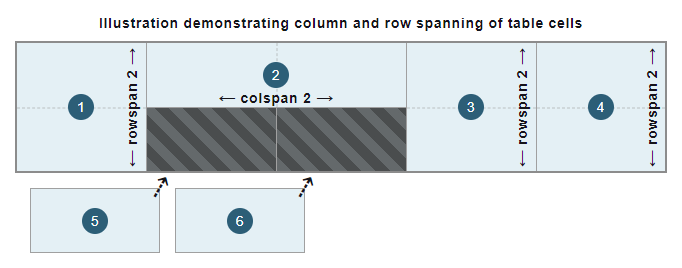

{{HTMLSidebar}}

The **`<td>`** [HTML](/en-US/docs/Web/HTML) element defines a cell of a table that contains data and may be used as a child of the {{HTMLElement("tr")}} element.

{{EmbedInteractiveExample("pages/tabbed/td.html","tabbed-taller")}}

## Attributes

This element includes the [global attributes](/en-US/docs/Web/HTML/Global_attributes).

- `colspan`
  - : Contains a non-negative integer value that indicates how many columns the data cell spans or extends. The default value is `1`. User agents dismiss values higher than 1000 as incorrect, setting to the default value (`1`).
- `headers`
  - : Contains a list of space-separated strings, each corresponding to the `id` attribute of the {{HTMLElement("th")}} elements that provide headings for this table cell.
- `rowspan`
  - : Contains a non-negative integer value that indicates for how many rows the data cell spans or extends. The default value is `1`; if its value is set to `0`, it extends until the end of the table grouping section ({{HTMLElement("thead")}}, {{HTMLElement("tbody")}}, {{HTMLElement("tfoot")}}, even if implicitly defined), that the cell belongs to. Values higher than `65534` are clipped to `65534`.

### Deprecated attributes

The following attributes are deprecated and should not be used. They are documented below for reference when updating existing code and for historical interest only.

- `abbr` {{deprecated_inline}}

  - : Contains a short abbreviated description of the data cell's content. Some user-agents, such as speech readers, may present this description before the content itself. Put the abbreviated content inside the cell and place the (longer) description in the [`title`](/en-US/docs/Web/HTML/Global_attributes/title) attribute, as this attribute is deprecated. Or, preferably, include the content within the data cell, and use CSS to [visually clip overflowing text](/en-US/docs/Web/CSS/text-overflow).

- `align` {{deprecated_inline}}

  - : Specifies the horizontal alignment of the data cell. The possible {{Glossary("enumerated")}} values are `left`, `center`, `right`, `justify`, and `char`. When supported, the `char` value aligns the textual content on the character defined in the [`char`](#char) attribute and the offset defined by the [`charoff`](#charoff) attribute. Use the {{cssxref("text-align")}} CSS property instead, as this attribute is deprecated.

- `axis` {{deprecated_inline}}

  - : Contains a list of space-separated strings, each corresponding to the `id` attribute of a group of cells that the data cell applies to.

- `bgcolor` {{deprecated_inline}}

  - : Defines the background color of the data cell. The value is an HTML color; either a [6-digit hexadecimal RGB code](/en-US/docs/Web/CSS/hex-color), prefixed by a `#`, or a [color keyword](/en-US/docs/Web/CSS/named-color). Other CSS {{cssxref("color_value", "&lt;color&gt")}} values are not supported. Use the {{cssxref("background-color")}} CSS property instead, as this attribute is deprecated.

- `char` {{deprecated_inline}}

  - : Does nothing. It was originally intended to specify the alignment of the content to a character of the data cell. Typical values for this include a period (`.`) when attempting to align numbers or monetary values. If [`align`](#align) is not set to `char`, this attribute is ignored.

- `charoff` {{deprecated_inline}}

  - : Does nothing. It was originally intended to specify the number of characters to offset the data cell content from the alignment character specified by the [`char`](#char) attribute.

- `height` {{deprecated_inline}}

  - : Defines a recommended data cell height. Use the {{cssxref("height")}} CSS property instead, as this attribute is deprecated.

- `scope` {{deprecated_inline}}

  - : Defines the cells that the header (defined in the {{HTMLElement("th")}}) element relates to. The possible {{Glossary("enumerated")}} values are `row`, `col`, `rowgroup`, and `colgroup`. Only use this attribute with the {{HTMLElement("th")}} element to define the row or column for which it is a header, as this attribute is deprecated for the `<td>` element.

- `valign` {{deprecated_inline}}

  - : Specifies the vertical alignment of the data cell. The possible {{Glossary("enumerated")}} values are `baseline`, `bottom`, `middle`, and `top`. Use the {{cssxref("vertical-align")}} CSS property instead, as this attribute is deprecated.

- `width` {{deprecated_inline}}

  - : Defines a recommended data cell width. Use the {{cssxref("width")}} CSS property instead, as this attribute is deprecated.

## Usage notes

- The `<td>` may only be used within a {{HTMLElement("tr")}} element.
- When using the [`colspan`](#colspan) and [`rowspan`](#rowspan) attributes to span data cells across multiple columns and rows, cells without these attributes defined (with a default value of `1`) are automatically fitted into free available spaces in the table structure that span 1x1 cells, as illustrated in the following figure:

  

  > [!NOTE]
  > These attributes must not be used to overlap cells.

## Examples

See {{HTMLElement("table")}} for a complete table example introducing common standards and best practices.

### Basic data cells

This example uses `<td>` elements along with other table-related elements to introduce a basic table with data about the phonetic alphabet.

#### HTML

Some table rows ({{HTMLElement("tr")}} elements) contain both header cells ({{HTMLElement("th")}} elements) and data cell `<td>` elements. The {{HTMLElement("th")}} element that is the first child of each row forms the first column of the table, with each `<th>` providing the row header for the data cells within that row. Each corresponding `<td>` element contains data aligned with its respective column header and row header cell.

> [!NOTE]
> Normally, a table head group with column headers would be implemented to make it easier to understand the information in the columns. The {{HTMLElement("thead")}} and {{HTMLElement("tbody")}} elements would be used to group such rows of headers and data into the respective table head and body sections. This is not implemented in this example to focus on the data cells and reduce the complexity of this example.

```html
<table>
  <tr>
    <th scope="row">A</th>
    <td>Alfa</td>
    <td>AL fah</td>
  </tr>
  <tr>
    <th scope="row">B</th>
    <td>Bravo</td>
    <td>BRAH voh</td>
  </tr>
  <tr>
    <th scope="row">C</th>
    <td>Charlie</td>
    <td>CHAR lee</td>
  </tr>
  <tr>
    <th scope="row">D</th>
    <td>Delta</td>
    <td>DELL tah</td>
  </tr>
</table>
```

#### CSS

Some basic CSS is used to style the table and its cells. CSS [attribute selectors](/en-US/docs/Web/CSS/Attribute_selectors) and the {{cssxref(":nth-of-type")}} pseudo-class are used to alternate the appearance of the cells to make the information in the table easier to understand and identify.

```css
td,
th {
  border: 1px solid rgb(160 160 160);
  padding: 8px 10px;
}

tr:nth-of-type(odd) td {
  background-color: #eee;
}

tr th[scope="row"] {
  background-color: #d6ecd4;
}
```

```css hidden
table {
  border-collapse: collapse;
  border: 2px solid rgb(140 140 140);
  font-family: sans-serif;
  font-size: 0.8rem;
  letter-spacing: 1px;
}
```

#### Result

{{EmbedLiveSample("Basic_data_cells", 650, 140)}}

### Column and row spanning

This example extends and enhances the basic table from the [previous example](#basic_data_cells) by adding an additional "ABC" cell.

#### HTML

An additional data cell (`<td>` element) is introduced within the first row ({{HTMLElement("tr")}} element). This creates a fourth column in the table.

Using the [`rowspan`](#rowspan) attribute, the "ABC" cell is spanned across the first three rows of the table. The last data cells of the subsequent rows each span two columns. This is done using the [`colspan`](#colspan) attribute, aligning them correctly within the table structure. Note that an additional row ({{HTMLElement("tr")}} element) is added to the table to illustrate this.

```html
<table>
  <tr>
    <th scope="row">A</th>
    <td>Alfa</td>
    <td>AL fah</td>
    <td rowspan="3">ABC</td>
  </tr>
  <tr>
    <th scope="row">B</th>
    <td>Bravo</td>
    <td>BRAH voh</td>
  </tr>
  <tr>
    <th scope="row">C</th>
    <td>Charlie</td>
    <td>CHAR lee</td>
  </tr>
  <tr>
    <th scope="row">D</th>
    <td>Delta</td>
    <td colspan="2">DELL tah</td>
  </tr>
  <tr>
    <th scope="row">E</th>
    <td>Echo</td>
    <td colspan="2">ECK oh</td>
  </tr>
</table>
```

#### CSS

The {{cssxref(":first-of-type")}} and {{cssxref(":last-of-type")}} pseudo-classes are used in the CSS to select and style the added "ABC" data cell.

```css
tr:first-of-type td:last-of-type {
  width: 60px;
  background-color: #505050;
  color: #fff;
  font-weight: bold;
  text-align: center;
}

td,
th {
  border: 1px solid rgb(160 160 160);
  padding: 8px 10px;
}

tr:nth-of-type(odd) td {
  background-color: #eee;
}

tr th[scope="row"] {
  background-color: #d6ecd4;
}
```

```css hidden
table {
  border-collapse: collapse;
  border: 2px solid rgb(140 140 140);
  font-family: sans-serif;
  font-size: 0.8rem;
  letter-spacing: 1px;
}
```

#### Result

{{EmbedLiveSample("Column_and_row_spanning", 650, 170)}}

### Associate data cells with header cells

For more complex relationships between data cells (`<td>` elements) and header cells ({{HTMLElement("th")}} elements), using {{HTMLElement("th")}} elements with the [`scope`](/en-US/docs/Web/HTML/Element/th#scope) attribute alone may not be sufficient for assistive technologies, especially screen readers.

#### HTML

To improve the {{Glossary("accessibility", "accessibility")}} of the [previous example](#column_and_row_spanning) and to allow screen readers, for example, to speak the headers associated with each data cell, the [`headers`](#headers) attribute can be introduced along with [`id`](/en-US/docs/Web/HTML/Global_attributes/id) attributes. Each row header cell ({{HTMLElement("th")}} element) associated with the "ABC" data cell, i.e., the letters "A", "B", and "C", is given a unique identifier with the [`id`](/en-US/docs/Web/HTML/Global_attributes/id) attribute. The "ABC" data cell (`<td>` element) then uses these `id` values in a space-separated list for the [`headers`](#headers) attribute.

> [!NOTE]
> It's recommended to use more descriptive and useful values for the [`id`](/en-US/docs/Web/HTML/Global_attributes/id) attribute. Each `id` in a document must be unique to that document. In this example, the `id` values are single characters to maintain focus on the concept of the [`headers`](#headers) attribute.

```html
<table>
  <tr>
    <th id="a" scope="row">A</th>
    <td>Alfa</td>
    <td>AL fah</td>
    <td headers="a b c" rowspan="3">ABC</td>
  </tr>
  <tr>
    <th id="b" scope="row">B</th>
    <td>Bravo</td>
    <td>BRAH voh</td>
  </tr>
  <tr>
    <th id="c" scope="row">C</th>
    <td>Charlie</td>
    <td>CHAR lee</td>
  </tr>
  <tr>
    <th scope="row">D</th>
    <td>Delta</td>
    <td colspan="2">DELL tah</td>
  </tr>
  <tr>
    <th scope="row">E</th>
    <td>Echo</td>
    <td colspan="2">ECK oh</td>
  </tr>
</table>
```

#### Result

While the [visual result](#result_2) is unchanged from the [previous example table](#column_and_row_spanning), each data cell (`<td>`) is now explicitly associated with its row header cell (`<th>`).

## Technical summary

<table class="properties">
  <tbody>
    <tr>
      <th scope="row">
        <a href="/en-US/docs/Web/HTML/Content_categories"
          >Content categories</a
        >
      </th>
      <td>Sectioning root.</td>
    </tr>
    <tr>
      <th scope="row">Permitted content</th>
      <td>
        <a href="/en-US/docs/Web/HTML/Content_categories#flow_content"
          >Flow content</a
        >.
      </td>
    </tr>
    <tr>
      <th scope="row">Tag omission</th>
      <td>
        The start tag is mandatory.<br />The end tag may be omitted, if it is
        immediately followed by a {{HTMLElement("th")}} or
        <code>&lt;td&gt;</code> element or if there are no more data in its
        parent element.
      </td>
    </tr>
    <tr>
      <th scope="row">Permitted parents</th>
      <td>A {{HTMLElement("tr")}} element.</td>
    </tr>
    <tr>
      <th scope="row">Implicit ARIA role</th>
      <td>
        <code
          ><a href="/en-US/docs/Web/Accessibility/ARIA/Roles/cell_role"
            >cell</a
          ></code
        >
        if a descendant of a {{HTMLElement("table")}} element, or <code
          ><a href="/en-US/docs/Web/Accessibility/ARIA/Roles/gridcell_role"
            >gridcell</a
          ></code
        >
        if a descendant of an element with <code
          ><a href="/en-US/docs/Web/Accessibility/ARIA/Roles/grid_role"
            >grid</a
          ></code
        > role
      </td>
    </tr>
    <tr>
      <th scope="row">Permitted ARIA roles</th>
      <td>Any</td>
    </tr>
    <tr>
      <th scope="row">DOM interface</th>
      <td>{{domxref("HTMLTableCellElement")}}</td>
    </tr>
  </tbody>
</table>

## Specifications

{{Specifications}}

## Browser compatibility

{{Compat}}

## See also

- [Learn: HTML table basics](/en-US/docs/Learn_web_development/Core/Structuring_content/HTML_table_basics)
- {{HTMLElement("caption")}}, {{HTMLElement("col")}}, {{HTMLElement("colgroup")}}, {{HTMLElement("table")}}, {{HTMLElement("tbody")}}, {{HTMLElement("tfoot")}}, {{HTMLElement("th")}}, {{HTMLElement("thead")}}, {{HTMLElement("tr")}}: Other table-related elements
- {{cssxref("background-color")}}: CSS property to set the background color of each data cell
- {{cssxref("border")}}: CSS property to control borders of data cells
- {{cssxref("height")}}: CSS property to control the recommended data cell height
- {{cssxref("text-align")}}: CSS property to horizontally align each data cell content
- {{cssxref("vertical-align")}}: CSS property to vertically align each data cell content
- {{cssxref("width")}}: CSS property to control the recommended data cell width
- {{cssxref(":nth-of-type")}}, {{cssxref(":first-of-type")}}, {{cssxref(":last-of-type")}}: CSS pseudo-classes to select the desired data cells
