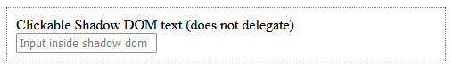

{{HTMLSidebar}}

The **`<template>`** [HTML](/en-US/docs/Web/HTML) element serves as a mechanism for holding {{Glossary("HTML")}} fragments, which can either be used later via JavaScript or generated immediately into shadow DOM.

## Attributes

This element includes the [global attributes](/en-US/docs/Web/HTML/Global_attributes).

- `shadowrootmode`

  - : Creates a [shadow root](/en-US/docs/Glossary/Shadow_tree) for the parent element.
    It is a declarative version of the {{domxref("Element.attachShadow()")}} method and accepts the same {{glossary("enumerated")}} values.

    - `open`

      - : Exposes the internal shadow root DOM for JavaScript (recommended for most use cases).

    - `closed`

      - : Hides the internal shadow root DOM from JavaScript.

    > [!NOTE]
    > The HTML parser creates a {{domxref("ShadowRoot")}} object in the DOM for the first `<template>` in a node with this attribute set to an allowed value.
    > If the attribute is not set, or not set to an allowed value — or if a `ShadowRoot` has already been declaratively created in the same parent — then an {{domxref("HTMLTemplateElement")}} is constructed.
    > A {{domxref("HTMLTemplateElement")}} cannot subsequently be changed into a shadow root after parsing, for example, by setting {{domxref("HTMLTemplateElement.shadowRootMode")}}.

    > [!NOTE]
    > You may find the non-standard `shadowroot` attribute in older tutorials and examples that used to be supported in Chrome 90-110. This attribute has since been removed and replaced by the standard `shadowrootmode` attribute.

- `shadowrootclonable`

  - : Sets the value of the [`clonable`](/en-US/docs/Web/API/ShadowRoot/clonable) property of a [`ShadowRoot`](/en-US/docs/Web/API/ShadowRoot) created using this element to `true`.
    If set, a clone of the shadow host (the parent element of this `<template>`) created with {{domxref("Node.cloneNode()")}} or {{domxref("Document.importNode()")}} will include a shadow root in the copy.

- `shadowrootdelegatesfocus`

  - : Sets the value of the [`delegatesFocus`](/en-US/docs/Web/API/ShadowRoot/delegatesFocus) property of a [`ShadowRoot`](/en-US/docs/Web/API/ShadowRoot) created using this element to `true`.
    If this is set and a non-focusable element in the shadow tree is selected, then focus is delegated to the first focusable element in the tree.
    The value defaults to `false`.

- `shadowrootserializable` {{experimental_inline}}

  - : Sets the value of the [`serializable`](/en-US/docs/Web/API/ShadowRoot/serializable) property of a [`ShadowRoot`](/en-US/docs/Web/API/ShadowRoot) created using this element to `true`.
    If set, the shadow root may be serialized by calling the {{DOMxRef('Element.getHTML()')}} or {{DOMxRef('ShadowRoot.getHTML()')}} methods with the `options.serializableShadowRoots` parameter set `true`.
    The value defaults to `false`.

## Usage notes

There are two main ways to use the `<template>` element.

### Template document fragment

By default, the element's content is not rendered.
The corresponding {{domxref("HTMLTemplateElement")}} interface includes a standard {{domxref("HTMLTemplateElement.content", "content")}} property (without an equivalent content/markup attribute). This `content` property is read-only and holds a {{domxref("DocumentFragment")}} that contains the DOM subtree represented by the template.
This fragment can be cloned via the {{domxref("Node.cloneNode", "cloneNode")}} method and inserted into the DOM.

Be careful when using the `content` property because the returned `DocumentFragment` can exhibit unexpected behavior.
For more details, see the [Avoiding DocumentFragment pitfalls](#avoiding_documentfragment_pitfalls) section below.

### Declarative Shadow DOM

If the `<template>` element contains the [`shadowrootmode`](#shadowrootmode) attribute with a value of either `open` or `closed`, the HTML parser will immediately generate a shadow DOM. The element is replaced in the DOM by its content wrapped in a {{domxref("ShadowRoot")}}, which is attached to the parent element.
This is the declarative equivalent of calling {{domxref("Element.attachShadow()")}} to attach a shadow root to an element.

If the element has any other value for `shadowrootmode`, or does not have the `shadowrootmode` attribute, the parser generates a {{domxref("HTMLTemplateElement")}}.
Similarly, if there are multiple declarative shadow roots, only the first one is replaced by a {{domxref("ShadowRoot")}} — subsequent instances are parsed as {{domxref("HTMLTemplateElement")}} objects.

## Examples

### Generating table rows

First we start with the HTML portion of the example.

```html
<table id="producttable">
  <thead>
    <tr>
      <td>UPC_Code</td>
      <td>Product_Name</td>
    </tr>
  </thead>
  <tbody>
    <!-- existing data could optionally be included here -->
  </tbody>
</table>

<template id="productrow">
  <tr>
    <td class="record"></td>
    <td></td>
  </tr>
</template>
```

First, we have a table into which we will later insert content using JavaScript code. Then comes the template, which describes the structure of an HTML fragment representing a single table row.

Now that the table has been created and the template defined, we use JavaScript to insert rows into the table, with each row being constructed using the template as its basis.

```js
// Test to see if the browser supports the HTML template element by checking
// for the presence of the template element's content attribute.
if ("content" in document.createElement("template")) {
  // Instantiate the table with the existing HTML tbody
  // and the row with the template
  const tbody = document.querySelector("tbody");
  const template = document.querySelector("#productrow");

  // Clone the new row and insert it into the table
  const clone = template.content.cloneNode(true);
  let td = clone.querySelectorAll("td");
  td[0].textContent = "1235646565";
  td[1].textContent = "Stuff";

  tbody.appendChild(clone);

  // Clone the new row and insert it into the table
  const clone2 = template.content.cloneNode(true);
  td = clone2.querySelectorAll("td");
  td[0].textContent = "0384928528";
  td[1].textContent = "Acme Kidney Beans 2";

  tbody.appendChild(clone2);
} else {
  // Find another way to add the rows to the table because
  // the HTML template element is not supported.
}
```

The result is the original HTML table, with two new rows appended to it via JavaScript:

```css hidden
table {
  background: #000;
}
table td {
  background: #fff;
}
```

{{EmbedLiveSample("Generating table rows", 500, 120)}}

### Implementing a declarative shadow DOM

In this example, a hidden support warning is included at the beginning of the markup. This warning is later set to be displayed via JavaScript if the browser doesn't support the `shadowrootmode` attribute. Next, there are two {{HTMLElement("article")}} elements, each containing nested {{HTMLElement("style")}} elements with different behaviors. The first `<style>` element is global to the whole document. The second one is scoped to the shadow root generated in place of the `<template>` element because of the presence of the `shadowrootmode` attribute.

```html
<p hidden>
  ⛔ Your browser doesn't support <code>shadowrootmode</code> attribute yet.
</p>
<article>
  <style>
    p {
      padding: 8px;
      background-color: wheat;
    }
  </style>
  <p>I'm in the DOM.</p>
</article>
<article>
  <template shadowrootmode="open">
    <style>
      p {
        padding: 8px;
        background-color: plum;
      }
    </style>
    <p>I'm in the shadow DOM.</p>
  </template>
</article>
```

```js
const isShadowRootModeSupported =
  HTMLTemplateElement.prototype.hasOwnProperty("shadowRootMode");

document
  .querySelector("p[hidden]")
  .toggleAttribute("hidden", isShadowRootModeSupported);
```

{{EmbedGHLiveSample("dom-examples/shadow-dom/shadowrootmode/scoping.html", "", "120")}}

### Declarative Shadow DOM with delegated focus

This example demonstrates how `shadowrootdelegatesfocus` is applied to a shadow root that is created declaratively, and the effect this has on focus.

The code first declares a shadow root inside a `<div>` element, using the `<template>` element with the `shadowrootmode` attribute.
This displays both a non-focusable `<div>` containing text and a focusable `<input>` element.
It also uses CSS to style elements with [`:focus`](/en-US/docs/Web/CSS/:focus) to blue, and to set the normal styling of the host element.

```html
<div>
  <template shadowrootmode="open">
    <style>
      :host {
        display: block;
        border: 1px dotted black;
        padding: 10px;
        margin: 10px;
      }
      :focus {
        outline: 2px solid blue;
      }
    </style>
    <div>Clickable Shadow DOM text</div>
    <input type="text" placeholder="Input inside Shadow DOM" />
  </template>
</div>
```

The second code block is identical except that it sets the `shadowrootdelegatesfocus` attribute, which delegates focus to the first focusable element in the tree if a non-focusable element in the tree is selected.

```html
<div>
  <template shadowrootmode="open" shadowrootdelegatesfocus>
    <style>
      :host {
        display: block;
        border: 1px dotted black;
        padding: 10px;
        margin: 10px;
      }
      :focus {
        outline: 2px solid blue;
      }
    </style>
    <div>Clickable Shadow DOM text</div>
    <input type="text" placeholder="Input inside Shadow DOM" />
  </template>
</div>
```

Last of all we use the following CSS to apply a green-yellow border to the parent `<div>` element when it has focus.

```css
div:focus {
  border: 2px solid red;
}
```

The results are shown below.
When the HTML is first rendered, the elements have no styling, as shown in the first image.
For the shadow root that does not have `shadowrootdelegatesfocus` set you can click anywhere except the `<input>` and the focus does not change (if you select the `<input>` element it will look like the second image).



For the shadow root with `shadowrootdelegatesfocus` set, clicking on the text (which is non-focusable) selects the `<input>` element, as this is the first focusable element in the tree.
This also focuses the parent element as shown below.


## Avoiding DocumentFragment pitfalls

When a {{domxref("DocumentFragment")}} value is passed, {{domxref("Node.appendChild")}} and similar methods move only the _child nodes_ of that value into the target node. Therefore, it is usually preferable to attach event handlers to the children of a `DocumentFragment`, rather than to the `DocumentFragment` itself.

Consider the following HTML and JavaScript:

### HTML

```html
<div id="container"></div>

<template id="template">
  <div>Click me</div>
</template>
```

### JavaScript

```js
const container = document.getElementById("container");
const template = document.getElementById("template");

function clickHandler(event) {
  event.target.append(" — Clicked this div");
}

const firstClone = template.content.cloneNode(true);
firstClone.addEventListener("click", clickHandler);
container.appendChild(firstClone);

const secondClone = template.content.cloneNode(true);
secondClone.children[0].addEventListener("click", clickHandler);
container.appendChild(secondClone);
```

### Result

Since `firstClone` is a `DocumentFragment`, only its children are added to `container` when `appendChild` is called; the event handlers of `firstClone` are not copied. In contrast, because an event handler is added to the first _child node_ of `secondClone`, the event handler is copied when `appendChild` is called, and clicking on it works as one would expect.

{{EmbedLiveSample('Avoiding_DocumentFragment_pitfall')}}

## Technical summary

<table class="properties">
  <tbody>
    <tr>
      <th scope="row">
        <a href="/en-US/docs/Web/HTML/Content_categories"
          >Content categories</a
        >
      </th>
      <td>
        <a href="/en-US/docs/Web/HTML/Content_categories#metadata_content"
          >Metadata content</a
        >,
        <a href="/en-US/docs/Web/HTML/Content_categories#flow_content"
          >flow content</a
        >,
        <a href="/en-US/docs/Web/HTML/Content_categories#phrasing_content"
          >phrasing content</a
        >,
        <a
          href="/en-US/docs/Web/HTML/Content_categories#script-supporting_elements"
          >script-supporting element</a
        >
      </td>
    </tr>
    <tr>
      <th scope="row">Permitted content</th>
      <td>No restrictions</td>
    </tr>
    <tr>
      <th scope="row">Tag omission</th>
      <td>None, both the starting and ending tag are mandatory.</td>
    </tr>
    <tr>
      <th scope="row">Permitted parents</th>
      <td>
        Any element that accepts
        <a href="/en-US/docs/Web/HTML/Content_categories#metadata_content"
          >metadata content</a
        >,
        <a href="/en-US/docs/Web/HTML/Content_categories#phrasing_content"
          >phrasing content</a
        >, or
        <a
          href="/en-US/docs/Web/HTML/Content_categories#script-supporting_elements"
          >script-supporting elements</a
        >. Also allowed as a child of a {{HTMLElement("colgroup")}}
        element that does <em>not</em> have a
        <a href="/en-US/docs/Web/HTML/Element/colgroup#span"><code>span</code></a> attribute.
      </td>
    </tr>
    <tr>
      <th scope="row">Implicit ARIA role</th>
      <td>
        <a href="https://www.w3.org/TR/html-aria/#dfn-no-corresponding-role"
          >No corresponding role</a
        >
      </td>
    </tr>
    <tr>
      <th scope="row">Permitted ARIA roles</th>
      <td>No <code>role</code> permitted</td>
    </tr>
    <tr>
      <th scope="row">DOM interface</th>
      <td>{{domxref("HTMLTemplateElement")}}</td>
    </tr>
  </tbody>
</table>

## Specifications

{{Specifications}}

## Browser compatibility

{{Compat}}

## See also

- [`part`](/en-US/docs/Web/HTML/Global_attributes/part) and [`exportparts`](/en-US/docs/Web/HTML/Global_attributes/exportparts) HTML attributes
- {{HTMLElement("slot")}} HTML element
- {{CSSXref(":has-slotted")}}, {{CSSXref(":host")}}, {{CSSXref(":host_function", ":host()")}}, and {{CSSXref(":host-context", ":host-context()")}} CSS pseudo-classes
- {{CSSXref("::part")}} and {{CSSXref("::slotted")}} CSS pseudo-elements
- [`ShadowRoot`](/en-US/docs/Web/API/ShadowRoot) interface
- [Using templates and slots](/en-US/docs/Web/API/Web_components/Using_templates_and_slots)
- [CSS scoping](/en-US/docs/Web/CSS/CSS_scoping) module
- [Declarative Shadow DOM (with html)](/en-US/docs/Web/API/Web_components/Using_shadow_DOM#declaratively_with_html) in _Using Shadow DOM_
- [Declarative shadow DOM](https://web.dev/articles/declarative-shadow-dom) on web.dev (2023)
