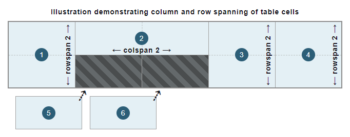

{{HTMLSidebar}}

The **`<thead>`** [HTML](/en-US/docs/Web/HTML) element encapsulates a set of table rows ({{HTMLElement("tr")}} elements), indicating that they comprise the head of a table with information about the table's columns. This is usually in the form of column headers ({{HTMLElement("th")}} elements).

{{EmbedInteractiveExample("pages/tabbed/thead.html","tabbed-taller")}}

## Attributes

This element includes the [global attributes](/en-US/docs/Web/HTML/Global_attributes).

### Deprecated attributes

The following attributes are deprecated and should not be used. They are documented below for reference when updating existing code and for historical interest only.

- `align` {{deprecated_inline}}

  - : This {{Glossary("enumerated", "enumerated")}} attribute specifies how horizontal alignment of each head cell content will be handled. Possible values are:

    - `left`, aligning the content to the left of the cell;
    - `center`, centering the content in the cell;
    - `right`, aligning the content to the right of the cell;
    - `justify`, inserting spaces into the textual content so that the content is justified in the cell;
    - `char`, aligning the textual content on a special character with a minimal offset, defined by the [`char`](#char) and [`charoff`](#charoff) attributes.

    If this attribute is not set, the `left` value is assumed.

    > **Note:** Do not use this attribute as it is deprecated (and not supported) in the latest standard: use the CSS {{cssxref("text-align")}} property instead.

- `bgcolor` {{deprecated_inline}}

  - : This attribute defines the background color of each head cell. It is a [6-digit hexadecimal RGB code](/en-US/docs/Web/CSS/hex-color), prefixed by a '`#`'. One of the predefined [color keywords](/en-US/docs/Web/CSS/named-color) can also be used.

    > **Note:** Do not use this attribute as it is deprecated (and not supported) in the latest standard: use the CSS {{cssxref("background-color")}} property instead.

- `char` {{deprecated_inline}}

  - : This attribute specifies the alignment of the content to a character in head cells. Typical values for this include a period (`.`) when attempting to align numbers or monetary values. If [`align`](#align) is not set to `char`, this attribute is ignored.

    > **Note:** Do not use this attribute as it is deprecated (and not supported) in the latest standard: use the CSS {{cssxref("text-align")}} property instead.

- `charoff` {{deprecated_inline}}

  - : This attribute is used to indicate the number of characters to offset the column data from the alignment character specified by the [`char`](#char) attribute.

    > **Note:** Do not use this attribute as it is deprecated (and not supported) in the latest standard.

- `valign` {{deprecated_inline}}

  - : This attribute specifies how vertical alignment of each head cell content will be handled. Possible values are:

    - `baseline`, which will put the text as close to the bottom of the cell as it is possible, but align it on the {{Glossary("baseline/typography", "baseline")}} of the characters instead of the bottom of them. If characters are all of the size, this has the same effect as `bottom`.
    - `bottom`, which will put the text as close to the bottom of the cell as it is possible;
    - `middle`, which will center the text in the cell;
    - `top`, which will put the text as close to the top of the cell as it is possible.

    > **Note:** Do not use this attribute as it is deprecated (and not supported) in the latest standard: use the CSS {{cssxref("vertical-align")}} property instead.

## Usage notes

- The `<thead>` is placed after any {{HTMLElement("caption")}} and {{HTMLElement("colgroup")}} elements, but before any {{HTMLElement("tbody")}}, {{HTMLElement("tfoot")}}, and {{HTMLElement("tr")}} elements.
- Along with its related {{HTMLElement("tbody")}} and {{HTMLElement("tfoot")}} elements, the `<thead>` element provides useful {{Glossary("semantics", "semantic")}} information and can be used when rendering for either screen or print. Specifying such table content groups also provides valuable contextual information for assistive technologies, including screen readers and search engines.
- When printing a document, in the case of a multipage table, the table head usually specifies information that remains the same on each page.

## Examples

See {{HTMLElement("table")}} for a complete table example introducing common standards and best practices.

### Basic head structure

This example uses a `<thead>` and {{HTMLElement("tbody")}} element to structure a basic table into {{Glossary("semantics", "semantic")}} sections. The `<thead>` element represents the head section of the table, which contains a row ({{HTMLElement("tr")}} element) of column headers using {{HTMLElement("th")}} elements.

Some basic CSS is used to style and highlight the table head so that the headings of the columns stand out from the data in the table body.

```html
<table>
  <thead>
    <tr>
      <th>Student ID</th>
      <th>Name</th>
      <th>Major</th>
      <th>Credits</th>
    </tr>
  </thead>
  <tbody>
    <tr>
      <td>3741255</td>
      <td>Jones, Martha</td>
      <td>Computer Science</td>
      <td>240</td>
    </tr>
    <tr>
      <td>3971244</td>
      <td>Nim, Victor</td>
      <td>Russian Literature</td>
      <td>220</td>
    </tr>
    <tr>
      <td>4100332</td>
      <td>Petrov, Alexandra</td>
      <td>Astrophysics</td>
      <td>260</td>
    </tr>
  </tbody>
</table>
```

```css
thead {
  border-bottom: 2px solid rgb(160, 160, 160);
  background-color: #2c5e77;
  color: #fff;
}
```

```css hidden
table {
  border-collapse: collapse;
  border: 2px solid rgb(140, 140, 140);
  font-family: sans-serif;
  font-size: 0.8rem;
  letter-spacing: 1px;
}

tbody {
  background-color: #e4f0f5;
}

th,
td {
  border: 1px solid rgb(160, 160, 160);
  padding: 8px 10px;
}

tbody > tr > td:last-of-type {
  text-align: center;
}
```

#### Result

{{EmbedLiveSample("Basic_head_structure", 650, 140)}}

### Multiple head rows

To markup the table from the [basic example](#basic_head_structure) in a more advanced way, this example uses two table rows ({{HTMLElement("tr")}} elements) within the `<thead>` element to introduce a multi-row table head. An additional column is created to split the student names into first and last names.

The CSS is unchanged from the [previous example](#basic_head_structure).

In order to allocate the header cells to the correct columns and rows, the [`colspan`](/en-US/docs/Web/HTML/Element/th#colspan) and [`rowspan`](/en-US/docs/Web/HTML/Element/th#rowspan) attributes are used on the {{HTMLElement("th")}} elements. The values set in these attributes specify how many cells each header cell ({{HTMLElement("th")}} element) is to span. Due to the way these attributes are set in the following example, the two header cells in the second row are automatically placed in the correct location—fitting into the available areas in the table structure, with the default value being `1` for the [`colspan`](/en-US/docs/Web/HTML/Element/th#colspan) and [`rowspan`](/en-US/docs/Web/HTML/Element/th#rowspan) attributes. This is illustrated in the following figure, which corresponds to the example below:



```html
<table>
  <thead>
    <tr>
      <th rowspan="2">Student ID</th>
      <th colspan="2">Student</th>
      <th rowspan="2">Major</th>
      <th rowspan="2">Credits</th>
    </tr>
    <tr>
      <th>First name</th>
      <th>Last name</th>
    </tr>
  </thead>
  <tbody>
    <tr>
      <td>3741255</td>
      <td>Martha</td>
      <td>Jones</td>
      <td>Computer Science</td>
      <td>240</td>
    </tr>
    <tr>
      <td>3971244</td>
      <td>Victor</td>
      <td>Nim</td>
      <td>Russian Literature</td>
      <td>220</td>
    </tr>
    <tr>
      <td>4100332</td>
      <td>Alexandra</td>
      <td>Petrov</td>
      <td>Astrophysics</td>
      <td>260</td>
    </tr>
  </tbody>
</table>
```

```css hidden
thead {
  border-bottom: 2px solid rgb(160, 160, 160);
  background-color: #2c5e77;
  color: #fff;
}

table {
  border-collapse: collapse;
  border: 2px solid rgb(140, 140, 140);
  font-family: sans-serif;
  font-size: 0.8rem;
  letter-spacing: 1px;
}

tbody {
  background-color: #e4f0f5;
}

th,
td {
  border: 1px solid rgb(160, 160, 160);
  padding: 8px 10px;
}

tbody > tr > td:last-of-type {
  text-align: center;
}
```

#### Result

{{EmbedLiveSample("Multiple_head_rows", 650, 180)}}

## Technical summary

<table class="properties">
  <tbody>
    <tr>
      <th scope="row">
        <a href="/en-US/docs/Web/HTML/Content_categories"
          >Content categories</a
        >
      </th>
      <td>None.</td>
    </tr>
    <tr>
      <th scope="row">Permitted content</th>
      <td>Zero or more {{HTMLElement("tr")}} elements.</td>
    </tr>
    <tr>
      <th scope="row">Tag omission</th>
      <td>
        The start tag is mandatory. The end tag may be omitted if the
        {{HTMLElement("thead")}} element is immediately followed by a
        {{HTMLElement("tbody")}} or {{HTMLElement("tfoot")}}
        element.
      </td>
    </tr>
    <tr>
      <th scope="row">Permitted parents</th>
      <td>
        A {{HTMLElement("table")}} element. The
        {{HTMLElement("thead")}} must appear after any
        {{HTMLElement("caption")}} and
        {{HTMLElement("colgroup")}} elements, even implicitly defined,
        but before any {{HTMLElement("tbody")}},
        {{HTMLElement("tfoot")}}, and {{HTMLElement("tr")}}
        elements.
      </td>
    </tr>
    <tr>
      <th scope="row">Implicit ARIA role</th>
      <td>
        <code
          ><a href="/en-US/docs/Web/Accessibility/ARIA/Roles/Rowgroup_Role"
            >rowgroup</a
          ></code
        >
      </td>
    </tr>
    <tr>
      <th scope="row">Permitted ARIA roles</th>
      <td>Any</td>
    </tr>
    <tr>
      <th scope="row">DOM interface</th>
      <td>{{domxref("HTMLTableSectionElement")}}</td>
    </tr>
  </tbody>
</table>

## Specifications

{{Specifications}}

## Browser compatibility

{{Compat}}

## See also

- [HTML tables tutorial](/en-US/docs/Learn/HTML/Tables)
- Other table-related HTML Elements: {{HTMLElement("caption")}}, {{HTMLElement("col")}}, {{HTMLElement("colgroup")}}, {{HTMLElement("table")}}, {{HTMLElement("tbody")}}, {{HTMLElement("td")}}, {{HTMLElement("tfoot")}}, {{HTMLElement("th")}}, {{HTMLElement("tr")}};
- CSS properties that may be specially useful to style the `<thead>` element:

  - the {{cssxref("background-color")}} property to set the background color of each head cell;
  - the {{cssxref("border")}} property to control borders of head cells;
  - the {{cssxref("text-align")}} property to horizontally align each head cell content;
  - the {{cssxref("vertical-align")}} property to vertically align each head cell content.
