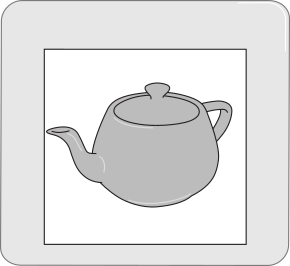
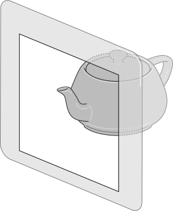
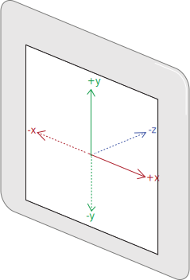
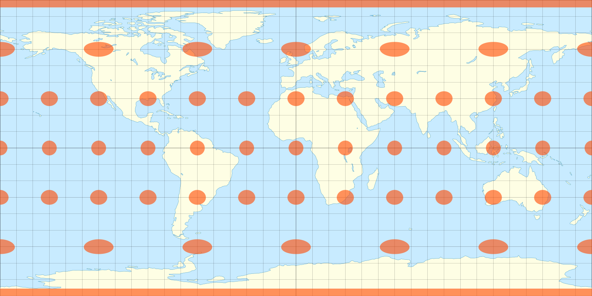
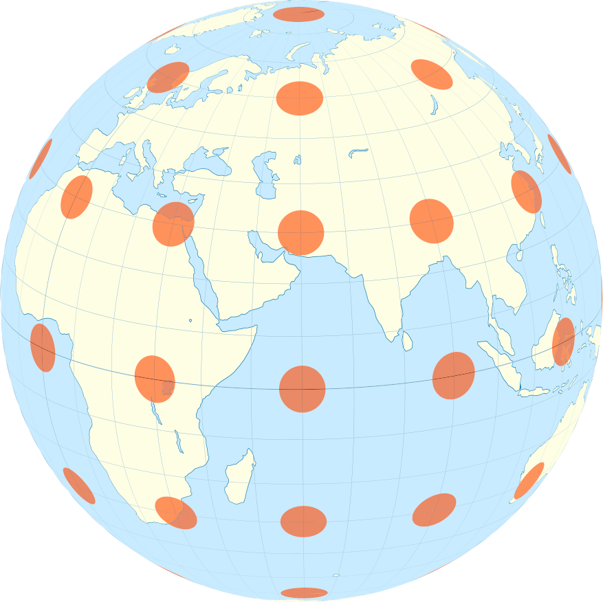
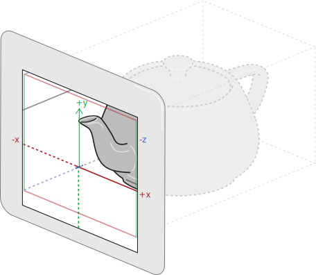

{{HTMLSidebar}}

The **`<model>`** [HTML](/en-US/docs/Web/HTML) element represents a three-dimensional (3D) model inline on a web page. On view tracked platforms such as head-mounted devices, this may be presented inside a portal _within_ the page.

<table> <tr> <td>


A model on an untracked, monoscopic platform: the model appears _on_ the page.

</td><td>


A model on a tracked / stereo platform: the model appears _inside_ the page.

</td></tr></table>

Because a model resource can contain an animation, both the declarative element and the JavaScript API can control aspects of its animated behavior.

It provides a private, declarative method to display three-dimensional model information as an alternative to (and complement for) the JavaScript-based [WebXR API](/en-US/docs/Web/API/WebXR_Device_API).

## Coordinate space

A valid model resource will contain three-dimensional data. The coordinate space is interpreted as a right-handed, Y-up [coordinate system](https://en.wikipedia.org/wiki/Cartesian_coordinate_system). That is by default, the model will be displayed with the following alignment:

- Y will be displayed as the _vertical_ dimension, with positive-Y directed _upward_,
- X will be displayed as the _horizontal_ dimension, with positive-X directed _right_,
- Z will be displayed as the _depth_ dimension, with _negative_-Z directed _inward_.

> [!NOTE]
> For safety and security reasons, rendering of content is only permitted inside the portal within the page, and content that protrudes in the +Z dimension beyond the front plane of the page will be clipped.


The coordinate space in a model context

## Attributes

This element includes the [global attributes](/en-US/docs/Web/HTML/Reference/Global_attributes).

- [`environmentmap`](/en-US/docs/Web/API/HTMLModelElement/environmentMap#usage_notes)

  - : Defines the URL for the environment map to use to illuminate the model. This resource is assumed to be in an [equirectangular](https://en.wikipedia.org/wiki/Equirectangular_projection) projection. A valid environment map may be supplied in any valid image format, but it is recommended to supply a resource capable of presenting raw luminance values, such as [OpenEXR `.exr`](https://en.wikipedia.org/wiki/OpenEXR) format, or [RGBE `.hdr`](https://en.wikipedia.org/wiki/RGBE_image_format) format.

<table> <tr> <td>


An equirectangular projection of Earth

</td><td>


The projection of the equirectangular back to a sphere

</td></tr></table>

> [!NOTE]
> While environment map resources are provided as images, an appropriate resource should contain a very high dynamic range of luminance values, and may not be appropriate to display directly.

- [`autoplay`](/en-US/docs/Web/API/HTMLModelElement/autoplay#usage_notes)

  - : A Boolean attribute; if specified, the model automatically begins to play back as soon as the model file has been loaded and parsed.

- [`loop`](/en-US/docs/Web/API/HTMLModelElement/loop#usage_notes)

  - : A Boolean attribute; if specified, the browser will automatically seek back to the start upon reaching the end of the model's animation and continue playback.

- [`stagemode`](/en-US/docs/Web/API/HTMLModelElement/stageMode#usage_notes)

  - : An enumerated attribute indicating which mode, if any, the User Agent should respond to pointer events with by default. It can have the following values:
    - `none`, which indicates that the User Agent should take no action,
    - `orbit`, which indicates that the User Agent should provide the orbit mode interaction. see [stageMode:orbit mode](/en-US/docs/Web/API/HTMLModelElement/stageMode#orbit_mode) for more in-depth discussion.

- `src`

  - : The model {{glossary("URL")}} to be fetched. Multiple model file candidates may also be provided through one or more [source](/en-US/docs/Web/HTML/Reference/Elements/source) elements for alternate resources, such as the [GLTF](https://www.khronos.org/gltf/) or [USDZ](https://openusd.org/release/spec_usdz.html) formats.

- `height`

  - : The intrinsic height of the model's viewport, in pixels. Must be an integer without a unit.

- `width`

  - : The intrinsic width of the model's viewport, in pixels. Must be an integer without a unit.

## Usage notes

- While it provides benefits for all devices and User Agents, the `<model>` element has particular value on platforms with stereoscopic and/or head-tracking capabilities, such as Head-Mounted Displays (HMDs). It can be used as declarative alternative to the WebXR API to provide spatial content.

### Object fit

By default, the model content is initially set to an "object fit". That is, the scale is set such that the model's `entityTransform` is:

- centered horizontally on its [`boundingBoxCenter.x`](/en-US/docs/Web/API/HTMLModelElement/boundingBoxCenter),
- centered vertically on its [`boundingBoxCenter.y`](/en-US/docs/Web/API/HTMLModelElement/boundingBoxCenter),
- scaled uniformly to accommodate its [`boundingBoxExtents.x`](/en-US/docs/Web/API/HTMLModelElement/boundingBoxExtents) inside the viewport's `width`, and
- scaled uniformly to accommodate its [`boundingBoxExtents.y`](/en-US/docs/Web/API/HTMLModelElement/boundingBoxExtents) inside the viewport's `height`, and
- set back to fully display the model's [`boundingBoxExtents.z`](/en-US/docs/Web/API/HTMLModelElement/boundingBoxExtents) within its portal.

This will result in the model being centered inside the viewport and scaled to fit within it:


A model file scaled to the bounds of the viewport specified

### Natural scale

While model elements are governed by "object fit" and ["orbit fit"](/en-US/docs/Web/API/HTMLModelElement/stageMode#orbit_mode) transformations by default, model resources have implicit real-world dimensions. For example, A model with its `entityTransform` set to the [identity matrix](https://en.wikipedia.org/wiki/Identity_matrix) _I<sub>4</sub>_ with a 10cm teapot will be displayed as occupying 10cm, or approximately 378 CSS pixels in the window.

> [!NOTE]
> The CSS-equivalent scale for model contents is unlikely to equate to real-world dimensions on any device. See discussion of [CSS units and values](/en-US/docs/Learn_web_development/Core/Styling_basics/Values_and_units) for more details.

## Examples

In this example, a `<model>` element is used to portray a teapot.

```html live-sample___basic-model
<model alt="a model of a teapot">
  <source src="./teapot.usdz" type="model/vnd.usdz+zip" />
  <source src="./teapot.glb" type="model/gltf+binary" />
  
</model>
```

{{EmbedLiveSample('basic-model')}}

The semantics of the `model` element is that of declaratively portraying a single, three-dimensional object.

## Technical summary

<table class="properties">
  <tbody>
    <tr>
      <th scope="row">
        <a href="/en-US/docs/Web/HTML/Guides/Content_categories"
          >Content categories</a
        >
      </th>
      <td>
        <a href="/en-US/docs/Web/HTML/Guides/Content_categories#flow_content"
          >Flow content</a
        >,
        <a href="/en-US/docs/Web/HTML/Guides/Content_categories#phrasing_content"
          >phrasing content</a
        >,
        <a href="/en-US/docs/Web/HTML/Guides/Content_categories#interactive_content"
          >interactive content</a
        >,
        <a
          href="/en-US/docs/Web/HTML/Guides/Content_categories#palpable_content"
          >palpable content</a>
      </td>
    </tr>
    <tr>
      <th scope="row">Permitted content</th>
      <td>None; it is a {{Glossary("void element")}}.</td>
    </tr>
    <tr>
      <th scope="row">Tag omission</th>
      <td>None, both the starting and ending tag are mandatory.</td>
    </tr>
    <tr>
      <th scope="row">Permitted parents</th>
      <td>
        Any element that accepts
        <a href="/en-US/docs/Web/HTML/Guides/Content_categories#embedded_content"
          >embedded content</a
        >.
      </td>
    </tr>
    <tr>
      <th scope="row">Implicit ARIA role</th>
      <td>
        <ul>
          <li>
            with non-empty <code>alt</code> attribute or no
            <code>alt</code> attribute:
            <code
              ><a href="/en-US/docs/Web/Accessibility/ARIA/Reference/Roles/model_role"
                ><code>model</code></a
              ></code
            >
          </li>
          <li>
            with empty <code>alt</code> attribute:
            <a href="/en-US/docs/Web/Accessibility/ARIA/Reference/Roles/presentation_role"
              ><code>presentation</code></a
            >
          </li>
        </ul>
      </td>
    </tr>
    <tr>
      <th scope="row">Permitted ARIA roles</th>
      <td>
        <ul>
          <li>
            with non-empty <code>alt</code> attribute:
            <ul>
              <li>
                <code
                  ><a
                    href="/en-US/docs/Web/Accessibility/ARIA/Reference/Roles/button_role"
                    >button</a
                  ></code
                >
              </li>
              <li>
                <code
                  ><a
                    href="/en-US/docs/Web/Accessibility/ARIA/Reference/Roles/checkbox_role"
                    >checkbox</a
                  ></code
                >
              </li>
              <li><a href="/en-US/docs/Web/Accessibility/ARIA/Reference/Roles/link_role"><code>link</code></a></li>
              <li><a href="/en-US/docs/Web/Accessibility/ARIA/Reference/Roles/menuitem_role"><code>menuitem</code></a></li>
              <li><a href="/en-US/docs/Web/Accessibility/ARIA/Reference/Roles/menuitemcheckbox_role"><code>menuitemcheckbox</code></a></li>
              <li><a href="/en-US/docs/Web/Accessibility/ARIA/Reference/Roles/menuitemradio_role"><code>menuitemradio</code></a></li>
              <li><a href="/en-US/docs/Web/Accessibility/ARIA/Reference/Roles/option_role"><code>option</code></a></li>
              <li><a href="/en-US/docs/Web/Accessibility/ARIA/Reference/Roles/progressbar_role"><code>progressbar</code></a></li>
              <li><a href="/en-US/docs/Web/Accessibility/ARIA/Reference/Roles/scrollbar_role"><code>scrollbar</code></a></li>
              <li><a href="/en-US/docs/Web/Accessibility/ARIA/Reference/Roles/separator_role"><code>separator</code></a></li>
              <li><a href="/en-US/docs/Web/Accessibility/ARIA/Reference/Roles/slider_role"><code>slider</code></a></li>
              <li>
                <code
                  ><a
                    href="/en-US/docs/Web/Accessibility/ARIA/Reference/Roles/switch_role"
                    >switch</a
                  ></code
                >
              </li>
              <li>
                <code
                  ><a href="/en-US/docs/Web/Accessibility/ARIA/Reference/Roles/tab_role"
                    >tab</a
                  ></code
                >
              </li>
              <li><a href="/en-US/docs/Web/Accessibility/ARIA/Reference/Roles/treeitem_role"><code>treeitem</code></a></li>
            </ul>
          </li>
          <li>
            with empty <code>alt</code> attribute, <a href="/en-US/docs/Web/Accessibility/ARIA/Reference/Roles/none_role"><code>none</code></a>
            or <a href="/en-US/docs/Web/Accessibility/ARIA/Reference/Roles/presentation_role"><code>presentation</code></a>
          </li>
          <li>
            with no <code>alt</code> attribute, no <code>role</code> permitted
          </li>
        </ul>
      </td>
    </tr>
    <tr>
    <tr>
    <th scope="row">DOM interface</th>
      <td>{{domxref("HTMLModelElement")}}</td>
    </tr>
  </tbody>
</table>

## Specifications

{{Specifications}}

## Browser compatibility

{{Compat}}

## See also

- WebXR, Media element, ..?
