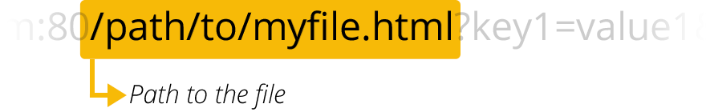

{{HTTPSidebar}}

The target of an HTTP request is called a "resource", whose nature isn't defined further; it can be a document, a photo, or anything else. Each resource is identified by a Uniform Resource Identifier ({{Glossary("URI")}}) used throughout HTTP for identifying resources.

## URLs and URNs

### URLs

The most common form of URI is the Uniform Resource Locator ({{Glossary("URL")}}), which is known as the _web address_.

```url
https://developer.mozilla.org
https://developer.mozilla.org/en-US/docs/Learn/
https://developer.mozilla.org/en-US/search?q=URL
```

Any of those URLs can be typed into your browser's address bar to tell it to load the associated page (resource).

A URL is composed of different parts, some mandatory and others optional. A more complex example might look like this:

```url
http://www.example.com:80/path/to/myfile.html?key1=value1&key2=value2#SomewhereInTheDocument
```

### URNs

A Uniform Resource Name (URN) is a URI that identifies a resource by name in a particular namespace.

```url
urn:isbn:9780141036144
urn:ietf:rfc:7230
```

The two URNs correspond to

- the book Nineteen Eighty-Four by George Orwell,
- the IETF specification 7230, Hypertext Transfer Protocol (HTTP/1.1): Message Syntax and Routing.

## Syntax of Uniform Resource Identifiers (URIs)

### Scheme or protocol

- 
  - : `http://` is the protocol. It indicates which protocol the browser must use. Usually it is the HTTP protocol or its secured version, HTTPS. The Web requires one of these two, but browsers also know how to handle other protocols such as `mailto:` (to open a mail client) or `ftp:` to handle a file transfer, so don't be surprised if you see such protocols. Common schemes are:

| Scheme      | Description                                                          |
| ----------- | -------------------------------------------------------------------- |
| data        | [Data URLs](/en-US/docs/Web/HTTP/Basics_of_HTTP/Data_URLs)           |
| file        | Host-specific file names                                             |
| ftp         | {{Glossary("FTP","File Transfer Protocol")}}                         |
| http/https  | [Hyper text transfer protocol (Secure)](/en-US/docs/Glossary/HTTP)   |
| javascript  | URL-embedded JavaScript code                                         |
| mailto      | Electronic mail address                                              |
| ssh         | Secure shell                                                         |
| tel         | telephone                                                            |
| urn         | Uniform Resource Names                                               |
| view-source | Source code of the resource                                          |
| ws/wss      | [WebSocket connections (Secure)](/en-US/docs/Web/API/WebSockets_API) |

### Authority

- 
  - : `www.example.com` is the domain name or authority that governs the namespace. It indicates which Web server is being requested. Alternatively, it is possible to directly use an {{Glossary("IP address")}}, but because it is less convenient, it is not often used on the Web.

### Port

- 
  - : `:80` is the port in this instance. It indicates the technical "gate" used to access the resources on the web server. It is usually omitted if the web server uses the standard ports of the HTTP protocol (80 for HTTP and 443 for HTTPS) to grant access to its resources. Otherwise, it is mandatory.

### Path

- 
  - : `/path/to/myfile.html` is the path to the resource on the Web server. In the early days of the Web, a path like this represented a physical file location on the Web server. Nowadays, it is mostly an abstraction handled by Web servers without any physical reality.

### Query

- 
  - : `?key1=value1&key2=value2` are extra parameters provided to the Web server. Those parameters are a list of key/value pairs separated with the `&` symbol. The Web server can use those parameters to do extra stuff before returning the resource to the user. Each Web server has its own rules regarding parameters, and the only reliable way to know how a specific Web server is handling parameters is by asking the Web server owner.

### Fragment

- 
  - : `#SomewhereInTheDocument` is an anchor to another part of the resource itself. An anchor represents a sort of "bookmark" inside the resource, giving the browser the directions to show the content located at that "bookmarked" spot. On an HTML document, for example, the browser will scroll to the point where the anchor is defined; on a video or audio document, the browser will try to go to the time the anchor represents. It is worth noting that the part after the #, also known as the fragment identifier, is never sent to the server with the request.

## Usage notes

When using URLs in {{Glossary("HTML")}} content, you should generally only use a few of these URL schemes. When referring to subresources — that is, files that are being loaded as part of a larger document — you should only use the HTTP and HTTPS schemes. Increasingly, browsers are removing support for using FTP to load subresources, for security reasons.

FTP is still acceptable at the top level (such as typed directly into the browser's URL bar, or the target of a link), although some browsers may delegate loading FTP content to another application.

## Examples

```url
https://developer.mozilla.org/en-US/docs/Learn
tel:+1-816-555-1212
git@github.com:mdn/browser-compat-data.git
ftp://example.org/resource.txt
urn:isbn:9780141036144
mailto:help@supercyberhelpdesk.info
```

## Specifications

{{Specifications}}

## See also

- [What is a URL?](/en-US/docs/Learn/Common_questions/Web_mechanics/What_is_a_URL)
- [IANA list of URI schemes](https://www.iana.org/assignments/uri-schemes/uri-schemes.xhtml)
