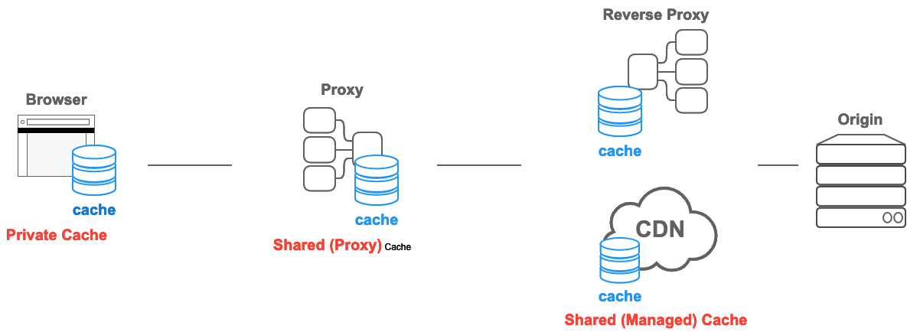
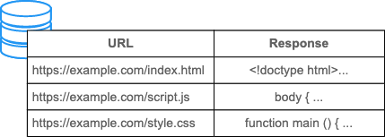
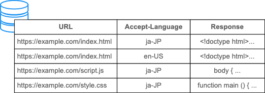
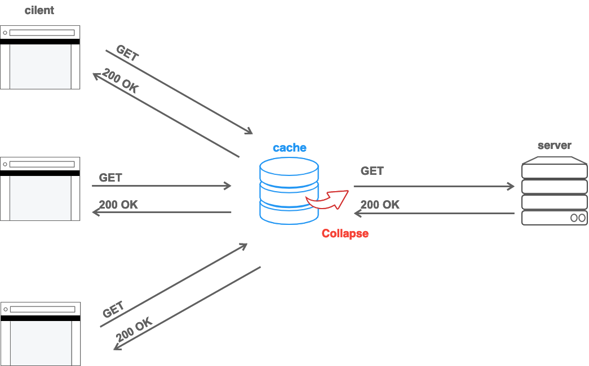

# HTTP Caching

{{HTTPSidebar}}

## Overview

The HTTP Cache stores a Response associated with a Request, and reuses the stored Response for subsequent Requests.

There are several advantages to reusability. First, since there is no need to deliver the Request to the Origin Server, the closer the client and cache are, the faster the response. The most typical example is when the browser itself stores a cache for browser requests.

Also, when reusable, the Origin Server does not need to process the request, so it does not need to parse and route the Request, restore the Session based on the cookie, query the DB for results, or render the Template Engine. This reduces the load on the server.

Proper operation of the Cache is critical to the health of the system.

## Type of Caches

In [HTTP Caching](https://datatracker.ietf.org/doc/html/RFC9111) spec, there are two main types of caches: **Private Cache** and **Shared Cache**.

### Private Cache

A Private Cache is a cache tied to a specific Client, typically a browser cache. Since the stored response is not shared with other clients, a Private Cache can store a personalized response for that user.

On the other hand, if personalized contents are stored in other than Private Cache, other users may be able to retrieve them, which may cause unintentional information leakage.

If response contains personalized content and wish to store it only in the Private Cache, you must give it a `private` directive.

```http
Cache-Control: private
```

Personalized contents are usually controlled by cookies, but the presence of a cookie does not always indicate that it is private, and thus a cookie alone does not make the response private.

Also, since Private Cache requires `private`, you may think that Shared Cache requires `public`, but this is not quite true. Shared Cache will store a response without `public` as long as `max-age` is given.

If the Response has an `Authorization` header, it cannot be stored in either the Private or Shared cache, even if it has `max-age`, and `public` can be used to allow such case. If you are not using Basic Authentication and do not have an `Authorization` header, then there is no need to add `public` and it is only a waste of bytes.

### Shared Cache

The Shared Cache is located between the Client and Server and can store Responses that can be shared among users. And also Shared Cache should be further divided into a Proxy Cache and a Managed Cache.

#### Proxy Cache

In addition to the function of access control, some proxies implement caching to reduce traffic out of the network. This is usually not recognized/operated by the Service developer, so it must be controlled by appropriate HTTP headers and so on. However, in the past, this Proxy Cache implementation has been outdated and has often caused problems for developers, such as implementations that did not properly understand the HTTP Cache standard.

**Kichen Sink Headers** like following are also supposedly granted to otp-out from "old and not updated Proxy Cache" that does not understand HTTP Cache like `no-store`.

```http
Cache-Control: no-store, no-cache, max-age=0, must-revalidate, proxy-revalidate
```

However, in recent years, as HTTPS has become more common and client/server communication has become encrypted, Proxy Caches in the path can only tunnel the Response and can't behave as a cache in many cases. There is no need to worry about outdated Proxy Cache implementations that cannot even see the Response.

On the other hand, if the TLS Bridge Proxy decrypts all communications in a Person-in-the-Middle manner by installing a certificate from a CA managed by the organization on the PC, and performs access control, etc., it is possible to see the contents of the Response and cache it. However, since CT(Certificate Transparency) has become widespread in recent years, and some browsers only allow certificates issued with the SCT(Signed Certificate Timestamp), this method requires the application of an Enterprise Policy. In such a controlled environment, there is no need to worry about the Proxy Cache being "out of date and not updated".

#### Managed Cache

Maganed Cache is explicitly deployed by Service developers to offload the Origin Server and to deliver content efficiently. Examples include Reverse Proxy, CDN, Service Worker + Cache APIs.

The characteristics of Managed Cache vary depending on the product deployed, but in most cases you can control its behavior not only through the `Cache-Control` header, but also through your own configuration files and dashboards.

For example, the HTTP Cache specification normally does not has way to delete cache explicitly, but with Managed Cache, the stored Response can be deleted at any time through bashboard operations, API calls, restarts etc. It allowing for a more proactive caching strategy.

It is also possible to ignore the standard HTTP Cache protocols because it can be manipulated explicitly. For example, the following settings can be configured to Opt-Out the Private Cache or Proxy Cache, while using your own strategy to cache only in the Managed Cache.

```http
Cache-Control: no-store
```

For example, Vernish uses VCL-based logic to handle cache storage, while Service Worker and Cache APIs allow you to create that logic in JS.

This means that there is no need to say a Managed Cache's intentional ignore of `no-store` as "non-compliant" with the standard. What you should do is not to submit **Kichen Sink Headers**, but to carefully read the documentation of that Managed Cache and control it properly in the provided ways.

Note that some CDNs provide their own headers that are effective only for that CDN (e.g., `Surrogate-Control`). Currently, work is underway to standardize the `CDN-Cache-Control` header to standardize them.



## Heuristic Cache

HTTP is designed to cache as much as possible, so even if no `Cache-Control` is given, it will store and resuse if the conditions are met. This is called **Heuristic Caching**.

For example, take the following response. This response was last updated 1 year ago.

```http
HTTP/1.1 200 OK
Content-Type: text/html
Content-Length: 1024
Date: Tue, 22 Feb 2022 22:22:22 GMT
Last-Modified: Tue, 22 Feb 2021 22:22:22 GMT

<!doctype html>
...
```

It is heuristically known that content that has not been updated for a full year will not be updated for some time after that. Therefore, the client stores this response (despite the lack of `max-age`) and reuses it for a while. How long to reuse is up to the implementation, but the specification recommends about 10% (in this case 0.1 year) after storing.

It is commonn misunderstanding to assume that if you do not give a `Cache-Control`, it will not be stored. If you do not want such a store, you must explicitly deny it with a `Cache-Control`. Rather, the Heuristic Cache is a work around to make content cacheable before `Cache-Control` became popular, and basically all responses should explicitly specify a `Cache-Control` header.

## Fresh and Stale based on Age

HTTP Stored Responses have two states: **Fresh** and **Stale**. Fresh usually indicates that the Response is still valid and can be reused, while Stale means that it has already expired.

The criterion for determining when a response is Fresh and when it is Stale is **Age**. In HTTP, Age is the time elapsed since the response was generated. This is similar to the TTL in other caching mechanisms.

Take the following example (604800 == 1week).

```http
HTTP/1.1 200 OK
Content-Type: text/html
Content-Length: 1024
Date: Tue, 22 Feb 2022 22:22:22 GMT
Cache-Control: max-age=604800

<!doctype html>
...
```

The Cache that stored the response counts the time elapsed since the response was generated as an `Age`. The meaning of `max-age` is that if the `Age` is less than 1 week, it is Fresh, and if `Age` is greater than 1 week, it is Stale.

If it is stored in a Private Cache, it will be available for reuse in response to client requests for one week after it is stored. If the Shared Cache saves it, it is necessary to inform the client of the time elapsed from it was stored to the Shared Cache until it is reused by the client. If the Shared Cache has been stored for 1 day and then reused by the Client, the following response will be sent from the Shared Cache to the Client.

```http
HTTP/1.1 200 OK
Content-Type: text/html
Content-Length: 1024
Date: Tue, 22 Feb 2022 22:22:22 GMT
Cache-Control: max-age=604800
Age: 86400

<!doctype html>
...
```

The Client that receives this reqponse is found to be Fresh for the remaining `604800-86400=518400`.

## Expires or max-age

In HTTP/1.0, Freshness used to be specified by the `Expires` header.

The `Expires` header tells the lifetime of the cache by an explicit datetime, not by an expiration date.

```http
Expires: Tue, 28 Feb 2022 22:22:22 GMT
```

However, since the time format is difficult to parse, many implementation bugs were found, and it is possible to induce problems by intentionally shifting the system clock, `max-age` for elapsed time was adopted for `Cache-Control` in HTTP/1.1.

If both `Expires` and `Cache-Contro: max-age` are available, `max-age` is defined to be preferred. So it is not necessary to provide `Expires` now that HTTP/1.1 is widely used.

## Vary

Although cache is basically stored in combination with URL.



But the content of Resonse is not always the same even if the URL is the same. Especially when Content Negotiation is performed, the response from the server depends on the values of `Accept`, `Accept-Language`, and `Accept-Encoding`.

It is undesirable to have English content returned as `Accept-Language: en` cached and then reused for `Accept-Language: ja` requests, even though the content is i18nized. In this case, you can separate the cache by language by adding `Accept-Language` to the `Vary` header.

```http
Vary: Accept-Language
```

This makes the cache key to a composite key of URL and `Accept-Language` instead of a single key of URL.



Also, if you are providing content optimization (e.g., responsive design, use of certain APIs) optimized based on User Agent, you may be tempted to include `User-Agent` in the `Vary`. However, `User-Agent` generally has a very large number of variations, which drastically reduces the chance that the cache will be Reused. If possible, consider a way where the same response is used to perform Feature Detection on the browser.

For applications that use cookies to prevent others from reusing the cache of personalized content, you should use `Cache-Control: private` instead of specifying a cookie for `Vary`.

## Validation

Stale Responses are not immediately discarded. HTTP has a mechanism to return a Stale Response to Fresh by asking to the Origin Server. This is called **Validation** (also called **Revalidation** in same meaning).

Validation is done by Conditional Request which includes `If-Modified-Since` or `If-None-Match`.

### If-Modified-Since

The following response was generated at 22:22 and `max-age` is 1h, so you know that it is Fresh until 23:22.

```http
HTTP/1.1 200 OK
Content-Type: text/html
Content-Length: 1024
Date: Tue, 22 Feb 2022 22:22:22 GMT
Last-Modified: Tue, 22 Feb 2022 22:00:00 GMT
Cache-Control: max-age=3600

<!doctype html>
...
```

At 23:22, the response is Stale and the cache cannot be reused. So the client asking to the server with an `If-Modified-Sice` header to see if there have been any changes since `Last-Modified` time.

```http
GET /index.html HTTP/1.1
Host: example.com
Accept: text/html
If-Modified-Since: Tue, 22 Feb 2022 22:00:00 GMT
```

The server will respond with `304 Not Modified` if the content has not changed since `Last-Modified`.

Since this Response only indicates "no change", there is no Response Body, only Status Code, so the transfer size is extreamly small.

```http
HTTP/1.1 304 Not Modified
Content-Type: text/html
Date: Tue, 22 Feb 2022 22:23:22 GMT
Last-Modified: Tue, 22 Feb 2022 22:00:00 GMT
Cache-Control: max-age=3600
```

Upon receiving this, the client reverts the stored Stale Response back to Fresh and can reuse it in next 1h.

The datetime required for `Last-Modified` can be obtained from the OS File System, so it is relatively easy to support when serving static files. However, there are some problems such that the datetime format is complex and difficult to parse, and also distributed servers have difficulty synchronizing file update times.

To solve such problems, `ETag` was standardized as an alternative.

### ETag/If-None-Match

`ETag` is an arbitrary value to be generated for the response. There are no restrictions on how the value is generated, so any value can be used, such as a hash value of the Body or version number.

As an example, if a hash value is used for `ETag` and the hash value of index.html is `deadbeef`, the response will be as follows.

```http
HTTP/1.1 200 OK
Content-Type: text/html
Content-Length: 1024
Date: Tue, 22 Feb 2022 22:22:22 GMT
ETag: "deadbeef"
Cache-Control: max-age=3600

<!doctype html>
...
```

If this Response is Stale, the client assigns the value of `ETag` to `If-Modified-Since` and asks the server if it has modified.

```http
GET /index.html HTTP/1.1
Host: example.com
Accept: text/html
If-Non-Match: "deadbeef"
```

The server will return `304 Not Modified` as the content has not modified, if the ETag generated by the same method in the current response is the same as `If-None-Match`.

If the `ETag` values are different, the client will get the latest content in any case by returning the latest response with `200 OK` from servers.

> **Note:** ETag or Last-Modified ?
> In Cache Revalidation, if both `ETag` and `Last-Modified` are present, `ETag` takes precedence.
> Therefore, you may think that `Last-Modified` is unnecessary if you are only think about caching.
> However, `Last-Modified` is not just a header for caching. It is a standard HTTP header that is also used by CMS to display the last modified time, by crawlers to adjust the crawl frequency, and for other various purposes.
> It would be preferable to provide both headers, from the point of view of HTTP ecosystem.

### Force Revalidation

If you do not want Response to be reused, but always fetch the latest content from the server, you can use `no-cache` to force Validation.

By adding `Cache-Control: no-cache` to the response with `Last-Modified` / `ETag` as follows, the client will always receive the latest response by Validation with `200 OK` if the content is out of date, otherwise the client will receive the up to date response with `304 Not Modified`.

```http
HTTP/1.1 200 OK
Content-Type: text/html
Content-Length: 1024
Date: Tue, 22 Feb 2022 22:22:22 GMT
Last-Modified: Tue, 22 Feb 2022 22:00:00 GMT
ETag: deadbeef
Cache-Control: no-cache

<!doctype html>
...
```

It is often explained that `max-age=0` plus `must-revalidate` mean the same as `no-cache`.

```
Cache-Control: max-age=0, must-revalidate
```

`max-age=0` means that the response is immediately stale, and `must-revalidate` means that it must not be reused without Revalidate once it is stale, so the semantics seems to be the same.

However, this is a remnant of the fact that many implementations prior to HTTP/1.1 were unable to handle `no-cache`, so `max-age=0` was used as an alternative.

Now that HTTP/1.1 is sufficiently popular, there is no reason to use this combination; you should simply use `no-cache`.

## Don't Cache

The `no-cache` does not prevent Store, but rather prevents Reuse without Revalidation.

If you do not want to "Store" response in any cache, `no-store` will prevent storing from every caches.

```http
Cache-Control: no-store
```

However, in general, the "Do not cache" requirement is actually because

- Don't want it stored by anyone other than the specific client for privacy reasons.
- Want to provide up-to-date information always.
- Don't know what could happen with the old implementation.

The directive that should be given in such cases is not always `no-store`.

Let's look at each of these in detail.

### Do not share with others

It would be problematic if a Response with personalized content is unexpectedly visible to other users.

In this case, by giving it `private` will only be stored with the specific client and will not be leaked to anyone else.

```http
Cache-Control: private
```

Even if `no-store` is given, `private` must be given in such case.

### Provide Up-to-date content every time

The `no-store` prevents the Response from being stored, but does not delete the already stored Response at that URL.

In other words, if there is an old Response already stored at that URL, returning `no-store` will not prevent the old Response from being reused.

Alternatively, `no-cache` will force the client to send Validation Request before Reusing stored Response.

```http
Cache-Control: no-cache
```

If the Server does not support Conditional Requests, you can force the Client to access the Server every time and always get the latest Response with `200 OK`.

### Be afraid of old implementation

As a workaround to older implementations that ignore `no-store`, you may see an Kichen Sink Headers that gives many directives, such as below.

```http
Cache-Control: no-store, no-cache, max-age=0, must-revalidate, proxy-revalidate
```

It is [recommended](https://docs.microsoft.com/en-us/troubleshoot/developer/browsers/connectivity-navigation/how-to-prevent-caching) to use `no-cache` as an alternative for such old implementations, and it is not a problem if `no-cache` is given from the beginning, since the server will always receive the request.

If it is the Shared Cache that you are concerned about, you can make sure to prevent unintended caching by adding `private` too.

```http
Cache-Control: no-cache, private
```

### What's lost by `no-store`

You may want to add `no-store` to Opt-Out from Caching because you don't want to care about caching.

However, it is basically not recommended to grant `no-store` easily, because you lose many advantages that HTTP and browsers have, including BFCache etc.

Many cases can be covered with `no-cache` and `private`, which will bring out the potential of the Web.

## Reload / Force Reload

Validate can be emitted from the Request as well as the Response.

**Reload** and **Force Reload** are typical examples of validation emitted by browser.

### Reload

For recovery the window corruption or updating to the latest information, the browser has a Reload function for user.

The HTTP Request during browser Reload is as follows (Simplified).

```http
GET / HTTP/1.1
Host: example.com
Cache-Control: max-age=0
If-None-Match: "deadbeef"
If-Modified-Since: Tue, 22 Feb 2022 20:20:20 GMT
```

(Chrome, Edge and Firefox behave this way, but Safari is bit different.)

The `max-age=0` in the request only allows reuse of "Responses with an Age of 0 or less", so in effect intermediate stored responses are not reused.

As a result, a request reached at Origin and is validated by `If-None-Match` and `If-Modified-Since`.

This behavior is also defined in the [Fetch Standard](https://fetch.spec.whatwg.org/#http-network-or-cache-fetch) and can be reproduced in JS by `fetch()` with Cache Mode "no-cache" (Note that it's not "reload")

```js
// Notice: not { cache: "reload" } for reproduce Reload
fetch("/", { cache: "no-cache" });
```

### Force Reload

The use of `max-age=0` in Reload is to keep backword compatibility, since many implementations prior to HTTP/1.1 did not understand `no-cache`. But `no-cache` is fine now in this use-casse and **Force Reload** is an additional implementation for this.

The HTTP Request during **Force Reload** by the browser is as follows.

```http
GET / HTTP/1.1
Host: example.com
Pragma: no-cache
Cache-Control: no-cache
```

(Chrome, Edge and Firefox behave this way, but Safari is bit different.)

Since it is not a Conditional Request with `no-cache`, you can be sure to get a `200 OK` from the Origin Server.

This behavior is also defined in the [Fetch Standard](https://fetch.spec.whatwg.org/#http-network-or-cache-fetch) and can be reproduced in JS by `fetch()` with Cache Mode "reload" (Note that it's not "no-cache" or "force-reload")

```js
// Notice: not { cache: "no-cache" } for reproduce Force Reload
fetch("/", { cache: "reload" });
```

### Avoiding Revalidate

Content that never change should be given a long `max-age` by Cache Busting, which includes Version, Hash value, etc in its URL.

However, when the user Reloads the browser, a revalidation request is sent even though the server knows that the content is Immutable.

To prevent this, `immutable` explicitly shows that Revalidation is not required because the content never changes.

```http
Cache-Control: max-age=31536000, immutable
```

This prevents unnecessary revalidation during reload.

Note that, instead of implementing this directive, [Chrome has changed its implementation](https://blog.chromium.org/2017/01/reload-reloaded-faster-and-leaner-page_26.html) so that Revalidation is not performed during Realod for Subresouce.

## Delete stored response

There is basically no way to delete response that has already been stored with long `max-age`.

Imagine that the following response to `https://example.com/` were stored.

```http
HTTP/1.1 200 OK
Content-Type: text/html
Content-Length: 1024
Cache-Control: max-age=31536000

<!doctype html>
...
```

You may want to overwrite this response once it expired on the server, but there is nothing the server can do once the response is stored, since no more requests reach the server because there is cache.

One of the methods mentioned in the specification is to send a Request with unsafe method such as `POST` for the same URL, but it is usually difficult to do so intentionally on all clients.

There is also a `Clear-Site-Data: cache` specification, but [not all browsers support it](https://groups.google.com/a/mozilla.org/g/dev-platform/c/I939w1yrTp4), and even if it can be cleared, it is only for the browser and has no effect on intermediate caches.

Therefore, it should be assumed that the stored Response will remain for the `max-age` period unless the user performs a Reload, Force Reload or Clear History on their own.

Caching reduces access to the server, which means that the server loses control on that URL. If the server does not want to lose control of a URL, such as one that is frequently updated, you should add `no-cache` so that the server will always receive requests and send intended response.

## Request Collapse

The shared cache is primarily located before origin and is intended to reduce traffic to origin.

Thus, if multiple same requests arrives to the shared cache at the same time, the intermediate cache will forward single request on behalf of itself to Origin, which can then reuse the result for all clients. It's called **Request Collapse**.

Request Collapse occurs when "requests are arriving at the same time", so even if `max-age=0` or `no-cache` is given to the Response, it will be reused.

If the Response is personalized to a particular user and you do not want it to be shared in Collapse, you should add `private`.



## Caching Pattern

There are many directives in `Cache-Control` spec, and it may be difficult to understand all of them. But most Web sites can be covered by a combination of several patterns.

This section describes the common patterns in designing caches.

### Default Setting

As mentioned above, the default of HTTP cache (Response without `Cache-Control`) is not "Don't cache" but implicit caching according to "Heuristic Cache".

To avoid this, it is preferable to explicitly give all Responses a default `Cache-Control`.

By default, it is common practice to always make a Request to the Server at all URLs and add `no-cache` so that the latest information can always be transfered.

```http
Cache-Control: no-cache
```

In addition, if the service implements cookies or other login methods, and the content is personalized for each user, `private` must be given too to prevent sharing with other users.

```http
Cache-Control: no-cache, private
```

### Cache Busting

The files that work best with caching are static immutable files whose content never changes. Conversely, it is a standard practice to change the URL each time the content changes so that the URL unit can be cached for a longer period of time.

As an example, consider the following html

```html
<script src="bundle.js"></script>
<link rel="stylesheet" href="build.css" />
<body>
  hello
</body>
```

In modern Web development, JS and CSS are frequently updated as development progresses. Also, if the JS and CSS versions are out of sync, the display will break.

So this HTML makes it difficult to cache bundle.js and build.css with `max-age`.

Therefore, you can fix the JS / CSS URL by including a version or hash value. There are multiple ways to do this.

```
# version in filename
bundle.v123.js

# version in query
bundle.js?v=123

# hash in filename
bundle.YsAIAAAA-QG4G6kCMAMBAAAAAAAoK.js

# hash in query
bundle.js?v=YsAIAAAA-QG4G6kCMAMBAAAAAAAoK
```

Since the cache is stored keyed with the URL, the old cache will not be reused again if the URL is changed when the content is updated.

```html
<script src="bundle.v123.js"></script>
<link rel="stylesheet" href="build.v123.css" />
<body>
  hellow
</body>
```

With this design, both JS and CSS can be cached for a long time. So how long `max-age` should it be? The answer is in QPACK spec.

[QPACK](https://datatracker.ietf.org/doc/html/rfc9204) is a standard for compressing HTTP header fields, with commonly used field values are defined in predefiend tables.

You can see some commonly used cache header fields below.

```
36 cache-control max-age=0
37 cache-control max-age=2592000
38 cache-control max-age=604800
39 cache-control no-cache
40 cache-control no-store
41 cache-control public, max-age=31536000
```

If you select one of these settings, you can compress values in 1-byte when transfered via HTTP3.

37, 38, and 41 are for periods of one week, one month, and one year.

Because the cache removes old entries when new entries are saved, the probability that an stored response still exist after one week is not that high even if `max-age` is set to 1 week. Therefore, in practice, it does not make much difference which one you choose.

Note that the 41 has a longest `max-age` (1 year) but with `public`.

The `public` has the effect of making the Response Storeable even if the Authorization header is present. So if the response is personalized with Basic Authentication, the presence of `public` may cause problems. If you are concerned about that, you can choose the 2nd longest value 37 (1 month).

```http
# response for bundle.v123.js

## If you never personalize response via Authorization
Cache-Control: public, max-age=31536000

## If you can't make sure
Cache-Control: max-age=2592000
```

### Validation

In addition, don't forget to set the `If-Modified-Since` and `ETag` headers, so that you don't have to retransmit the file when Reloading. Pre-built static files are easy to generate these headers.

`ETag` here may be the hash of the file.

```http
# response for bundle.v123.js
If-Modified-Since: Tue, 22 Feb 2022 20:20:20 GMT
ETag: YsAIAAAA-QG4G6kCMAMBAAAAAAAoK
```

In addition, `immutable` can be added to prevent Validation itself on Reload.

The result is below.

```http
# bundle.v123.js
200 OK HTTP/1.1
Content-Type: application/javascript
Content-Length: 1024
Cache-Control: public, max-age=31536000, immutable
If-Modified-Since: Tue, 22 Feb 2022 20:20:20 GMT
ETag: YsAIAAAA-QG4G6kCMAMBAAAAAAAoK
```

To make Response cacheable over a long period of time by changing URL when the content changes is called **Cache Busting**. This technique can be applied to every Subresources like images.

> **Note:** immutable and QPACK
> Are you concerned that the `immutable` has changed the predefied value of QPACK?
> In this case, only the `immutable` can be encoded separately by splitting the `Cache-Control` in two line.
> However, this depends on the encoding algorithm by the QPACK implementation.

```http
Cache-Control: public, max-age=31536000
Cache-Control: immutable
```

### HTML Main resources

Unlike Subresources, Main resources cannot be Cache Busted because its URL can't be decorated.

If the HTML itself is stored, the latest information cannot be displayed even if the content is updated on the server side.

```html
<script src="bundle.v123.js"></script>
<link rel="stylesheet" href="build.v123.css" />
<body>
  hellow
</body>
```

However, `no-cache` would be appropriate here, not `no-store` since we don't want to store HTML, we just want it to always be up-to-date.

Furthermore, adding `If-Modified-Since`, `If-None-Match` will allow client to send Conditional Request, a `302 Not Modified` can be returned if there are no HTML updates.

```http
200 OK HTTP/1.1
Content-Type: text/html
Content-Length: 1024
Cache-Control: no-cache
If-Modified-Since: Tue, 22 Feb 2022 20:20:20 GMT
ETag: AAPuIbAOdvAGEETbgAAAAAAABAAE
```

However, this is a setting for non-personalized HTML.

If response were Personalaizing by cookie (e.g. with Login), do not forget to give `private`.

```http
200 OK HTTP/1.1
Content-Type: text/html
Content-Length: 1024
Cache-Control: no-cache, private
If-Modified-Since: Tue, 22 Feb 2022 20:20:20 GMT
ETag: AAPuIbAOdvAGEETbgAAAAAAABAAE
Set-Cookie: __Host-SID=AHNtAyt3fvJrUL5g5tnGwER; Secure; Path=/; HttpOnly
```

The same can be used for favicon.ico, manifest.json, .well-known, and API endpoints whose URLs cannot be changed due to Cache Busting, in addition to HTML/API.

Most Web content can be covered by a combination of the two pattern.

### Additonal Managed Cache

With the previous methods, Subresources could be cached for a long time with the Cache Busting, but HTML cannot be cached.

Caching the main resource is difficult because there is no way to actively delete cache contents when content is updated on the server with standard HTTP Caching spec.

However, it is possible by deploying a Managed Cache such as a CDN or Service Worker.

For example, a CDN that allows cache purging via API or dashboard operation would allow for a more aggressive caching strategy by storing the main resource and explicitly purging the relevant cache only when an update occurs on the server.

A Service Worker could do the same if it could delete the contents in the Cache API when update occures on the server.

For more information, see the CDN documentation you choose or the Service Worker section.

## See also

- [RFC 9111: Hypertext Transfer Protocol (HTTP/1.1): Caching](https://datatracker.ietf.org/doc/html/RFC9111)
- [Caching Tutorial - Mark Nottingham](https://www.mnot.net/cache_docs)
