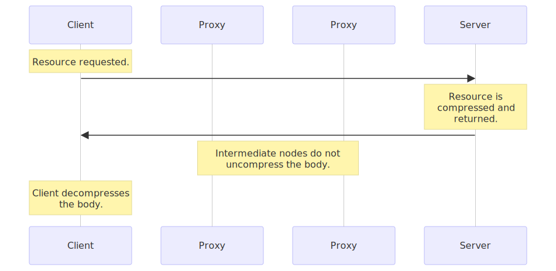
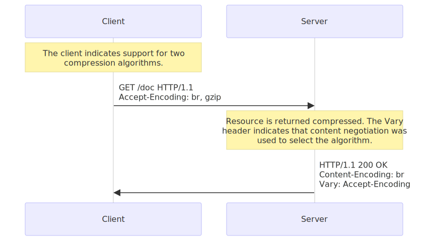
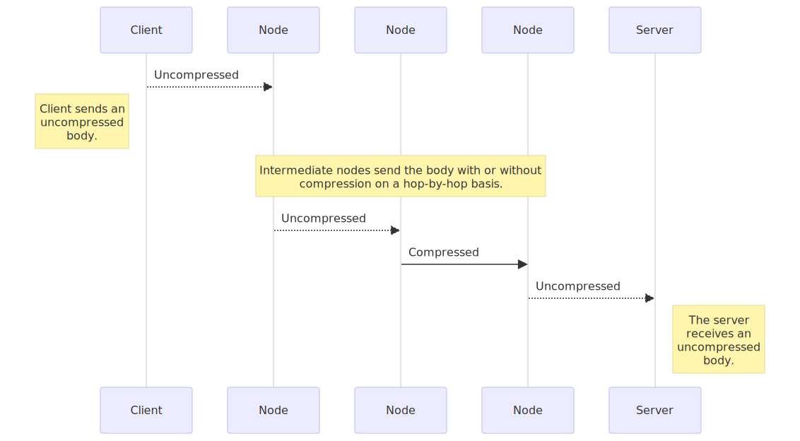
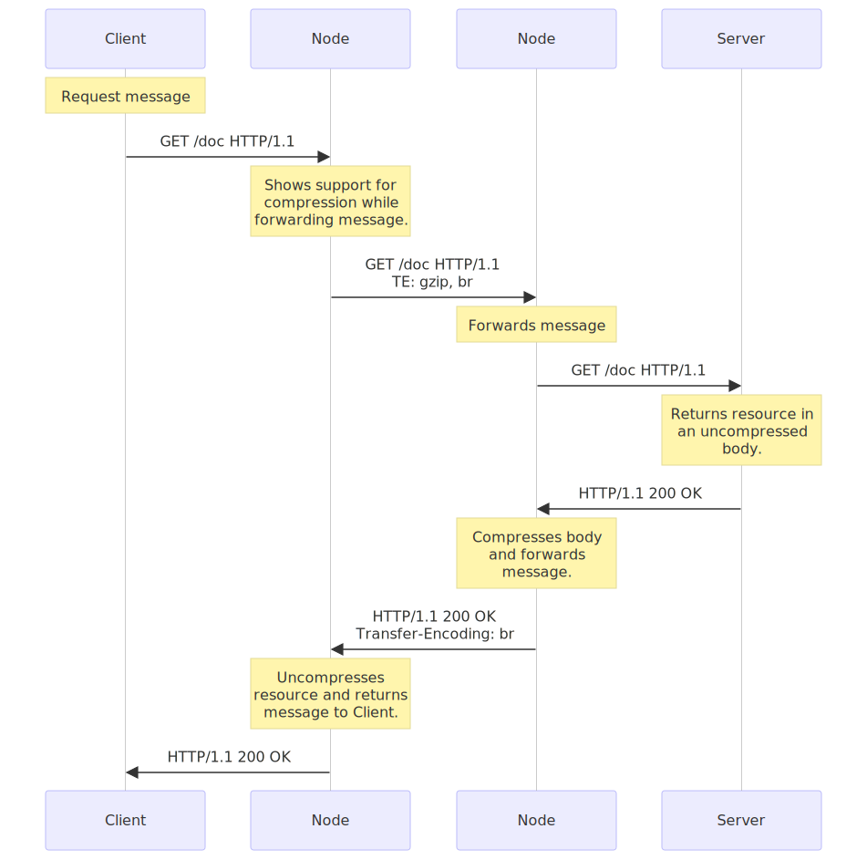

{{HTTPSidebar}}

**Compression** is an important way to increase the performance of a website. For some documents, size reduction of up to 70% lowers the bandwidth capacity needs. Over the years, algorithms also got more efficient, and new ones are supported by clients and servers.

In practice, web developers don't need to implement compression mechanisms, both browsers and servers have it implemented already, but they have to be sure that the server is configured adequately. Compression happens at three different levels:

- first some file formats are compressed with specific optimized methods,
- then general encryption can happen at the HTTP level (the resource is transmitted compressed from end to end),
- and finally compression can be defined at the connection level, between two nodes of an HTTP connection.

## File format compression

Each data type has some redundancy, that is _wasted space_, in it. If text can typically have as much as 60% redundancy, this rate can be much higher for some other media like audio and video. Unlike text, these other media types use a lot of space to store their data and the need to optimize storage and regain space was apparent very early. Engineers designed the optimized compression algorithm used by file formats designed for this specific purpose. Compression algorithms used for files can be grouped into two broad categories:

- _Loss-less compression_, where the compression-uncompression cycle doesn't alter the data that is recovered. It matches (byte to byte) with the original.
  For images, `gif` or `png` are using lossless compression.
- _Lossy compression_, where the cycle alters the original data in a (hopefully) imperceptible way for the user.
  Video formats on the Web are lossy; the `jpeg` image format is also lossy.

Some formats can be used for both loss-less or lossy compression, like `webp`, and usually lossy algorithm can be configured to compress more or less, which then of course leads to less or more quality. For better performance of a website, it is ideal to compress as much as possible, while keeping an acceptable level of quality. For images, an image generated by a tool could be not optimized enough for the Web; it is recommended to use tools that will compress as much as possible with the required quality. There are [numerous tools](https://www.creativebloq.com/design/image-compression-tools-1132865) that are specialized for this.

Lossy compression algorithms are usually more efficient than loss-less ones.

> **Note:** As compression works better on a specific kind of files, it usually provides nothing to compress them a second time. In fact, this is often counterproductive as the cost of the overhead (algorithms usually need a dictionary that adds to the initial size) can be higher than the extra gain in compression resulting in a larger file. Do not use the two following techniques for files in a compressed format.

## End-to-end compression

For compression, end-to-end compression is where the largest performance improvements of websites reside. End-to-end compression refers to a compression of the body of a message that is done by the server and will last unchanged until it reaches the client. Whatever the intermediate nodes are, they leave the body untouched.

<!--
%%{init: { "sequence": { "wrap": true, "width": 175, "noteAlign": "center", "messageAlign": "left" }} }%%

sequenceDiagram
    participant Client
    participant Proxy1 as Proxy
    participant Proxy2 as Proxy
    participant Server

    Note over Client: Resource requested.
    Client->>Server:
    Note over Server: Resource is compressed and returned.
    Server->>Client:
    Note over Proxy1,Proxy2: Intermediate nodes do not uncompress the body.
    Note over Client: Client decompresses the body.
-->

All modern browsers and servers do support it and the only thing to negotiate is the compression algorithm to use. These algorithms are optimized for text. In the 1990s, compression technology was advancing at a rapid pace and numerous successive algorithms have been added to the set of possible choices. Nowadays, only two are relevant: `gzip`, the most common one, and `br` the new challenger.

To select the algorithm to use, browsers and servers use [proactive content negotiation](/en-US/docs/Web/HTTP/Content_negotiation). The browser sends an {{HTTPHeader("Accept-Encoding")}} header with the algorithm it supports and its order of precedence, the server picks one, uses it to compress the body of the response and uses the {{HTTPHeader("Content-Encoding")}} header to tell the browser the algorithm it has chosen. As content negotiation has been used to choose a representation based on its encoding, the server must send a {{HTTPHeader("Vary")}} header containing at least {{HTTPHeader("Accept-Encoding")}} alongside this header in the response; that way, caches will be able to cache the different representations of the resource.

<!--
%%{init: { "sequence": { "wrap": true, "width":380, "noteAlign": "center", "messageAlign": "left" }} }%%

sequenceDiagram
    participant Client
    participant Server

    Note over Client: The client signifies its ability to understand two compression algorithms.
    Client->>Server: GET /doc HTTP/1.1 Accept-Encoding: br, gzip
    Note over Server: The resource is sent compressed. The Vary header indicates that content negotiation has been used to select the algorithm.
    Server->>Client: HTTP/1.1 200 OK Content-Encoding: br Vary: Accept-Encoding
-->

As compression brings significant performance improvements, it is recommended to activate it for all files except already compressed ones like images, audio files and videos.

Apache supports compression and uses [mod_deflate](https://httpd.apache.org/docs/current/mod/mod_deflate.html); for Nginx there is [ngx_http_gzip_module](https://nginx.org/en/docs/http/ngx_http_gzip_module.html); for IIS, the [`<httpCompression>`](https://docs.microsoft.com/iis/configuration/system.webServer/httpCompression/) element.

## Hop-by-hop compression

Hop-by-hop compression, though similar to end-to-end compression, differs by one fundamental element: the compression doesn't happen on the resource in the server, creating a specific representation that is then transmitted, but on the body of the message between any two nodes on the path between the client and the server. Connections between successive intermediate nodes may apply a _different_ compression.

<!--
%%{init: { "sequence": { "wrap": true, "width": 130, "noteAlign": "center", "messageAlign": "left" }} }%%

sequenceDiagram
    participant Client
    participant N1 as Node
    participant N2 as Node
    participant N3 as Node
    participant Server

    Client->>N1: Uncompressed
    Note left of Client: Client sends an uncompressed body.
    Note over N1,N3: Intermediate nodes send the body with or without compression on a hop-by-hop basis.
    N1->>N2: Uncompressed
    N2->>N3: Compressed
    N3->>Server: Uncompressed
    Note right of Server: The server receives an uncompressed body.
-->

To do this, HTTP uses a mechanism similar to the content negotiation for end-to-end compression: the node transmitting the request advertizes its will using the {{HTTPHeader("TE")}} header and the other node chooses the adequate method, applies it, and indicates its choice with the {{HTTPHeader("Transfer-Encoding")}} header.

<!--
%%{init: { "sequence": { "wrap": true, "width": 175, "noteAlign": "center" }} }%%

sequenceDiagram
    participant Client
    participant Node1 as Node
    participant Node2 as Node
    participant Server

    Note over Client: Request message
    Client->>Node1: GET /doc HTTP/1.1

    Note over Node1: Shows support for compression while forwarding message.
    Node1->>Node2: GET /doc HTTP/1.1 TE: gzip, br

    Note over Node2: Forwards message
    Node2->>Server: GET /doc HTTP/1.1

    Note over Server: Returns resource in an uncompressed body.
    Server->>Node2: HTTP/1.1 200 OK

    Note over Node2: Compresses body and forwards message.
    Node2->>Node1: HTTP/1.1 200 OK Transfer-Encoding: br

    Note over Node1: Uncompresses resource and returns message to Client.
    Node1->>Client: HTTP/1.1 200 OK
-->

In practice, hop-by-hop compression is transparent for the server and the client, and is rarely used. {{HTTPHeader("TE")}} and {{HTTPHeader("Transfer-Encoding")}} are mostly used to send a response by chunks, allowing to start transmitting a resource without knowing its length.

Note that using {{HTTPHeader("Transfer-Encoding")}} and compression at the hop level is so rare that most servers, like Apache, Nginx, or IIS, have no easy way to configure it. Such configuration usually happens at the proxy level.
