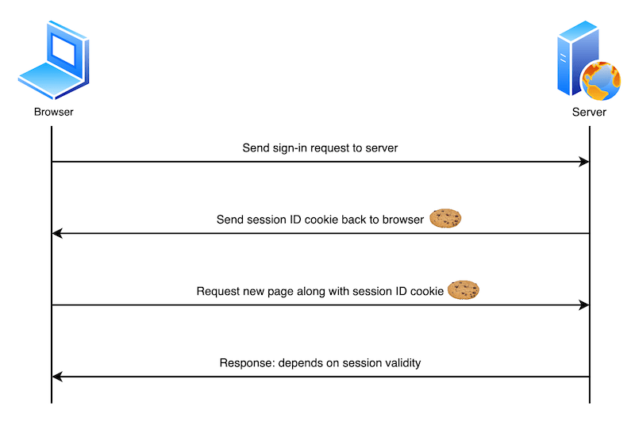

{{HTTPSidebar}}

A **cookie** (also known as a web cookie or browser cookie) is a small piece of data a server sends to a user's web browser. The browser may store cookies, create new cookies, modify existing ones, and send them back to the same server with later requests. Cookies enable web applications to store limited amounts of data and remember state information; by default the HTTP protocol is [stateless](/en-US/docs/Web/HTTP/Overview#http_is_stateless_but_not_sessionless).

In this article we will explore the main uses of cookies, explain best practices for using them, and look at their privacy and security implications.

## What cookies are used for

Typically, the server will use the contents of HTTP cookies to determine whether different requests come from the same browser/user and then issue a personalized or generic response as appropriate. The following describes a very simple user sign-in system:

1. The user sends sign-in credentials to the server, for example via a form submission.
2. If the credentials are correct, the server updates the UI to indicate that the user is signed in, and responds with a cookie containing a session ID that records their sign-in status on the browser.
3. At a later time, the user moves to a different page on the same site. The browser sends the cookie containing the session ID along with the corresponding request to indicate that it still thinks the user is signed in.
4. The server checks the session ID and, if it is still valid, sends the user a personalized version of the new page. If it is not valid, the session ID is deleted and the user is shown a generic version of the page (or perhaps shown an "access denied" message and asked to sign in again).



Cookies are mainly used for three purposes:

- **Session management**: User sign-in status, shopping cart contents, game scores, or any other user session-related details that the server needs to remember.
- **Personalization**: User preferences such as display language and UI theme.
- **Tracking**: Recording and analyzing user behavior.

### Data storage

In the early days of the web when there was no other option, cookies were used for general client-side data storage purposes. Modern storage APIs are now recommended, for example the [Web Storage API](/en-US/docs/Web/API/Web_Storage_API) (`localStorage` and `sessionStorage`) and [IndexedDB](/en-US/docs/Web/API/IndexedDB_API).

They are designed with storage in mind, never send data to the server, and don't come with other drawbacks of using cookies for storage:

- Browsers are generally limited to a maximum number of cookies per domain (varies by browser, generally in the hundreds), and a maximum size per cookie (usually 4KB). Storage APIs can store larger amounts of data.
- Cookies are sent with every request, so they can worsen performance (for example on slow mobile data connections), especially if you have a lot of cookies set.

> [!NOTE]
> To see stored cookies (and other storage that a web page is using) you can use the [Storage Inspector](https://firefox-source-docs.mozilla.org/devtools-user/storage_inspector/index.html) in Firefox Developer Tools, or the [Application panel](https://developer.chrome.com/docs/devtools/progressive-web-apps) in Chrome Developer Tools.

## Creating, removing, and updating cookies

After receiving an HTTP request, a server can send one or more {{HTTPHeader("Set-Cookie")}} headers with the response, each one of which will set a separate cookie. A simple cookie is set by specifying a name-value pair like this:

```http
Set-Cookie: <cookie-name>=<cookie-value>
```

The following HTTP response instructs the receiving browser to store a pair of cookies:

```http
HTTP/2.0 200 OK
Content-Type: text/html
Set-Cookie: yummy_cookie=chocolate
Set-Cookie: tasty_cookie=strawberry

[page content]
```

> [!NOTE]
> Find out how to use the `Set-Cookie` header in various server-side languages/frameworks: [PHP](https://www.php.net/manual/en/function.setcookie.php), [Node.js](https://nodejs.org/docs/latest-v19.x/api/http.html#responsesetheadername-value), [Python](https://docs.python.org/3/library/http.cookies.html), [Ruby on Rails](https://api.rubyonrails.org/classes/ActionDispatch/Cookies.html).

When a new request is made, the browser usually sends previously stored cookies for the current domain back to the server within a {{HTTPHeader("Cookie")}} HTTP header:

```http
GET /sample_page.html HTTP/2.0
Host: www.example.org
Cookie: yummy_cookie=chocolate; tasty_cookie=strawberry
```

### Removal: defining the lifetime of a cookie

You can specify an expiration date or time period after which the cookie should be deleted and no longer sent. Depending on the attributes set within the {{HTTPHeader("Set-Cookie")}} header when the cookies are created, they can be either _permanent_ or _session_ cookies:

- Permanent cookies are deleted after the date specified in the `Expires` attribute:

  ```http
  Set-Cookie: id=a3fWa; Expires=Thu, 31 Oct 2021 07:28:00 GMT;
  ```

  or after the period specified in the `Max-Age` attribute:

  ```http
  Set-Cookie: id=a3fWa; Max-Age=2592000
  ```

  > **Note:** `Expires` has been available for longer than `Max-Age`, however `Max-Age` is less error-prone, and takes precedence when both are set. The rationale behind this is that when you set an `Expires` date and time, they're relative to the client the cookie is being set on. If the server is set to a different time, this could cause errors.

- _Session_ cookies — cookies without a `Max-Age` or `Expires` attribute – are deleted when the current session ends. The browser defines when the "current session" ends, and some browsers use _session restoring_ when restarting. This can cause session cookies to last indefinitely.

  > [!NOTE]
  > If your site authenticates users, it should regenerate and resend session cookies, even ones that already exist, whenever a user authenticates. This approach helps prevent [session fixation attacks](/en-US/docs/Web/Security/Types_of_attacks#session_fixation), where a third-party can reuse a user's session.

There are some techniques designed to recreate cookies after they're deleted. These are known as "zombie" cookies. These techniques violate the principles of user [privacy](#privacy_and_tracking) and control, may violate [data privacy regulations](#cookie-related_regulations), and could expose a website using them to legal liability.

### Updating cookie values

To update a cookie via HTTP, the server can send a {{HTTPHeader("Set-Cookie")}} header with the existing cookie's name and a new value. For example:

```http
Set-Cookie: id=new-value
```

There are several reasons why you might want to do this, for example if a user has updated their preferences and the application wants to reflect the changes in client-side data (you could also do this with a client-side storage mechanism such as [Web Storage](/en-US/docs/Web/API/Web_Storage_API)).

#### Updating cookies via JavaScript

In the browser, you can create new cookies via JavaScript using the {{domxref("Document.cookie")}} property, or the asynchronous {{domxref("Cookie_Store_API", "Cookie Store API", "", "nocode")}}. Note that all examples below use `Document.cookie`, as it is the most widely supported/established option.

```js
document.cookie = "yummy_cookie=chocolate";
document.cookie = "tasty_cookie=strawberry";
```

You can also access existing cookies and set new values for them, provided the [`HttpOnly`](/en-US/docs/Web/HTTP/Headers/Set-Cookie#httponly) attribute isn't set on them (i.e. in the `Set-Cookie` header that created it):

```js
console.log(document.cookie);
// logs "yummy_cookie=chocolate; tasty_cookie=strawberry"

document.cookie = "yummy_cookie=blueberry";

console.log(document.cookie);
// logs "tasty_cookie=strawberry; yummy_cookie=blueberry"
```

Note that, for security purposes, you can't change cookie values by sending an updated `Cookie` header directly when initiating a request, i.e. via {{domxref("Window/fetch", "fetch()")}} or {{domxref("XMLHttpRequest")}}. Note that there are also good reasons why you shouldn't allow JavaScript to modify cookies — i.e. set `HttpOnly` during creation. See the [Security](#security) section for more details.

## Security

When you store information in cookies, by default all cookie values are visible to, and can be changed by, the end user. You really don't want your cookies to be misused — for example accessed/modified by bad actors, or sent to domains where they shouldn't be sent. The potential consequences can range from annoying — apps not working or exhibiting strange behavior — to catastrophic. A criminal could for example steal a session ID and use it to set a cookie that makes it look like they are logged in as someone else, taking control of their bank or e-commerce account in the process.

You can secure your cookies in a variety of ways, which are reviewed in this section.

### Block access to your cookies

You can ensure that cookies are sent securely and aren't accessed by unintended parties or scripts in one of two ways: with the `Secure` attribute and the `HttpOnly` attribute:

```http
Set-Cookie: id=a3fWa; Expires=Thu, 21 Oct 2021 07:28:00 GMT; Secure; HttpOnly
```

- A cookie with the `Secure` attribute is only sent to the server with an encrypted request over the HTTPS protocol. It's never sent with unsecured HTTP (except on localhost), which means {{Glossary("MitM", "man-in-the-middle")}} attackers can't access it easily. Insecure sites (with `http:` in the URL) can't set cookies with the `Secure` attribute. However, don't assume that `Secure` prevents all access to sensitive information in cookies. For example, someone with access to the client's hard disk (or JavaScript if the `HttpOnly` attribute isn't set) can read and modify the information.

- A cookie with the `HttpOnly` attribute can't be accessed by JavaScript, for example using {{domxref("Document.cookie")}}; it can only be accessed when it reaches the server. Cookies that persist user sessions for example should have the `HttpOnly` attribute set — it would be really insecure to make them available to JavaScript. This precaution helps mitigate cross-site scripting ([XSS](/en-US/docs/Web/Security/Types_of_attacks#cross-site_scripting_xss)) attacks.

> [!NOTE]
> Depending on the application, you may want to use an opaque identifier that the server looks up rather than storing sensitive information directly in cookies, or investigate alternative authentication/confidentiality mechanisms such as [JSON Web Tokens](https://jwt.io/).

### Define where cookies are sent

The `Domain` and `Path` attributes define the _scope_ of a cookie: what URLs the cookies are sent to.

- The `Domain` attribute specifies which server can receive a cookie. If specified, cookies are available on the specified server and its subdomains. For example, if you set `Domain=mozilla.org` from `mozilla.org`, cookies are available on that domain and subdomains like `developer.mozilla.org`.

  ```http
  Set-Cookie: id=a3fWa; Expires=Thu, 21 Oct 2021 07:28:00 GMT; Secure; HttpOnly; Domain=mozilla.org
  ```

  If the `Set-Cookie` header does not specify a `Domain` attribute, the cookies are available on the server that sets it _but not on its subdomains_. Therefore, specifying `Domain` is less restrictive than omitting it.
  Note that a server can only set the `Domain` attribute to its own domain or a parent domain, not to a subdomain or some other domain.
  So, for example, a server with domain `foo.example.com` could set the attribute to `example.com` or `foo.example.com`, but not `bar.foo.example.com` or `elsewhere.com` (the cookies would still be _sent_ to subdomains such as `bar.foo.example.com` though).
  See [Invalid domains](/en-US/docs/Web/HTTP/Headers/Set-Cookie#invalid_domains) for more details.

- The `Path` attribute indicates a URL path that must exist in the requested URL in order to send the `Cookie` header. For example:

  ```http
  Set-Cookie: id=a3fWa; Expires=Thu, 21 Oct 2021 07:28:00 GMT; Secure; HttpOnly; Path=/docs
  ```

  The `%x2F` ("/") character is considered a directory separator, and subdirectories match as well. For example, if you set `Path=/docs`, these request paths match:

  - `/docs`
  - `/docs/`
  - `/docs/Web/`
  - `/docs/Web/HTTP`

  But these request paths don't:

  - `/`
  - `/docsets`
  - `/fr/docs`

### Controlling third-party cookies with `SameSite`

The [`SameSite`](/en-US/docs/Web/HTTP/Headers/Set-Cookie#samesitesamesite-value) attribute lets servers specify whether/when cookies are sent with cross-site requests — i.e. [third-party cookies](/en-US/docs/Web/Privacy/Third-party_cookies). Cross-site requests are requests where the {{Glossary("Site", "site")}} (the registrable domain) and/or the scheme (http or https) do not match the site the user is currently visiting. This includes requests sent when links are clicked on other sites to navigate to your site, and any request sent by embedded third-party content.

`SameSite` helps to prevent leakage of information, preserving user [privacy](#privacy_and_tracking) and providing some protection against {{Glossary("CSRF", "cross-site request forgery")}} attacks. It takes three possible values: `Strict`, `Lax`, and `None`:

- `Strict` causes the browser to only send the cookie in response to requests originating from the cookie's origin site. This should be used when you have cookies relating to functionality that will always be behind an initial navigation, such as authentication or storing shopping cart information.

  ```http
  Set-Cookie: cart=110045_77895_53420; SameSite=Strict
  ```

  > [!NOTE]
  > Cookies that are used for sensitive information should also have a short [lifetime](#removal_defining_the_lifetime_of_a_cookie).

- `Lax` is similar, except the browser also sends the cookie when the user _navigates_ to the cookie's origin site (even if the user is coming from a different site). This is useful for cookies affecting the display of a site — for example you might have partner product information along with an affiliate link on your website. When that link is followed to the partner website, they might want to set a cookie stating that the affiliate link was followed, which displays a reward banner and provides a discount if the product is purchased.

  ```http
  Set-Cookie: affiliate=e4rt45dw; SameSite=Lax
  ```

- `None` specifies that cookies are sent on both originating and cross-site requests. This is useful if you want to send cookies along with requests made from third-party content embedded in other sites, for example, ad-tech or analytics providers. Note that if `SameSite=None` is set then the `Secure` attribute must also be set — `SameSite=None` requires a _secure context_.

  ```http
  Set-Cookie: widget_session=7yjgj57e4n3d; SameSite=None; Secure; HttpOnly
  ```

If no `SameSite` attribute is set, the cookie is treated as `Lax` by default.

### Cookie prefixes

Because of the design of the cookie mechanism, a server can't confirm that a cookie was set from a secure origin or even tell _where_ a cookie was originally set.

A vulnerable application on a subdomain can set a cookie with the `Domain` attribute, which gives access to that cookie on all other subdomains. This mechanism can be abused in a _session fixation_ attack. See [session fixation](/en-US/docs/Web/Security/Types_of_attacks#session_fixation) for primary mitigation methods.

As a [defense-in-depth measure](<https://en.wikipedia.org/wiki/Defense_in_depth_(computing)>), however, you can use _cookie prefixes_ to assert specific facts about the cookie. Two prefixes are available:

- `__Host-`: If a cookie name has this prefix, it's accepted in a {{HTTPHeader("Set-Cookie")}} header only if it's also marked with the `Secure` attribute, was sent from a secure origin, does _not_ include a `Domain` attribute, and has the `Path` attribute set to `/`. In other words, the cookie is _domain-locked_.
- `__Secure-`: If a cookie name has this prefix, it's accepted in a {{HTTPHeader("Set-Cookie")}} header only if it's marked with the `Secure` attribute and was sent from a secure origin. This is weaker than the `__Host-` prefix.

The browser will reject cookies with these prefixes that don't comply with their restrictions. This ensures that subdomain-created cookies with prefixes are either confined to a subdomain or ignored completely. As the application server only checks for a specific cookie name when determining if the user is authenticated or a CSRF token is correct, this effectively acts as a defense measure against session fixation.

> [!NOTE]
> On the server, the web application _must_ check for the full cookie name including the prefix. User agents _do not_ strip the prefix from the cookie before sending it in a request's {{HTTPHeader("Cookie")}} header.

For more information about cookie prefixes and the current state of browser support, see the [Prefixes section of the Set-Cookie reference article](/en-US/docs/Web/HTTP/Headers/Set-Cookie#cookie_prefixes).

## Privacy and tracking

Earlier on we talked about how the `SameSite` attribute can be used to control when third-party cookies are sent, and that this can help preserve user privacy. Privacy is a very important consideration when building websites which, when done right, can build trust with your users. If done badly, it can completely erode that trust and cause all kinds of other problems.

Third-party cookies can be set by third-party content embedded in sites via {{htmlelement("iframe")}}s. They have many legitimate uses include sharing user profile information, counting ad impressions, or collecting analytics across different related domains.

However, third-party cookies can also be used to create creepy, invasive user experiences. A third-party server can create a profile of a user's browsing history and habits based on cookies sent to it by the same browser when accessing multiple sites. The classic example is when you search for product information on one site and are then chased around the web by adverts for similar products wherever you go.

Browser vendors know that users don't like this behavior, and as a result have all started to block third-party cookies by default, or at least made plans to go in that direction. Third-party cookies (or just tracking cookies) may also be blocked by other browser settings or extensions.

> [!NOTE]
> Cookie blocking can cause some third-party components (such as social media widgets) not to function as intended. As browsers impose further restrictions on third-party cookies, developers should start to look at ways to reduce their reliance on them.

See our [Third-party cookies](/en-US/docs/Web/Privacy/Third-party_cookies) article for detailed information on third-party cookies, the issues associated with them, and what alternatives are available. See our [Privacy](/en-US/docs/Web/Privacy) landing page for more information on privacy in general.

## Cookie-related regulations

Legislation or regulations that cover the use of cookies include:

- The [General Data Privacy Regulation](https://gdpr.eu/) (GDPR) in the European Union
- The ePrivacy Directive in the EU
- The California Consumer Privacy Act

These regulations have global reach. They apply to any site on the _World Wide_ Web that users from these jurisdictions access (the EU and California, with the caveat that California's law applies only to entities with gross revenue over 25 million USD, among things).

These regulations include requirements such as:

- Notifying users that your site uses cookies.
- Allowing users to opt out of receiving some or all cookies.
- Allowing users to use the bulk of your service without receiving cookies.

There may be other regulations that govern the use of cookies in your locality. The burden is on you to know and comply with these regulations. There are companies that offer "cookie banner" code that helps you comply with these regulations.

> [!NOTE]
> Companies should disclose the types of cookies they use on their sites for transparency purposes and to comply with regulations. For example, see [Google's notice on the types of cookies it uses](https://policies.google.com/technologies/cookies#types-of-cookies) and Mozilla's [Websites, Communications & Cookies Privacy Notice](https://www.mozilla.org/en-US/privacy/websites/#cookies).

## See also

- Related HTTP headers: {{HTTPHeader("Set-Cookie")}}, {{HTTPHeader("Cookie")}}
- Related JavaScript APIs: {{domxref("Document.cookie")}}, {{domxref("Navigator.cookieEnabled")}}, {{domxref("Cookie_Store_API", "Cookie Store API", "", "nocode")}}
- [Third-party cookies](/en-US/docs/Web/Privacy/Third-party_cookies)
- [Cookie specification: RFC 6265](https://datatracker.ietf.org/doc/html/rfc6265)
- [Cookies, the GDPR, and the ePrivacy Directive](https://gdpr.eu/cookies/)
