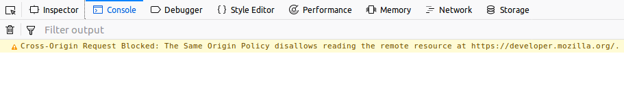

{{HTTPSidebar}}

[Cross-Origin Resource Sharing](/en-US/docs/Web/HTTP/CORS) ({{Glossary("CORS")}}) is a standard that allows a server to relax the [same-origin policy](/en-US/docs/Web/Security/Same-origin_policy). This is used to explicitly allow some cross-origin requests while rejecting others. For example, if a site offers an embeddable service, it may be necessary to relax certain restrictions. Setting up such a CORS configuration isn't necessarily easy and may present some challenges. In these pages, we'll look into some common CORS error messages and how to resolve them.

If the CORS configuration isn't set up correctly, the browser console will present an error like `"Cross-Origin Request Blocked: The Same Origin Policy disallows reading the remote resource at [some site]"` indicating that the request was blocked due to violating the CORS security rules. This might not necessarily be a set-up mistake, though. It's possible that the request is in fact intentionally being disallowed by the user's web application and remote external service. However, If the endpoint is meant to be available, some debugging is needed to succeed.

## Identifying the issue

To understand the underlying issue with the CORS configuration, you need to find out which request is at fault and why. These steps may help you do so:

1. Navigate to the website or web app in question and open the [Developer Tools](https://firefox-source-docs.mozilla.org/devtools-user/index.html).
2. Now try to reproduce the failing transaction and check the [console](https://firefox-source-docs.mozilla.org/devtools-user/web_console/index.html) if you are seeing a CORS violation error message. It will probably look like this:



The text of the error message will be something similar to the following:

```plain
Cross-Origin Request Blocked: The Same Origin Policy disallows
reading the remote resource at https://some-url-here. (Reason:
additional information here).
```

> [!NOTE]
> For security reasons, specifics about what went wrong with a CORS request _are not available to JavaScript code_. All the code knows is that an error occurred. The only way to determine what specifically went wrong is to look at the browser's console for details.

## CORS error messages

Firefox's console displays messages in its console when requests fail due to CORS. Part of the error text is a "reason" message that provides added insight into what went wrong. The reason messages are listed below; click the message to open an article explaining the error in more detail and offering possible solutions.

- [Reason: CORS disabled](/en-US/docs/Web/HTTP/CORS/Errors/CORSDisabled)
- [Reason: CORS request did not succeed](/en-US/docs/Web/HTTP/CORS/Errors/CORSDidNotSucceed)
- [Reason: CORS header 'Origin' cannot be added](/en-US/docs/Web/HTTP/CORS/Errors/CORSOriginHeaderNotAdded)
- [Reason: CORS request external redirect not allowed](/en-US/docs/Web/HTTP/CORS/Errors/CORSExternalRedirectNotAllowed)
- [Reason: CORS request not http](/en-US/docs/Web/HTTP/CORS/Errors/CORSRequestNotHttp)
- [Reason: CORS header 'Access-Control-Allow-Origin' missing](/en-US/docs/Web/HTTP/CORS/Errors/CORSMissingAllowOrigin)
- [Reason: CORS header 'Access-Control-Allow-Origin' does not match 'xyz'](/en-US/docs/Web/HTTP/CORS/Errors/CORSAllowOriginNotMatchingOrigin)
- [Reason: Credential is not supported if the CORS header 'Access-Control-Allow-Origin' is '\*'](/en-US/docs/Web/HTTP/CORS/Errors/CORSNotSupportingCredentials)
- [Reason: Did not find method in CORS header 'Access-Control-Allow-Methods'](/en-US/docs/Web/HTTP/CORS/Errors/CORSMethodNotFound)
- [Reason: expected 'true' in CORS header 'Access-Control-Allow-Credentials'](/en-US/docs/Web/HTTP/CORS/Errors/CORSMIssingAllowCredentials)
- [Reason: CORS preflight channel did not succeed](/en-US/docs/Web/HTTP/CORS/Errors/CORSPreflightDidNotSucceed)
- [Reason: invalid token 'xyz' in CORS header 'Access-Control-Allow-Methods'](/en-US/docs/Web/HTTP/CORS/Errors/CORSInvalidAllowMethod)
- [Reason: invalid token 'xyz' in CORS header 'Access-Control-Allow-Headers'](/en-US/docs/Web/HTTP/CORS/Errors/CORSInvalidAllowHeader)
- [Reason: missing token 'xyz' in CORS header 'Access-Control-Allow-Headers' from CORS preflight channel](/en-US/docs/Web/HTTP/CORS/Errors/CORSMissingAllowHeaderFromPreflight)
- [Reason: Multiple CORS header 'Access-Control-Allow-Origin' not allowed](/en-US/docs/Web/HTTP/CORS/Errors/CORSMultipleAllowOriginNotAllowed)

## See also

- Glossary: {{Glossary("CORS")}}
- [CORS introduction](/en-US/docs/Web/HTTP/CORS)
- [Server-side CORS settings](/en-US/docs/Web/HTTP/CORS)
- [CORS enabled image](/en-US/docs/Web/HTML/CORS_enabled_image)
- [CORS settings attributes](/en-US/docs/Web/HTML/Attributes/crossorigin)
